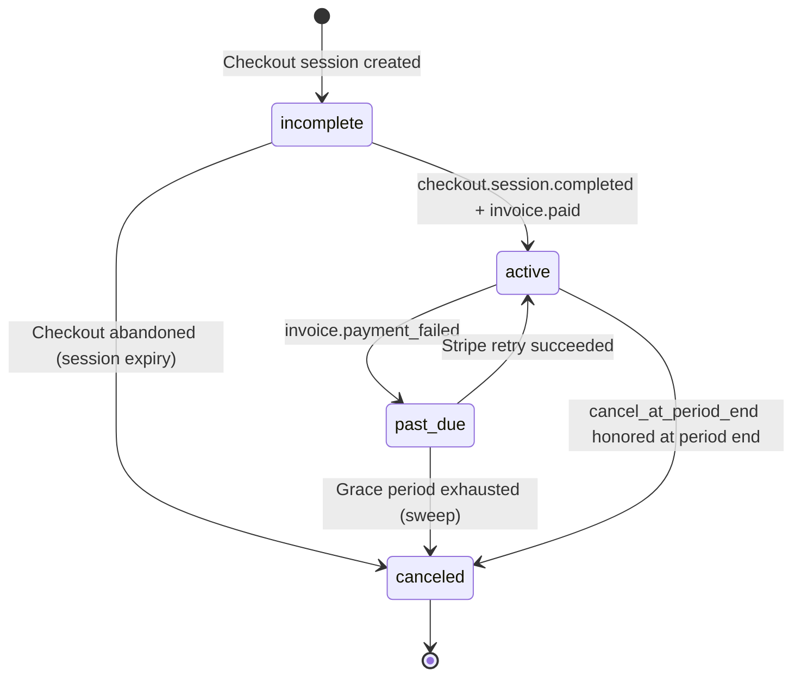

# Platform Subscription Payments (Coach to Platform) — Design

**Date**: 2026-05-12
**Status**: Draft
**Milestone**: M1 — Platform subscription payments, **Stripe only**. Both Global (USD) and TR (TRY) coaches pay via a single European Stripe account. M2 (deferred) covers student-to-coach marketplace payments and introduces iyzico for the TR side; nothing iyzico-shaped ships in M1.

## Problem

Coaches sign up, get stamped onto a `PlatformPlan` row, and never pay. The pricing-page CTAs are dead. The `bypass` provider on `Payment` ([backend/apps/billing/views/payments.py:111](backend/apps/billing/views/payments.py:111), [backend/apps/billing/views/payments.py:276](backend/apps/billing/views/payments.py:276)) hardcodes every `subscribe` call to mark a `Subscription` `active`, which is fine for local dev and useless in production. M1 wires real Stripe for both regions, drives a `PlatformSubscription` state machine off Stripe webhooks, and gates tenant quotas on subscription state. iyzico does not appear in M1 — it is an M2 marketplace concern and is deliberately not pre-scaffolded.

## Goals & Non-goals

### Goals (M1)

1. Stripe Checkout works end-to-end for both `Tenant.billing_currency = "USD"` and `Tenant.billing_currency = "TRY"`. One Stripe account, two presentment currencies.
2. Provider abstraction (`PaymentProvider` ABC + `StripeProvider`) is in place so M2 can plug a second adapter (iyzico for marketplace) later without re-architecting.
3. `PlatformSubscription` lifecycle (incomplete → active → past_due → canceled) is driven entirely by Stripe webhook events, idempotent against replay.
4. Stripe Customer Portal handles self-serve payment-method update, cancel, and plan change for both currencies — Stripe supports it natively for either.
5. `Tenant.is_subscription_active` is the single entitlement signal that gates the four quotas (`max_students`, `max_storage_gb`, `max_streaming_hours`, `max_campaign_emails`).
6. Transactional receipts go out in the coach's locale (en + tr) via Resend, triggered from webhook events.
7. Stripe Checkout renders in the coach's language via Stripe's `locale` parameter — Turkish for TR coaches, English for Global.
8. Bypass mode stays as a dev/test escape hatch, gated by `BILLING_BYPASS_ENABLED`.

### Non-goals (deferred to M2 or later)

- **iyzico, entirely.** iyzico is the M2 marketplace provider for TR coach → student payments. It does not touch platform subscriptions. No iyzico SDK, no iyzico envs, no iyzico stub class in M1.
- **Stripe Connect, submerchant onboarding, payout splits.** M2 marketplace work.
- **In-app refund UI.** Refunds via Stripe Dashboard only, done by support.
- **Tax / KDV invoicing.** Separate milestone. Stripe Tax may be enabled later; KDV-compliant invoicing is its own project.
- **Coupons, discounts, trial extensions.** Later.
- **Annual billing.** Monthly only in M1.
- **Mid-cycle plan changes need no special TR handling.** Same provider on both currencies → Stripe proration covers both regions identically.
- **Self-service region migration.** Region is immutable; a coach who wants TR moves by signing up again on `tr.contentor.app` (per commit 81c6fa0).

## High-level Architecture

```mermaid
flowchart LR
    Pricing[/pricing CTA — region-aware/] -->|POST /platform/checkout/| API[Django API]
    Admin[/admin/billing — coach in customer app/] -->|POST /platform/checkout/| API
    API -->|select_provider_for| Adapter[PaymentProvider ABC]
    Adapter --> Stripe[StripeProvider]
    Stripe -->|line item from Plan.prices billing_currency stripe_price_id| Session[stripe.checkout.Session.create]
    Session -->|locale=en or tr| Hosted[Stripe Checkout hosted page]
    Hosted -->|success redirect| Return[/admin/billing?checkout=success/]
    Hosted -->|asynchronous| Webhook[/api/webhooks/stripe/]
    Webhook --> Idem[WebhookEvent insert]
    Idem --> SubState[PlatformSubscription state]
    SubState --> Tenant[Tenant.plan + is_subscription_active]
    Tenant --> Quotas[enforce_max_students / storage / streaming / emails]
    BeatDun[Celery beat: dunning sweep] --> SubState
```



The only branch point is `Tenant.billing_currency`, used solely to choose the Stripe Price ID inside `Plan.prices`. Provider is always Stripe in M1.

## Data Model Changes

### New: `apps.core.PlatformSubscription` (public schema, SHARED_APPS)

Public-schema concern. Tenant-schema `Subscription` ([backend/apps/billing/models/core.py:39](backend/apps/billing/models/core.py:39)) is unrelated — that is the future student-to-coach model.

| Field | Type | Description |
|---|---|---|
| `tenant` | `OneToOneField(Tenant, on_delete=CASCADE, related_name="platform_subscription")` | At most one active subscription per tenant. |
| `user` | `ForeignKey(User, on_delete=PROTECT)` | The coach who started the subscription. Region-scoped per commit 81c6fa0. |
| `plan` | `ForeignKey(PlatformPlan, on_delete=PROTECT)` | Pinned at subscription create time; survives a downgrade for audit. |
| `status` | `CharField(choices=[incomplete, active, past_due, canceled])` | Stripe-aligned naming. |
| `provider` | `CharField(default="stripe")` | Reserved string so M2 can add other values without a schema change. Always `"stripe"` in M1 (or `"bypass"` in dev). |
| `provider_subscription_id` | `CharField(max_length=255, blank=True)` | Stripe `sub_*`. |
| `provider_customer_id` | `CharField(max_length=255, blank=True)` | Stripe `cus_*`. Region-scoped — a TR coach's Stripe Customer is distinct from any Global account that shares the same email. |
| `current_period_start` | `DateTimeField(null=True)` | From `customer.subscription.updated`. |
| `current_period_end` | `DateTimeField(null=True)` | Drives "Next billing date" UI and dunning math. |
| `cancel_at_period_end` | `BooleanField(default=False)` | Stripe native. |
| `canceled_at` | `DateTimeField(null=True)` | When the terminal cancel landed. |
| `created_at` / `updated_at` | timestamps | Standard. |

Unique constraint: `(provider, provider_subscription_id)` for webhook lookup. Index on `(status, current_period_end)` for the dunning sweep.

### New: `apps.core.WebhookEvent` (public schema, SHARED_APPS)

| Field | Type | Description |
|---|---|---|
| `provider` | `CharField` | `"stripe"` in M1. |
| `provider_event_id` | `CharField(max_length=255)` | Stripe `evt_*`. Unique per provider. |
| `event_type` | `CharField(max_length=100)` | `checkout.session.completed`, etc. |
| `payload` | `JSONField` | Raw event for audit. No PAN data ever lands here. |
| `received_at` | `DateTimeField(auto_now_add=True)` | When we got it. |
| `processed_at` | `DateTimeField(null=True)` | Set on successful processing. |
| `processing_error` | `TextField(blank=True)` | Traceback on failure. |

Unique constraint: `(provider, provider_event_id)`. Duplicate INSERT raises `IntegrityError`, caught and converted to 200 OK with no side effects.

### Modified: `apps.core.PlatformPlan.prices` shape

Today's shape at [backend/apps/core/models.py:91](backend/apps/core/models.py:91) is `{"USD": {"amount_cents": 1900, "stripe_price_id": "price_..."}}`. M1 extends it to:

```
{
  "USD": {"amount_cents": 1900,  "stripe_price_id": "price_..."},
  "TRY": {"amount_cents": 65000, "stripe_price_id": "price_..."}
}
```

Both entries use `stripe_price_id`. No `provider` field on the JSONB — M1 is single-provider. M2 may introduce provider-distinguished entries for the marketplace use case, but that change is additive and out of scope here. `PlatformPlan.get_price(currency)` returns the entry; the caller reads `stripe_price_id`.

### Modified: `apps.core.Tenant`

No schema change. Existing `billing_currency` and `plan` FK are reused. One new property:

```python
@property
def is_subscription_active(self) -> bool:
    ...
```

Returns True iff a `PlatformSubscription` exists with `status in {"active", "past_due"}` for the tenant. Free-tier tenants without a subscription return False here; quota helpers separately fall back to Free limits for them.

### Modified: `apps.billing.Payment`

No schema change. The existing `provider` enum keeps `iyzico|stripe|bypass`. `iyzico` is reserved for M2 and not written by any M1 code path. M1 adds one optional FK:

| Field | Type | Description |
|---|---|---|
| `platform_subscription` | `ForeignKey(PlatformSubscription, on_delete=SET_NULL, null=True, blank=True, related_name="payments")` | Set when the Payment came from a platform-subscription webhook. NULL for student-to-coach payments (unchanged). |

## Provider Abstraction

`apps.billing.providers` (new module). One abstract base, one concrete adapter, one bypass adapter for dev/test. **No iyzico stub.**

### Interface

```
class PaymentProvider(ABC):
    name: str  # "stripe" | "bypass"

    def create_checkout_session(tenant, user, plan, success_url, cancel_url, locale) -> CheckoutSession
    def create_customer_portal_session(provider_customer_id, return_url) -> str
    def cancel_subscription(provider_subscription_id) -> None
    def parse_webhook(request) -> WebhookEvent | None
```

`CheckoutSession` is a value object: `{checkout_url: str, expires_at: datetime, session_id: str}`.

`get_provider(tenant) -> PaymentProvider` returns `StripeProvider` in M1 (or `BypassProvider` when `BILLING_BYPASS_ENABLED=true`). When M2 adds iyzico for the marketplace, `get_provider` is extended to return iyzico for marketplace surfaces — platform subscriptions stay on Stripe regardless of region.

### StripeProvider concrete

- SDK: `stripe-python`. Wraps `stripe.checkout.Session.create`, `stripe.billing_portal.Session.create`, `stripe.Subscription.modify`, `stripe.Webhook.construct_event`, `stripe.Invoice.list`.
- Checkout: `mode="subscription"`, `line_items=[{price: <stripe_price_id from Plan.prices[currency]>, quantity: 1}]`, `customer_email=user.email`, `locale=<en|tr>`, `success_url=<frontend>/admin/billing?checkout=success&session_id={CHECKOUT_SESSION_ID}`, `cancel_url=<frontend>/admin/billing?checkout=cancel`, `metadata={tenant_id, plan_id, region}`. The `metadata.tenant_id` is the single source of truth on the webhook side — Host header is irrelevant since webhooks land on the platform apex.
- Customer Portal: configured once per environment (test, live) via a checked-in `stripe/portal_config.json` and a `make seed-stripe-portal-config` script.
- Webhook signature: `stripe.Webhook.construct_event(body, sig_header, STRIPE_WEBHOOK_SECRET)`. Bad signature → 400. Default tolerance window (300s).
- Events consumed: `checkout.session.completed`, `customer.subscription.created`, `customer.subscription.updated`, `customer.subscription.deleted`, `invoice.paid`, `invoice.payment_failed`.

### BypassProvider

Used only when `BILLING_BYPASS_ENABLED=true` (default false in prod, true in dev/test). Returns a synthetic checkout URL pointing at our own success route, immediately creates a `PlatformSubscription(status="active", provider="bypass")`. Preserves today's local-dev experience.

## API Surface

All endpoints under `/api/v1/billing/platform/` unless noted. Authentication: `TenantJWTAuthentication` (default); permissions: `IsAuthenticated` + `IsCoachOrOwner`. Region middleware applies (cross-region token → 403 `CROSS_REGION`).

### `POST /api/v1/billing/platform/checkout/`

Body: `{"plan_id": 2}`.

If `tenant.billing_currency` is NULL, derive from `tenant.region` (`global → USD`, `tr → TRY`) and persist atomically inside the same transaction. Resolve `plan.prices[billing_currency].stripe_price_id` — 400 `PRICE_NOT_AVAILABLE` if missing. Call `StripeProvider.create_checkout_session(... locale=user.preferred_locale)`. Returns:

```
{"checkout_url": "https://checkout.stripe.com/...", "expires_at": "2026-05-12T15:34:00Z"}
```

Error codes: `PRICE_NOT_AVAILABLE`, `ALREADY_SUBSCRIBED`, `PROVIDER_ERROR`.

### `POST /api/v1/billing/platform/portal/`

Returns the Stripe Customer Portal URL for the tenant's `provider_customer_id`. Works for both currencies — Stripe supports the portal natively for any presentment currency.

```
{"portal_url": "https://billing.stripe.com/p/session/..."}
```

### `POST /api/v1/billing/platform/cancel/`

Calls `stripe.Subscription.modify(cancel_at_period_end=True)`. Returns the updated subscription state.

### `GET /api/v1/billing/platform/subscription/`

```
{
  "plan": {"id": 2, "name": "Pro"},
  "status": "active",
  "currency": "TRY",
  "current_period_start": "...",
  "current_period_end": "...",
  "cancel_at_period_end": false,
  "is_active": true
}
```

Free-tier tenants (no `PlatformSubscription` row): `{"plan": {"name": "Free"}, "status": "free", "is_active": true}`.

### `GET /api/v1/billing/platform/invoices/?limit=20`

Lists invoices via `stripe.Invoice.list(customer=provider_customer_id, limit=...)`. Paginated using Stripe's `starting_after` cursor. Returns Stripe's hosted-invoice URL so the user can download a PDF.

### `POST /api/webhooks/stripe/`

Exempt from `TenantJWTAuthentication` (`@authentication_classes([])`, `AllowAny` is not enough — must clear the auth class too), exempt from CSRF, exempt from `RegionResolverMiddleware`'s region requirement, runs in public schema. Tenant is resolved from `event.data.object.metadata.tenant_id`. Response: 200 OK on success or idempotent duplicate, 400 on bad signature, 500 on unexpected processing error (Stripe retries on 500 — desirable).

## Lifecycle



### Dunning

- `invoice.payment_failed` → status `past_due`, Stripe's smart retries run on their schedule.
- Subsequent `invoice.paid` → status `active`.
- Celery beat `cleanup_past_due_subscriptions` runs daily. For each row where `status == "past_due"` and `now - current_period_end > PAST_DUE_GRACE_DAYS`:
  - Call `StripeProvider.cancel_subscription(provider_subscription_id)`.
  - Transition to `canceled`, set `canceled_at`.
  - Downgrade `Tenant.plan` to the seeded Free `PlatformPlan`.
  - Send the localized "subscription canceled due to non-payment" Resend email.

`PAST_DUE_GRACE_DAYS` is an env-driven int, default 7. Tests use 0 to make dunning land in-test.

### Mid-cycle plan change

`stripe.Subscription.modify` with the new `price_id` and `proration_behavior="create_prorations"`. Stripe credits/debits on the next invoice. Same code path for USD and TRY — no TR-specific handling needed because there is no second provider.

## Webhook Idempotency

Every Stripe event has a stable `id`. Pipeline, after signature verification:

1. Compute `(provider="stripe", provider_event_id=event.id)`.
2. `WebhookEvent.objects.create(...)` inside a transaction. `IntegrityError` on the unique constraint → return 200 OK immediately (already handled).
3. Otherwise dispatch to the event-type handler. On success: `processed_at = now`. On exception: store `processing_error`, re-raise so Stripe retries.

## Entitlement Enforcement

A new helper module `apps.core.quotas` exposes `enforce_max_students`, `enforce_max_storage_gb`, `enforce_max_streaming_hours`, `enforce_max_campaign_emails`. Each:

- Checks `tenant.is_subscription_active`. If False and the action is a write, raise `SubscriptionInactive` → 402 with `code=SUBSCRIPTION_INACTIVE`.
- Compares current usage + delta against `tenant.plan` limits. Over → raise `QuotaExceeded` → 402 with `code=QUOTA_EXCEEDED`.
- At 80% used, emit a soft-warning signal that downstream wires to a Resend email.

| Quota | Enforcement point |
|---|---|
| `max_students` | Pre-save signal on `User` create with `role=student`. |
| `max_storage_gb` | `apps.media.views.upload_init` and `apps.courses` upload paths. |
| `max_streaming_hours` | `apps.live.stream_service.start_session`. |
| `max_campaign_emails` | `apps.email_campaigns.views.send_campaign`. |

Soft downgrade: existing assets stay, new writes block. UI shows a sticky "Subscription canceled — limits restricted" banner with Reactivate CTA.

## Frontend Changes

### `frontend-main`

- **`src/app/pricing/page.tsx`** — CTAs become live. Each card POSTs `{plan_id}` to `/api/v1/billing/platform/checkout/`, then `window.location.assign(checkout_url)`. TR variant (on `tr.contentor.app`) renders TRY pricing using the existing region-aware formatting from the bilingual milestone.
- New `lib/api/billing-platform.ts` with `startCheckout(planId)`.

### `frontend-customer`

- **`src/app/admin/billing/page.tsx`** — currently Products/Bundles/Plans tabs. Add a new top-level "Subscription" tab as the default landing tab when `?checkout=success`. Components:
  - `SubscriptionTile` — current plan, status badge, currency, next billing date, Cancel button (confirm modal), Change plan link.
  - `InvoicesList` — paginated from `GET /platform/invoices/` with Stripe-hosted invoice links.
  - `PaymentMethodCard` — "Manage in Stripe" button → POST `/platform/portal/` → redirect.
- The post-checkout return path polls `GET /platform/subscription/` every 2s for up to 30s in case the webhook hasn't landed yet; falls back to a "Provisioning..." pill if still incomplete.
- Stripe Checkout itself is rendered in the coach's language via the `locale` parameter passed at checkout-creation time. TR coaches see a fully Turkish Stripe page.

## TR Experience Guarantees

This is a single-provider system, but the TR coach must perceive a fully Turkish flow at every step:

- A TR coach lands on `tr.contentor.app/pricing` → prices render in TRY.
- The checkout CTA hits `/api/v1/billing/platform/checkout/`, which resolves `billing_currency=TRY` from `tenant.region` and creates a Stripe Checkout Session with the TRY `stripe_price_id` and `locale="tr"`.
- The Stripe Checkout page renders in Turkish, charges in TRY (presentment).
- The Stripe Customer Portal renders in Turkish.
- Our own Resend transactional emails (activation, cancellation, dunning) ship in Turkish for `User.preferred_locale="tr"`. Stripe's first-party receipt emails can also be enabled in TR via Stripe Dashboard.
- Settlement to our European Stripe account happens at Stripe's FX rate. **This is an accepted FX cost.** It is documented here and in `.env.example` rather than engineered against.
- `PlatformSubscription.provider_customer_id` is region-scoped: a TR coach's Stripe Customer is distinct from any Global account that shares the same email (consistent with commit 81c6fa0's per-region account rule). The checkout endpoint never reuses a `provider_customer_id` across regions.

## Env Vars and Secrets

| Variable | Description |
|---|---|
| `STRIPE_SECRET_KEY` | `sk_test_*` or `sk_live_*`. Required for any environment that hits Stripe. |
| `STRIPE_PUBLISHABLE_KEY` | `pk_test_*` or `pk_live_*`. Exposed to both frontends. |
| `STRIPE_WEBHOOK_SECRET` | `whsec_*`. Required for signature verification. |
| `STRIPE_PRICE_STARTER_USD` | `price_*` for Starter (USD). Read by `seed_plans` into `PlatformPlan.prices.USD.stripe_price_id`. |
| `STRIPE_PRICE_PRO_USD` | Same for Pro (USD). |
| `STRIPE_PRICE_STARTER_TRY` | `price_*` for Starter (TRY). |
| `STRIPE_PRICE_PRO_TRY` | Same for Pro (TRY). |
| `BILLING_BYPASS_ENABLED` | Boolean. Default false in prod, true in dev/test. |
| `PAST_DUE_GRACE_DAYS` | Int, default 7. |
| `BILLING_FREE_PLAN_NAME` | Default `"Free"`. Used by `seed_plans` and the downgrade logic so the row is locatable by name. |

No `IYZICO_*` envs in M1. They land with M2.

## Backwards Compatibility

- Bypass mode runs only when `BILLING_BYPASS_ENABLED=true`. Production settings refuse the combination of `env=prod` and `BILLING_BYPASS_ENABLED=true` (raises `ImproperlyConfigured`).
- Existing tenants without a `PlatformSubscription` default to the Free `PlatformPlan`. The Phase 0 data migration creates a Free row if absent and attaches `Tenant.plan = Free` for any tenant with NULL plan.
- The legacy `subscribe` view at [backend/apps/billing/views/payments.py:227](backend/apps/billing/views/payments.py:227) is untouched — that endpoint operates on tenant-schema `Subscription` (student-to-coach future), not platform subscriptions.

## Risks and Mitigations

| Risk | Mitigation |
|---|---|
| Stripe rejects TRY presentment for our merchant category | Verify TRY is enabled on the account in test mode before Phase 1 begins. Document the verification step in `.env.example` and a Phase 0 manual check. |
| European Stripe account regulatory limits on billing TR customers | Confirm with Stripe support; document compliance status in `docs/` before going live. If blocked, defer the TR Phase 1 smoke until resolved — code already supports it. |
| FX volatility erodes TRY margin (we settle in EUR) | TR pricing reviewed quarterly. Nothing in code; flagged here as an operational risk. |
| Stripe webhook lands before the success-URL redirect → frontend shows stale state | Frontend polls `GET /platform/subscription/` for 30s after `?checkout=success`. Webhook also sets a Redis hint the polling endpoint reads to short-circuit. |
| Cross-region webhook misroute | Tenant resolution is by `metadata.tenant_id` only; mismatched currency vs `Tenant.billing_currency` raises an alert and refuses processing. |
| Webhook retries cause duplicate Payment rows | `WebhookEvent` unique constraint + dispatcher-level create-once inside the event handler. |
| Stripe price ID typo in env causes wrong-amount charges | `seed_plans` validates each ID via `stripe.Price.retrieve` and asserts currency + unit_amount match expectations (when `STRIPE_SECRET_KEY` is set). |
| Dunning downgrade races with a quota-sensitive action | Quota check reads `Tenant.is_subscription_active` at action time. Worst case is one extra action; acceptable. |
| `BILLING_BYPASS_ENABLED=true` accidentally enabled in prod | Settings loader refuses the combination; CI smoke checks the prod settings file. |
| Stripe Customer Portal misconfigured (e.g., cancel-immediately) | Portal config checked into `stripe/portal_config.json` and applied via `make seed-stripe-portal-config`; reviewed in PR diff. |

## Validation Checklist

- [ ] Coach on `contentor.localhost` clicks "Get Starter" → Stripe Checkout in English with USD → completes test card → redirected to `/admin/billing?checkout=success` → tile shows Starter active within 30s.
- [ ] Coach on `tr.contentor.localhost` does the same → Stripe Checkout in Turkish with TRY → completes test card → tile shows Starter active.
- [ ] Webhook duplicate (replay the same `evt_*` via `stripe trigger`): second call returns 200, no second `Payment` row, `WebhookEvent` duplicate counter increments.
- [ ] Bad signature on `/api/webhooks/stripe/` → 400 + audit log entry.
- [ ] `invoice.payment_failed` → tile shows past_due. After `PAST_DUE_GRACE_DAYS=0` and a manual `cleanup_past_due_subscriptions` run → status canceled, `Tenant.plan = Free`, banner appears.
- [ ] Cancel button → Stripe Subscription has `cancel_at_period_end=true`; tile shows "cancels on <period_end>".
- [ ] Customer Portal opens in Turkish for a TR tenant; in English for a Global tenant.
- [ ] Tenant on Free tries to create the 11th student → 402 `QUOTA_EXCEEDED`.
- [ ] Tenant with canceled subscription tries to upload media → 402 `SUBSCRIPTION_INACTIVE`.
- [ ] `BILLING_BYPASS_ENABLED=true` in dev: checkout returns a fake URL, subscription appears active.
- [ ] `seed_plans` against a fresh DB writes Free + Starter + Pro with USD and TRY `stripe_price_id` entries.
- [ ] Cross-region: Global coach's JWT cannot trigger TR checkout (TenantJWTAuthentication rejects).
- [ ] Prometheus counters increment for one full success flow (`billing_checkout_started`, `billing_checkout_succeeded`, `billing_webhook_received`).
- [ ] No PCI data lands in `WebhookEvent.payload` (assertion test scans for PAN-like patterns).
- [ ] Resend activation email arrives in Turkish for a TR coach, in English for a Global coach.
