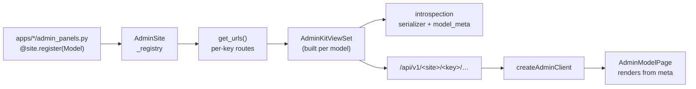

# Admin Kit Framework

# Admin Kit Framework

`backend/apps/adminkit/` + `packages/shared/src/admin-kit/`

A schema-driven admin framework: one Python declaration per model produces a full CRUD REST surface **and** the metadata a generic React renderer uses to build the table, filters, forms and bulk actions. It is `django.contrib.admin`'s idea, re-expressed as JSON for the two Next.js SPAs — nothing about a model's admin UI is hand-written in TypeScript.

Two sites exist:

| Site | Namespace | Mounted at | Audience | Schema |
|---|---|---|---|---|
| `platform_site` | `platform-admin` | `/api/v1/platform-admin/` | superadmin (`IsSuperUser`) | public |
| `studio_site` | `studio-admin` | `/api/v1/studio-admin/` | coach/owner (`IsCoachOrOwner`) | tenant-only |

Both are rendered by the same frontend components, mounted at `/admin/m` in `frontend-main` (platform) and `frontend-customer` (studio) — those four `page.tsx` files are the entire per-app integration.

---

## Architecture at a glance



---

## Backend

### Registration and autodiscovery

`AdminkitConfig.ready()` calls `autodiscover_modules("admin_panels")`. Every Django app declares its admins in `admin_panels.py` — deliberately *not* `admin.py`, so the kit coexists with Django's own admin without clashing. The app itself has **no models**; it is pure framework.

```python
from apps.adminkit.options import ModelAdmin, admin_action
from apps.adminkit.sites import studio_site

@studio_site.register(SubscriptionPlan)
class SubscriptionPlanAdmin(ModelAdmin):
    list_display = ("name", "price", "is_active")
```

`AdminSite.register()` instantiates the admin immediately (`cls(model, self)`) and stores it under `admin.key` — the URL segment, defaulting to `slugify(label_plural)`. Duplicate keys raise `AlreadyRegisteredError` at import time, so collisions fail loudly at startup rather than silently shadowing.

### `ModelAdmin` — the declaration surface

`options.ModelAdmin` is a plain class of class attributes plus overridable hooks. The groups:

- **Identity/navigation** — `label`, `label_plural`, `key`, `icon` (lucide name hint), `description`.
- **List** — `list_display`, `search_fields`, `list_filters`, `ordering`, `list_select_related`, `page_size`.
- **List rendering** — `list_mode` (`"table"` | `"gallery"`), `gallery_image_field`.
- **Form** — `fields` (None → all editable concrete fields), `readonly_fields`, `exclude`.
- **Capabilities** — `can_create` / `can_edit` / `can_delete`, `permission_classes`.
- **Images** — `image_fields`, `image_upload_url`, `image_upload_prefix`.

Hooks you override per admin: `get_queryset`, `perform_create`, `perform_update`, `perform_delete`, `get_autocomplete_queryset`.

Three derived-config methods drive everything downstream:

- `get_form_fields()` — writable names in declaration order; skips pk, non-editable, auto-created, `auto_now`/`auto_now_add` date fields, `exclude`, and `readonly_fields`.
- `get_serializer_field_names()` — everything the API exposes: pk + form fields + readonly fields + any `list_display` entry that is a real model field.
- `get_computed_columns()` — `list_display` entries that are *not* model fields, i.e. admin methods or `__str__`. These are rendered by `compute_column()` at list time and labelled via `column_label()` (which honours a `short_description` attribute on the method, Django-style).

### Sites and the URL surface

`AdminSite.get_urls()` emits a site-level `meta/` route plus five routes per registered model. `urls_platform.py` / `urls_studio.py` are one-liners that expose them.

| Route | Verb(s) | Purpose |
|---|---|---|
| `meta/` | GET | Site meta: namespace, title, visible models |
| `<key>/` | GET, POST | List (paginated, searched, filtered, ordered) / create |
| `<key>/meta/` | GET | Full `model_meta()` contract for this model |
| `<key>/<int:pk>/` | GET, PUT, PATCH, DELETE | Retrieve / update / partial update / destroy |
| `<key>/actions/<action_name>/` | POST | Run a bulk or row action over `{"ids": [...]}` |
| `<key>/autocomplete/<field_name>/` | GET | FK options as `{results: [{value, label}]}` |

Note the pk converter is `<int:pk>` — models with non-integer primary keys are not currently addressable.

The site-level `meta` view filters the model list through `_visible_models()`, which hides any admin whose own `permission_classes` all fail for the requesting user. Careful: at the *site meta* level those classes are treated as an **extra** gate on top of the site default, whereas `build_viewset` uses `admin.permission_classes or site.permission_classes` — i.e. on the endpoints they **replace** the site default. If you narrow an admin, narrow it (don't widen it) or the index card and the endpoint will disagree.

### The generic viewset

`views.build_viewset(admin)` synthesises a `AdminKitViewSet` subclass per registration, carrying `model_admin`, a `PageNumberPagination` subclass (`page_size` from the admin, `page_size_query_param="page_size"`, `max_page_size=100`) and the resolved permission classes.

What the viewset adds over `ModelViewSet`:

- **`initial()`** — for `tenant_only` sites, raises `Http404` when `connection.schema_name` is the public schema, *before* auth runs. The studio's models have no public-schema tables; this keeps apex requests from erroring out of the ORM.
- **`filter_queryset()`** — the whole list query language:
  - `?q=` ORs `icontains` across `search_fields`; adds `.distinct()` if any search field spans a relation (`__`).
  - Each entry in `list_filters`: a string is matched exactly (with `"true"`/`"false"` coerced to booleans, and `.distinct()` when the field is M2M); a non-string is a **filter descriptor** and gets to run its own `filter_queryset(qs, value)`.
  - `?ordering=` is validated against concrete field names (plus `pk`) and silently dropped otherwise — a guard against ordering-by-injection and against sorting on computed columns.
- **`list()`** — serializes the page, then post-processes each row: computed columns via `admin.compute_column()`, and every `image_fields` value rewritten from a bare storage key to `{"key", "url"}` using `apps.core.storage.sign_if_s3_key` (a presigned, time-limited URL).
- **Write gating** — `create` / `update` / `destroy` return **405** when the corresponding capability flag is off; `destroy` translates `ProtectedError` into a **409** with a human message instead of a 500. `perform_*` delegate to the admin hooks.
- **`run_action()`** — validates the action name (404), requires a non-empty `ids` list (400), then re-applies `filter_queryset` before `pk__in=ids` so an action can never reach rows outside the caller's current view.
- **`autocomplete()`** — 404s for unknown or non-relational fields, otherwise returns the first 50 objects from `get_autocomplete_queryset()` as `{value, label}`.

### Introspection: one serializer, one contract

`introspection.build_serializer(admin)` builds a `ModelSerializer` on the fly — `fields = get_serializer_field_names()`, `read_only_fields` = everything not editable and not the pk — and uses `LabeledRelatedField` as the related-field class, so FKs **read** as `{"value": pk, "label": str(obj)}` and **write** as a bare pk. `use_pk_only_optimization()` is disabled because the label needs the real instance.

Serializers are cached in `_SERIALIZER_CACHE` keyed by `id(admin)`. Admin instances are created once at import and live for the process, so this is stable in practice — but it does mean a serializer is not rebuilt if you mutate an admin's config at runtime, and tests that construct throwaway `ModelAdmin` instances can in principle collide if an old instance is garbage-collected and its id reused.

`field_schema(admin, name, field)` is the heart of the contract. It maps each DRF field to a `type` (`_field_type`: m2m, fk, boolean, multichoice, choice, integer, decimal, datetime, date, email, url, json, else `text` for a model `TextField`, else `string`), then layers on:

- `image` type + `upload_url` / `upload_prefix` for anything in `admin.image_fields`;
- `default` via `_scalar_default`, which falls back to the *model* field's default when DRF leaves it to `.save()` — so auto-built create forms start from the value the model would have used;
- `max_length`, `decimal_places`, and `min_value`/`max_value` scraped from both `MinValueValidator`/`MaxValueValidator` and the field's own attributes;
- `choices` — **only** after the type is known to be choice-ish. There is a load-bearing ordering comment here: `RelatedField.choices` is a property that evaluates the whole queryset, so touching it unconditionally would fire a full table read per FK field on every meta request.

`model_meta(admin)` assembles the per-model payload: columns (model fields get their real schema and `sortable: true`; everything else becomes `type: "computed"`, `sortable: false`), `form_fields` (writable fields plus readonly fields that exist on the serializer), sorted `actions`, capability flags, `default_ordering`, `page_size`, and the gallery settings.

### Actions

`@admin_action(label=None, *, style="default", confirm=None, row=False)` stamps `adminkit_action` metadata onto a method; `ModelAdmin.get_actions()` discovers them by scanning the class. The method signature is `(self, request, queryset)` and it returns either a string (becomes `{"detail": str}`) or a dict merged into the response. A returned `{"redirect": url}` tells the frontend to navigate instead of refreshing — this is how the impersonation hand-offs work.

`row=True` renders the action as a per-row button operating on that single object; otherwise it is a bulk action over the current selection. `style` (`default`/`primary`/`danger`) and `confirm` are pure frontend hints.

### Filters and `TagChoiceFilter`

`filter_schema(admin)` produces one descriptor per `list_filters` entry:

- A **serializer field** → `boolean`/`choice`/`fk` keep their type, everything else degrades to a `string` exact-match box. Boolean and choice filters get per-option **row counts** appended to their labels (`"Active (42)"`), and booleans are forced to `type: "choice"` so the frontend renders a Yes/No button group rather than a tri-state.
- A **relation that isn't a serializer field** → `_relation_filter_choices` turns an FK/M2M into a choice of the related objects, again with counts. This is what lets you filter by an M2M tag that never appears in `list_display` or the form.
- A **filter descriptor object** → delegates to its own `.schema(model)`.

`TagChoiceFilter` is the one built-in descriptor. It targets a comma-separated tag `CharField` where a bare field name would give a useless exact-match box. It computes the distinct tags across all rows (normalized the same way the coach galleries split them: split on `,`, strip, lowercase, drop blanks — matching `frontend-customer`'s `library-catalog.ts`), orders choices by descending count, and filters with a `__iregex` anchored on comma boundaries so `art` never matches `startup` or `cart`. Its `name` is the *query-param* key (default `tag`), which is why `filter_queryset` reads `params.get(name.name)` for descriptors.

Be aware that `filter_schema` is genuinely query-heavy — one `COUNT` per choice, plus a full column scan for `TagChoiceFilter`. It runs on every `<key>/meta/` request, so a `list_filters` entry over a high-cardinality relation is expensive by construction.

### Multi-tenancy and permissions summary

- `studio_site` is `tenant_only`; both the viewset (`initial`) and the site meta view 404 in the public schema.
- Tenant isolation itself is free — `django-tenants` has already switched the schema by the time any of this runs, so `model._default_manager.all()` is inherently scoped.
- `platform_site` operates on public-schema models under `IsSuperUser`.

---

## The JSON contract

`packages/shared/src/admin-kit/types.ts` mirrors the backend payloads exactly and is the reference for both sides. The key shapes: `SiteMeta` / `SiteModelEntry`, `ModelMeta`, `FieldSchema`, `ColumnSchema`, `FilterSchema`, `ActionSchema`, `ActionResult`, `ListPage`, and the row value shapes `FkValue` (`{value, label}`) and `ImageValue` (`{key, url}`).

If you change a schema key in `introspection.py`, change it in `types.ts` in the same commit — there is no codegen bridging these two files (unlike the drf-spectacular-generated `api-generated.ts` used elsewhere in the repo).

---

## Frontend

Everything lives in `packages/shared/src/admin-kit/`, imported as `@shared/admin-kit/*` by both apps. The components use only design-token utility classes (`bg-card`, `text-muted-foreground`, …) that both apps define, plus the shared `Spinner` and `useAsyncAction` — no per-app UI imports, so the kit renders identically in either panel.

> If your local (non-Docker) tsserver flags `cannot find module 'react'` in these files, that's expected: bare-specifier resolution for `packages/shared` only works inside the containers, via the `node_modules` symlink in each Dockerfile.

| File | Role |
|---|---|
| `client.ts` | `createAdminClient(apiBase)` — every endpoint, plus `AdminKitError` |
| `types.ts` | The TS mirror of the backend contract |
| `model-index.tsx` | `AdminModelIndex` — landing grid, one card per model from site meta |
| `model-page.tsx` | `AdminModelPage` — all state: meta, list, search, filters, selection, actions, paging, overlays |
| `model-list.tsx` | Presentational table: columns, sort headers, selection, row actions |
| `model-form.tsx` | Slide-over create/edit form generated from `form_fields` |
| `widgets.tsx` | `CellValue` (schema → table cell) and `FieldInput` (schema → input), plus `ImageFieldInput` |
| `primitives.tsx` | `KitButton`/`KitInput`/`KitTextarea`/`KitSelect`/`KitToggle`/`KitBanner`/`KitSkeletonRows`, and `kitIcon` |
| `gallery-view.tsx` | Gallery list mode: image cards + drop-a-PNG zone |
| `json-record-modal.tsx` | Gallery mode's create/edit surface: image pane + one JSON textarea |

### Client

`kitFetch` sets JSON headers and `credentials: "same-origin"`, and throws `AdminKitError` on non-2xx. `AdminKitError` splits a DRF body into `fieldErrors` (per-field message arrays joined) and `detail` (from `detail` / `non_field_errors`) — that split is what lets `ModelForm` render inline field errors and a form-level banner from one exception.

### `AdminModelPage` data flow

1. On mount, `client.modelMeta(modelKey)` → sets `meta`, seeds `ordering` from `default_ordering`, and fires an `autocomplete` call for every `fk`-typed filter to populate its options.
2. A second effect refetches the list whenever `pageNum`, `q`, `ordering`, `filters` or `refreshTick` changes. Page 1 replaces `accumulatedResults` and clears selection; later pages append — the table and gallery both use **infinite scroll** (`InfiniteScrollSentinel`, an `IntersectionObserver` that bumps `pageNum`) rather than pager buttons.
3. Search is debounced 300 ms (`qInput` → `q`); the `StringFilter` exact-match box is debounced 400 ms. Any filter or sort change resets to page 1.
4. Actions go through `applyActionResult`: a `redirect` in the response wins and navigates via `window.location.href`; otherwise show a success banner and `refresh()`. `refresh()` resets to page 1 and increments `refreshTick`.
5. Banners are single-slot; successes auto-dismiss after 4 s via `showBanner`.

`ButtonSelectFilter` renders small filters as a wrapping button group and, past `FILTER_TOP_N` (10) options, switches to a search box plus a horizontally scrollable strip with arrow buttons — which is why the backend orders choices by descending count. Clicking a chip re-centers it (`centerChip`) so edge clicks reveal neighbours instead of leaving the selection clipped.

### `ModelForm`

Create mode shows only editable fields; edit mode shows all `form_fields` (read-only ones rendered disabled). FK fields load their options from the autocomplete endpoint on mount.

Submit builds the payload with deliberate emptiness rules:

- `json` fields: blank → omitted; otherwise parsed, with a client-side "Invalid JSON." error on failure.
- Empty **FK** → `null` (an explicit clear).
- Empty non-text fields (anything but `string`/`text`/`email`/`url`) → **omitted**, so server defaults apply on create and PATCH leaves them unchanged on edit.

Errors from the server land as `errors` (inline, per field) plus `formError` (banner). Both submit and delete run through `useAsyncAction` with `errorToast: false` — the kit surfaces errors in its own banners rather than the app's toast system.

### Widgets

`CellValue` renders per column `type`: booleans as check/minus icons, FKs as their label, images as a thumbnail, choices as a pill (resolved through `column.choices`), dates/datetimes localized, numbers `tabular-nums`, JSON as `{…}`, everything else truncated to 28ch. Null/empty renders an em dash.

`FieldInput` is the inverse mapping — toggle, textarea, monospace JSON textarea, select, FK select, `ImageFieldInput`, number inputs (with `step` derived from `decimal_places` and min/max from the schema), date/datetime-local, and typed text inputs with `maxLength`. `ImageFieldInput` POSTs a multipart `file` (+ `prefix`) to `field.upload_url`, then stores the returned `key` as the field value and shows the returned `url` as a preview.

### Gallery mode

Set `list_mode = "gallery"` plus a `gallery_image_field` (which must be in `image_fields` *and* in `list_display`, so rows carry its `{key, url}` value). This replaces the table + slide-over form with a bulk-curation workflow — it is what the curated logo/photo catalogs use.

The flow: drop or pick a PNG → `galleryUpload` POSTs it to the image field's `upload_url` → `JsonRecordModal` opens in `create` mode with a prefilled JSON record. `initialJson` seeds `title` from the filename, `position` past the largest on the current page, and `enabled: true`. `parseRecord` validates that the textarea holds a JSON object whose keys are all editable non-image fields, returning `{data}` or `{error}` — it never throws. Save merges in the image key and creates the row.

The modal supports ←/→ navigation between rows on the loaded page (arrow keys are ignored while a textarea/input is focused), and pressing → at the end of the page triggers `onLoadMore` and auto-advances once the next page arrives (`waitingForNext`). `AdminModelPage` remounts the modal via a `key` on row switch so the textarea state reloads cleanly rather than carrying stale edits.

---

## Adding a new model admin

1. Create or open `backend/apps/<app>/admin_panels.py`.
2. Register against `studio_site` (tenant models) or `platform_site` (public models).
3. Declare `list_display`, `search_fields`, `list_filters`, `ordering`; add `list_select_related` for any FK column to avoid an N+1 on list.
4. Constrain writes with `fields` / `readonly_fields` / `exclude` and the `can_*` flags.
5. Add bulk or row behaviour with `@admin_action`.
6. Override `get_queryset` / `perform_*` if the model needs scoping or side effects on save.

No frontend work is required — the model appears on `/admin/m` and gets its own page at `/admin/m/<key>` as soon as the meta endpoint reports it.

---

## Contributor notes and sharp edges

- **The two type files must move together.** `introspection.py`'s dict keys and `types.ts` are hand-synced.
- **`choices` evaluation order in `field_schema` is load-bearing** — see the inline `NB:` comment. Reordering it silently adds a full queryset read per FK to every meta request.
- **`filter_schema` costs one COUNT per choice.** Adding a high-cardinality `list_filters` entry makes `<key>/meta/` slow for everyone using that model.
- **`ordering` is whitelisted to concrete fields.** Computed columns are correctly marked `sortable: false`; if a sort silently does nothing, the field isn't concrete.
- **Bulk actions are filter-scoped**, not id-scoped — `run_action` re-applies `filter_queryset` before `pk__in`.
- **Capability flags are enforced server-side** (405), not just hidden in the UI.
- **`admin.permission_classes` replaces the site default on endpoints but stacks on it in the site index.** Use it to narrow, not widen.
- **Serializer cache keyed by `id(admin)`** — fine for import-time singletons, worth knowing if you build admins dynamically.
- **Tests** exercise the introspection layer directly: see `test_course_admin_filter_schema_lists_options` (`apps/filters`) and `test_adminkit_course_filter_schema_lists_tags` (`apps/tags`), both calling `filter_schema()` against a real admin.
