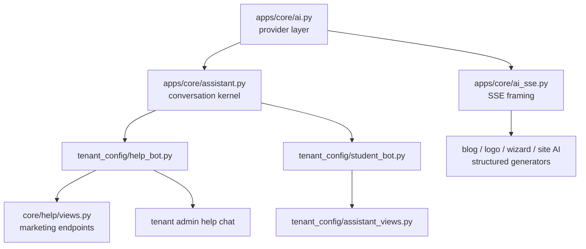

# AI Infrastructure & Assistants — backend-apps

# AI Infrastructure & Assistants

This module is the backend's entire AI stack: a single provider layer through which **every** AI feature calls Claude, plus the shared plumbing (SSE framing, conversation kernel, cost governance, audit) and the two conversational assistants built on top of it — the coach-facing **help bot** ("Ask Contentor") and the student-facing **site assistant**. Structured-generation features elsewhere in the codebase (blog drafts, logo studio, onboarding wizard, site AI) consume the same provider and SSE layers.

Design docs: `docs/superpowers/specs/2026-07-09-shared-ai-provider-design.md`, `docs/superpowers/plans/2026-07-09-coach-help-bot.md`, `docs/superpowers/specs/2026-07-10-ai-assistants-governance-design.md`.

## Layering

The dependency rule is strict: feature modules own personas, knowledge, gating and usage accounting; the kernel owns transcript-shaped plumbing; `ai.py` owns everything provider-specific. Nothing above `ai.py` ever imports the `anthropic` SDK or spawns the CLI.

## Provider layer — `apps/core/ai.py`

### Two providers, selected by `settings.AI_PROVIDER`

- **`anthropic`** (prod): SDK calls with prompt caching on the system block (`cache_control: ephemeral`). Costs are estimated per call from `_MODEL_PRICES` and returned to the caller.
- **`cli`** (local dev): shells out to the `claude` CLI on the developer's subscription. `_cli_env()` strips `ANTHROPIC_API_KEY` / `ANTHROPIC_AUTH_TOKEN` from the subprocess environment so the CLI can never silently bill the API key, and cost is always `Decimal("0")` — subscription usage must not accrue against the USD budget caps. `_cli_model_alias()` maps full model IDs (`claude-sonnet-5`) onto the CLI's short aliases (`opus`/`sonnet`/`haiku`), falling back to `AI_CLI_MODEL` for unrecognized families.

`available()` is the preflight both bots call before answering: `(ok, reason)` with reasons `ok | no_api_key | cli_no_binary | cli_no_token`.

### Call shapes

| Function | Shape | CLI support |
|---|---|---|
| `structured(system, user, output_model, model, max_tokens)` | One schema-validated call → `(parsed, cost_usd, model)` | Yes (schema appended to system prompt, pydantic-validated, one retry) |
| `structured_stream(...)` | Generator: `("partial", dict)*` then one `("done", (parsed, cost, model))` | Degrades: no partials, straight to `done` |
| `structured_messages(system, messages, ...)` | Structured over a full messages array (base64 images allowed) | No — raises `AiError`; gate with `supports_vision()` |
| `stream_text(system, history, model, max_tokens)` | Generator: `("delta", text)*` then one `("done", {cost_usd, provider, model})` | Yes (`stream-json --include-partial-messages`) |

Both providers validate against the **same pydantic `output_model`**, so callers get identical guarantees regardless of environment.

### Streaming partials

With `output_format=` the model emits one text block of accumulating JSON, so `structured_stream` repairs the truncated snapshot with `_partial_json()` — close open strings, drop a dangling key (`_DANGLING_KEY_RE`), close open containers — throttled to one emit per `PARTIAL_MIN_INTERVAL_SECONDS` (0.4s). Partials are **progress display only**; the final value is always the provider's own validated parse.

### Errors and cost integrity

Every failure raises `AiError`, which carries `cost_usd` — the estimated cost of the possibly-billed attempt — so callers can still accrue it against budget kill-switches even when the call failed (e.g. a completed stream whose output failed schema validation). Timing constants matter: `CLI_TIMEOUT_SECONDS = 240` and the SDK's `timeout=100.0` are sized so a single attempt stays under gunicorn's `--timeout` and degrades gracefully instead of killing the worker.

### The prompt-caching contract

The `system` argument must be **byte-frozen per feature**: persona, knowledge base, static instructions only. Any tenant-, viewer- or request-specific state travels in the first user turn. Interpolating tenant state into `system` would fragment Anthropic's prompt cache per tenant and destroy the token economics. The two bots implement this differently (see below), but both honor it.

## SSE framing — `apps/core/ai_sse.py`

The minimal wire format for streamed **structured** generation (blog, logo, wizard, site AI — see the incoming callers `blog_generate`, `logo_converse`, `wizard_site_edit_preview`, `site_ai_preview`). The chat assistants frame their own events inside the kernel instead, because they carry chat-specific concerns like the suggestions tail.

- `sse_frame(payload)` — one `data: {...}\n\n` frame using **DRF's `JSONEncoder`**, not stdlib json: done-frames ship serializer output containing UUIDs, Decimals and datetimes that plain `json.dumps` refuses.
- `sse_headers(response)` / `stream_response(frames)` — apply `Cache-Control: no-cache` and `X-Accel-Buffering: no`; without the latter the proxy buffers the whole stream.
- `EventStreamRenderer` — exists only so DRF content negotiation accepts `Accept: text/event-stream` instead of 406ing; it never actually renders.
- `wants_stream(request)` — Accept-header sniff for endpoints that serve both JSON and SSE.

Frame conventions by `"type"`: `phase` (progress step), `preview` (feature-shaped partial), `done` (terminal payload), `error`.

## Conversation kernel — `apps/core/assistant.py`

Shared by all three chat widgets (coach help, marketing visitor, student site assistant).

### History and streaming

`prepare_history(messages, context_block)` validates and trims the client transcript (`MAX_HISTORY_MESSAGES = 6`, `MAX_MESSAGE_CHARS = 2000`), enforces user-first/user-last ordering, and splices the caller's context block into the first user turn — this is how per-tenant/per-viewer state reaches the model without touching the cached system prompt.

`run_chat(system, history, model, max_tokens, on_complete)` streams one answer as SSE frames. The personas end every answer with a `|||SUGGESTIONS ["…"]` tail; `run_chat` holds back the last `len(TAIL_DELIMITER) - 1` characters while streaming so a tail split across deltas never leaks to the user, then parses it (`MAX_SUGGESTIONS = 3`) and ships it in the `done` event. `on_complete(info)` receives the **clean** answer plus `info["suggestions"]`, and whatever dict it returns is merged into the `done` event — this is where features do usage accounting, transcript logging and cache population.

### Audit and threads

- `log_transcript(...)` writes an `AiTranscript` row — best-effort, never raises (the user already has their answer).
- `rate_token(transcript_id)` mints a signed capability (`RATE_SALT`), handed out in the `done` event and verified by the public `rate_answer` endpoint (`apps/core/assistant_views.py`, mounted at `ai/rate/`) — 7-day max age, must match the submitted `transcript_id`.
- Conversation threads (v2 spec §5): `get_or_create_conversation()` keys on `(session_id, feature, tenant_schema)` — the session UUID is the bearer token (D5). `append_message()` bumps activity stamps; `thread_payload()` pages messages for widget polling; `maybe_auto_release()` lazily flips a human-takeover conversation back to AI after `ASSISTANT_HUMAN_IDLE_RELEASE_MIN` minutes of agent silence (no celery job — checked from chat/thread views).

### Cost guards (v2 spec §10.3–10.4)

- `answer_cache_key(feature, audience, prompt_version, kb_fingerprint, question, scope)` — cache key for first-turn answers. **`scope` must identify whatever per-caller state was spliced into the first user turn**, otherwise two callers served different context blocks would replay each other's context-derived answers. See each bot's `sse_events` for how they handle this.
- `replay_cached(cached, on_complete)` — serves a cache hit over the same SSE wire at zero model cost, still audited (the hook writes a `provider="cache"` transcript).
- `session_over_daily_cap(session_id)` — per-session daily question counter in Django cache (`ASSISTANT_SESSION_DAILY_QUESTIONS`).

## The help bot — `apps/tenant_config/help_bot.py`

"Ask Contentor": answers platform questions from a knowledge base, in two flavors keyed by `audience`:

- **`coach`** — inside the tenant admin panel; deep links restricted to the KB's ROUTES table.
- **`visitor`** — on the marketing site (`apps/core/help/views.py`); links restricted to `/signup`, `/pricing`, `/demo`, `/login`.

### Prompt construction

`system_prompt(audience)` = persona + `help_kb.md` + rendered PLATFORM NOTES (superadmin-editable `PlatformKbEntry` addenda). It is byte-stable between addenda edits: `_addenda_state()` computes a cheap `max(updated_at)|count` fingerprint in one query, and `_system_prompt_cached` (an `lru_cache`) only rebuilds when the fingerprint changes — keeping Anthropic's prompt cache warm. Bump `PROMPT_VERSION` on persona/KB changes (it participates in the answer-cache key).

Tenant state goes in the first user turn via `build_tenant_context(config, tenant)`: a ~200-token snapshot (brand, plan, published state, enabled modules, student count, outstanding setup steps from `compute_setup_state`).

### `sse_events(history, audience, bucket, month, ...)`

First-turn questions consult the answer cache with `scope=bucket` — critical because the coach flavor's first turn carries **this tenant's** context block; without scoping, two tenants asking the same normalized question would leak each other's account-derived answers. The `on_complete` hook records usage (`record_question` — accrues USD on **every** attempt for kill-switch integrity), populates the cache, writes the transcript, and appends the reply to the conversation thread. `question` is the raw last user message, captured **before** context injection, so transcripts never store tenant snapshots.

### Availability

`availability(tenant_schema, ...)` → `(enabled, reason)` with reasons `ok | disabled | budget | quota`, backed by `HelpBotUsage` rows keyed `(tenant_schema, month)`: provider preflight, global monthly kill-switch (`HELP_BOT_GLOBAL_MONTHLY_USD` over `global_spend()`), then per-tenant USD and question caps. The marketing endpoints pass their own caps for the shared `MARKETING_BUCKET = "__marketing__"` pseudo-tenant, whose spend still sums into the global kill-switch.

## The student bot — `apps/tenant_config/student_bot.py`

The coach-branded "site assistant" on each tenant site: helps students and visitors understand what the coach sells, with hard anti-injection and anti-hallucination rules (quote prices exactly, link only to whitelisted targets, treat `<site_knowledge>` as data).

### Per-tenant prompt, deterministic bytes

Unlike the help bot's platform-wide frozen prompt, this system prompt is per-tenant **by nature** — it embeds the coach's catalog. That's still cache-friendly as long as the bytes are deterministic: `build_system_prompt(tenant, config)` uses stable ordering, no timestamps or counters, and returns `(prompt, kb_hash)` where `kb_hash` fingerprints the knowledge pack (stored on transcripts and used in the cache key). The catalog (`_catalog_lines`) enumerates published courses, downloads, upcoming live events (all four live models), and active membership plans, capped at `MAX_COURSES/MAX_DOWNLOADS/MAX_LIVE/MAX_PLANS`; coach-curated `AssistantLink` and `AssistantKnowledgeEntry` rows append as approved links and Q&A notes.

Per-viewer state goes in the first user turn: `build_viewer_context(user)` lists a signed-in student's enrolled courses, owned downloads (via `PaymentItem`), active membership and upcoming owned live sessions — titles only.

### Caching is anonymous-only

`sse_events` builds a cache key **only** for anonymous, non-preview first turns. A signed-in viewer's context block carries their purchase history, and `kb_hash` is tenant-scoped, not viewer-scoped — caching those answers would replay one student's purchases to the next asker. Anonymous visitors get a constant flag-only context block, so caching them is safe.

### Availability and quotas

`availability(tenant, config, ...)` adds two gates the help bot doesn't have: the tenant must be on a paid plan (`upgrade_required`) and the coach must have enabled the assistant (`AssistantConfig.enabled`). Question quota comes from the **live** platform subscription plan via `plan_question_limit` (never the `Tenant.plan` FK — same rule as `blog.plan_limit`). Usage lives in `StudentBotUsage` with its own tenant/global USD caps.

## HTTP surface

All public endpoints set `@authentication_classes([])` (mandatory — `TenantJWTAuthentication` is the DRF default), check `ipblock.blocked_response`, and carry per-IP/user throttles.

**Marketing site** (`apps/core/help/`, public schema): `chat/`, `status/`, `thread/`, `human-message/`, `human-request/` — `help_bot_public_chat` mirrors the coach chat contract but with the visitor persona, `MARKETING_BUCKET`, and dedicated burst/day throttles.

**Tenant site, student-facing** (`apps/tenant_config/urls_assistant.py`): `status/` (greeting, suggested questions, link whitelist), `chat/`, `thread/`, `human-message/`, `human-request/` (emails the coach once, best-effort — the flag is the state).

**Tenant admin, coach-facing** (`assistant_views.py`, `IsCoachOrOwner`): `assistant_config` (GET/PUT settings + usage), `assistant_knowledge*` and `assistant_link*` CRUD (validated, capped at `MAX_ENTRIES`/`MAX_LINKS`; links must be same-site paths or https), `assistant_transcripts` (paged audit of their tenant's `student_bot` + `help_bot` exchanges), `assistant_preview_chat` (coach tries the bot without enabling it or spending plan quota — USD still accrues, paid-plan gate still applies), and the human-takeover console (`assistant_conversations`, `_thread`, `_takeover`, `_message`, `_release`).

**Shared**: `rate_answer` (`apps/core/assistant_urls.py`) — thumbs up/down with the signed `rate_token`.

### The chat request lifecycle

Every chat view follows the same order, and the order is load-bearing:

1. Resolve the conversation and `maybe_auto_release` it. **Human-mode conversations short-circuit before any gating** — a human agent can keep answering even when the AI is capped, and human messages cost nothing (v2 spec §6.2). The view returns `{"mode": "human"}` JSON instead of a stream.
2. Session daily cap → availability gates (all return HTTP 200 with `{"enabled": false, "reason": ...}` so widgets can render the reason, not an error).
3. `prepare_history` with the feature's context block (400 on bad input).
4. Stream the feature's `sse_events(...)` as a `StreamingHttpResponse` with no-buffering headers.

## Human takeover lifecycle

A coach (or superadmin, for the marketing bucket) can take over any `student_bot`/`help_bot` conversation: `assistant_conversation_takeover` flips `AiConversation` to `STATUS_HUMAN`, stamps the agent label, and appends an `agent_joined:` system message. While human, the widget polls `thread/` and sends via `human-message/`; the AI never runs. `maybe_auto_release` returns the conversation to AI after the idle window, appending `assistant_resumed`. Students request a human via `human-request/`, which sets `human_requested` once and emails the coach (gated on `AssistantConfig.human_handoff_enabled` for tenants; always-on for the marketing bucket per spec D9).

## Operations

`python manage.py ai_check` is the one-command answer to "is my AI provider working?": prints the active provider, runs `ai.available()` with a fix-it message per failure reason (rebuild with `INSTALL_CLAUDE_CLI=1`, run `claude setup-token`, set `ANTHROPIC_API_KEY`), then fires one ~10-output-token end-to-end `structured()` call — and warns that on the anthropic provider that call bills the key.

## Adding a new AI feature — the checklist the existing code implies

1. Call `core_ai.structured` / `structured_stream` / `stream_text` — never the SDK directly.
2. Keep the system prompt byte-frozen (or at least byte-deterministic per tenant); ship dynamic state in the user turn.
3. Accrue `cost_usd` on every attempt, including `AiError.cost_usd` on failures, into a usage model with per-tenant and global monthly caps.
4. Gate with `core_ai.available()` and expose an `availability() -> (enabled, reason)`.
5. Audit through `assistant.log_transcript` (best-effort) and version your prompt with a `PROMPT_VERSION` constant.
6. If you cache first-turn answers, make sure the cache key's `scope`/fingerprint covers **everything** spliced into the first user turn — the help bot's `scope=bucket` and the student bot's anonymous-only rule both exist because of real cross-caller leak hazards caught in review.