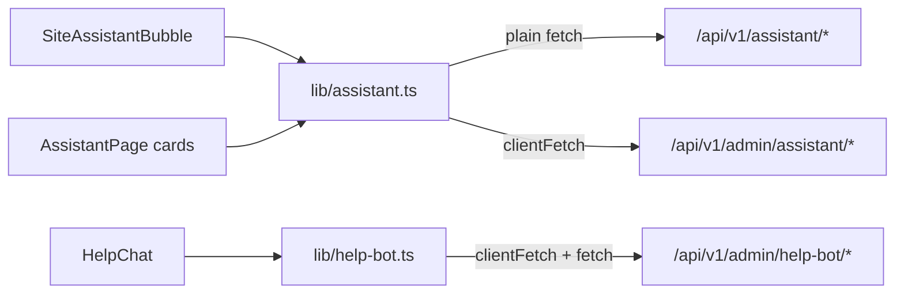

# AI Infrastructure & Assistants — frontend-customer-src

# AI Infrastructure & Assistants — frontend-customer

This module is the client side of Contentor's tenant-level AI assistant system: the chat widgets that students, anonymous visitors, and coaches talk to, the coach's admin console for configuring and supervising the assistant, and the shared client libraries that speak to the Django AI endpoints. The server counterpart lives in `apps/tenant_config` (assistant views, `AssistantKnowledgeEntry`, `AssistantLink`) and `apps/core/assistant.py` (the takeover kernel).

There are three distinct chat surfaces, backed by two client libraries:

| Surface | Component | Audience | Library | Backend prefix |
|---|---|---|---|---|
| Site assistant bubble | `SiteAssistantBubble` (`components/assistant/site-assistant-bubble.tsx`) | Students & anonymous visitors on the tenant site | `lib/assistant.ts` (public half) | `/api/v1/assistant/…` |
| Setup help chat | `HelpChat` (`components/setup/help-chat.tsx`) | Coaches, inside the setup panel's "help" tab | `lib/help-bot.ts` | `/api/v1/admin/help-bot/…` |
| Admin console | `AssistantPage` + cards (`app/admin/assistant/`) | Coaches configuring & supervising the site assistant | `lib/assistant.ts` (admin half) | `/api/v1/admin/assistant/…` |

All three share one wire contract (SSE streaming, thread polling, markdown-lite answers) but differ in auth: the student-facing endpoints use plain `fetch` with an anonymous session id, while everything coach-facing goes through `clientFetch` (cookie-session auth, JSON handling, demo-readonly toast).

## Client libraries

### `lib/assistant.ts`

Split into two halves, clearly separated in the file.

**Public half (student/visitor, plain `fetch`):**

- `useAssistantStatus()` — React hook over a module-level status cache (`statusCache` + `listeners` + `refreshAssistantStatus()`). Every mounted widget shares one `/api/v1/assistant/status/` fetch; `broadcast()` fans updates out to all subscribers. `AssistantStatus` carries `enabled`, a `reason` (`ok | disabled | upgrade_required | budget | quota | session_limit`), the coach's `greeting`, `suggested_questions`, `brand`, `human_handoff`, and `link_whitelist`. Failures fail soft to `null` — the widget renders nothing.
- `streamAssistantChat(messages, onDelta, onDone?)` — POSTs the full history to `/api/v1/assistant/chat/` and reads an SSE stream (see [SSE contract](#sse-streaming-contract)). Resolves `"ai"` on a normal answer, `"human"` if the conversation raced into human mode server-side, and throws `AssistantUnavailable` (carrying the server's `reason`) when gated. One important nuance: a `session_limit` gate is a **per-visitor** cap, so it is deliberately *not* broadcast into the shared status cache — flipping `enabled: false` there would unmount the widget before it could render its inline "capped for today" message. Tenant-wide reasons (`disabled`/`budget`/`quota`) *do* collapse the shared status.
- `fetchThread(after)` / `sendHumanMessage` / `requestHuman` — the polling and human-handoff endpoints. `fetchThread` maps a 404 to an **empty `ThreadPayload`, not `null`**: a brand-new session's first poll always 404s (the conversation row is created lazily by the chat POST), and that is a definitive "zero messages" answer. Only genuine failures (network, 5xx) return `null` so the poller skips the tick. Collapsing 404 into `null` would break hydration — see below.
- `applyThreadPoll(thread, lastId, initial)` — the pure poll-tick reducer both widgets use. On the `initial` tick it replays the entire stored thread (all roles); on later ticks it appends only `agent`/`system` rows, because `user`/`assistant` rows are already local echoes from `send()`. Returns the rows to append plus the new high-water-mark message id. It is pure precisely so vitest can cover it without a DOM.
- Session identity: `getSessionId()`/`touchSession()` persist a UUID in localStorage under `contentor.ai.session.assistant`, rotated after 24h idle (`SESSION_IDLE_MS`). `resolveSession(raw, now)` is the pure rotation logic, again for DOM-free tests.
- `decideLink(href, origin, whitelist)` — the link-safety boundary (see [Link safety](#link-safety)).
- `rateAssistantAnswer(meta, rating)` — fire-and-forget thumbs to `/api/v1/ai/rate/`, authenticated by the per-answer `rate_token` from the SSE `done` event, not by session.

**Admin half (coach, `clientFetch`):**

- Config: `getAssistantConfig`/`putAssistantConfig`. The GET/PUT *response* uses the field name `human_handoff` while the PUT *request* uses `human_handoff_enabled`; `normalizeAdminConfig` renames on the way in so consumers only ever see `human_handoff_enabled`.
- Knowledge base CRUD: `listKnowledge`/`createKnowledge`/`updateKnowledge`/`deleteKnowledge`.
- Link registry CRUD: `listLinks`/`createLink`/`updateLink`/`deleteLink`.
- Takeover console: `listConversations`, `getConversationThread(id, after)`, `takeoverConversation`, `releaseConversation`, `sendAgentMessage` — all return a full `ThreadPayload`.
- `streamAssistantPreview` — same SSE contract as `streamAssistantChat`, but hits `/api/v1/admin/assistant/preview-chat/` with **no session id** (the server pins `session_id="preview"`), bypassing the enable switch and the monthly question quota.

### `lib/help-bot.ts`

Mirrors the public half of `lib/assistant.ts` for the coach-facing help bot: its own `HelpBotStatus` cache + `useHelpBotStatus()` hook (shared between the setup bubble and panel), `streamHelpBotChat` with the same `"ai" | "human"` resolution and a `HelpBotUnavailable` error class, and its own session under the distinct key `contentor.ai.session.help` so a coach's help-bot session never collides with the site assistant's. It re-exports `resolveSession`, `applyThreadPoll`, and the thread types from `lib/assistant.ts` rather than duplicating them. Because `fetchHelpThread` goes through `clientFetch` (authenticated), the 404 → empty-payload case is detected by catching `ApiError` and checking `err.status`, not by reading `res.status` directly.

## Shared mechanics

### SSE streaming contract

All three chat endpoints stream `data:` frames separated by `\n\n`, each carrying a JSON event of `type` `"delta" | "done" | "error"`. `delta` events carry `text` chunks fed to `onDelta`; the `done` event carries the answer-tail metadata (`transcript_id`, `rate_token`, `suggestions`) packaged into `AnswerMeta` for `onDone`. A stream that ends without a `done` event throws `"stream ended early"`.

Before touching the stream, every client checks the response `content-type`: a JSON body instead of a stream means either a gate (`enabled: false` + `reason` → throw the typed unavailable error) or `mode: "human"` — the message was stored server-side but there is no AI stream to read. The chat UIs handle `"human"` by dropping the empty streaming placeholder bubble and letting the poller deliver whatever the human agent replies.

These streams intentionally bypass `clientFetch`, which JSON-parses whole bodies.

### Thread polling and hydration

Both chat widgets run the same effect shape: an immediate `tick()` plus a `setInterval` (5s in AI mode, tightened to 3s once a human is involved or has been requested). Each tick fetches messages `after` the high-water mark in `lastIdRef` and feeds them through `applyThreadPoll`.

The subtle part is deciding whether a tick is the widget's **first successful** one (`initial`), which triggers a full-thread replay. That flag lives in `hydratedRef` and is captured synchronously *before* the `await` — a suggested-question chip can add local messages while the first fetch is still in flight, and `hydratedRef` (unlike `lastIdRef` or the message list) is never touched by `send()`, so it can't be raced by the concurrent local echo. It is deliberately **not** derived from `lastId === 0`: a genuinely empty first fetch never advances `lastId`, which would keep treating every later tick as "initial" and re-replay the first Q&A exchange on top of its own local echo. This is also why `fetchThread`/`fetchHelpThread` map 404 to an empty payload — hydration must complete on that always-404 first tick of a brand-new session.

If you change any of this, keep the three pieces consistent: the reducer (`applyThreadPoll`), the 404 mapping in the fetchers, and the `hydratedRef` capture in both widgets.

### Human handoff

The loop, end to end: a visitor clicks "talk to a human" → `requestHuman()` flags the conversation and the widget tightens its poll interval → the coach sees a "wants human" badge in `ConversationsCard` and clicks take over (`takeoverConversation`) → the conversation `status` flips to `"human"`, the widget shows the agent banner, and `send()` switches from streaming to `sendHumanMessage` (plain POST, replies arrive via polling) → the coach replies with `sendAgentMessage` and eventually `releaseConversation` hands back to the AI. The takeover kernel writes `system`-role rows (`agent_joined:<name>`, `assistant_resumed`, `human_requested`) that both sides render through `systemLine` — the widgets have local copies, and `format-answer.ts` exports a shared version for the admin console.

### Link safety

Assistant answers use a markdown-lite contract: plain text, `**bold**`, and `[label](href)` links rendered as navigation buttons rather than inline anchors. Extraction is a two-stage design, and the division of labor matters:

1. A **syntactic regex** (`LINK_RE`, per-surface) is only a first pass. It rejects the obvious `//evil.com` protocol-relative form but cannot rule out parser quirks like `/\evil.com` (WHATWG URL parsing treats that backslash as a second slash).
2. The **actual safety boundary** resolves every extracted href with the real `URL` parser: `decideLink(href, origin, whitelist)` for the student bubble (`"internal"` only when the resolved origin matches the page's own; `"external"` only on an *exact* match against the coach's `link_whitelist`; otherwise dropped), and `isSameOriginPath`/`parseAnswer` in `format-answer.ts` for the admin surfaces (same-origin only). `HelpChat`'s regex additionally restricts hrefs to `/admin/…` paths.

`parseAnswer(content, origin)` takes `origin` as an explicit parameter instead of reading `window.location` so it stays pure and SSR-safe; callers read the origin once at the component level. Never "simplify" one of these surfaces down to regex-only filtering.

## The chat widgets

### `SiteAssistantBubble`

Mounted by `StudentLayout` and `PublicLayout` — **only for non-owners**, so the bottom-right corner stays free for the coach's EditButton. Renders nothing when `useAssistantStatus()` reports disabled or on `HIDDEN_PREFIXES` routes (`/learn` is the focused course player, plus `/admin`, `/login`, `/callback`, `/checkout`). While the popover is `open` it runs the polling effect; on send it locally echoes the user message plus an empty assistant placeholder, streams deltas into that placeholder, and attaches `AnswerMeta` on `done` (enabling the thumbs buttons and follow-up suggestion pills). On stream failure it rolls the message list back to `priorMessages` and restores the input, distinguishing `session_limit` from generic errors. The "talk to a human" affordance appears only when the coach has `human_handoff` enabled.

### `HelpChat`

Same skeleton as the bubble with two differences. It has no `open` state — `SetupAssistantPanel` only mounts it while the coach is on the help tab, so mount lifetime *is* visibility and the polling effect runs unconditionally. And its conversation starters are context-aware: it reads `useSetupStatus()` and surfaces suggestions for undone setup items (payouts, publish) ahead of the evergreen ones.

## The coach admin page (`/admin/assistant`)

`AssistantPage` loads `AssistantAdminConfig` once, renders `UpsellCard` if `config.status.reason === "upgrade_required"`, and otherwise composes six cards:

- **`EnableCard`** — the on/off switch, a usage meter over `usage.questions_used / questions_cap`, and the human-handoff toggle. Both toggles are optimistic in the page (`handleToggle`/`handleToggleHandoff` set state first, roll back on failure).
- **`GreetingCard`** — greeting + up to `MAX_SUGGESTIONS` (3) suggested questions. Seeded once from the loaded config and uncontrolled after mount, so an unrelated save elsewhere (e.g. the enable switch replacing `config`) never clobbers in-progress edits.
- **`KnowledgeCard`** — the "teach your assistant" knowledge base. CRUD list with an inline add form, optimistic enable toggles, `window.confirm` deletes, and a `MAX_ENTRIES`/`MAX_CONTENT` cap that mirrors `AssistantKnowledgeEntry` on the backend (client-side as a UX nicety only; the server 400s past the cap). Accepts a `prefill` prop for the teach loop below.
- **`LinksCard`** — the external-link registry (the source of the student widget's `link_whitelist`), mirroring `KnowledgeCard`'s shape with `MAX_LINKS` = 20.
- **`PreviewChatCard`** — "try it yourself" via `streamAssistantPreview`; quota-free, works with the assistant disabled, and doubles as visual QA for the suggestions tail.
- **`ConversationsCard`** — the live console: paginated conversation list (idle-refreshed every `LIST_POLL_MS` = 10s, but only while no thread is open, so a coach mid-reply never has the list rewritten under them), expandable inline into a full thread polled every `THREAD_POLL_MS` = 3s, with takeover/reply/release actions.

`ConversationsCard` has its own concurrency discipline worth understanding before editing: `mergeThread` dedupes incoming messages by id and only moves the high-water mark forward, so a poll tick that was in flight when a takeover replaced the thread can apply harmlessly twice. Stale responses are guarded two ways — the polling effect uses a per-instance `cancelled` flag (sufficient because the effect re-runs per conversation), while the one-shot handlers (`openThread`, `handleTakeover`, `handleRelease`, `handleSend`) compare against `activeRef`, a synchronous mirror of `active`, because they don't re-run on render and a coach can switch conversations before their promise resolves.

The improvement loop: every assistant answer in a thread has an "Add to knowledge" button. `precedingUserMessage` walks the thread backwards to find the *question* the answer responded to, and `handleAddToKnowledge` in the page prefills `KnowledgeCard` with it and scrolls there — teaching the assistant the thing it was asked, not the answer it gave.

## Testing notes

The deliberately-pure functions are the unit-test surface (this repo's frontend tests are lib-only, no React harness): `applyThreadPoll`, `resolveSession`, `decideLink`, `isSameOriginPath`, `parseAnswer`, `systemLine`. `getCachedAssistantStatus()` exists so tests can assert whether a code path called `broadcast()` — e.g. that a `session_limit` gate leaves the shared status untouched — without mounting a hook. When touching any serializer these clients consume, remember the project-wide rule: regenerate `src/types/api-generated.ts` via `npm run gen:api` and review the diff.