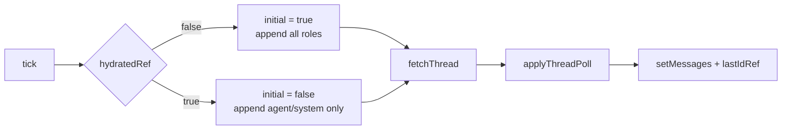

# AI Infrastructure & Assistants — frontend-main-src

# AI Infrastructure & Assistants — `frontend-main/src`

The marketing site's entire AI surface is one file: `frontend-main/src/components/shared/help-bubble.tsx`. It renders "Ask Contentor" — a floating chat bubble for **anonymous visitors** on the marketing/signup site, backed by the public `/api/v1/help/*` endpoints. It streams AI answers, persists a session across page loads and reloads, and transparently switches into human-agent mode when a superadmin takes over the conversation.

It is mounted once, unconditionally, from `src/app/layout.tsx` (`RootLayout → HelpBubble`), and self-gates: it renders `null` unless the backend reports the bot enabled and the current path is a marketing path.

## Why this file is self-contained

`frontend-customer` has an equivalent widget backed by `lib/assistant.ts`. `frontend-main` is a **separate Next.js app** — there is no cross-app import boundary — so the polling reducer (`applyThreadPoll`) is duplicated here verbatim, structure-for-structure. When you change polling semantics in one app, change the other. The doc comment on `applyThreadPoll` points at the customer-side original as the canonical history of *why* the reducer has this exact shape.

## Backend contract

Five endpoints, all called with `credentials: "same-origin"` (the visitor is anonymous; the session id is the correlation key, not a cookie identity):

| Endpoint | Called by | Purpose |
|---|---|---|
| `GET /api/v1/help/status/` | mount effect in `HelpBubble` | `{ enabled: boolean }` — kill switch |
| `POST /api/v1/help/chat/` | `streamChat` | send transcript, read SSE-framed answer |
| `GET /api/v1/help/thread/?session=&after=` | `fetchThread` | this session's persisted thread |
| `POST /api/v1/help/human-message/` | `sendHumanMessage` | visitor message while in human mode |
| `POST /api/v1/help/human-request/` | `requestHuman` | ask for a human agent |
| `POST /api/v1/ai/rate/` | `rateAnswer` | thumbs up/down on one answer |

`streamChat` handles a dual-shaped response. If `Content-Type` is `application/json`, the backend did *not* stream: either it's a caps/config problem (throws `"unavailable"`) or `{ mode: "human" }`, meaning the conversation flipped to human mode server-side between the visitor typing and the POST landing. In that case the message is already stored and the poller will deliver the reply, so `streamChat` resolves `"human"` and `send()` drops the empty streaming placeholder it had optimistically appended.

Otherwise the body is read as a stream of `\n\n`-separated frames, each with a `data: ` line carrying `{ type: "delta" | "done" | "error", ... }`. Deltas are appended to the last message; `done` carries `transcript_id`, `rate_token` and follow-up `suggestions` (captured as `AnswerMeta`). A stream that ends without a `done` frame throws — a truncated answer is treated as a failure, not a partial success.

## Session management

Sessions live in `localStorage` under `contentor.ai.session.help` as `{ id, ts }`. The same key string is used by frontend-customer's coach help chat, but the two apps are served from different origins so there's no collision.

- `resolveSession(raw, now)` is pure and testable without a DOM: it returns the stored id if it parses and is younger than `SESSION_IDLE_MS` (24h), otherwise a fresh UUID with `fresh: true`. Any parse failure falls through to a fresh session.
- `getSessionId()` memoizes into a module-level `sessionId` and touches storage on first resolve.
- `touchSession()` rewrites the timestamp after every meaningful interaction (successful stream, human message send) — idle expiry is measured from last activity, not from creation. Storage failures are swallowed; the session degrades to in-memory only.

## Thread polling and the `initial` flag

This is the subtle part of the module. While the popover is open, a `tick` runs immediately and then on an interval — **3s** when a human is involved or requested, **5s** otherwise. Each tick fetches the thread and feeds it to `applyThreadPoll`.

`applyThreadPoll(thread, lastId, initial)` filters to messages newer than `lastId`, advances the high-water mark, and decides what to append: **all roles on the initial tick** (replaying the stored thread when the visitor reopens the widget), **only `agent`/`system` rows afterwards** — because `user` and `assistant` rows were already echoed locally by `send()` and `streamChat`'s delta handler.

Three invariants keep that from double-rendering messages, and all three are load-bearing:

1. **`initial` comes from `hydratedRef`, never from `lastId === 0`.** A genuinely empty first fetch never advances `lastId`, so deriving `initial` from it would mark every later tick as initial too — replaying the first Q&A on top of its own local echo once it persists.
2. **`initial` is captured synchronously before the `await`.** A suggested-question chip click can push local messages while the first `fetchThread()` is still in flight; `hydratedRef` (unlike `lastIdRef` or the message list) is never touched by `send()`, so it can't be raced.
3. **`hydratedRef` stays `false` across a failed or cancelled tick**, so a retry still gets full-replay treatment.

`fetchThread` mirrors this care in its error mapping. Network errors and 5xx return `null` (unknown state → skip the tick, leaving `hydratedRef` untouched). A **404 is deliberately different**: the backend returns it when no `AiConversation` row exists yet for the session — the definitive answer for "zero messages", which happens on literally every new session's first tick since the row is created lazily by the chat POST. It's mapped to an empty `ThreadPayload` so hydration completes on that tick, exactly like a real empty `200`.

## Message model

The widget keeps a local `Msg[]` where `role` is one of `user | assistant | agent | system`, plus optional `meta` (`AnswerMeta`) and `rated`. The wire type `ChatMessage` sent to `/help/chat/` is narrower — `send()` filters the local list down to `user`/`assistant` before building history, so agent and system rows never enter the model's transcript.

`system` rows are protocol markers, not prose. `systemLine()` maps them to translated text: `agent_joined:<name>`, `assistant_resumed`, `human_requested`. Unknown markers render nothing.

## Rendering

`AnswerBody` post-processes model output rather than rendering markdown:

- `LINK_RE` extracts `[label](/signup|/pricing|/login…)` links out of the prose and re-renders them as primary-styled `next/link` CTA buttons below the text. The regex is the enforcement point for the visitor persona's allowed link targets — the model can't emit a link to anywhere else and have it render.
- `**bold**` is stripped to plain text; the remainder renders as `whitespace-pre-wrap`.

An assistant message with empty `content` renders the three-dot bouncing "thinking" indicator — that's the state between `send()`'s optimistic placeholder and the first delta.

Path gating uses `HIDDEN_PREFIXES` (`/admin`, `/dashboard`, `/callback`): the visitor bot never appears over the superadmin SPA, the coach dashboard, or auth callbacks.

Note: this widget predates / sits outside the shared loading conventions in CLAUDE.md — it uses raw `next/link` and hand-rolled CSS bounce dots rather than `<NavLink>` / `<Spinner>`. If you refactor it, the link rendering is deliberately raw because targets are model-generated and validated by `LINK_RE`.

## Send paths

`send(question)` branches on `mode`:

- **`mode === "human"`** — append the local echo, clear follow-ups, `sendHumanMessage()`. No streaming; the poller delivers the agent's reply.
- **`mode === "ai"`** — snapshot `priorMessages`, append the user message plus an empty assistant placeholder, then `streamChat()`. On any throw, the whole exchange is rolled back to `priorMessages`, the question is restored into the input, and the error line shows. On a `"human"` result, the placeholder is sliced off and `mode` flips (which also speeds the poll interval to 3s).

`requestHumanHandoff()` sets `humanRequested` optimistically before awaiting `requestHuman()` — the "Talk to a human" affordance disappears immediately and the poller speeds up, regardless of the request's outcome.

`rateAnswer` is fire-and-forget: it needs both `transcriptId` and `rateToken` from the `done` frame, expects `204`, and the UI marks the message `rated` locally without waiting for the result.

## Contributing notes

- **Changing polling semantics?** Mirror the change in `frontend-customer/src/lib/assistant.ts::applyThreadPoll` and keep the doc comments in sync.
- **Adding a new response mode to `/help/chat/`?** It must arrive as JSON with a `mode` field; `streamChat` currently throws `"unavailable"` for any JSON body other than `mode: "human"`.
- **Adding a new marketing link target?** Extend `LINK_RE`'s alternation *and* the backend persona prompt — either alone silently drops the link.
- **New `system` marker?** Add it to `systemLine()` with a translation key under `marketing.helpBot`, or it renders as nothing.
- The pure functions (`resolveSession`, `applyThreadPoll`) are deliberately DOM-free and are the right place to add unit tests for expiry and replay behavior.
