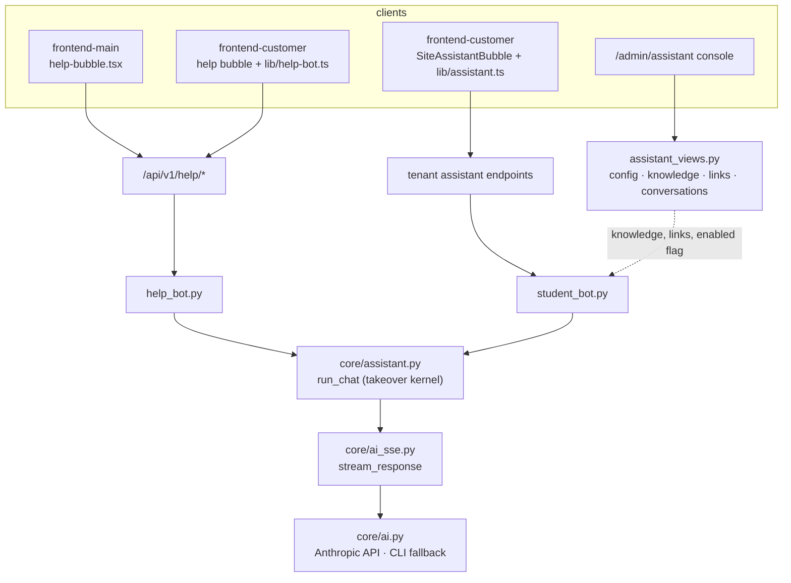

# AI Infrastructure & Assistants

# AI Infrastructure & Assistants

Everything Contentor does with Claude flows through this module group: one backend provider layer, one SSE framing convention, one conversation kernel with cost governance — and three chat surfaces on top of it, spread across both frontends.

The split is by tier, not by feature:

| Sub-module | Owns |
|---|---|
| [Backend](ai-infrastructure-assistants-backend-apps.md) | The provider layer (`apps/core/ai.py`), SSE framing (`apps/core/ai_sse.py`), the takeover kernel (`apps/core/assistant.py`), and the two bots — `apps/tenant_config/help_bot.py` (coach-facing "Ask Contentor") and `apps/tenant_config/student_bot.py` (tenant site assistant), plus their config/knowledge/conversation views in `assistant_views.py`. |
| [frontend-customer](ai-infrastructure-assistants-frontend-customer-src.md) | The tenant-side surfaces: `SiteAssistantBubble` for students and visitors, the coach's help bubble, the `/admin/assistant` console (`KnowledgeCard`, `ConversationsCard`, `PreviewChatCard`), and the two client libs `src/lib/assistant.ts` / `src/lib/help-bot.ts`. |
| [frontend-main](ai-infrastructure-assistants-frontend-main-src.md) | One self-contained file — `components/shared/help-bubble.tsx` — the anonymous-visitor "Ask Contentor" bubble on the marketing site, mounted unconditionally from `RootLayout`. |

## How the tiers compose

Nothing in the group talks to Claude directly. `apps/core/ai.py` is the only call site, and `apps/core/ai_sse.py` is the only place event framing is decided — which is why the same client-side stream parser works against the help bot, the student bot, and `streamAssistantPreview` in the admin console. Structured-generation features outside this group (blog drafts, Logo Studio, the onboarding wizard) reuse the same two files.

## Workflows that span sub-modules

**Streamed answer with human takeover.** A bubble opens a session (`getSessionId` → `touchSession`, duplicated deliberately in each frontend so the marketing bundle stays dependency-free), posts a question, and consumes SSE from `stream_response`. `run_chat` decides per turn whether the reply comes from Claude or from a human agent; when a superadmin or coach claims the thread, the client's poll (`fetchThread` → `applyThreadPoll` on the marketing side, the equivalent in `lib/help-bot.ts`) flips the widget into human-agent mode and routes subsequent turns through `sendHumanMessage`. Release goes back through `assistant_conversation_release`.

**Coach configures, then supervises.** `AssistantPage` writes config, `AssistantKnowledgeEntry` rows, and `AssistantLink` rows through `assistant_views.py` (validated by `_validate_entry` / `_validate_link`); `build_system_prompt` in `student_bot.py` folds those plus the live product catalog (`_catalog_lines` → `_price`) into the prompt students actually hit. `PreviewChatCard` exercises that exact prompt path before it ships, and `ConversationsCard` reads back what students asked.

**Cost governance.** Every answer settles through `record_question` → `tenant_usage`, and both bots gate on `availability`, which checks per-tenant usage and `global_spend` against `current_month` — `student_bot.py` reuses `help_bot.current_month` so the two bots share one month boundary and one platform-wide ceiling. A disabled or over-budget assistant is what makes the bubbles render `null` rather than fail mid-stream.

Design docs: `docs/superpowers/specs/2026-07-09-shared-ai-provider-design.md`, `docs/superpowers/plans/2026-07-09-coach-help-bot.md`, `docs/superpowers/specs/2026-07-10-ai-assistants-governance-design.md`.