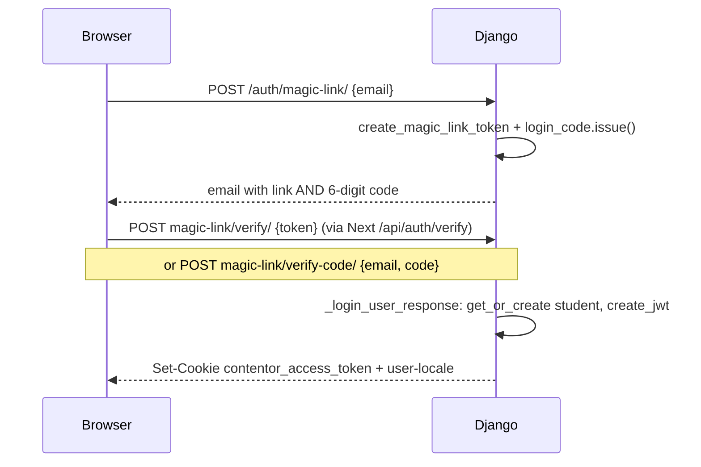

# Authentication & Accounts

# Authentication & Accounts

`backend/apps/accounts` owns identity for the whole platform: the `User` model, every login flow (magic link, emailed code, Google OAuth), session issuance, impersonation, and the student-management API a coach uses. It is a **SHARED_APP but its `User` table exists in every schema** — the public schema holds coaches/superadmins, each tenant schema holds that tenant's students and staff. The two Next.js frontends consume it through thin proxy routes and the `getAuthUser()` helper.

There are no server-side sessions. A signed HS256 JWT in the `contentor_access_token` cookie (httpOnly, `SameSite=Lax`, 7 days) is the session. Everything else in this module is machinery for minting, validating, and scoping that token.

## The token model

All tokens are HS256 JWTs signed with `settings.SECRET_KEY`, minted in `tokens.py`. They are distinguished by a `purpose` claim — session tokens are the only kind **without** one, and `AdminJWTBackend` relies on that to reject every special-purpose token:

| Token | Factory | Purpose claim | TTL | Notes |
|---|---|---|---|---|
| Session | `create_jwt(user, tenant, region=None, extra_claims=None)` | *(none)* | `JWT_EXPIRY_DAYS` | Carries `user_id`, `tenant_id` (schema name), `role`, `region`. `extra_claims` is how impersonation adds `imp`. |
| Magic link | `create_magic_link_token` / `verify_magic_link_token` | `magic_link` | `MAGIC_LINK_EXPIRY_MINUTES` | Carries only `email` + tenant; user is created on redeem. |
| Signup | `create_signup_token` / `verify_signup_token` | `signup` | same as magic link | Used by coach signup (in `apps.core`). |
| Wizard | `create_wizard_token` / `verify_wizard_token` | `wizard` (verify also accepts `signup`) | `WIZARD_TOKEN_EXPIRY_DAYS` | Long-lived so a coach can resume the pre-provision onboarding wizard. `decode_wizard_token_allow_expired` skips only the `exp` check (signature still enforced) — used by recovery, which re-sends a fresh link to the owner's email, never trusts the caller. |
| Impersonation | `create_impersonation_token` / `verify_impersonation_token` | `impersonation` | 120 s | Single-use via `jti`; carries `target_user_id`, `impersonator_email`, `scope`. |
| OAuth state | `_create_oauth_state` / `_verify_oauth_state` (in `views.py`) | `google_oauth` | 10 min | Replaces state cookies; carries tenant, origin, region through Google's fixed redirect_uri. |

## Request authentication

**`TenantJWTAuthentication`** (`authentication.py`) is the default DRF auth class project-wide. It reads the cookie (falling back to a `Bearer` header), decodes it, and enforces two scoping rules:

1. **Tenant match** — `payload["tenant_id"]` must equal `connection.tenant.schema_name`, otherwise the request is anonymous. User IDs are per-schema sequences, so without this check user 1's token would resolve to user 1 in any schema.
2. **Region match** — a `region` claim that disagrees with `request.region` raises `CrossRegionRejection`, a structured 401 carrying `redirect_to` (built via `region_apex`) that the Next.js middleware turns into a 302 to the correct region's apex.

Deliberate design choice: expired/invalid tokens return `None` rather than raising, so `AllowAny` views see an anonymous user instead of a 403, while `IsAuthenticated` views still reject. On success it also calls `apps.logbook.context.set_current_user` so log lines are attributed.

> Because the default auth class rejects bad tokens by returning `None` but still *runs*, truly public endpoints (magic link, OAuth, signup) must set `@authentication_classes([])` — `AllowAny` alone is not enough (see CLAUDE.md).

**`AdminJWTBackend`** (`backends.py`) lets an already-logged-in staff user into the classic Django admin without a password, from the same cookie. It applies the same tenant and region checks plus two admin-specific ones: the payload must have no `purpose` (so magic-link/signup/impersonation/oauth tokens can never open an admin session) and the user must be `is_staff` and `is_active`.

## Login flows

### Magic link + emailed code

`magic_link_request` (throttled `5/min` per IP via `MagicLinkThrottle`) mints the link token, issues a login code, and sends one email with both through `apps.core.email.send_magic_link`. In `DEBUG` with a `demo-*` tenant slug it skips email entirely and returns a `demo_redirect` URL for instant login; the frontend `MagicLinkForm` follows it.

The **login code** (`login_code.py`) exists because installed PWAs have their own cookie jar — the emailed link opens in the browser, so its session never reaches the app, whereas a code is typed into whatever context requested it. Codes are stored SHA-256-hashed in Redis under `login_code:{schema}:{email}` with the same TTL as the link. A **separate atomic counter key** (`cache.incr`) enforces the 5-attempt lockout so parallel wrong guesses can't race past it; the code entry itself is immutable after issue. `issue()` returning `None` on cache failure is intentional — link login must never depend on the code path.

Both verify endpoints converge on `_login_user_response`, which lower-cases the email, does a region-scoped `get_or_create` (with `email__iexact` lookup so pre-normalization prod users are found), issues the session JWT, and sets two cookies via `_set_session_cookie` and `_set_locale_cookie`. The `user-locale` cookie is deliberately **not** httpOnly so the Next.js edge middleware can read it without decoding the JWT. `_COOKIE_SECURE = not settings.DEBUG` — only plain-http local dev relaxes the Secure flag.

### Google OAuth

Google enforces one fixed `redirect_uri`, so the callback always lands on a single host regardless of which tenant subdomain started the flow. `google_login` therefore packs everything into the signed state JWT: the tenant schema, the originating `origin` URL, and the region (resolved from the origin host via `resolve_host`, since `request.region` at callback time is meaningless).

`google_callback` verifies the state, resolves the tenant and calls `connection.set_tenant()` manually (the request arrived on the callback domain, not the tenant's), exchanges the code, fetches userinfo, then `get_or_create`s the user — default role `coach` on the public schema, `student` on a tenant. Crucially it passes the state's region as an explicit override to `create_jwt(user, tenant, region=region)` so the resulting cookie survives `TenantJWTAuthentication`'s cross-region check when the user lands back on e.g. `tr.contentor.app`. It finishes by redirecting to `{origin}/callback?token=...&source=google`; every failure mode redirects to `/login?error=<code>`, which both frontends' `LoginPage`s map to translated messages via `GOOGLE_ERROR_KEYS`.

Note the asymmetry the frontend `CallbackPage` handles: a Google callback token is **already a session JWT** (the `/api/auth/google` route — shared `packages/shared/src/auth/login-route.ts` — just sets the cookie), while a magic-link token still needs Django verification (`/api/auth/verify` proxies to `magic-link/verify/`).

## Impersonation ("Log in as")

`impersonation.py` is the single service both admin surfaces use: the superadmin platform panel calls `impersonate_tenant_admin` (which picks the tenant's staff owner via `tenant_admin_user`), and the coach's studio SPA calls `impersonate_same_tenant_user` through the `login_as` row action in `admin_panels.py` (students only). Both funnel into `issue_impersonation`, which mints a 120-second single-use token, logs an audit line with the `jti`, and returns `{"redirect": "https://<tenant-domain>/impersonate?token=...&next=..."}` — staff/owners land on `/admin`, students on `/dashboard` (`_landing_path`).

Redemption happens on the target tenant's domain:

- The `frontend-customer/src/app/impersonate/page.tsx` landing page posts the token to `/api/auth/impersonate/verify`, which proxies to Django **forwarding the current cookie** so Django can stash it.
- `impersonate_verify` burns the `jti` in Redis (`SET NX EX 130`; if Redis is down it logs and proceeds — the 120 s expiry still bounds replay), then issues a normal session JWT with an `imp: {by, scope}` extra claim.
- **Studio scope** (coach→student, same domain): if the existing cookie is a non-impersonated owner/coach session for this tenant, it's stashed in the `contentor_impersonator_return` cookie so "Exit" restores the coach in place. **Platform scope** (superadmin arriving cross-domain) must *not* adopt whatever session sits on the subdomain — any stale return cookie is cleared.
- `impersonate_stop` either restores the stashed session or just clears everything (`restored: false`), and the `ImpersonationBanner` routes accordingly: restored → `/admin`, platform scope → apex `/admin`, else `/`.

The banner state comes from `/users/me/`, which surfaces `impersonating` **from the signed session claim** (`request.auth["imp"]`) — it cannot be spoofed by setting a cookie.

## The User model

`models.py` defines a custom `AbstractBaseUser` with email login (`USERNAME_FIELD = "email"`), roles `owner` / `coach` / `student`, and `UserManager` (`create_user` sets an unusable password when none is given — most users never have one; `create_superuser` defaults to `role="owner"`).

The most important constraint: **email is unique per `(email, region)`, not globally** (`accounts_user_email_region_unique`). The same person may legitimately run businesses in multiple regions, each with its own row, preferences, and Stripe customer (`payment_customer_id`). This looser key is safe because auth-time isolation rides on the JWT's `tenant_id` + `region` claims, not the email. Every login lookup in `views.py` therefore includes `region` in its key.

Other fields worth knowing: `preferred_locale` (empty = fall back to tenant default — see `_tenant_default_locale`), `accessible_regions` (superadmin-only Django-admin scoping, consumed by `RegionScopedAdminMixin`), and PWA telemetry (`last_display_mode`, `last_platform`, `first_pwa_at`).

### Public-schema delete quirk

`admin.py`'s `UserAdmin` overrides `get_deleted_objects` / `delete_model` / `delete_queryset` because tenant-only apps (courses, billing, …) have FKs to `User` whose tables **don't exist in the public schema** — Django's delete Collector walks every reverse FK regardless of schema and crashes with `relation "courses_course" does not exist`. In the public schema `_public_delete` bypasses the Collector with raw SQL against the only two public tables referencing `accounts_user` (the auth m2m through-tables). In tenant schemas, default behavior is correct and used. If you ever add a public-schema model with an FK to `User`, this raw-SQL list must grow with it.

## API surface (`urls.py`, mounted under `/api/v1/auth/`)

Public (no auth class): `magic-link/`, `magic-link/verify/`, `magic-link/verify-code/`, `google/`, `google/callback/`, `impersonate/verify/`.

Authenticated: `logout/`, `impersonate/stop/`, `users/me/` (GET), `users/me/update/` (PATCH, via `UserSerializer` — email/role/is_superuser read-only), `users/me/locale/` (also refreshes the `user-locale` cookie).

Coach/owner only (checked inline via `IsCoachOrOwner`): `students/` (list with search/ordering, optional `limit`/`offset` pagination via `StandardPagination`; `StudentListSerializer` computes per-course progress, overall progress, and active-subscription info — note it does N+1-ish per-student queries into courses/billing), `students/<pk>/` (DELETE), `students/<pk>/grant-access/` (free enrollment into a course).

## Frontend integration

Browser calls hit Django directly through Caddy at `/api/v1/*`; the Next.js `/api/auth/*` routes exist only where the **server** must sit in the middle — to forward `Set-Cookie` headers (verify, impersonate) or to set the cookie itself (google, logout, shared in `packages/shared/src/auth/`). These server-side routes build the tenant target with the `X-Tenant-Domain` header, never a custom `Host` (undici drops it).

Server components use `getAuthUser()` from each app's `src/lib/auth.ts`, which calls `/users/me/` with the cookie as a Bearer token. The customer app wraps it in a 60-second `createTtlPromiseCache` keyed by `tenantDomain:token` because every server-rendered navigation blocks on it — so role changes take up to a minute to propagate, while logout is instant (the key disappears with the cookie). `requireAuth` / `requireRole` / `requireSuperuser` build on it, and both apps' `(auth)/layout.tsx` redirect already-authenticated users away from login pages.

## Dev tooling

`manage.py issue_login_token --role {superadmin,coach,student} [--tenant slug]` prints a real session JWT for a seeded user — used by the screenshot-map crawler and browser-pane automation. It refuses to run unless `settings.DEBUG`, so it can never mint a login in prod. In dev, unsent magic links are printed to stdout; in prod the token is deliberately withheld from logs (they ship off-box).