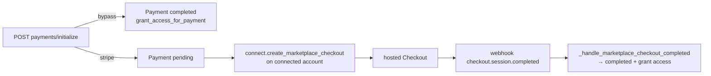
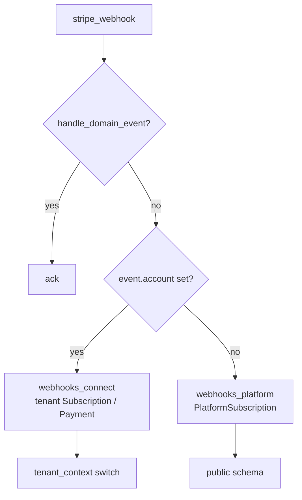

# Billing & Payments — backend-apps

# Billing & Payments (`backend/apps/billing`)

The billing app owns **two distinct money flows** that share models, providers, and one webhook endpoint. Keeping them straight is the single most important thing to understand before touching this code:

| Flow | Who pays whom | Stripe mechanism | State lives in |
|---|---|---|---|
| **Platform subscription** | Coach → Contentor | Checkout on the *platform* account, prices from `PlatformPlan.prices` | `core.PlatformSubscription` (public schema) |
| **Marketplace** | Student → Coach | **Direct charges** on the coach's *connected* account (`stripe_account=…`), platform takes an `application_fee` | `billing.Payment` / `billing.Subscription` (tenant schema) |

Everything else — the provider abstraction, the monetization gate, the webhook router — exists to keep those two from bleeding into each other.

## Layout

```
apps/billing/
  models/core.py           SubscriptionPlan, SubscriptionPlanAccess, Subscription,
                           Payment, PaymentItem, Bundle, BundleItem  (all tenant-schema)
  providers/
    __init__.py            PaymentProvider ABC + get_provider() factory
    types.py               CheckoutSession, ProviderError, InvalidWebhookSignature
    stripe_provider.py     platform-side Stripe adapter + webhook signature verify
    bypass_provider.py     dev/CI adapter, no network
    connect.py             Stripe Connect (Express) helpers — marketplace side
  views/
    payments.py            purchase, subscribe, refund, orders, earnings
    plans.py               coach SubscriptionPlan public read + access management
    bundles.py, store.py   catalogue surfaces
    connect.py             coach payout onboarding
    platform.py            coach→Contentor checkout, subscription, entitlements
    webhooks.py            /api/webhooks/stripe/ — verify, dedupe, dispatch
    webhooks_platform.py   coach→Contentor handlers
    webhooks_connect.py    student→coach (connected-account) handlers
    webhooks_common.py     pure payload parsers, shared by both sides
  admin.py / admin_panels.py   Django admin + coach-SPA adminkit registrations
  management/commands/seed_connect_test.py
```

`urls.py` mounts everything under `/api/v1/billing/`. The webhook is deliberately **not** there — `config/urls.py:35` mounts it at `/api/webhooks/stripe/`, before any `/api/v1/` route, so it escapes `TenantJWTAuthentication` and the region/tenant middleware and runs in the public schema.

## Models

All billing models are **tenant-schema** (`TENANT_APPS`). They describe what happens inside one coach's studio.

- **`SubscriptionPlan`** — a recurring membership the coach sells. `billing_interval_months` (1–36) is the cycle. The `stripe_price_id` / `stripe_price_amount_cents` / `stripe_price_interval_months` triple records *what the current Stripe Price was minted for*; when price or cycle changes, a **new** Price is provisioned and existing subscribers stay on the old one (decision **D1**, grandfathering). Stripe Prices are immutable — never try to mutate one.
- **`SubscriptionPlanAccess`** — generic FK rows saying "this plan unlocks that content".
- **`Subscription`** — a student's membership. `pending_plan` holds a scheduled plan change applied on the next `invoice.paid`. `provider` is `stripe` or `bypass`; `provider_subscription_id` is the webhook join key.
- **`Payment` / `PaymentItem`** — one charge, N items. `platform_fee` + `submerchant_payout` split the amount. `PaymentItem.is_refunded` supports per-item refunds of a multi-item charge. Note `Payment.platform_subscription` is a FK into the **public** schema with `db_constraint=False` — django-tenants would otherwise create a per-schema FK that breaks cross-schema `TRUNCATE` on test teardown. Integrity is ORM-level only.
- **`Bundle` / `BundleItem`** — discounted grouping of content, itself purchasable as a `PaymentItem`.

`Payment.provider` still lists `iyzico` as a choice; there is **no** iyzico adapter in `providers/` — it's a TR-roadmap placeholder.

## The provider abstraction

`providers/PaymentProvider` is an ABC with four methods (`create_checkout_session`, `create_customer_portal_session`, `cancel_subscription`, `parse_webhook`). `get_provider(tenant)` returns `BypassProvider` when `BILLING_BYPASS_ENABLED` is true, else `StripeProvider`. The `tenant` argument is accepted and discarded — reserved for future per-tenant routing.

Two important limits:

- The ABC covers the **platform** flow only. The marketplace side does not go through it; it calls `providers/connect.py` functions directly.
- `StripeProvider.create_customer_portal_session` and `cancel_subscription` still `raise NotImplementedError("Phase 2")`.

Both `stripe_provider._client()` and `connect._client()` resolve the SDK **lazily** and re-read `settings.STRIPE_SECRET_KEY` on every call. That is deliberate: import never hard-fails when Stripe is unconfigured, and per-test `override_settings` takes effect. `connect._client()` additionally raises `ProviderError(code="CONNECT_NOT_CONFIGURED")` so views return a clean 400 instead of a 500.

Every `connect.*` function wraps its Stripe call in `try/except → ProviderError`. Views translate that into a 4xx. In `views/payments.py`, `_provider_error_response()` logs the full exception but returns a generic `"Payment could not be processed."` — **raw Stripe exception text must never reach the client**.

### `BypassProvider`

More than a stub: it writes a synthetic `WebhookEvent` row (observability parity), then **immediately** upserts `PlatformSubscription` to active and lets the `post_save` signal mirror `Tenant.plan`. It also get-or-creates a real `User` when handed a pk-less placeholder (the pre-provision wizard checkout path), mirroring `provision_tenant`'s coach-user creation so a later real signup reuses the row.

## The monetization gate (D4)

Two helpers in `apps/core/monetization.py` guard every money path:

- `is_paid_active(tenant)` — paid plan + active `PlatformSubscription`. Gate for *reaching* Connect onboarding and for publishing/selling paid content.
- `can_monetize(tenant)` — `is_paid_active` **and** `stripe_charges_enabled`. Gate for *taking a real payment right now*.

Under bypass both short-circuit to true once the plan is paid, or the marketplace would be untestable offline.

`views/platform._compute_entitlements()` mirrors these gates into the per-feature map the coach-admin renders "Paid" badges from — `payouts` and `selling` both map to `is_paid_active`. If you add a gate to a feature, add it here too or the badge will disagree with the paywall.

## Coach payout onboarding (`views/connect.py`, `providers/connect.py`)

Express accounts, Stripe-hosted onboarding (**D6**), direct charges (**D7**).

```
POST /connect/onboard/    → create Express account if missing, persist
                            Tenant.stripe_account_id, return hosted onboarding URL
                            (402 UPGRADE_REQUIRED unless is_paid_active)
GET  /connect/status/     → connected / charges_enabled / payouts_enabled /
                            is_paid_active / can_monetize
                            ?refresh=1 re-reads live from Stripe and persists
GET  /connect/dashboard/  → single-use Express dashboard login link
```

Readiness normally arrives via the `account.updated` webhook (`_handle_account_updated`) which mirrors `charges_enabled` / `payouts_enabled` onto the public-schema `Tenant`. `?refresh=1` exists because the coach returns from onboarding before that webhook lands.

`create_express_account` picks country `TR` for `region == "tr"`, else `US`, and drops `.localhost` business URLs (Stripe rejects them).

## One-time purchase flow

`POST /payments/initialize/` validates each item is `pricing_type="paid"` (or a `Bundle`) and not already owned via `ContentAccessService`, computes per-item `platform_fee` from `tenant.plan.transaction_fee_pct` (`_get_fee_pct()`, default 10%), and creates a `Payment` + `PaymentItem` rows.



The success page polls `GET /payments/<id>/` (scoped to `student=request.user`, so one buyer can't read another's payment) until `status` flips.

`grant_access_for_payment(payment)` is the access side-effect. Most content types unlock implicitly — a completed, non-refunded `PaymentItem` is what `ContentAccessService` reads — so the only explicit record it creates is a course `Enrollment`, for directly purchased courses and for courses inside a purchased bundle. It's idempotent (`get_or_create`) because webhooks replay. It uses `payment.student_id` rather than `payment.student`: on the webhook path the search_path is the tenant schema and dereferencing the public-schema `User` would raise.

## Marketplace subscriptions

`POST /subscribe/` → `_ensure_subscription_price(plan, account_id, currency)` provisions or reuses a connected-account Price (the D1 check: reuse only if `stripe_price_id` **and** cached amount **and** cached interval all match), then `connect.create_subscription_checkout` with `application_fee_percent`. The local `Subscription` row is created by the webhook, not the view.

- `POST /subscriptions/<id>/cancel/` → `connect.cancel_subscription(at_period_end=True)`, sets `cancel_at_period_end`.
- `POST /subscriptions/<id>/change-plan/` → swaps the Stripe subscription item to the new Price with `proration_behavior="none"`, and records `pending_plan` locally. The local plan swap is applied on the next `invoice.paid`.

## Refunds (D8)

`POST /payments/<pid>/items/<iid>/refund/` is owner-only and runs the whole handler inside `transaction.atomic()` with `select_for_update()` on both the `Payment` and the `PaymentItem`. That lock is load-bearing: without it two concurrent requests both pass the `is_refunded` check and double-refund real money.

Order matters — Stripe first, local state second, so a failed refund leaves access intact. `connect.refund_payment` deliberately omits `refund_application_fee`: **the platform keeps its fee**, only the coach's share returns to the buyer. Refunding a course item deactivates the `Enrollment`; the parent payment becomes `refunded` or `partially_refunded`.

`GET /earnings/` aggregates completed sales (excluding `platform_subscription`-linked rows — those are the coach paying *us*) and, outside bypass, adds the live Connect balance from `connect.retrieve_balance`.

## Webhooks

One endpoint, `POST /api/webhooks/stripe/` (`views/webhooks.py:stripe_webhook`), CSRF-exempt, `authentication_classes([])`, public schema.

**Order of operations:**

1. `StripeProvider().verify_webhook_signature` → 400 `BAD_SIGNATURE` on failure.
2. `connection.set_schema_to_public()` defensively, then insert a `WebhookEvent`.
3. Dispatch inside `transaction.atomic()`; stamp `processed_at` on success, record the traceback and **re-raise** on failure so Stripe retries.

**Dedup semantics are subtle and intentional.** A `WebhookEvent` row does not mean "seen", it means "seen"; only `processed_at` means "done":

- new row → process
- existing row with `processed_at` set → genuine duplicate, ack 200
- existing row *without* `processed_at` → a prior attempt failed, **reprocess**

Getting this wrong would silently drop any transiently-failed event forever.

**Routing.** `apps.domains.handle_domain_event` gets first refusal. Otherwise `_connected_tenant(event)` decides the flow: Connect events carry a top-level `account` field and act on the tenant `Subscription`; platform events have none and act on `PlatformSubscription`. `checkout.session.completed` is split further by metadata — `payment_id` → marketplace one-time, `subscription_plan_id` → marketplace recurring, `plan_id` → platform.



Handlers only in `_STRIPE_HANDLED` are dispatched; anything else is acked with `handled: false`.

Guards worth knowing:

- Platform `checkout.session.completed` refuses to activate a plan unless `payment_status` is `paid` / `no_payment_required` — async payment methods can complete a session while unpaid, and activating then hands out a paid plan for free.
- `_handle_marketplace_invoice_paid` bootstraps the `Subscription` row from the invoice's embedded metadata if it doesn't exist yet: Stripe frequently delivers `invoice.paid` **before** `checkout.session.completed`, and the first charge must not be dropped.
- `_handle_platform_subscription_deleted` marks the row canceled so the `post_save` signal reverts the tenant to Free — without it a canceled coach keeps their paid plan forever.
- `webhooks_common.py` holds pure payload parsers (`_sub_period`, `_invoice_subscription_id`, `_invoice_period_end`) that tolerate **both** old and new Stripe API shapes (period fields moved from the subscription root onto items; `subscription` moved under `parent.subscription_details`). Parse invoices/subscriptions through these, never by hand.

### The non-webhook activation path

`sync_platform_checkout_session(tenant, session_id)` in `webhooks_platform.py` retrieves the Checkout Session directly and applies the same upsert. The onboarding wizard's return URL (`?upgraded=1&session_id=…`) calls it because local dev receives no webhooks without `make stripe-listen`, and even in prod the redirect can beat the webhook. Whichever path lands second is a no-op.

### Import-cycle constraint

`apps.domains.webhooks` imports from `apps.billing.views.webhooks`. Therefore **`webhooks_connect.py` and `webhooks_platform.py` must never import from `apps.domains`** — `handle_domain_event` stays imported only in `webhooks.py`. Several other imports inside those modules are function-local for the same reason (and because `apps.core` models aren't loaded when `providers/` is imported at startup).

## Currency

Content models carry no currency field. Every price on a tenant is denominated in `tenant_charge_currency(tenant)` — `Tenant.billing_currency`, locked on the coach's **first platform checkout** (`views/platform.start_checkout`, under `select_for_update` to prevent a concurrent-checkout race) and immutable thereafter, falling back to the region default.

`views/payments.tenant_currency` is a thin alias over it. This matters because a direct charge must match the connected account's currency — a global/USD account cannot be charged in TRY. Adminkit's `perform_create` for `SubscriptionPlan` and `Bundle` forces `currency=tenant_charge_currency()`; it is never user input.

## Catalogue & read surfaces

- `GET /store/` (`AllowAny`) — `_collect_store_items()` walks paid `Course`, `DownloadFile`, `LiveClass`, `LiveStream` plus active `Bundle`s, then attaches `access_info` per item via `ContentAccessService`. Filter by `?type=` / `?search=`.
- `GET /products/` (`IsCoachOrOwner`) — same items, no `access_info`, but with a `sales_count` computed from non-refunded `PaymentItem`s on completed payments.
- `GET /plans/`, `/plans/<pk>/` (`AllowAny`) — public plan listing with `is_subscribed` for the requester; `_resolve_access_items` resolves plan contents to titles/slugs/signed thumbnails.
- `PUT /plans/<pk>/access/` (`IsOwner`) — **bulk replace**: deletes all existing `SubscriptionPlanAccess` rows for the plan, then recreates from the payload.
- `/bundles/` — GET is public, POST/PATCH/DELETE require `request.user.role == "owner"` checked inline (DELETE is a soft delete: `is_active = False`).

Content-type strings are mapped by hand in several `CONTENT_TYPE_MAP` dicts (`serializers/bundles.py`, `serializers/payments.py`, `serializers/plans.py`). Note the payments map includes `"bundle"`; the bundle/plan maps do not — bundles can't nest.

## Admin surfaces

Two, and they're different:

- `admin.py` — plain Django admin for the superadmin, all seven models.
- `admin_panels.py` — adminkit registrations rendered in the **coach SPA** (`studio_site`), `IsOwner`-gated. `SubscriptionPlan` and `Bundle` get Activate/Deactivate bulk actions and force the tenant currency on create; `Payment` is fully read-only (`can_create/can_edit/can_delete = False`).

## Dev, test & e2e

- `BILLING_BYPASS_ENABLED=true` → fully offline payments. Dev `.env` runs it **false** (real Stripe test mode); prod must always be false.
- `make stripe-listen` forwards webhooks and writes a fresh signing secret. `stripe_provider._get_webhook_secret()` re-reads `.stripe_whsec` / `.env` **only when `DEBUG`** so a rotated CLI secret is picked up without a restart. Never rely on this in prod.
- `manage.py seed_connect_test --tenant <slug>` creates a **Custom** test-mode account with Stripe's documented test data (routing `110000000`, address `address_full_match`) and polls until `charges_enabled`, so marketplace checkout works locally without hosted Express onboarding. It refuses any key that isn't `sk_test_*`.
- Tests live in `apps/billing/tests/` — `test_stripe_webhook.py` and `test_marketplace_checkout.py` are the ones to read first; they import the payload helpers re-exported from `views/webhooks.py` (hence the `noqa: F401` re-exports at the top of that module — don't remove them).

## Contributor checklist

- Changing a serializer? Run `npm run gen:api` in `frontend-customer` and review `src/types/api-generated.ts`.
- Adding a Stripe event? Add it to `_STRIPE_HANDLED` **and** decide whether it is Connect-side or platform-side; unlisted events are acked and dropped.
- Reading period/subscription fields off a Stripe payload? Use `webhooks_common.py`, not `.get("current_period_end")`.
- Touching a money-mutating path? Check whether it needs `select_for_update` (see the refund handler) and whether it's idempotent under webhook replay.
- Never mutate an existing Stripe Price. Provision a new one and update the cached amount/interval fields.
