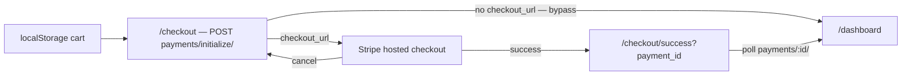

# Billing & Payments — frontend-customer-src

# Billing & Payments — `frontend-customer/src`

The billing module in `frontend-customer` covers two distinct money flows that happen to share a URL namespace:

1. **Marketplace billing** — a *student* buys or subscribes to a *coach's* content (courses, downloads, live classes/streams, bundles, tenant subscription plans). Money flows student → coach's Stripe Connect account, minus the platform fee.
2. **Platform billing** — the *coach* pays Contentor for their own SaaS plan (Free / Starter / Pro). Money flows coach → platform.

Both are served from `/api/v1/billing/`, but the platform side lives under `/api/v1/billing/platform/*` and is scoped to the coach, while everything else is tenant-scoped and student-facing. Keeping this distinction straight is the single most useful thing to know when working in this module — `SubscriptionTile` (coach's own plan) and `(student)/subscriptions/page.tsx` (student's memberships in this tenant) look similar and mean completely different things.

---

## File map

| Layer | Files |
|---|---|
| Types | `src/types/billing.ts` — `AccessInfo`, `StoreItem`, `Bundle`, `CartItem`, `SubscriptionPlan(Detail)` |
| Pure helpers | `src/lib/billing-interval.ts`, `src/lib/entitlements.ts`, `src/lib/cart.ts` |
| API wrappers | `src/lib/api/billing-platform.ts`, `src/lib/api/entitlements.ts` |
| Shared components | `src/components/billing/{price-badge,subscribe-button,content-picker}.tsx`, `src/components/admin/{entitlements-provider,feature-badges,monetize-nudge}.tsx` |
| Coach routes | `app/admin/billing/**`, `app/admin/payouts/page.tsx` |
| Student routes | `app/(student)/{checkout,checkout/success,orders,subscriptions}/`, `app/(public)/{store,plans}/**` |

Everything talks to Django through `clientFetch` (`@/lib/api-client`) from client components, or `serverFetch` (`@/lib/api-server`) from server components — `app/(public)/plans/[id]/page.tsx` is the one server-rendered page here (`export const dynamic = "force-dynamic"`).

---

## Marketplace purchase flow

The cart is **client-only**, stored in `localStorage` under `contentor_cart` by `src/lib/cart.ts`. `getCart`/`addToCart`/`removeFromCart`/`clearCart`/`getCartCount` all guard on `typeof window === "undefined"` and swallow parse errors by returning `[]`, so they're safe to call from anywhere. Dedupe is by `(content_type, object_id)` — there are no quantities.

Items enter the cart from `EnrollButton` (`components/public/enroll-button.tsx`) and from the store grid (`handleAddToCart` → `getContentType` in `(public)/store/page.tsx`). `CheckoutPage` reads the cart on mount and after every removal — it never trusts the previous React state, it re-reads via `getCart()`.

Two branches matter and they recur throughout the module:

- **Real Stripe** (`BILLING_BYPASS_ENABLED=false`): the response carries `checkout_url` and the page does `window.location.href = res.checkout_url`. The cart is deliberately **not** cleared here, so a cancel returns the buyer to `/checkout` with their items intact.
- **Bypass provider** (dev/CI): no `checkout_url`; the payment is already completed server-side, so the page clears the cart, toasts, and navigates to `/dashboard`.

`checkout/success/page.tsx` bridges the webhook gap: it polls `GET /api/v1/billing/payments/:id/` every 2 s up to 15 times (~30 s) until `status === "completed"`, clearing the cart exactly once via a `cleared` ref. Timeout lands in a `"pending"` state — reassuring copy plus a link to the dashboard, never an error. A missing `payment_id` short-circuits straight to `"pending"`. The whole thing is wrapped in `<Suspense>` because it reads `useSearchParams`.

Error handling on the pay action is delegated to `useAsyncAction`'s `onError`, which special-cases `ApiError` with `status === 403` (anonymous buyer) by navigating to `/login?toast=...&toast_type=info` rather than showing a failure toast. `SubscribeButton` uses the same pattern and additionally maps `400` to "You're already subscribed to this plan".

### Tenant subscriptions

`SubscribeButton` (`components/billing/subscribe-button.tsx`) posts `plan_id` to `/api/v1/billing/subscribe/` and follows the same `checkout_url`-or-bypass fork. It's rendered by `PricingPlansBlock` (page-builder block), by `StorePlanCard`, and by the sticky sidebar on `(public)/plans/[id]/page.tsx`.

`(student)/subscriptions/page.tsx` lists the student's memberships (`GET billing/subscriptions/`) alongside all tenant plans (`GET billing/plans/`), filtering out `expired` rows. `SubscriptionRowActions` is a separate component per row so cancel and change-plan get independent in-flight state; both actions call `onChanged()` (the parent's `load` callback) to refetch rather than mutating local state. Cancels are always end-of-period, plan changes are always scheduled for the next cycle — the UI copy says so, and `pending_plan_name` hides the change-plan select once a switch is queued.

`billingIntervalSuffix(months)` is the one shared price-formatting helper: `1 → "/mo"`, `12 → "/yr"`, multiples of 12 → `"/N yr"`, otherwise `"/N mo"`. Use it anywhere a recurring price is rendered; it's already used by the plans tab, subscriptions page, plan detail page, and `PricingPlansBlock`.

`PriceBadge` is the display counterpart for one-off pricing. Its precedence is: owned (`has_access` and `access_reason !== "free"`) → free → subscription-included → priced → generic "Paid". It accepts either a full `AccessInfo` or loose `price`/`pricingType` props so it can be used before access info is available.

---

## Coach admin: `/admin/billing`

`app/admin/billing/page.tsx` is a five-tab shell: `subscription`, `products`, `bundles`, `plans`, `payments`. The default tab is `subscription` — a checkout return (`?checkout=success|cancel`) forces it, otherwise an explicit `?tab=` from `BILLING_TABS` wins. The `key={defaultTab}` on `<Tabs>` is load-bearing: it remounts the tab group when the URL changes so the separate "Billing" and "Store" sidebar entries each land on their own tab when navigating between them.

`ProductsTab`, `BundlesTab`, and `PlansTab` are near-identical fetch-list-render components over `billing/products/`, `billing/bundles/`, and `billing/plans/`. Each carries `loading` / `error` / `reloadKey` state and renders through `<PageState onRetry={() => setReloadKey(k => k + 1)}>` with a table skeleton (`TableSkeletonRows`). If you add a tab, follow that shape — the loading-pattern lint (`scripts/check-loading-patterns.mjs`) enforces the skeleton-over-spinner rule.

### `ContentPicker`

`components/billing/content-picker.tsx` is the shared multi-select used by bundle create/edit and plan-access management. It loads `GET billing/products/`, **drops rows with `type === "bundle"`** (no bundles inside bundles), and filters client-side by type + title substring. Selection is a controlled `SelectedItem[]` (`content_type`, `object_id`, `title`, `price`) owned by the parent.

Note the type asymmetry it papers over: when adding, it prefers `product.content_type ?? product.type`; when *loading* an existing bundle, `EditBundlePage` normalizes Django content-type labels back to picker types via `CONTENT_TYPE_NAME_MAP` (`courses.course → course`, `downloads.downloadfile → download`, `live.liveclass → live_class`, `live.livestream → live_stream`), falling back to the raw numeric content-type id as a string. If you add a sellable model, you must extend both that map and `TYPE_FILTERS`/`TYPE_LABEL_MAP`/`TYPE_BADGE_VARIANT`.

Bundle pages compute "Original Price (sum of items)" locally from the selected items' prices. `EditBundlePage` additionally keeps `initialOriginalPrice` from the server so the field doesn't collapse to `0.00` when item prices can't be resolved from the product list.

Plan access (`admin/billing/plans/[id]/page.tsx`) loads plan + `plans/:id/access/` in parallel and saves with `PUT` — a full replacement of the item set, not a diff.

---

## Coach's own platform subscription

`src/lib/api/billing-platform.ts` is the thin typed wrapper for the coach-facing endpoints:

| Function | Endpoint |
|---|---|
| `getSubscription()` | `GET billing/platform/subscription/` |
| `listPlatformPlans()` | `GET billing/platform/plans/` |
| `startCheckout(planId)` | `POST billing/platform/checkout/` |

`PlatformPlanSummary.prices` is a per-currency map of `{ amount_cents, available }`. `available` means a Stripe price id is configured for that currency — **the id itself never reaches the client**. The flat `amount_cents` / `currency` fields are a legacy region-default and should not be used for new UI.

`ChangePlanCard` renders one card per non-Free plan (Free is the implicit baseline, shown by `SubscriptionTile` above it). Currency resolution goes: `subscription.currency` if it's `USD`/`TRY` → `regionHint` prop (tests only) → `regionFromHost(window.location.host)`. `regionFromHost` intentionally duplicates a slice of `src/i18n/config.ts` because that module is server-only (`headers()`); if the host→region rule changes, both need updating.

Plans are sorted Free-first then by USD amount ascending, and that sorted index is what determines `isDowngrade` (a lower index than the current plan). Downgrades render a disabled button — self-serve downgrade is deliberately out of scope; the copy points at support. Plans with `available === false` for the active currency show a "coming soon in {currency}" note and a disabled button.

`UpgradeButton` is factored out per plan card specifically so each card gets its own `useAsyncAction` in-flight flag; a single hook at the parent would make every card spin together. On success it hard-redirects to `res.checkout_url`.

Stripe returns the coach to `/admin/billing?checkout=success|cancel`. `SubscriptionTile` then receives `pollUntilActive` and polls `getSubscription()` every 2.5 s against a 30 s deadline, stopping as soon as the status is `active` or `past_due` — this bridges the window between the redirect landing and the Stripe webhook being processed. Same trick as the student success page, different endpoint. `showCanceledNotice` renders an amber banner and does no polling.

`PricingCta` on the marketing pricing page (`app/pricing/PricingCta.tsx`) calls the same `startCheckout`.

---

## Payouts & Stripe Connect

`app/admin/payouts/page.tsx` is the coach's Connect onboarding surface, driven entirely by `GET billing/connect/status/` → `{ connected, charges_enabled, payouts_enabled, is_paid_active, can_monetize }`.

Gating is two-stage:

1. `is_paid_active === false` → `<UpgradeGate>` replaces the whole card and links to `/admin/billing?tab=subscription`. Selling requires a paid, active platform plan.
2. Otherwise, either "Connect with Stripe" (`POST billing/connect/onboard/` → redirect to `onboarding_url`) or a status readout with `StatusRow` per capability, plus "Open Stripe dashboard" (`GET billing/connect/dashboard/` → `window.open(..., "_blank", "noopener")`).

Stripe redirects back with `?connect=return`; the page appends `?refresh=1` to the status call in that case so it re-reads live from Stripe rather than waiting for the `account.updated` webhook.

`EarningsCard` (rendered only when `is_paid_active`) reads `GET billing/earnings/`. Note the unit mismatch it handles: `gross_sales` / `net_payout` / `platform_fees` / `refunded_total` are decimal strings in major units, while `stripe_balance[currency].{available,pending}` are Stripe **cents** and are divided by 100 before formatting. It swallows fetch errors and renders nothing rather than showing an error — it's supplementary information.

`MonetizeNudge` is the counterpart warning shown next to price fields in the course and downloads admin forms. It hits the same `connect/status/` endpoint and renders an inline amber "set up payouts" prompt only when `can_monetize === false` **and** a non-zero price is entered. It caches the answer in a module-level `cached` variable so the status is fetched once per page session no matter how many price fields are on screen — that cache is not invalidated, so a coach who completes onboarding in another tab needs a reload.

---

## Entitlements & paid-feature badges

Plan entitlements are a separate, lighter concern from subscription state and are split across three files on purpose:

- `src/lib/entitlements.ts` — types + `isFeatureLocked()`. **Import-free by design** so it stays trivially unit-testable. Keys: `live`, `ai_blog`, `site_ai`, `student_bot`, `logo_studio`, `payouts`, `platform_mailbox`, `selling`.
- `src/lib/api/entitlements.ts` — just `getEntitlements()` over `GET billing/platform/entitlements/`, re-exporting the types.
- `components/admin/entitlements-provider.tsx` — fetches once and shares via context.

The backend returns `true` when the plan **includes** a feature, so "locked" is `entitlements[feature] === false`. The fail-safe is the important part: while loading, or after a failed fetch, `entitlements` stays `null` and `isFeatureLocked` returns `false`. A paying coach never sees a "Paid" badge flash on because their entitlements hadn't resolved yet — the badge only ever appears on a confirmed negative.

`EntitlementsProvider` is mounted in `AdminShell` (and `EditSidebar`), so `useEntitlements()` / `useIsLocked(key)` work anywhere in the admin subtree. Consumers render `<PaidFeatureBadge feature="…">`, which self-gates on `useIsLocked` and returns `null` when unlocked. `<PaidBadge>` is the raw presentational pill — it always renders when mounted, so gate it yourself. `partial` swaps the tooltip for sections that are only partly paid (e.g. Live, where Zoom and on-site events are free). `<AiBadge>` is plan-independent and always renders.

Current consumers include `AppSidebar`, `MobileHeader`, the billing tabs (`selling`), `admin/live`, `admin/blog`, `admin/mailbox`, `BrandTab`, `AutopilotCard`, and `SetupAssistantPanel`.

---

## Conventions to follow when contributing here

- **Never call `fetch` directly.** `clientFetch` in client components, `serverFetch` in server components; both handle the tenant resolution and throw `ApiError` (with `.status`) on failure.
- **Every async action goes through `useAsyncAction`** — it provides the loading flag, the double-submit guard, and a default error toast. Pass `errorToast` for a custom message or `onError` when you need to branch on status (the 403 → login redirect pattern).
- **Loading state**: `<PageState loading error skeleton onRetry>` for initial page loads with a `reloadKey` counter for retry; `<Button loading loadingText>` for actions. No raw spinners — `scripts/check-loading-patterns.mjs` runs in `make lint` and will fail the build.
- **Navigation**: `useNavigate()` from `@shared/navigation/navigation-provider`, never `router.push`. `router.refresh()` is still fine for server-data revalidation (see `SubscribeButton`'s bypass path).
- **Every fetch effect must be cancellable.** The prevailing pattern is a `let cancelled = false` flag checked before each `setState`, with the cleanup flipping it — inconsistently named across files (`cancelled`, `active`) but always present.
- **Handle both provider branches.** Any new purchase path must work when the response has no `checkout_url` (bypass provider in dev/CI), or the e2e suite will break — the non-Stripe specs run with the bypass provider.
- **Currency is never assumed.** Prices arrive as strings with a sibling `currency`; the checkout page derives the cart currency from the first item that has one, on the premise that a tenant charges in a single currency. `admin/payouts` and `ChangePlanCard` use `Intl.NumberFormat` with a try/catch fallback for unknown codes.
- After changing any billing serializer on the backend, run `npm run gen:api` in `frontend-customer` and review the `src/types/api-generated.ts` diff. The hand-written interfaces in `src/types/billing.ts` and inline in the page files are **not** generated and drift silently — check them against the schema when the contract moves.
