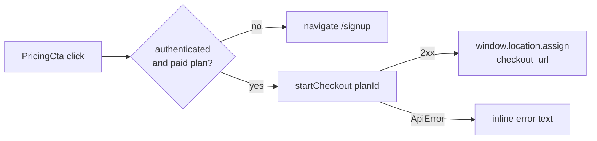

# Billing & Payments — frontend-main-src

# Billing & Payments — `frontend-main`

The marketing site's slice of the billing stack. It is deliberately thin: it reads the **platform plan catalog** (the plans coaches pay Contentor for) and starts a **Stripe-hosted checkout session** for a signed-in coach. Everything after the redirect — Checkout, webhooks, subscription state, plan changes — lives in `apps.billing` on the backend and in `frontend-customer`'s tenant admin.

Files in scope:

| Path | Role |
|---|---|
| `frontend-main/src/lib/api/billing-platform.ts` | Browser-side fetch wrappers for `/api/v1/billing/platform/*` |
| `frontend-main/src/app/pricing/page.tsx` | Server component: fetches the live catalog, renders three plan cards + FAQ |
| `frontend-main/src/app/pricing/PricingCta.tsx` | Client component: the per-card button that either routes to signup or starts checkout |
| `frontend-main/src/app/pricing/loading.tsx` | Route skeleton |

## Two fetch paths, one endpoint

`GET /api/v1/billing/platform/plans/` is called from **both sides**, and the difference matters.

- **Server-side** (`fetchPlans` in `page.tsx`) hits the absolute `DJANGO_API_URL` and *must* send `X-Tenant-Domain: BASE_DOMAIN`. This is the multi-tenancy rule from `CLAUDE.md`: Node's undici drops a custom `Host`, so without the header Django would resolve the tenant from `Host: django` and the request would land on the wrong schema. `cache: "no-store"` keeps prices from being frozen into the build.
- **Client-side** (`listPlans` in `billing-platform.ts`) uses a relative `/api/v1/...` path with `credentials: "same-origin"`. The browser is already on the marketing apex, so Caddy routes it to Django with the correct Host and the JWT cookie rides along — no explicit tenant header needed.

`listPlans` currently has no caller in the pricing route; the page uses its own server-side fetch. It exists for client-side consumers of the same catalog. Note the two `PlanSummary` types have **drifted**: `billing-platform.ts` declares `stripe_price_id_present`, while `page.tsx` declares `transaction_fee_pct` and `is_live_enabled`. If you touch the platform-plans serializer, reconcile both — and regenerate `api-generated.ts` per the repo convention.

## Checkout flow



`startCheckout(planId)` POSTs `{ plan_id }` to `/api/v1/billing/platform/checkout/` and returns `{ checkout_url, expires_at, provider }`. It deliberately **does not** perform the redirect — the caller does, because a full-page `window.location.assign` must be the component's decision, not the API helper's.

On a non-2xx it throws `ApiError(status, body)`, parsing the JSON body best-effort (a parse failure degrades to `{ detail: "Request failed" }` rather than throwing a `SyntaxError` from the wrong layer). This structured throw is the contract `PricingCta` branches on.

### Branching in `PricingCta`

The three behaviors collapse into one guard:

```ts
if (!isAuthenticated || isFreePlan || planId == null) {
  navigate("/signup");
  return;
}
```

`planId == null` covers the degraded case where `fetchPlans` returned `null` (API down) — the card still renders from i18n fallbacks, and the CTA safely degrades to signup instead of posting a bogus plan.

Error handling lives in `useAsyncAction`'s `onError`, which suppresses the default toast in favor of inline text under the button. Only one backend error code is special-cased today:

- `PRICE_NOT_AVAILABLE` (read from `err.data?.error`) → `pricing.errors.priceNotAvailable`. This is what the backend returns when a plan exists but has no Stripe price for the resolved region/currency.
- Anything else → `pricing.errors.generic`.

To add a case, extend that `onError` branch and add the i18n key — don't move error strings into `billing-platform.ts`, which stays presentation-free.

Conventions this component follows (enforced by `scripts/check-loading-patterns.mjs` in `make lint`): `useAsyncAction` for the loading state and double-submit guard, `<Button loading={...} loadingText={...}>` rather than a raw spinner, and `useNavigate()` rather than `router.push`.

## How the pricing page composes plan cards

`PricingPage` is an async server component. It resolves three things in sequence: `getAuthUser()` (drives `isAuthenticated` and `PlatformHeader`), `getTranslations("pricing")`, and `fetchPlans()`.

Card layout is **static**; card content is **live**. `PLAN_KEYS = ["free", "starter", "pro"]` fixes the three columns and their order, `PLAN_FEATURE_KEYS` fixes each card's bullet order, and `PLAN_HIGHLIGHT` marks `starter` as the visually promoted plan. Backend rows are matched into that structure by `planKeyFromName`, which lowercases `PlatformPlan.name` — tolerating the seed command's mixed casing (`"Free"`, `"starter"`, `"pro"`). A plan whose name doesn't map to a key is dropped from the page entirely.

Three helpers turn a `PlanSummary` into card text:

- **`formatPrice(currency, amountCents)`** — minor units → `Intl.NumberFormat` in the plan's currency, dropping decimals for whole amounts (`1900 USD` → `$19`). Wrapped in try/catch because an unrecognized currency code from the backend would otherwise throw and take the whole server render down; the fallback is `"19 USD"`.
- **`limitText(value, unit, plural)`** — encodes the platform-wide convention that **`0` means unlimited**, not zero.
- **`dynamicFeatureLabel(featureKey, plan)`** — handles only the *quantitative* bullets (`students`, `storage`, `fee`, `campaigns`) and returns `null` for descriptive ones (`courseBuilder`, `branding`, `domain`, `support`), which fall through to i18n at the call site:

  ```ts
  {(plan && dynamicFeatureLabel(featureKey, plan)) ?? t(`plans.${key}.features.${featureKey}`)}
  ```

The check/cross state per bullet comes from `includedSet`, seeded from the i18n `plans.<key>.included` array and then **overridden by live capabilities** — `is_live_enabled` and `max_campaign_emails > 0` add or remove the `live` and `campaigns` keys. The intent: the page can never advertise a capability the backend won't actually grant, even if translations lag behind a plan change.

### Degrading when the API is down

`fetchPlans` swallows both network errors and non-2xx into `null`. Everything downstream is written to survive that: prices fall back to `t("plans.<key>.price")`, feature bullets fall back to i18n, `includedSet` keeps its translated defaults, and `planId` becomes `null` so every CTA routes to `/signup`. The pricing page renders and remains useful with Django unreachable — worth preserving if you refactor this fetch.

## Boundaries and known gaps

- **The marketing site never renders subscription state.** It cannot: the marketing apex can't read cookies scoped to a tenant subdomain. The `TODO(phase-2)` in `page.tsx` describes the intended fix — a dedicated cookie set at login carrying `tenant_slug`, used to link existing coaches to `https://{slug}.contentor.app/admin/billing`. Until then, the existing-coach upgrade path is `ChangePlanCard` inside the tenant admin, and the pricing CTA is a signup funnel only.
- **Free plans never touch Stripe.** `isFreePlan` short-circuits to `/signup` before any API call, so the free tier has no checkout session and no `stripe_price_id`.
- **`loading.tsx` mirrors the real layout** — a pill for the sticky header, `SkeletonPageHeader` for the hero, `SkeletonCardGrid count={3}` for the plan grid. Keep the count at 3 if you keep three `PLAN_KEYS`; the repo requires a `loading.tsx` at or above every route segment.
- **Adding a fourth plan** means touching `PLAN_KEYS`, `PLAN_FEATURE_KEYS`, `PLAN_HIGHLIGHT`, `planKeyFromName`, the grid's `md:grid-cols-3`, the skeleton count, and the `pricing.plans.*` i18n namespace. There is no data-driven path for it by design — the marketing narrative per tier is hand-written.
- **Testing checkout locally**: dev `.env` runs `BILLING_BYPASS_ENABLED=false` against real Stripe test mode, so the CTA produces a genuine Checkout URL and needs `make stripe-listen` in another shell for webhooks to land. Set the flag `true` for a fully offline run via the `bypass` provider.