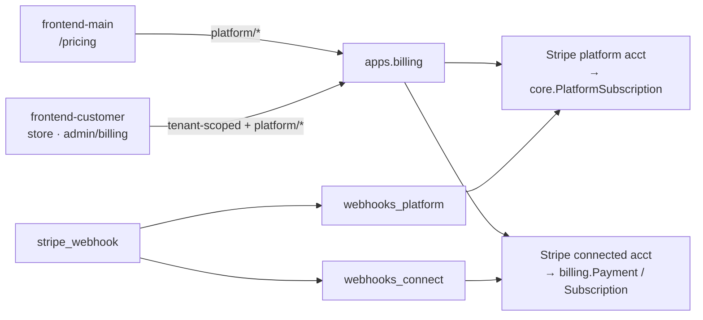

# Billing & Payments

# Billing & Payments

Contentor's money layer. It spans one Django app and both frontends, and it exists to serve **two independent money flows** that share models, providers, and a single webhook endpoint:

| Flow | Who pays whom | Stripe mechanism | Where state lives |
|---|---|---|---|
| **Platform subscription** | Coach → Contentor | Checkout on the platform account, prices from `PlatformPlan.prices` | `core.PlatformSubscription` (public schema) |
| **Marketplace** | Student → Coach | Direct charges on the coach's connected account, platform takes an `application_fee` | `billing.Payment` / `billing.Subscription` (tenant schema) |

Every question about this module reduces to "which flow is this?" — the two never share a schema, a Stripe account, or a webhook handler, even though they share the code path that receives the events.

## Sub-modules

- **[Billing & Payments — backend-apps](billing-payments-backend-apps.md)** — `apps.billing`: models, the provider abstraction (`providers/stripe_provider.py`, `providers/connect.py`), views split by concern (`payments`, `plans`, `bundles`, `store`, `connect`, `platform`), and the webhook dispatcher that fans out to `webhooks_platform` / `webhooks_connect`.
- **[Billing & Payments — frontend-customer-src](billing-payments-frontend-customer-src.md)** — the tenant portal: student-facing store, cart, and enroll/subscribe buttons, plus the coach's admin billing screens (`ChangePlanCard`, `SubscriptionTile`, bundle editor, Connect onboarding).
- **[Billing & Payments — frontend-main-src](billing-payments-frontend-main-src.md)** — the marketing site's thin slice: read the platform plan catalog on `/pricing`, start a platform Checkout session for a signed-in coach, then hand off.

## How the pieces fit

The backend is the only component that talks to Stripe. Both frontends are clients of `/api/v1/billing/`, and the URL prefix tells you which flow you are in: `/api/v1/billing/platform/*` is coach-scoped platform billing; everything else is tenant-scoped and student-facing.

### Platform subscription lifecycle

Coach discovers plans on `/pricing` (frontend-main, live catalog — not hardcoded) or changes plan from `ChangePlanCard` in the tenant admin. Both call `start_checkout`, which resolves the provider via `get_provider()` and returns a hosted Checkout URL. Stripe then calls `stripe_webhook`, which routes subscription events to `_handle_subscription_event` → `_resolve_plan`, and that is what actually writes `core.PlatformSubscription`. Price IDs are provisioned separately by `core.stripe_pricing.provision_stripe_price` and seeded by the `seed_plans` command — the app never invents a price at checkout time.

### Marketplace purchase lifecycle

A student adds items to the cart from the store (`addToCart`) or uses an enroll/subscribe button, then `payment_initialize` builds a direct charge through `providers/connect.create_marketplace_checkout`. Two gates run before Stripe is touched: `core.monetization.can_monetize` (is this coach allowed to sell?) and `_get_fee_pct` (the platform's cut). Currency is never taken from the request — `core.currency.tenant_charge_currency` resolves it, both at initialize time and again inside the webhook path when `_upsert_tenant_subscription` records a new tenant subscription. Completion, renewal, and cancellation all arrive as connected-account events handled in `webhooks_connect`.

### Selling surfaces

`plans`, `bundles`, and `store` are the coach's catalog side of the marketplace: tenant subscription plans with content-type access rules (`plan_access` → `resolve_content_type`), multi-item bundles (`_save_items`), and the assembled storefront payload (`_collect_store_items`). The student-facing store page and enroll buttons in frontend-customer render exactly what these endpoints return.

### Connect onboarding

Before a coach can take marketplace money at all, `connect_onboard` sends them through Stripe's hosted onboarding and `_handle_account_updated` keeps the local account status in sync; `retrieve_balance` powers the payouts view. A coach whose Connect account is not ready fails `can_monetize`, so marketplace checkout is blocked at the source rather than at Stripe.

## Working here

- Identify the flow first. A change to platform billing that touches `webhooks_connect` (or vice versa) is almost certainly in the wrong file.
- `stripe_webhook` is a shared entry point with per-flow handlers; signature verification (`verify_webhook_signature` → `_get_webhook_secret`) resolves a *different* secret per flow.
- Webhooks — not the checkout response — are the source of truth for subscription and payment state in both flows.
- Currency and fee percentage are derived server-side (`tenant_charge_currency`, `_get_fee_pct`); never accept either from a client.