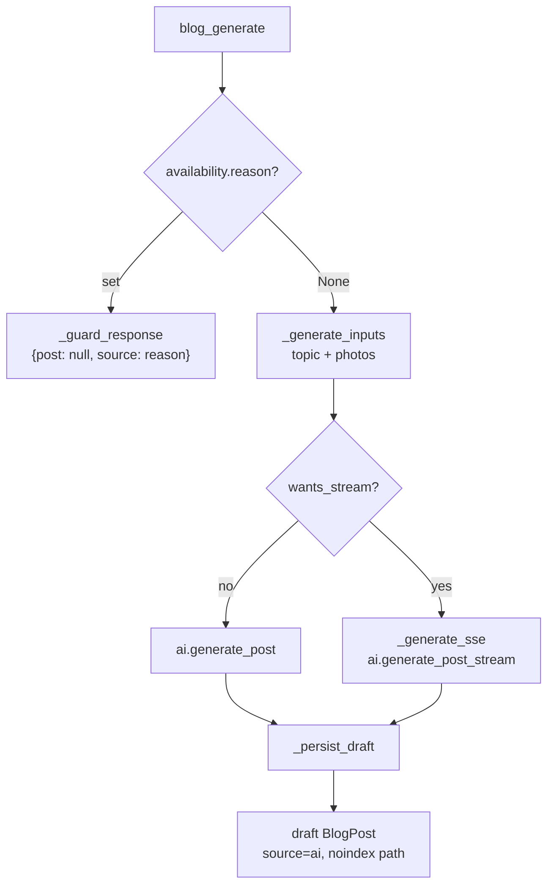

# Blog & AI Content — backend-apps

# Blog & AI Content — `backend/apps/blog` (+ `core/curated_photos`)

The blog module gives every coach a real content marketing surface on their tenant site, and gives the platform (`contentor.app`) its own marketing blog on the same engine. Most posts are written by one Claude call each; the module's real substance is the plumbing around that call — prompt caching discipline, quota/budget metering, photo grounding, HTML trust boundaries, and an unattended autopilot schedule.

Design specs: `docs/superpowers/specs/2026-07-09-ai-blog-design.md` (blog + AI engine) and `docs/superpowers/specs/2026-07-19-curated-photos-design.md` (curated photo library).

---

## Two blogs, one engine

| | Coach blog | Platform blog |
|---|---|---|
| Models | `blog.BlogPost`, `BlogTopicIdea`, `BlogAutopilot` (TENANT_APPS) | `core.PlatformBlogPost` (public schema) |
| Views | `views.py` (+ `admin_urls.py`, `urls.py`) | `platform_views.py` (+ `urls_platform.py`) |
| Brief | `ai.brand_brief(config, course_titles)` from `TenantConfig` + `Course` | frozen `platform_views.PLATFORM_BRIEF` |
| Auth for writes | `IsCoachOrOwner` | `IsSuperUser` |
| Metering | USD **and** quota, keyed by `tenant_schema` | USD only, under `tenant_schema="public"` |
| Photos, placements, autopilot | yes | no |

`apps/blog/ai.py` is shared by both. It owns prompts, output validation, budgets and quotas — nothing else. Actual provider calls live in `apps.core.ai` (`AI_PROVIDER`: `anthropic` in prod, `cli` locally against the developer's Claude subscription).

---

## The token-efficiency contract (`ai.py`)

Four rules, all enforced by structure rather than by review:

1. **One model call per post.** `generate_post()` is a single `core_ai.structured()` call returning a validated `_BlogDraft` — no outline→draft→polish chain.
2. **Static prompts are byte-frozen and cached.** `BLOG_STATIC_PROMPT` and `TOPIC_STATIC_PROMPT` are sent with `cache_control: ephemeral` by the provider layer. Interpolating tenant data into them would fragment the cache per tenant and destroy the hit rate, so *all* per-tenant state travels in the small user message: `brand_brief()`, the topic, the coach's instructions, and `available_photos_block()`. **Any edit to a static prompt must bump `PROMPT_VERSION`.**
3. **The model emits markdown sections, never HTML** (~30% cheaper). `render_body()` converts and sanitizes server-side.
4. **Topics are batched 12-at-a-time** on the cheaper `BLOG_AI_TOPIC_MODEL` into `BlogTopicIdea` rows, so picking a topic never costs a per-decision LLM call.

### Output contracts

The model is forced into `_BlogDraft`: `title`, `slug`, `meta_description`, `excerpt`, `tags`, `cover_photo_id`, and `sections: list[_Section]` where each `_Section` is `{heading, body_markdown, photo_id}`. An empty `heading` means continuation paragraphs with no `<h2>` — that's how the intro section arrives.

`_draft_fields()` turns a validated draft into a `BlogPost`-ready dict and is deliberately shared by the blocking and streaming paths so the two cannot drift. Note what it *drops*: the model's `slug` is ignored (callers re-derive via `models.unique_slug`), photo ids not in the caller-supplied `valid_ids` set become `""` / are dropped, `image_placements` is truncated to 2, and every string is length-clamped to its column width. An empty rendered body raises `BlogAiError`.

### Trust boundary: `render_body()`

```
model markdown  →  md.markdown(extensions=[])  →  nh3.clean(tags=_BLOG_TAGS, attributes=_BLOG_ATTRS)  →  body_html
```

Headings are re-emitted as `## <heading>` and everything else is clamped to a small tag allowlist (`p br strong em b i ul ol li h2 h3 blockquote a`, with `href` the only permitted attribute). Nothing model-generated reaches `body_html` except through this function. Human- and superadmin-authored HTML has its own boundary: `validate_body_html()` on both admin serializers runs `apps.core.sanitize.clean_rich_html`.

### `BlogAiError`

Carries `cost_usd`, because a provider failure may still have been billed. Every caller catches it and calls `ai.record_attempt_cost(...)` with that cost before returning — the kill switch has to see spend that produced nothing.

---

## Metering: USD budget vs. generation quota

Two independent meters, both rows in `core.BlogAiUsage` keyed `(tenant_schema, month)`:

- **`record_attempt_cost(schema, usd)`** — charged on **every** attempt, success or failure. Feeds `global_spend()`, which is compared against `settings.BLOG_AI_MONTHLY_BUDGET_USD`. This is the platform-wide kill switch.
- **`record_success(schema)`** — increments `generations_used` only for a validated generation. This is the per-tenant quota.

Both use `F()` updates on a filtered queryset (never `save()`), so concurrent generations don't clobber each other.

`plan_limit(tenant)` reads `tenant.platform_subscription.plan.max_ai_blog_posts` — the same source as `has_paid_platform_plan`. It deliberately does **not** read the `Tenant.plan` FK, which is set at signup and never resynced with the live subscription. Getting this wrong is the classic bug here.

`availability(tenant)` is the single gate every generation path checks, returning `{enabled, eligible, remaining, limit, reason, free_grant}`. Its shape intentionally mirrors the Brand Pack status endpoint so the frontend's upsell pattern transfers unchanged. `reason` is one of `upgrade_required` / `disabled` / `budget` / `quota_exhausted` / `None`, and every generate endpoint echoes it back as `source` so the client can render the right upsell.

**Free-plan grant.** `BlogAiUsage` is month-keyed, so "one free post, ever" cannot be expressed as a limit. It lives on `Tenant.free_blog_grant_used` instead. `consume_free_grant(tenant)` is idempotent, a no-op on any plan with a real quota, and race-safe via a conditional `UPDATE ... WHERE free_blog_grant_used = false` — only the first concurrent generation flips the flag.

---

## Photo grounding

The model can only reference photos it was shown, and it is told never to invent an id. Candidates come from two sources, concatenated up to `ai.MAX_AVAILABLE_PHOTOS` (30):

1. The tenant's own `media.Photo` rows, newest first.
2. `curated.curated_candidates(topic, limit=...)` — platform catalog rows, filling whatever slots remain.

Curated selection is **deliberately non-LLM**: lowercase token overlap (`_tokens()`, words ≥3 chars) between the topic and each enabled `CuratedPhoto`'s `tags` + `title`, scored in Python over the small `AI_KINDS` catalog and sorted by `(-score, position, pk)`. Zero overlap — a Turkish topic against English tags, or thin tagging — falls back to up to 3 `kind="hero"` rows so a photo-less tenant still gets a cover rather than nothing.

Curated candidates are wrapped in `CuratedCandidate`, which duck-types the `.id/.title/.alt_text` trio `available_photos_block()` reads. Their ids are namespaced `curated:<pk>` so they can never collide with tenant `Photo` UUIDs. After generation, `resolve_curated_photo_ids(fields)` mutates the fields dict in place, swapping chosen `curated:` ids for real tenant `Photo` UUIDs via `core.curated_photos.materialize.materialize_curated_photo()`. Unknown ids **fail open** — `""` cover, dropped placement — mirroring the never-invent-an-id contract. It must run inside the tenant context, since it creates `media.Photo` rows.

`materialize_curated_photo()` is copy-on-use: the new `Photo` points at the *shared* platform object key (no storage duplication), deduped by `s3_key`. Deleting the tenant `Photo` never touches storage, and catalog rows are only ever `enabled=False`, never deleted — so the reference can't break. The same helper backs the coach-facing `curated_photo_use` endpoint and onboarding's `ai_photos.photo_for`.

### Serve-time placement rendering (`placements.py`)

`body_html` **never** stores image URLs, because presigned URLs expire. Inline images are resolved at serialization time only:

- `resolve_placements(post)` → `[{heading, photo_id, url, alt}]`, signing each `Photo.s3_key` fresh. Malformed UUIDs, deleted photos, and photos with no `s3_key` drop out.
- `inject_placement_images(body_html, resolved)` inserts a `<figure class="blog-inline-image">` immediately after the first `<h2>` whose text equals the placement heading. The comparison is HTML-escaped, matching how markdown rendering escaped the stored heading. Unmatched headings simply skip.

Both are called from `BlogPostDetailSerializer.get_body_html`; the admin serializer exposes the resolved list separately as `image_placements_resolved`.

---

## Coach generation flow

`blog_generate` serves both a JSON and an SSE response from one route via content negotiation (`Accept: text/event-stream` → `apps.core.ai_sse.wants_stream`). A second route was avoided on purpose: the availability guards and quota accounting stay single-sourced, and the autopilot task plus existing clients keep the JSON shape.



`_guard_response()` exists because pre-stream guards must answer in plain JSON even for a streaming request — nothing has been generated, so there is no stream to frame. The frontend reader checks `content-type` and handles both shapes.

`_generate_inputs()` resolves `topic_id` against `BlogTopicIdea` rows still `status="available"`, otherwise falls back to `custom_topic` text; a missing topic is a `400` with `source: "error"`. `_persist_draft()` derives the slug with `unique_slug()`, forces `status="draft"` and `source="ai"`, attaches the cover `Photo`, and marks the source topic `used`.

### Streaming and when quota commits

`generate_post_stream()` is the streaming twin of `generate_post()`: it yields `("phase", name)` and `("preview", dict)` frames, then exactly one `("result", DraftResult)`. Previews come from `_draft_preview()` and carry **headings only, never body prose** — the point is to show the post's shape forming (and let the coach bail on a bad title early), not to stream markdown the dialog would have to lay out. On the `cli` provider no previews arrive at all, so consumers see phases only and fall back to an indeterminate wait.

`_generate_sse()` encodes a deliberate, load-bearing decision: **quota commits the moment the model produces its first output**, not on completion.

- `commit()` (idempotent via a `nonlocal` flag) runs on the first `preview` *or* the `result` — whichever lands first — calling `record_success` + `consume_free_grant`.
- Cancelling, closing the tab, and losing the connection all happen after that instant, so all three consume a slot exactly like a finished post. Charging on completion would make "watch the title appear, cancel, retry" a free reroll — and the live preview is precisely what makes that reroll tempting.
- A provider failure *before* any output charges nothing: `commit()` never ran.
- USD lands in the `finally` block, which also runs on `GeneratorExit` (client disconnect) — an abandoned stream still accrues what it spent. A stream aborted mid-flight has no usage object to read and accrues `0`, which is why **quota, not budget, is the meter that actually caps abuse here.**

### Topics

`blog_topics` GET returns the available queue; POST refills it with one cheap-model batch call. Refill is **budget-metered, never quota-metered** — it checks only for `upgrade_required` / `disabled` / `budget`, so an out-of-quota coach can still browse fresh ideas. Rows get a shared `batch_id` (a UUID4) for traceability. `blog_topic_dismiss` flips a row to `dismissed`.

---

## Autopilot (`tasks.py`)

The hands-off schedule, deliberately built as a clone of `notifications.dispatch_due_recurrences` — `BlogAutopilot`'s field shapes mirror `RecurringAnnouncement` so `notifications.recurrence.next_occurrence()` applies unchanged.

`BlogAutopilot` is a per-tenant singleton (`pk=1`, `load()` gets-or-creates).

Celery beat runs `dispatch_due_blog_autopilot` every 15 minutes. It iterates tenants filtered to `provisioning_status="ready"` — half-provisioned schemas would raise `UndefinedTable` — and wraps each in a `try/except` so one tenant can't break the sweep. Per tenant, `_dispatch_for_current_tenant()` finds an enabled rule with `next_run_at <= now`, computes the next occurrence in the tenant's `TenantConfig.timezone`, and performs an **exactly-once claim**:

```python
claimed = BlogAutopilot.objects.filter(pk=rule.pk, next_run_at=rule.next_run_at).update(next_run_at=new_next)
if claimed:
    generate_autopilot_post.delay(schema_name)
```

Only the worker that successfully advances `next_run_at` spawns the generation task.

`_generate_for_current_tenant()` then mirrors the synchronous view path — `availability()` gate, pull or refill topics, assemble tenant + curated photos, `generate_post()`, meter, `resolve_curated_photo_ids()`, create the post with `source="autopilot"` and `status` per `rule.auto_publish`, mark the topic `used`. Two autopilot-specific behaviours:

- **No nagging.** A `quota_exhausted` skip notifies the coach at most once per month, tracked in `last_skip_notice_month` (`"YYYY-MM"`), so a weekly schedule doesn't fire four identical warnings.
- **`_notify_coach()`** web-pushes only to `PushSubscription`s whose user role is `coach`/`owner` — never students — deep-linking to `/admin/blog`.

`blog_autopilot` (GET/PATCH) recomputes `next_run_at` on every save: set from `next_occurrence()` when enabled, cleared to `None` when disabled. `BlogAutopilotSerializer.validate` enforces `weekday` for weekly and `day_of_month` for monthly.

---

## Endpoints

Route names are stable; mount prefixes come from wherever the URL conf is included (all under `/api/v1/`).

**Public tenant site** (`urls.py`) — `authentication_classes = []` is mandatory, since `TenantJWTAuthentication` is the DRF default:
- `posts/` → `PublicPostList` (published only, 12/page)
- `posts/<slug>/` → `PublicPostDetail` (injects placement images + signed cover URL)

**Coach admin** (`admin_urls.py`, all `IsCoachOrOwner`):
- `posts/` CRUD → `BlogPostAdminViewSet`
- `ai/status/` → `blog_ai_status` (raw `ai.availability(connection.tenant)`)
- `generate/` → `blog_generate` (JSON or SSE)
- `topics/` GET/POST, `topics/<id>/dismiss/`
- `autopilot/` GET/PATCH

**Platform** (`urls_platform.py`): `posts/`, `posts/<slug>/` (both anonymous, published only), `generate/` → `platform_blog_generate` (`IsSuperUser`).

**Curated photo library** (`core/curated_photos/urls.py`, `IsCoachOrOwner` — unlike the anonymous curated *logo* catalog): `""` → `curated_photo_search` (`?kind=&q=`, 60 max, hops to the public schema explicitly), `<pk>/use/` → `curated_photo_use`. The search view refuses to sign any `image_key` outside the `platform/` prefix, so a bad catalog row can't become a presigned URL into tenant storage.

---

## Model notes

`unique_slug(title)` is always derived server-side, never trusted from AI or client input: kebab from `slugify`, truncated to `MAX_SLUG_LEN` (60), deduped with `-2`, `-3`, … suffixes that shrink the base to stay within the column. It's shared well beyond this app — onboarding (`starter_post.py`, `seeding_content.py`, `content.py`), demo seeding (`calendar_content.py`), and content-calendar tests all call it.

`BlogPost.noindex` starts `True` for seeded AI drafts and is cleared unconditionally by `BlogPostAdminViewSet.perform_update` — a human reviewing and saving a post is the signal that it's fit to index. The same hook manages `published_at`: stamped on the draft→published transition, nulled on any move back to draft.

`BlogPost.source` and `ai_model` are read-only through the API; they're set only by the generation paths.

---

## Seeding the curated catalog

`seed_curated_photos` is idempotent (`update_or_create` on `image_key`) and reads `photo_meta.json` + images from `--dir` or `settings.CURATED_PHOTO_SYNC_DIR`. Unlike `logo_meta.json`, **`photo_meta.json` is committed to git**. `kind="spot"` entries go through `clean_curated_png()` to strip the white canvas so they blend into tenant blog themes; dimensions are read with PIL and stored on the row. Prod has no bind mount, so seeding there needs an explicit one-off `-v .../curated-photos:/seed` and `--dir /seed` (see the module docstring).

---

## Gotchas for contributors

- Changing `BLOG_STATIC_PROMPT` or `TOPIC_STATIC_PROMPT` without bumping `PROMPT_VERSION` silently invalidates cache accounting. Never interpolate anything tenant-specific into them — put it in `brand_brief()`.
- Add a field to `_BlogDraft`? Update `_draft_fields()` (both paths depend on it) and length-clamp it to the model column.
- Any new generation entry point must go through `ai.availability()` first, then `record_attempt_cost()` on *every* exit path including failures, and `record_success()` + `consume_free_grant()` only on validated success.
- `resolve_curated_photo_ids()` creates `media.Photo` rows — it must run inside `tenant_context`, never in the public schema.
- Anything model-generated that ends up in `body_html` must pass through `render_body()`; anything human-authored through `clean_rich_html()`. There is no third route.
- Don't put image URLs in `body_html`. Presigned URLs expire; `image_placements` + `placements.py` is the mechanism.
- New public read endpoints need `authentication_classes = []`, not just `AllowAny`.