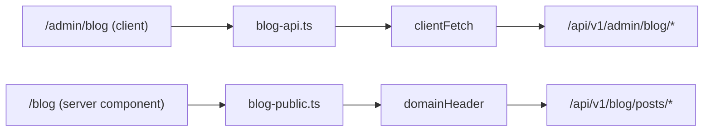

# Blog & AI Content — frontend-customer-src

# Blog & AI Content (frontend-customer)

The blog feature spans two audiences that happen to share a data model:

- **Coaches** author posts in the tenant admin (`/admin/blog`) — a client-side SPA area that talks to `/api/v1/admin/blog/*` with the browser's JWT.
- **Students / the public web** read them on the coach site (`/blog`, `/blog/[slug]`) — server-rendered routes that fetch `/api/v1/blog/posts/*` from Node, with an explicit tenant header.

Those two halves never share a fetch path, and that split is the single most important thing to internalize before editing here. Everything else — AI generation, autopilot scheduling, the curated image library — hangs off the admin half.

## File map

| Path | Role |
|---|---|
| `src/lib/blog-api.ts` | Coach-facing client (`clientFetch`) for every `/api/v1/admin/blog/*` endpoint + all shared TS types |
| `src/lib/blog-public.ts` | Server-side fetchers for the public blog; owns the `X-Tenant-Domain` header |
| `src/lib/curated-photos-api.ts` | Platform curated photo library search + materialize |
| `src/lib/html-headings.ts` | `parseH2Headings` — extracts H2 text from `body_html` for image anchoring |
| `src/app/admin/blog/page.tsx` | Post list, AI status/credits, upsell, autopilot card, generate dialog entry |
| `src/app/admin/blog/[id]/page.tsx` | The editor page — owns the whole post object in local state |
| `src/app/(public)/blog/page.tsx` | Public index (server component) |
| `src/app/(public)/blog/[slug]/page.tsx` | Public post + metadata + `BlogPosting` JSON-LD |
| `src/components/admin/blog/post-editor.tsx` | TipTap rich-text editor (H2/H3, bold, italic, list, link) |
| `src/components/admin/blog/cover-picker.tsx` | Cover image slot |
| `src/components/admin/blog/inline-images.tsx` | `image_placements` editor (photo ↔ H2 heading pairs) |
| `src/components/admin/blog/image-library-dialog.tsx` | Shared picker: curated library vs. tenant photos |
| `src/components/admin/blog/generate-dialog.tsx` | Streaming AI generation with topic chips + phase/preview UI |
| `src/components/admin/blog/autopilot-card.tsx` | Scheduled-generation settings |

## Two data paths



`clientFetch` (`src/lib/api-client.ts`) is browser-only — it carries the auth token and the tracking session id, and throws `ApiError` on failure. Because the request originates in the browser, Caddy routes it to Django with the real tenant Host and no header juggling is needed.

`blog-public.ts` runs in Node during SSR, where the Host header is useless (undici drops custom `Host`, so `django` resolves to the public schema). Every request therefore goes through `domainHeader()`, which strips the port off `getTenantDomain()` and emits `X-Tenant-Domain`. Both public fetchers are deliberately **soft-failing**: `no-store`, an 8s `AbortSignal.timeout`, and `catch → []` / `catch → null`. A flaky backend produces an empty blog index, not a 500 on the coach's marketing site. `fetchPublishedPost` returning `null` is what drives `notFound()` in the post route.

If you add a public field, remember it must be added to `BlogPostPublic` *and* be present in the Django public serializer — the admin type (`BlogPostAdmin`) is a separate, richer shape and they intentionally do not converge.

## The editor page

`BlogEditorPage` (`src/app/admin/blog/[id]/page.tsx`) is the hub. It holds one `post: BlogPostAdmin | null` in state and exposes a single mutator:

```ts
const patch = (fields: Partial<BlogPostAdmin>) =>
  setPost((prev) => (prev ? { ...prev, ...fields } : prev));
```

Every child that mutates the post takes `onPatched={patch}`. Two different persistence styles coexist, and the distinction is intentional:

- **Text fields are optimistic-local, saved explicitly.** Title, excerpt, tags, meta description, slug and `body_html` only live in React state until `doSave()` PATCHes them. `doSave(fields)` always sends the full text payload plus any override — that's how `togglePublish` flips `status` without losing unsaved edits sitting in the inputs.
- **Structural fields save immediately.** `CoverPicker` and `InlineImages` call `updatePost` themselves and feed the server response back through `onPatched`, because both depend on server-side resolution (`cover_photo_url`, `image_placements_resolved`) that the client can't synthesize.

`useAsyncAction` wraps each async handler (`save`, `togglePublish`, `regenerate`) to get the loading flag, double-submit guard and default error toast; the `<Button loading=…>` convention applies throughout — never a bare spinner.

### Regenerate is a swap, not an in-place rewrite

The `regenerate` handler is the one genuinely surprising piece of control flow. The generate endpoint always creates a *new* post, so regenerating an existing one is a three-step dance:

1. `generatePost({ custom_topic: post.title })` → a fresh post row.
2. `updatePost(post.id, …)` copying the new content onto the post being edited.
3. `deletePost(fresh.id)` to discard the throwaway row.

Local state is then reconciled with `{ ...post, ...fresh, id: post.id, slug: post.slug }` — the original id and slug are preserved deliberately so published URLs don't break. The button only renders when `post.source !== "manual"`.

## AI generation

`fetchAiStatus()` returns `BlogAiStatus`, whose `reason` field drives the whole gating UI:

| `reason` | UI effect |
|---|---|
| `upgrade_required` | List page shows the dashed upsell strip; "Write with AI" is disabled with `blog.upgradeTitle` |
| `quota_exhausted` | `blog.errQuota` toast on attempt |
| `disabled` / `budget` | `blog.errBudget` toast |
| `null` (eligible) | Credit counter (`blog.creditsLeft`) renders; autopilot card mounts |

`GenerateResponse.source` carries the *same* vocabulary back from a generation attempt, plus `"ai"` and `"error"`. Both `GenerateDialog` and the editor's `regenerate` map it to translation keys with identical logic — if you add a new refusal reason, both call sites need updating.

### Streaming

`generatePostStream` is the streaming twin of `generatePost`: same URL, same terminal `GenerateResponse`, but it reports progress through `AiStreamHandlers<DraftPreview>` (`src/lib/ai-stream.ts`). `DraftPreview` is headings-only (`title`, `excerpt`, `headings`) — enough for `<AiDraftPreview>` to show the post taking shape so a ~45 s wait doesn't read as a hang. `<AiProgress>` renders the phase strip (`preparing` → `drafting` → `rendering`) from the `onPhase` callback.

**Cancellation still burns a credit.** The server commits quota at the first preview, so aborting is an outcome, not a retry — `GenerateDialog` catches it via `isAbortError(err)`, shows an *info* toast (`blog.cancelled`), and the cancel button carries the `blog.cancelKeepsCredit` note. Don't "fix" this into an error toast or a silent retry.

While `generating` is true the dialog swaps its whole body for the progress view and disables both the close button and backdrop-click dismissal — the abort must go through the explicit Cancel so the coach sees the credit warning.

### Topics

Topic chips come from `listTopics()`. On mount, an empty list auto-triggers `refillTopics()` (a POST to the same path), so the coach never sees an empty picker. `dismissTopic(id)` is fire-and-forget — the chip is removed from local state first and the request's rejection is swallowed, since a failed dismissal is not worth interrupting the flow.

Selecting a chip clears `customTopic` and vice versa; the request sends `topic_id` **or** `custom_topic`, never both.

## Autopilot

`AutopilotCard` is self-contained: it fetches `getAutopilot()` on mount and returns `null` unless `eligible && settings`. Every control saves on change through a shared helper that writes optimistically, then replaces state with the server response — and rolls back to the previous settings object on failure. The server owns `next_run_at`, which is why the response (not the local patch) is authoritative.

Note `save(patch)` PATCHes **only the changed keys**, not the merged object, while updating local state with the merge. Frequency drives which cadence control renders: `weekly` → weekday buttons (0=Mon … 6=Sun), `monthly` → a day-of-month select capped at 28 to avoid short-month gaps. `generate_time` is sliced to `HH:MM` for the `<input type="time">`.

## Images

Two slots, one picker.

`ImageLibraryDialog` has two tabs. **Library** searches the platform-wide curated catalog via `searchCuratedPhotos({ kind, q })` across six `CuratedKind`s (hero, stock, spot, texture, divider, icon). **My photos** hits `/api/v1/photos/?search=` directly with `clientFetch`. The crucial invariant: a curated pick is **materialized into a tenant `Photo` before `onSelect` fires** — `pickCurated` awaits `materializeCuratedPhoto(item.id)` (POST `/api/v1/curated-photos/<id>/use/`) and hands the caller the resulting tenant photo id. Callers therefore only ever deal in tenant photo ids and never need to know where an image came from.

`materializeCuratedPhoto` is named `materialize*` rather than `use*` on purpose: ESLint's react-hooks rules treat `use`-prefixed functions as hooks and would reject calls from event handlers.

### Cover vs. inline

`CoverPicker` opens the dialog with `defaultKind="hero"` and PATCHes `cover_photo` (or `null` to clear).

`InlineImages` manages `image_placements: { heading, photo_id }[]` — each entry anchors an image under one H2, and the backend injects the `<figure class="blog-inline-image">` at serve time (`placements.py`). The heading options come from `parseH2Headings(post.body_html)`, which regex-matches `<h2>` blocks, strips nested tags, and decodes the five basic entities. Regex is acceptable here specifically because `body_html` is nh3-sanitized server-side and H2s can't nest.

Because headings are derived from `body_html` in state, **an unsaved heading is still selectable** — the placement PATCH will reference a heading the server doesn't have yet until the body is saved. `image_placements` is the input; `image_placements_resolved` (with `url` and `alt`) is the server-rendered output the list renders from.

## Public rendering & SEO

`body_html` is injected with `dangerouslySetInnerHTML` in exactly one place — the post page — and the comment there is load-bearing: the HTML is sanitized by nh3 in `apps/blog/ai.py::render_body()` before it's ever persisted. If you find yourself adding a second `dangerouslySetInnerHTML` for post bodies, sanitize at that boundary or reuse this one.

Both public routes are `dynamic = "force-dynamic"` (tenant-resolved per request, `no-store` fetches). The post route adds:

- `generateMetadata` → title, description (`meta_description || excerpt`), OpenGraph `type: "article"`, and `robots: { index: false, follow: true }` when `post.noindex`.
- `BlogPosting` JSON-LD, with `author.name` from `fetchTenantConfig(...).brand_name` and `image` only when a cover exists.

`generateMetadata` and the page component each fetch the post independently (Next dedupes within a request), and the page parallelizes post + tenant config with `Promise.all`.

Inline-image styling is applied via arbitrary-variant selectors on the prose container (`[&_figure.blog-inline-image]:my-6` etc.) because the markup is server-generated and can't take component classes.

`PublicLayout` also calls `fetchPublishedPosts` — the tenant nav conditionally shows a Blog link — so that helper must stay cheap and failure-tolerant.

## Conventions to preserve when contributing

- Add new admin endpoints to `blog-api.ts` as one-line `clientFetch` wrappers off `BASE`; keep types in the same file. Mirror `brand-pack-api.ts` if in doubt.
- Public fetchers stay in `blog-public.ts`, always with `domainHeader()`, a timeout, and a swallowed catch.
- Navigation uses `useNavigate()`; the admin list page uses it for both post-create and post-generate redirects. (The public routes use `next/link` because they're outside the admin nav shell.)
- Per-row actions get their own `useAsyncAction` instance — see `DeletePostButton`, which exists as a separate component precisely so one row's in-flight delete doesn't disable every other row's button.
- `PageState` + skeleton presets for first loads; `Skeleton` grids for in-dialog refinement loads.
- All coach-facing strings come from `useTranslations("admin")` under the `blog.*` namespace. A few literals (`"Saved"`, `"Deleted"`, `"Regenerated"`, `"Cancel"`, the TipTap placeholder and toolbar labels) are still untranslated — worth fixing, not worth copying.

## Backend counterparts

| Frontend | Django |
|---|---|
| `blog-api.ts` | `apps/blog` admin viewsets under `/api/v1/admin/blog/` |
| `blog-public.ts` | `apps/blog` public read endpoints under `/api/v1/blog/` |
| `curated-photos-api.ts` | `apps/core/curated_photos` (public schema, shared catalog) |
| `parseH2Headings` ↔ `image_placements` | `apps/blog/placements.py` (serve-time figure injection) |
| streaming generate | `apps/blog/ai.py` (`render_body()` + nh3 sanitization, quota commit) |

After changing any blog serializer, run `npm run gen:api` in `frontend-customer` and diff `src/types/api-generated.ts` — the hand-written types in `blog-api.ts` are not generated, so a serializer change silently drifts from them until someone checks.
