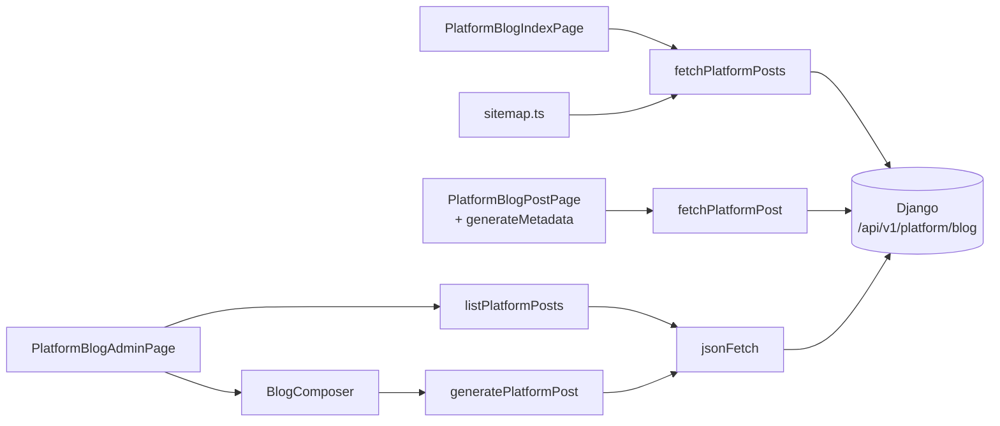

# Blog & AI Content — frontend-main-src

# Blog & AI Content — `frontend-main/src`

The marketing blog for `contentor.app`. Two surfaces live in this module:

1. **Public reader** — `/blog` and `/blog/[slug]`, server-rendered pages on the apex/locale hosts.
2. **Superadmin composer** — `/admin/blog`, a client page where the platform owner generates a draft with AI and hands it off to the generic Data admin for editing.

Everything here is **public-schema only** — this is the platform's own blog, not a tenant's. That distinction drives the most important implementation detail in the module: the fetch helpers deliberately send **no** `X-Tenant-Domain` header, so Django resolves them against the public schema. (Contrast with `apps.blog` tenant endpoints, which serve per-coach blogs from `frontend-customer`.)

## File map

| Path | Role |
|---|---|
| `src/lib/platform-blog.ts` | Server-side read helpers (`fetchPlatformPosts`, `fetchPlatformPost`) + the `PlatformBlogPost` shape |
| `src/lib/platform-blog-admin.ts` | Superadmin client (`listPlatformPosts`, `generatePlatformPost`) + `PlatformBlogPostAdmin` |
| `src/app/blog/page.tsx` | Public index (`PlatformBlogIndexPage`) |
| `src/app/blog/[slug]/page.tsx` | Public post (`PlatformBlogPostPage`) + `generateMetadata` |
| `src/app/blog/loading.tsx`, `src/app/blog/[slug]/loading.tsx` | Route skeletons |
| `src/app/admin/blog/page.tsx` | Superadmin page (`PlatformBlogAdminPage`) |
| `src/components/admin/blog-composer.tsx` | `BlogComposer` — the "Write with AI" form |

## Data flow



Two clients, one API base, different auth stories:

- **Reads** (`platform-blog.ts`) use bare `fetch` against `DJANGO_API_URL` — an absolute, in-cluster URL — because they run on the Next.js server. No auth, no tenant header.
- **Admin writes** (`platform-blog-admin.ts`) go through the shared `jsonFetch` from `src/lib/api-client.ts` with a relative path, so the browser's same-origin admin cookie rides along. Both surfaces target the same `/api/v1/platform/blog` prefix (backend `apps.blog.platform_views`).

## Read helpers: fail-soft by design

`fetchPlatformPosts` and `fetchPlatformPost` both wrap the whole call in `try/catch`, set an 8-second `AbortSignal.timeout`, and use `cache: "no-store"`. On any failure — network, timeout, non-2xx — they return `[]` and `null` respectively rather than throwing.

That's a deliberate contract, and callers depend on it:

- `PlatformBlogIndexPage` renders "No posts yet." for an empty array, so a backend blip degrades the blog to an empty page instead of a 500 on the marketing site.
- `PlatformBlogPostPage` treats `null` as `notFound()` — a missing slug and a dead backend produce the same 404.
- `sitemap.ts` (outside this module) calls `fetchPlatformPosts` and would otherwise break sitemap generation for the whole apex site.

If you add a helper here, preserve that shape: catch, timeout, return an empty value. And note `fetchPlatformPost` returns `res.json()` unvalidated — the response is trusted to match `PlatformBlogPost`.

Both public routes are `export const dynamic = "force-dynamic"` with `cache: "no-store"` fetches, so posts appear the moment they're published — no revalidation window, but also no static caching. If blog traffic ever justifies it, this is the knob to turn.

## Public post page

`PlatformBlogPostPage` parallelizes the two things it needs:

```ts
const [user, post] = await Promise.all([getAuthUser(), fetchPlatformPost(slug)]);
```

`getAuthUser()` feeds `<PlatformHeader user={user} />` so a logged-in coach sees their account state while reading the blog. The header/footer pair (`PlatformHeader`, `PlatformFooter`) is the standard marketing chrome, and it's what pulls these routes into the shared navigation stack — `PlatformHeader` renders `NavLink`, which drives the top progress bar via `useNavigation`.

Note `generateMetadata` also calls `fetchPlatformPost`, so a post page issues **two** fetches for the same slug per request. Next.js request-level fetch dedup doesn't apply under `cache: "no-store"`. It's cheap and intentional-by-omission rather than optimized; if you touch this, don't "fix" it by hoisting state between the two functions — they're separate invocations.

Metadata degrades gracefully too: a missing post returns `{}` from `generateMetadata` and the page body then 404s. `meta_description || excerpt` is the fallback chain for both the description and OpenGraph tags.

### The `dangerouslySetInnerHTML` on `body_html`

There are two raw-HTML injections on the post page, and both are load-bearing:

- **JSON-LD** — a `BlogPosting` schema.org blob built server-side from post fields. Standard structured-data practice.
- **`post.body_html`** — the article body, rendered into a Tailwind `prose` container.

The body HTML is **sanitized on the backend with `nh3` before it is persisted** (`apps/blog/ai.py`, `render_body()`), which is why the comment in the source calls this "the only place `body_html` is trusted." Do not add another render site for `body_html` without confirming the same guarantee, and do not move sanitization to the client — the invariant is that nothing untrusted ever reaches the database column.

## Superadmin composer

`PlatformBlogAdminPage` is intentionally thin. It is not a CMS — the actual editing happens in the generic model admin at `/admin/m/platform-blog-posts`, which the page links to twice. This page exists for one thing the generic admin can't do: kick off AI generation.

Its own list is a plain `useEffect` load of `listPlatformPosts()` on mount, with `posts` starting at `null` (loading), `.catch(() => setPosts([]))` collapsing errors into the empty state, and each row linking to the hard-coded production URL `https://contentor.app/blog/<slug>` — so "View" always points at prod regardless of environment. That list shows **published** posts only; drafts are reachable only through the Data link.

### `BlogComposer` and the three-way generate result

`BlogComposer` collects a required `topic` and optional `instructions`, then calls `generatePlatformPost`. The interesting part is the response contract — `GenerateResponse` carries a `source` discriminator, and the component branches on all three:

| `source` | Meaning | UI |
|---|---|---|
| `"ai"` | Draft created; `post` is populated | `onGenerated(post)`, inputs cleared |
| `"budget"` | Monthly AI spend cap hit | "AI writing is temporarily unavailable (monthly budget reached)." |
| `"error"` | Generation failed server-side | Generic error message |

The `budget` case is the one to know about: the backend returns **HTTP 200 with `source: "budget"`**, not an error status. `jsonFetch` therefore resolves normally and the `catch` block never runs — a budget refusal is a successful response with a soft-failure payload. Any new caller of `generatePlatformPost` must check `source` explicitly, or a budget exhaustion will silently look like success with a `null` post.

The parent's `onGenerated` callback stores the post in `lastGenerated` and renders a dashed confirmation card linking straight to the Data editor — the handoff that defines this page's role.

Two local conventions worth noting for anyone editing this component:

- Generation takes ~30s, so `<Button loading={generating}>` is paired with an explicit "this takes about half a minute…" hint. Per the repo's loading conventions, that's the right pattern: the `loading` prop on `<Button>`, never a hand-rolled spinner.
- Errors here are **inline** (`text-destructive`), not toasts. That's a deviation from the project's "action outcomes are sonner toasts" rule — the error sits next to the form it belongs to and the component predates a toast migration. Also unlike most async handlers in the codebase, this one hand-rolls `generating`/`error` state rather than using `useAsyncAction`. If you refactor, `useAsyncAction` with an `onError` is the house style.

## Type duality

`PlatformBlogPost` (public) and `PlatformBlogPostAdmin` (admin) describe the same backend model at different serialization depths. The admin type adds `id`, `status`, and `source`, and makes `meta_description`/`body_html` required. Neither is generated from the OpenAPI schema — they're hand-written, so a serializer change in `apps.blog.platform_views` will not surface as a type error here. Check both files after touching the backend serializers.

## Adding a field end-to-end

1. Serializer in `apps/blog/platform_views.py` (or its serializers module).
2. Add the field to `PlatformBlogPost` and/or `PlatformBlogPostAdmin` — remembering these are hand-maintained, not codegen'd.
3. Render it in `PlatformBlogIndexPage` / `PlatformBlogPostPage`, and adjust the matching `loading.tsx` skeleton so the first-paint shape still resembles the final layout.
4. If it's HTML-bearing, sanitize it server-side with `nh3` on write; don't introduce a second trusted-HTML site on the client.