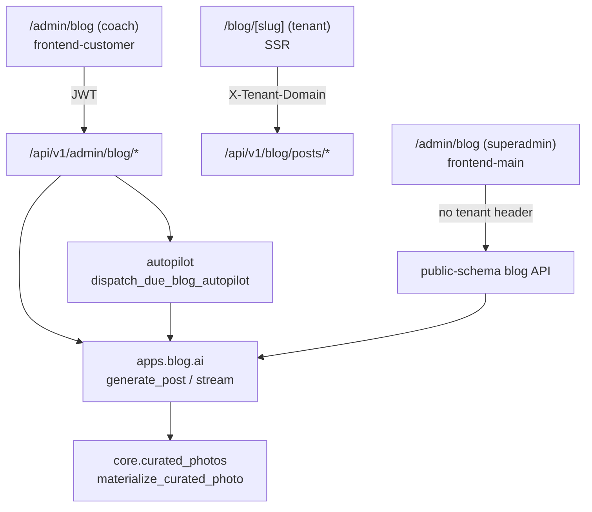

# Blog & AI Content

# Blog & AI Content

Contentor runs two blogs on one engine: a **coach blog** on every tenant site, and the **platform blog** for `contentor.app`. Both are backed by `apps.blog`, both draft posts with a single Claude call wrapped in quota metering and prompt-cache discipline, and both draw cover/inline imagery from the shared `core.curated_photos` library. What differs is the schema they resolve against and who is allowed to author.

## Sub-modules

| Page | Scope |
|---|---|
| [Blog & AI Content — backend-apps](blog-ai-content-backend-apps.md) | `apps.blog` models, AI engine (`ai.py`), curated-photo matching (`curated.py`), placement injection (`placements.py`), autopilot tasks |
| [Blog & AI Content — frontend-customer-src](blog-ai-content-frontend-customer-src.md) | Coach admin at `/admin/blog` + public tenant reader at `/blog`, `/blog/[slug]` |
| [Blog & AI Content — frontend-main-src](blog-ai-content-frontend-main-src.md) | Platform reader at `/blog` + superadmin composer at `/admin/blog` |

## How the pieces fit

The dividing line that matters is **which fetch path a request takes**, because that determines the Postgres schema:

- Coach admin and public tenant pages go to tenant endpoints — the browser path uses `clientFetch` with a JWT; the SSR path (`fetchPublishedPost`) sends an explicit `X-Tenant-Domain`.
- The platform surfaces in `frontend-main` deliberately send **no** tenant header, so Django resolves them against the public schema.

Get that wrong and a coach's drafts leak into the platform blog, or vice versa.

## Key cross-cutting workflows

**Assisted authoring.** `GenerateDialog` (coach) or `blog-composer` (superadmin) calls into `generatePostStream` / `generatePlatformPost`, which hits `blog_generate` → `_generate_sse`. The backend builds a brief from the tenant (`_brief_for_current_tenant`), streams `_draft_preview` chunks so the dialog fills in live, then persists via `_persist_draft` → `unique_slug`. Quota is metered on the way out (`record_success` → `tenant_usage`), and the admin list checks `fetchAiStatus`/`availability` first so the button is disabled when no provider is configured.

**Images.** Cover and inline art come from the curated library rather than uploads: `CoverPicker` and `ImageLibraryDialog` call `materializeCuratedPhoto`, and the backend's `curated_candidates` ranks library rows against the post's topic tokens before `materialize_curated_photo` copies a real asset into the tenant. Inline placement is heading-anchored — `InlineImages` reads H2s via `parseH2Headings`, and serialization resolves them server-side (`get_body_html` → `resolve_placements` → `inject_placement_images`), so the stored body stays clean and the HTML trust boundary lives in one place.

**Autopilot.** A Celery beat task (`dispatch_due_blog_autopilot` → `_dispatch_for_current_tenant`) walks tenants with autopilot enabled and runs the same generation path unattended; `AutopilotCard` in the coach admin reads and edits that schedule.

## Editing notes

- Never mix the two fetch layers — no admin call from an SSR route, no tenant header from `frontend-main`.
- AI changes belong in `apps/blog/ai.py`; both frontends consume it through the same SSE contract, so a payload change breaks three surfaces at once.
- Post bodies are never rendered raw from the editor — go through the serializer's placement resolution.
