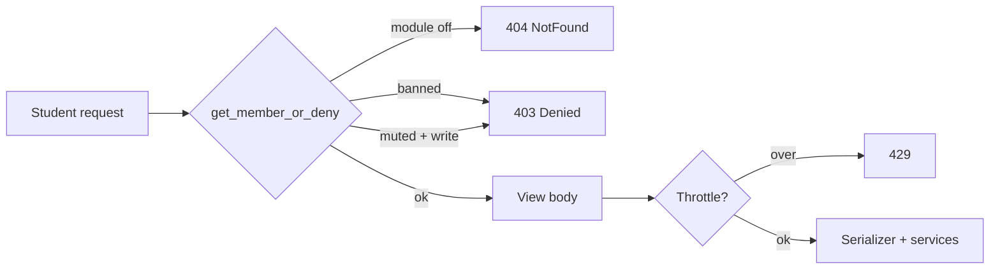

# Community

# Community Module

The Community module is Contentor's in-tenant social feed: a Facebook-group-style space where a coach's students post, comment, react with emoji, and report bad content, with the coach acting as moderator. It lives entirely in the tenant schema (`apps.community` in `TENANT_APPS`), so every tenant's community is fully isolated — separate settings, separate members, separate posts.

Three audiences touch it:

| Audience | Surface | Code |
|---|---|---|
| Student | `/community` in frontend-customer | `app/(student)/community/page.tsx` + `components/community/*` |
| Coach (moderator) | `/admin/community` in frontend-customer | `app/admin/community/page.tsx` + `components/admin/community/*` |
| Superadmin | `/admin/community` in frontend-main | `platform_views.community_reports_rollup` |

## Data model

`backend/apps/community/models.py` holds five models plus three module constants (`REACTION_EMOJIS`, `AUTO_HIDE_THRESHOLD = 3`, `MAX_POST_IMAGES = 4`).

- **`CommunitySettings`** — per-tenant singleton at `pk=1`, always reached via `CommunitySettings.load()` (a `get_or_create`, so it never 404s on a fresh tenant). `is_enabled` is *the* feature gate; the docstring is explicit that the legacy `"community"` entry in `TenantConfig.enabled_modules` is inert — don't add checks against it.
- **`CommunityMember`** — a `OneToOne` on the tenant user, created lazily on first access (`services.get_or_create_member`), carrying the community identity (`display_name`, `avatar_url` for external URLs / `avatar_key` for uploads) and the moderation state (`is_banned`, `muted_until`, `requires_approval`). `is_muted` is a property comparing `muted_until` against now — mutes expire on their own, nothing sweeps them.
- **`Post`** / **`Comment`** — both use the same `PostStatus` enum (`visible`, `pending`, `hidden`, `removed`), so status handling is symmetric across the two. Posts carry `image_keys` (JSON list of S3 keys), `is_pinned`, and denormalized `comment_count` / `reaction_count`.
- **`Reaction`** — one row per (member, target), pointing at *either* a post or a comment. DB constraints enforce that: two partial unique constraints plus a `reaction_exactly_one_target` check.
- **`Report`** — same either/or shape as `Reaction`, with `uniq_report_reporter_post` / `uniq_report_reporter_comment` making a report idempotent per member, and `resolved_by` / `resolved_at` / `action_taken` recording the moderator decision.

The polymorphic "post or comment" pattern shows up everywhere downstream: services and view helpers take `post=None, comment=None` keyword pairs and build `kwargs = {"post": post} if post else {"comment": comment}`. Follow that convention rather than introducing a generic FK.

## Request gating

Every student-facing content endpoint funnels through `access.get_member_or_deny(request, write=False)`:

1. `CommunitySettings.load().is_enabled` false → `NotFound` (404, not 403 — a disabled community shouldn't be discoverable).
2. Lazily create the `CommunityMember` row.
3. `is_banned` → `PermissionDenied`.
4. On writes only, `is_muted` → `PermissionDenied`.

Two views deliberately bypass it. `settings_view` uses plain `IsAuthenticated` so a student can learn the community is off without a member row being created, and `_has_new_posts` (the unread-dot query behind the nav link) explicitly reads `CommunityMember.objects.filter(...).first()` rather than the get-or-create path — its docstring calls this out. If you add an endpoint that must not mint a member row, do the same.

Moderator authority is a separate axis: `permissions.is_moderator(user)` — `role in ("owner", "coach")` or `is_staff` — wrapped as the `IsCommunityModerator` DRF permission for everything under `/moderation/`. `settings_view` calls the function directly to pick between `CommunitySettingsSerializer` (includes `notify_on_coach_post`) and `CommunitySettingsPublicSerializer`, and to reject non-moderator `PATCH`es.

## Content lifecycle

**Creating a post** (`views.posts`, POST): gate → `CommunityPostThrottle` → serialize → save with `status = PENDING if member.requires_approval else VISIBLE`. Only a `VISIBLE` post triggers `tasks.fanout_community_post.delay(post.id, connection.schema_name)`. Note the throttle is instantiated and called manually (`throttle.allow_request(request, None)`) rather than declared on the view, because GET and POST share one function-based view and only writes should be limited. Scopes are `community_posts` / `community_comments` in DRF settings.

**Reading the feed** (`views.posts`, GET): `CursorPagination` (`FeedPagination`, page size 20, ordered `-created_at, -id`) over non-pinned posts the member may see — `VISIBLE`, plus their *own* `PENDING` posts so an author sees their submission with an "Awaiting approval" badge. On the first page only (no `cursor` param), the response is augmented with `pinned` (all pinned visible posts) and `welcome_message`. Any client must therefore treat those two keys as first-page-only; `CommunityFeedPage` in `types/community.ts` marks them optional and documents why.

**Reactions** (`_handle_reaction`): `PUT` validates the emoji against `REACTION_EMOJIS`, then `update_or_create` — swapping ❤️ for 🎉 is not a new reaction, so `adjust_reaction_count(+1)` fires only when `created`. `DELETE` decrements only when a row was actually deleted.

**Counters** are maintained by `services.adjust_comment_count` / `adjust_reaction_count`, both of which use an `F()` expression *plus* a `reaction_count__gte=max(0, -delta)` filter — an atomic update that also refuses to go negative. Never `save()` a counter field by hand.

**Ownership vs. moderation.** Author-facing edit/delete (`post_detail`, `comment_detail`) scope the lookup by `author=member`, so a member can only ever touch their own row, and those paths *delete* the record. Moderators never delete: `moderation_views` route through `services.resolve_target`, which sets `status = REMOVED` and keeps the row for audit. `comment_detail` and `resolve_target` both decrement the parent post's `comment_count`, each guarding on the comment having been countable (`VISIBLE`, or `VISIBLE`/`HIDDEN` respectively) so a double-removal can't double-decrement.

## Reporting and auto-hide

`services.report_target` is a `get_or_create` keyed on (reporter, target) — a second report from the same member is a no-op. When a report is genuinely new, it counts the open reports on that target and, at `AUTO_HIDE_THRESHOLD` (3) or more, flips a `VISIBLE` target to `HIDDEN`. That's the module's only automated moderation: content disappears from the feed pending a human decision, it is never removed automatically.

`services.resolve_target(post=…, comment=…, moderator=…, action=…)` closes the loop and is the single write path for both report resolution and direct moderator removal:

- `action="remove"` → status `REMOVED` (decrementing `comment_count` when a countable comment is removed).
- `action="keep"` → a `HIDDEN` target is restored to `VISIBLE`; anything else is left alone.
- Either way, **all** open reports on that target are bulk-updated to `resolved` with `action_taken`, `resolved_by`, `resolved_at`. Resolving one report clears the pile.

`moderation_views.resolve_report_view` looks the report up with `status="open"` in the filter, so re-submitting a resolved report's id 404s rather than double-resolving.

## Moderation API

`moderation_views.py` is a flat set of `@api_view` functions behind `IsCommunityModerator`, all sharing a local `_get_or_404` helper and all returning `204` on success (the frontend refetches rather than reading a response body).

- `queue` — the one read endpoint: open reports (heavily `select_related` across reporter and both target chains) plus `PENDING` posts oldest-first, in a single `{reports, pending_posts}` payload.
- Post actions — `pin_post` (requires the post be `VISIBLE`), `unpin_post`, `remove_post`, `approve_post` (requires `PENDING`).
- `remove_comment`.
- Member actions — `members_list` (annotated `post_count`, optional `?q=` over display name and email), `ban_member` / `unban_member`, `mute_member` (`days` validated to 0–90; `days=0` clears the mute, which is how the UI implements "Unmute"), `set_requires_approval`.

Routes live in `urls.py` under the module prefix (`/api/v1/community/…`, mounted by the tenant URL conf), with the moderation half under `moderation/`. `urls_platform.py` separately exposes the superadmin rollup.

## Notifications

`tasks.py` holds two Celery tasks, each taking `(id, schema_name)` and re-entering the tenant via `django_tenants.utils.tenant_context` — the standard pattern in this codebase, since a worker has no ambient tenant. `_with_tenant` returns `None` for an unknown schema so a task fired against a deleted tenant exits quietly instead of raising.

- `fanout_community_post` — pushes to every member's subscriptions except the author's, but **only if the author is a moderator** (`is_moderator(post.author.user)`) and `notify_on_coach_post` is on. Student posts never fan out; this is a coach-broadcast channel, not a firehose.
- `notify_post_comment` — pushes to the post author when someone *else* comments (`comment.author_id == comment.post.author_id` short-circuits).

Both build payloads in `payloads.py`, which composes `apps.notifications.payloads._brand()` and trims the body to 120 chars. The module comment is load-bearing: the payload shape matches `apps.notifications` exactly so the existing student service worker renders community pushes with no changes. Delivery itself is `apps.notifications.services.send_to_subscriptions`.

## Images

Uploads are presigned, never proxied. `views.presign` gates as a write, validates the content type against `ALLOWED_IMAGE_TYPES`, generates a UUID filename, and returns `{upload_url, s3_key, method, headers}` from `apps.core.storage.build_s3_path("community", …)` / `generate_presigned_upload_url`. The client PUTs the file directly (`uploadCommunityImage` in `lib/community.ts`) and submits the returned `s3_key`.

`PostSerializer.validate_image_keys` rejects any key without `/community/` in it — that's the guard against a member attaching an arbitrary tenant object as a post image, so keep it if you touch that serializer. On read, `get_images` and the avatar getters call `apps.core.storage.sign_if_s3_key`, so responses always carry short-lived signed URLs and clients must not cache them.

## Frontend

**Client layer.** `lib/community.ts` (student) and `lib/community-admin.ts` (moderation) are thin wrappers over `clientFetch`; the admin module compresses its many 204 endpoints into one local `post()` helper. `types/community.ts` mirrors the backend contract by hand — including a duplicate of `REACTION_EMOJIS`, which must stay in sync with `models.py`.

**Student page.** `CommunityPage` is a gate state machine (`loading | disabled | banned | error | ok`) driven by `getCommunitySettings` then `getCommunityMe`, both through `retryTransient`. The error branch carries a comment worth reading before refactoring it: a 429 or 5xx must render as "something went wrong", **not** as the deliberate "switched off" empty state — conflating them told throttled visitors of a live community that it didn't exist. So 403 → `banned`, `isTransientApiError` → `error` (with a Try again that bumps an `attempt` counter), anything else → `disabled`.

First-time visitors get `JoinCard` (set display name + avatar, then `localStorage.community_joined`) before the feed. `Feed` then owns pagination and refresh, calling `loadFirst()` after any mutation. Its `mountedRef` reset-on-mount effect exists because React 18 StrictMode's mount → cleanup → mount would otherwise leave the ref `false` and freeze the feed on its skeleton permanently — don't "simplify" that effect away.

**Shared components.** `PostCard` is used by both the student feed and the moderator feed; the difference is a single `moderator: ModeratorHooks | null` prop (`pin`, `unpin`, `remove`, `banAuthor`, `removeComment`). `ModFeed` renders the very same `Feed` with those hooks wired to `lib/community-admin`, which is why there's no separate moderator feed implementation. `ReactionBar` optimistically updates and rolls back on failure, and handles hover (desktop) plus long-press (touch) to open the emoji picker, with an outside-click/touch listener because `mouseleave` never fires on touch. Other pieces: `Composer` (text + up to 4 photos, surfaces 429/403 distinctly, and toasts when a post lands `pending`), `CommentSection` (page-numbered comments), `ImageGrid` (lightbox), `Linkify`, `ReportDialog`.

**Coach admin.** `AdminCommunityPage` is a four-tab shell — Feed (`ModFeed`), Reports (`ReportsQueue`, with a badge counting reports + pending posts), Members (`MembersTable`), Settings (`CommunitySettingsTab`). Three of these repeat the same deliberate pattern, each with a comment pointing at the others: **per-row `useAsyncAction` state**, so banning one member or resolving one report doesn't disable every other row's controls. `CommunitySettingsTab` extends the idea to per-field hooks for the same reason. `MembersTable` also distinguishes its loads — the initial fetch drives `PageState`, while live search and post-action refreshes are silent so typing never re-triggers a full skeleton.

## Cross-module connections

- **`apps.adminkit`** — `admin_panels.py` registers `Post`, `Comment`, `Report`, `CommunityMember` on `studio_site` as the raw-data fallback (and what platform staff see via impersonation); day-to-day moderation is expected to happen at `/admin/community`. Each panel is `IsCoachOrOwner`-gated and offers a bulk "Remove" `admin_action`.
- **`apps.notifications`** — push delivery and payload branding, as above.
- **`apps.core`** — storage helpers, `Tenant` for the rollup, and `core.tasks._apply_wizard_answers`, which calls `CommunitySettings.load()` to enable the community during onboarding provisioning.
- **`apps.tenant_config`** — `student_bot._pages` reads `CommunitySettings.load()` to decide whether the site assistant should mention the community.
- **`apps.demo_seed`** — `seeding_helpers.seed_community` enables and populates the community for dev tenants (the Pro dev tenant is asserted to have it on with posts).
- **Platform rollup** — `platform_views.community_reports_rollup` iterates tenant schemas under `tenant_context`, mirroring `core.platform.views.platform_usage`. Each tenant is wrapped in a broad `except Exception` that logs and continues: a single broken schema must never 500 the superadmin dashboard. It's an O(tenants) sequential scan, acceptable at current fleet size and flagged as such in the module docstring. The page is read-only by design — its footer tells staff to impersonate the coach to actually act on a report.

## Testing

Backend tests live in `backend/apps/community/tests/`, split by surface: `test_models`, `test_settings_api`, `test_member_api`, `test_posts_api`, `test_comments_api`, `test_reactions_api`, `test_reports_api`, `test_moderation_api`, `test_enforcement_api`, `test_notifications`, `test_unread`, `test_platform_rollup`. Nearly all of them share an `enabled` fixture that flips `CommunitySettings.load().is_enabled` — a test that forgets it will see 404s from the access gate rather than the behavior under test. Run one file with `make test-app APP=community`.
