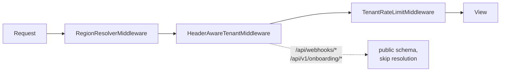
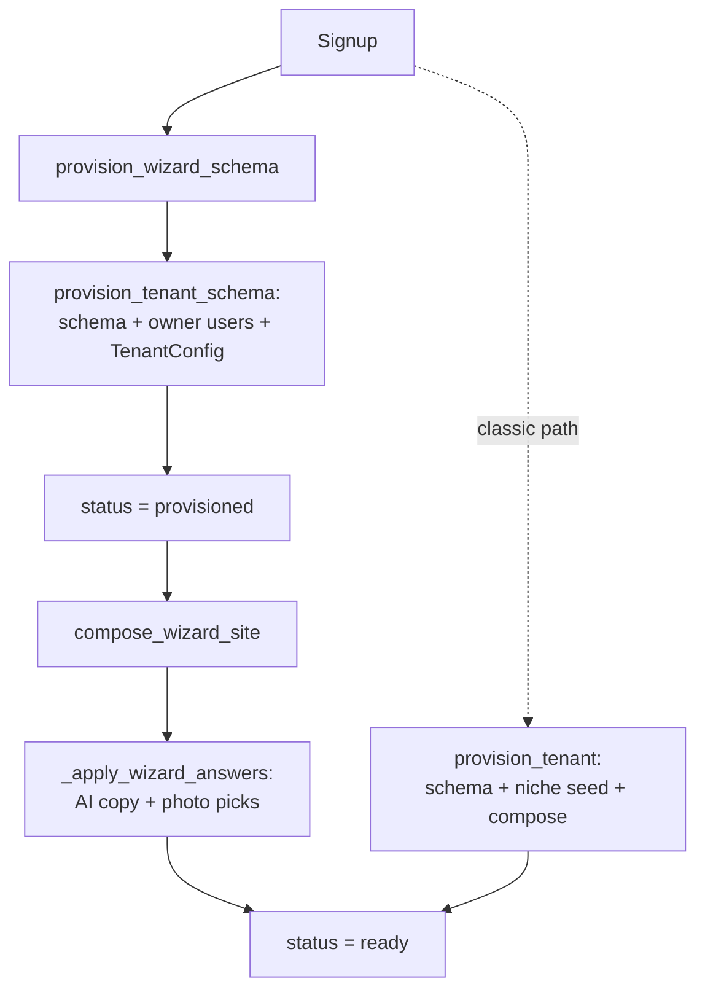

# Core Platform & Multi-Tenancy — apps

# Core Platform & Multi-Tenancy (`apps.core`)

`apps.core` is the foundation of Contentor's schema-per-tenant architecture. It lives in **SHARED_APPS** (public schema only) and owns everything that must exist *before* a tenant schema is even resolved: the `Tenant` model itself, the middleware pipeline that turns a hostname into a schema, region/locale resolution, tenant provisioning, the platform billing plan model, content access control, and the shared utilities (storage, email, sanitization, throttling) that every other app builds on.

If you are touching request routing, tenant lifecycle, or anything that spans tenants, you are working in this module.

## The request pipeline

Every request passes through three middleware layers before it reaches a view. Order matters — region resolution happens first (it only reads the host), then tenant resolution (sets the DB schema), then rate limiting (needs the resolved tenant).

### `RegionResolverMiddleware` (`middleware/region.py`)

Stamps `request.region`, `request.tenant_slug`, and `request.host_locale` from the host header via `region_utils.resolve_host()`. Region is the platform's primary isolation axis (`global` vs `tr`, defined in `constants.py`): a tenant is created in one region and stays there forever, and region determines default locale and currency (`REGION_DEFAULT_LOCALE`, `REGION_DEFAULT_CURRENCY`).

`resolve_host()` matches in a deliberate order — the TR tenant pattern (`<slug>.tr.contentor.app`) must be tried before the global pattern, because a TR tenant host also matches the global regex. `region_apex()` and `tenant_apex()` are the inverse helpers for building canonical URLs.

### `HeaderAwareTenantMiddleware` (`middleware/tenant.py`)

Extends django-tenants' `TenantMainMiddleware` with two critical behaviors:

1. **`X-Tenant-Domain` header support.** Node's undici (Next.js server-side `fetch`) silently drops custom `Host` headers, so server-rendered pages send the tenant domain via `X-Tenant-Domain` instead. `hostname_from_request()` prefers this header over `Host`.
2. **Webhook/onboarding short-circuit.** `/api/webhooks/*` and `/api/v1/onboarding/*` land on the platform apex with no meaningful Host-based tenant context. `process_request()` forces the public schema and skips resolution entirely; those handlers resolve the tenant from signed payload metadata or the request body. `RegionResolverMiddleware` mirrors this for webhooks (sets region to `None`).

### `TenantRateLimitMiddleware` (`middleware/rate_limit.py`)

Redis sliding-window rate limiter (100 req/min default, 10 req/min for `/api/v1/upload/`), applied only to tenant schemas — public-schema traffic is exempt. Three design decisions worth knowing:

- **Buckets are per client IP, not per tenant** — one abuser can't throttle a whole tenant's visitors, and a spoofed `X-Tenant-Domain` can't exhaust a victim tenant's window.
- **The tenant's own admins are exempt.** `_is_admin()` decodes the JWT *before* DRF auth runs and requires `payload["tenant_id"] == schema_name` — a coach's token for tenant A must not exempt them on tenant B, since the tenant is resolved from a spoofable header.
- **`/api/v1/admin/config/` is never limited** (`EXEMPT_PATHS`). It resolves whether a site exists on every server-rendered page load; throttling it would make a valid tenant render "Site not found" under load.

Rates are settings-overridable (`TENANT_RATE_LIMIT_DEFAULT` / `TENANT_RATE_LIMIT_UPLOAD`) so the e2e suite, whose traffic shares one IP, doesn't trip 429s in dev.

### `TenantRouter` (`routers.py`)

Extends django-tenants' `TenantSyncRouter` to hard-refuse migrating any non-`SHARED_APPS` app into the public schema. This is the backstop that keeps `TENANT_APPS` tables out of `public` regardless of how a migration is invoked.

## Data model (`models.py`)

All models here live in the public schema.

### `Tenant`

The central row. Beyond the django-tenants basics (`schema_name`, `slug`, `subdomain`), it carries:

- **Immutable region + currency.** `region` is set at signup from the host; `billing_currency` at first Stripe checkout. The `tenant_pre_save` signal raises `ValidationError` on any attempt to change either once set, and mirrors `billing_currency` from `REGION_DEFAULT_CURRENCY` on creation.
- **Slug validation.** `validate_tenant_slug()` (`validators.py`) rejects `RESERVED_SLUGS` (`www`, `api`, `tr`, …) in both `clean()` and the `pre_save` signal, so direct ORM writes and admin actions are caught too. The `public` base tenant is exempt.
- **Provisioning state machine.** `provisioning_status`: `pending → provisioning → provisioned → ready` (or `failed`). `provisioned` means "schema exists, site not yet composed" — see the lifecycle below.
- **Publish gate.** `is_published` + `preview_password` hide the public site behind a preview gate until the coach goes live.
- **Onboarding state.** `wizard_state` (JSON, owned by `apps.core.onboarding`), `wizard_bucket` (A/B holdout, assigned once at email-verify), `template_niche`/`template_seed_status`, and the recovery timestamps (`recovery_email_sent_at`, `abandon_warned_at`) that drive the abandonment beat tasks.
- **Plan helpers.** `is_subscription_active` and `has_paid_platform_plan` read the related `PlatformSubscription`; `past_due` counts as active/paid so a failed card doesn't instantly cut features off.

`auto_create_schema = False` — schema creation is explicit, done by the provisioning tasks.

### Platform billing

- **`PlatformPlan`** — the coach-facing pricing tiers. Multi-currency prices live in the `prices` JSONB (`{"USD": {"amount_cents", "stripe_price_id"}, ...}`); always read via `get_price(currency)`, which falls back to the legacy `price_monthly`/`stripe_price_id` pair (treated as USD) — that indirection is what makes a future `PlanPrice` table a one-place change. `is_free` recognizes the Free tier by name or zero price. Per-plan AI quotas (`max_ai_blog_posts`, `max_student_bot_questions`, `max_site_ai_updates`) gate the AI features.
- **`PlatformSubscription`** — coach→platform subscription (one per tenant). **Not** the same as `apps.billing.Subscription`, which is student→coach inside a tenant schema. Providers: `stripe`, `bypass` (dev/CI), `manual` (superadmin comp).
- **Plan mirroring (signals.py).** `PlatformSubscription` is the single source of truth; `Tenant.plan` is a mirror maintained by `subscription_mirror_plan_on_save`/`_on_delete` via `_mirror_plan_onto_tenant()`. A canceled or deleted subscription reverts the tenant to the Free plan (resolved by `BILLING_FREE_PLAN_NAME`), not to `None`, so quota checks fall back to Free limits rather than zero. The mirror uses `.update()` to avoid re-triggering tenant save signals.
- **`WebhookEvent`** — idempotency ledger for provider webhooks, unique on `(provider, provider_event_id)`.

### AI usage accounting

Five structurally identical models — `LogoAiUsage`, `HelpBotUsage`, `BlogAiUsage`, `OnboardingAiUsage`, `SiteAiUpdateUsage` — track per-tenant-per-month AI consumption, unique on `(tenant_schema, month)`. The shared contract:

- **DB-backed, never cache-backed**, so a Redis restart can't reset billing-relevant state.
- **`usd_spent` accrues on every attempt** (success or failure) — a systematic-failure loop still trips the global monthly USD kill-switch when summed across tenants.
- **The quota counter (`turns_used`, `questions`, `generations_used`, …) increments only on success.**

Follow this pattern when adding a new metered AI feature.

Supporting models: `AiTranscript` (audit trail, purged after `AI_TRANSCRIPT_RETENTION_DAYS` — billing state never lives here), `AiConversation`/`AiMessage` (chat threads, loosely coupled by `tenant_schema` string and plain-int user ids), `PlatformKbEntry` (superadmin prompt addenda), and `AiIpBlock` (see abuse prevention below).

Content catalogs (`CuratedLogo`, `CuratedPhoto`, `PlatformBlogPost`) also live here because they are superadmin-managed and cross-tenant. `CuratedPhoto` rows are **disabled, never deleted** — tenant `media.Photo` rows materialized from them must never break.

## Tenant provisioning (`tasks.py`)

Provisioning is split so the wizard can create a schema *early* (when the coach reaches the content step) and compose the site *later* (at the reveal):

- **`provision_tenant_schema()`** — the shared core: creates the schema (`create_schema(check_if_exists=True)`), the owner `User` in the public schema (role `coach`) *and* inside the tenant schema (role `owner`, `is_staff`), and a default `TenantConfig` via `_create_default_config()`. Every step is idempotent (`get_or_create`, existence guards) so Celery retries complete a partial signup instead of duplicating rows. Note the region rule: an existing public user's `region` is never mutated — it records first-signup origin only.
- **`provision_tenant`** — the classic full path: schema, then niche seeding (`seed_template_into_tenant`), then wizard-answer overlay, then `ready`.
- **`provision_wizard_schema`** — content-first early path: schema/owner/config only, stops at `provisioned`. It must accept the `provisioning` status too — the enqueueing endpoint sets that synchronously to close a double-poll race, so refusing it would make every call see its own handoff state and no-op.
- **`compose_wizard_site`** — finishes a `provisioned` tenant: applies wizard answers, best-effort seeds starter posts/draft products, marks `ready`. **Fail-soft**: AI failures fall back to deterministic pages and still reach `ready`; only unexpected errors retry.

### AI steps inside provisioning

`_apply_wizard_answers()` orchestrates the AI passes (`_compose_pages_with_ai`, `_pick_photos_with_ai`, `_seed_starter_post`), each run through `_run_ai_step()` — a one-worker `ThreadPoolExecutor` with a hard timeout that returns `(result, "ok")` or `(None, "failed")` and **never raises**. Two constraints to respect if you modify these:

- The worker thread gets fresh DB connections that land on the **public** schema — tenant-schema reads/writes must happen in the caller's thread inside `tenant_context`. That's why `_gather_content_items()` reads courses/downloads *before* the thread is spawned.
- Per-step status is recorded in `wizard_state` (`ai_compose_status`, `ai_photos_status`, `ai_blog_status`) as the once-only guard, so retries don't re-spend AI budget.

Other beat tasks here: `send_wizard_recovery_emails` (hourly drop-off nudge, at most one per tenant via the `recovery_email_sent_at` NULL filter), `cleanup_abandoned_signups` (two-stage: warn, then `tenant.delete(force_drop=True)` after the grace period — selection guards live in `onboarding/recovery.py`), `purge_ai_transcripts`, and `rank_curated_logos` (fire-and-forget wizard helper; every failure path is a silent no-op because the wizard has a client-side fallback rank).

## Content access control (`access.py`)

`ContentAccessService` is the single authority on whether a student can consume a piece of content (course, download, live class). Callers use `check_access(user, content)` for a boolean or `get_access_info()` for the full `AccessInfo` dataclass (`has_access`, `access_reason`, `unlock_methods`, price/currency).

The check order is a strict waterfall — the first matching rule wins:

1. **Owner/coach** — always in.
2. **Free content** (`pricing_type == "free"`).
3. **Direct purchase** — a non-refunded `PaymentItem` in a `completed`/`partially_refunded` payment.
4. **Bundle purchase** — a purchased `Bundle` containing the content.
5. **Subscription** — either the content is linked to one of the user's active plans (`SubscriptionPlanAccess`), or it's `subscription`-priced, in which case *any* active subscription unlocks it.
6. **No access** — `unlock_methods` tells the frontend what to offer (`purchase`, `subscribe`).

Two things to preserve when changing this:

- **`bulk_check_access(user, content_list)`** exists for listing pages and replaces per-item queries with one batch query per rule (`_batch_direct_purchases`, `_batch_bundle_purchases`, `_batch_subscription_access`, `_batch_plan_linked_by_ct`). If you add a rule to `get_access_info`, add its batch equivalent or listings will silently diverge from detail pages.
- **All billing imports are lazy and wrapped in `try/ImportError → deny/empty`** so the service degrades gracefully if `apps.billing` isn't installed.

`get_unlock_options(content)` returns the purchasable paths (direct price, bundles, plans) for paywall UIs. Prices have no currency column — `content_currency()` denominates them in the tenant's charge currency (`apps.core.currency.tenant_charge_currency()`), i.e. what Stripe will actually charge.

## Abuse prevention for public AI endpoints

Three cooperating pieces protect the unauthenticated AI endpoints (wizard followups, help bot, etc.):

- **`net.client_ip()`** — resolves the real client IP: `CF-Connecting-IP` first (unspoofable end-to-end because prod has no published origin ports behind the Cloudflare tunnel), then first `X-Forwarded-For` hop, then `REMOTE_ADDR`.
- **`throttling.ClientIpAnonThrottle`** — DRF `AnonRateThrottle` keyed on that real IP (behind the tunnel, all anonymous traffic otherwise shares one `REMOTE_ADDR` bucket). Scoped subclasses (`AiThreadThrottle`, `WizardFollowupThrottle`, `BrandNameCheckThrottle`, …) map to per-scope rates in settings. On every denial it calls `ipblock.record_throttle_denial()`.
- **`ipblock.py`** — a cached blocklist backed by `AiIpBlock` rows. Views call `blocked_response(request)` first thing and return its 403 if non-None (one cache hit per request; the blocklist itself is re-materialized from the DB every `BLOCKLIST_TTL` seconds). `record_throttle_denial()` keeps a Redis counter per denied IP and auto-creates a time-limited `AiIpBlock` at `AI_IP_AUTOBLOCK_THRESHOLD` denials. Manual blocks come from the superadmin panel.

## Shared utilities

### Object storage (`storage.py`)

`get_s3_client(external=False)` builds a boto3 client configured for both MinIO (dev) and Hetzner (prod) — path-style addressing + SigV4. `external=True` swaps to `AWS_ENDPOINT_EXTERNAL`, the endpoint reachable from the *browser*; all presigned-URL generation uses it.

Tenant isolation is prefix-based: `build_s3_path(category, *parts)` produces `tenants/<slug>/<category>/...` from the current connection's tenant. The security-critical counterpart is **`is_tenant_scoped_key(s3_key)`** — any client-supplied key (the upload "complete" endpoints) must pass it, or a coach could point a record at, and get a presigned URL for, any object in the bucket, including other tenants'. `is_blocked_content_type()` rejects uploads that could execute as active content (HTML/JS). `sign_if_s3_key()` is the convenience used by serializers: presign S3 keys, pass HTTP URLs through untouched.

### Email (`email.py`)

`send_email()` sends via Resend, with two fallbacks: when `EMAIL_SINK_ENABLED` is on (dev/e2e), mail is captured into `DevOutboundEmail` instead of sent — read back via `GET /api/v1/dev/emails/latest/?to=` (`dev/views.py`, 404s unless the sink is enabled); with no `RESEND_API_KEY`, it logs and returns `False`. `send_magic_link()` renders the localized (EN/TR) magic-link email, optionally with a 6-digit code for installed-app sign-in.

### Localization (`i18n_helpers.py`)

A deliberately thin alternative to gettext for the ~15 user-facing API error strings: `msg(request, key)` looks up `_MESSAGES` using `resolve_locale()` (request region → `Accept-Language` → EN). Unknown keys return the key itself rather than crashing. If the catalog outgrows ~50 entries, migrate to `.po`.

### Sanitization (`sanitize.py`)

The trust boundary for coach/student-authored content. `clean_rich_html()` (nh3, allowlist-based — no scripts, event handlers, or unsafe URL schemes) must wrap any untrusted HTML rendered back to a browser; `clean_css()` must wrap any value injected into a `<script>` breakout, plus `javascript:`, `@import`, `expression()`, etc.). Both are idempotent.

### Permissions, pagination, logging

- `permissions.py`: `IsOwner`, `IsCoachOrOwner`, `IsSuperUser` DRF classes, plus the function `is_coach_or_owner(user)` — the single source of truth for the role test, for use in mixed-method `@api_view` functions where a permission class can't gate one branch.
- `pagination.py`: `StandardPagination` (limit/offset, default 20, max 100), `apply_ordering()` (validated `?ordering=`, falls back to `-created_at`), `apply_tag_filter()` (`?tags=` ANY-match).
- `logging.py`: `TenantContextFilter` stamps every log record with the active schema name so `docker logs` lines identify their tenant; defensively degrades to `-` and never raises inside the logging machinery.

## Sub-packages with views

- **`me/`** — user-scoped endpoints (`/api/v1/me/...`), distinct from the superuser-only `platform/` API. `my_tenants` lists tenants owned by the requester (matched by `owner_email`); `update_my_tenant` is the coach's publish gate — going live is blocked while `publish_blockers()` (computed inside the tenant schema) is non-empty. The URLconf also mounts the custom-domain wizard routes from `apps.domains`; the specific `domain/` routes are listed before the bare `<slug>/` PATCH route intentionally.
- **`dev/`** — dev-only endpoints: the email-sink reader and a Gemini logo-generation debug page. Both are inert in prod (gated on `EMAIL_SINK_ENABLED` / debug settings).
- **`views.py`** — `health_check` (`/api/health/`): pings Postgres and Redis, returns 503 `degraded` if either fails. This is what `make health-check` and the deploy health gate hit.

## Gotchas checklist

- Public (unauthenticated) endpoints must set `@authentication_classes([])` — `AllowAny` alone doesn't bypass `TenantJWTAuthentication`.
- Never change `Tenant.region` or `billing_currency` after creation — the `pre_save` signal will raise.
- New AI features: copy the `*AiUsage` contract exactly (DB-backed, spend-on-attempt, quota-on-success).
- New access rules: update both `get_access_info` *and* `bulk_check_access`.
- Client-supplied S3 keys: always validate with `is_tenant_scoped_key()`.
- Provisioning tasks must stay idempotent — every step is designed to be safely re-run by a Celery retry.
- The curated-logo signals (`_mirror_curated_logos`) sync the DB catalog to the repo's `logo_meta.json` in dev; they deliberately skip writing an empty list when the table is empty, because that file is the seeder's input and the only local copy of the catalog.