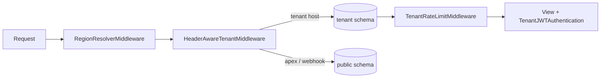

# Core Platform & Multi-Tenancy — backend

# Core Platform & Multi-Tenancy — Backend

## Purpose

This module is the foundation every request in Contentor passes through: the Django project entry points (`backend/manage.py`, `backend/config/`) and the platform layer in `apps.core` that implements schema-per-tenant multi-tenancy on top of `django-tenants`. It answers three questions for every incoming request before any app code runs:

1. **Which region and locale is this?** (`RegionResolverMiddleware`)
2. **Which tenant schema should queries hit?** (`HeaderAwareTenantMiddleware`)
3. **Is this client allowed to keep sending requests?** (`TenantRateLimitMiddleware`)

Each coach (tenant owner) gets an isolated PostgreSQL schema; the `public` schema holds platform-wide concerns — the tenant registry itself, platform billing, superadmin tooling, and AI usage accounting.

## Entry Points

`backend/manage.py` is the standard Django CLI entry point. Its `main()` defaults `DJANGO_SETTINGS_MODULE` to `config.settings.dev` and hands off to `execute_from_command_line`. Production processes (Gunicorn via `config/wsgi.py`, Celery via `config/celery.py`) run `config.settings.prod` instead; both environments layer on top of `config/settings/base.py`, where all multi-tenancy configuration lives.

Because migrations are schema-aware, you never run plain `migrate` — use `make migrate` (`migrate_schemas`, all tenants) or `make migrate-shared` (public schema only). In Docker, only the Gunicorn entrypoint runs migrations; Celery containers skip them to avoid races.

## The Shared / Tenant App Split

`config/settings/base.py` declares two app lists that `django-tenants` uses to decide where each app's tables live:

- **`SHARED_APPS`** — public schema only: `apps.core`, `apps.accounts`, `apps.adminkit`, `apps.platform_email`, `apps.domains`, `apps.mailbox`, `apps.demo_seed`, `apps.logbook`.
- **`TENANT_APPS`** — replicated into every tenant schema: `apps.tenant_config`, `apps.courses`, `apps.downloads`, `apps.live`, `apps.media`, `apps.billing`, `apps.email_campaigns`, `apps.notifications`, `apps.usage`, `apps.community`, `apps.blog`, and more.

`apps.mailbox` and `apps.accounts` appear in **both** lists deliberately: public-schema mailbox rows are the superadmin platform inbox, and users exist both in public (role `coach`) and inside their tenant (role `owner`).

`TenantRouter` (`apps/core/routers.py`) extends `django_tenants.routers.TenantSyncRouter` with one strict rule: `allow_migrate` returns `False` for any tenant-only app targeting the public schema. Without it, a stray migration could leak tenant tables into `public`. It is first in `DATABASE_ROUTERS`, ahead of the stock `TenantSyncRouter`.

The tenant registry itself is configured via `TENANT_MODEL = "core.Tenant"` and `TENANT_DOMAIN_MODEL = "core.Domain"`.

## Request Pipeline

The first three entries in `MIDDLEWARE` do the multi-tenancy work, in order:

### 1. Region resolution — `apps/core/middleware/region.py`

`RegionResolverMiddleware` calls `resolve_host()` (`apps/core/region_utils.py`) on `X-Tenant-Domain` (preferred) or the `Host` header, and annotates the request with `request.region`, `request.tenant_slug`, and `request.host_locale`. Host patterns map to two regions: `contentor.app` / `<slug>.contentor.app` (global, English) and `tr.contentor.app` / `<slug>.tr.contentor.app` (Turkey, Turkish). The TR regex is matched first because a TR tenant host also matches the global pattern. A tenant's `region` field is set once at signup from this value and is immutable.

### 2. Tenant resolution — `apps/core/middleware/tenant.py`

`HeaderAwareTenantMiddleware` extends `django_tenants`' `TenantMainMiddleware` with two behaviors you must understand before touching anything tenant-related:

- **`X-Tenant-Domain` beats `Host`.** Node's undici (Next.js server-side `fetch`) silently drops custom `Host` headers, so a request with `Host: django` would resolve to the public schema. Server-side Next.js code therefore sends the tenant domain in `X-Tenant-Domain`, which `hostname_from_request` checks first.
- **Webhooks and onboarding force public.** `process_request` short-circuits `/api/webhooks/*` and `/api/v1/onboarding/*` with `connection.set_schema_to_public()` — those requests arrive on the platform apex with no meaningful Host-based tenant context. Stripe webhooks resolve their tenant from signed payload metadata; the onboarding wizard runs before a tenant schema exists.

### 3. Rate limiting — `apps/core/middleware/rate_limit.py`

`TenantRateLimitMiddleware` runs late in the chain (after the tenant is bound) and applies a Redis sliding-window limit per **tenant × client IP × bucket** — 100 req/min general, 10 req/min for `/api/v1/upload/*`. Design decisions encoded in the class:

- Public-schema requests are never limited; neither is `/api/v1/admin/config/` (`EXEMPT_PATHS`), because throttling the site-existence lookup would make a healthy tenant render "Site not found" under load.
- `_is_admin()` decodes the JWT itself (this runs before DRF auth) and exempts the tenant's own `owner`/`coach` — but only if the token's `tenant_id` matches the resolved schema, so a coach's token for tenant A can't bypass tenant B's limits via a spoofed `X-Tenant-Domain`.
- Buckets are keyed per client IP (`_client_ip()`, first `X-Forwarded-For` hop) rather than per tenant, so one abuser can't exhaust a victim tenant's shared window.
- Redis failures are swallowed — rate limiting fails open rather than taking the API down.

Dev overrides `TENANT_RATE_LIMIT_DEFAULT` / `TENANT_RATE_LIMIT_UPLOAD` so the e2e suite (all traffic from one IP) doesn't trip 429s.

## Public-Schema Models (`apps/core/models.py`)

The tenant registry and platform billing:

- **`Tenant`** (`TenantMixin`) — slug, region, provisioning lifecycle (`provisioning_status`: pending → provisioning → provisioned → ready), publish gate (`is_published` + `preview_password`), Stripe Connect state (`stripe_account_id`, `stripe_charges_enabled`, `stripe_payouts_enabled`), and onboarding-wizard state (`wizard_state`, `wizard_bucket`, `template_niche`, abandonment timestamps). Note `auto_create_schema = False` — schema creation is an explicit provisioning step, not a side effect of saving the row. The properties `is_subscription_active` and `has_paid_platform_plan` are the canonical way to ask "is this coach paying?"; `past_due` counts as active so a failed card doesn't instantly cut features off.
- **`Domain`** (`DomainMixin`) — hostnames mapped to tenants, plus `ssl_status` for custom domains.
- **`PlatformPlan`** / **`PlatformSubscription`** — the coach→platform billing tier. Always read prices via `PlatformPlan.get_price(currency)` (multi-currency `prices` JSON with a legacy USD fallback), and check `plan.is_free` rather than comparing names. `PlatformSubscription` is deliberately distinct from `apps.billing.Subscription`, which is the tenant-scoped student→coach model.
- **`WebhookEvent`** — idempotency ledger for provider webhooks (unique on `provider` + `provider_event_id`).
- **`TenantUsage`** and the `*AiUsage` family (`LogoAiUsage`, `HelpBotUsage`, `BlogAiUsage`, `OnboardingAiUsage`, `SiteAiUpdateUsage`, `StudentBotUsage`) — per-tenant-per-month metering. The AI meters are DB-backed (not cache) so a Redis restart can't reset billing state, and `usd_spent` accrues on every attempt (success or failure) so a failure loop still trips the global budget kill-switch.

AI conversation models (`AiConversation`, `AiMessage`, `AiTranscript`) and the platform CMS (`PlatformBlogPost`, `CuratedLogo`, `CuratedPhoto`, `PlatformKbEntry`) also live here, loosely coupled by storing `tenant_schema` as a plain string so superadmin can read cross-tenant without schema iteration.

## Authentication

`TenantJWTAuthentication` (`apps/accounts/authentication.py`) is the DRF default (`REST_FRAMEWORK["DEFAULT_AUTHENTICATION_CLASSES"]`), with `IsAuthenticated` as the default permission. The critical convention: **public endpoints must set `@authentication_classes([])`** — `AllowAny` alone is not enough, because the default authentication class still runs and rejects requests with bad/missing tokens. The Stripe webhook and `/api/schema/` in `config/urls.py` both follow this pattern.

`AdminJWTBackend` (`apps/accounts/backends.py`) bridges the JWT world into classic Django admin: `admin_auto_login` in `config/urls.py` logs a JWT-holding staff user into `/django-admin/` without a separate password prompt.

## URL Surface (`config/urls.py`)

Everything is under `/api/v1/` (plus `/api/health/` → `health_check` and `/api/schema/` for drf-spectacular). Ordering in `urlpatterns` is load-bearing:

- `/api/webhooks/stripe/` is declared before any `/api/v1/` route and is skipped by both tenant middlewares.
- The specific `/api/v1/platform/email/`, `/platform/blog/`, and logbook includes precede the broad `apps.core.platform` include so they resolve first.
- `/api/v1/dev/` (the email sink read-back used by e2e) is mounted only when `EMAIL_SINK_ENABLED` is true; prod refuses the flag.

Core also mounts its own sub-packages here: `core/onboarding/` (signup wizard), `core/platform/` (superadmin API), `core/me/`, `core/uploads/`, `core/preview/`, `core/curated_logos/`, `core/curated_photos/`, and the assistant endpoints.

## Contributing Notes

- **Every request crosses the middleware in this module** — edit `middleware/` and `routers.py` with corresponding care, and run `make test-app APP=core`.
- Many function-local `from apps.…` imports inside `apps.core` exist to break import cycles. Don't hoist them to module level without checking the cycle; `apps/core/ai.py` and `assistant.py` are intentionally import-pure leaves.
- When adding an app, decide its schema home first (SHARED vs TENANT list) — moving an app between schemas after it has migrated is painful. `TenantRouter` will block tenant apps from migrating into public, but nothing stops you from accidentally sharing what should be isolated.
- `ContentAccessService` (`apps/core/access.py`) is the single paywall decision point used by courses, live, downloads, billing, and notifications — route new access checks through it rather than duplicating logic.
- After changing any serializer, regenerate the frontend contract (`npm run gen:api` in `frontend-customer`) and review the diff of `src/types/api-generated.ts`.
