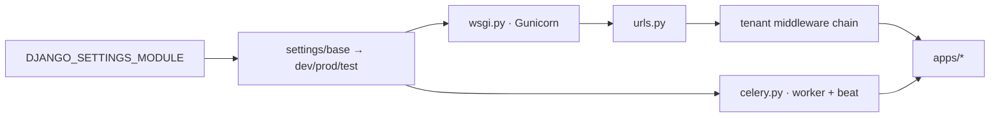

# Core Platform & Multi-Tenancy — config

# Core Platform & Multi-Tenancy — `config`

The `config` package is the Django project root for Contentor's backend. It owns settings (split by environment), the global URL map, Celery wiring, and the WSGI/ASGI entrypoints. Everything else in the codebase — `apps/*` — plugs into the structures defined here: the shared/tenant app split, the middleware chain, the beat schedule, and the URL prefix layout.

```
backend/config/
├── settings/
│   ├── base.py    # everything common; env-driven
│   ├── dev.py     # DEBUG, local fakes, relaxed rate limits
│   ├── prod.py    # hardened; fails fast on dev-grade config
│   └── test.py    # dev + hermetic/speed tweaks
├── urls.py        # ROOT_URLCONF — the full /api/v1/ map
├── celery.py      # worker app + beat schedule + logging handoff
├── wsgi.py        # Gunicorn entrypoint (default settings: dev)
└── asgi.py
```

## Settings layering

Settings are a strict inheritance chain via star-imports: `base.py` → `dev.py` → `test.py`, and `base.py` → `prod.py`. The module is selected by `DJANGO_SETTINGS_MODULE`; `wsgi.py`, `asgi.py`, and `celery.py` all default to `config.settings.dev`, and prod deployment sets `config.settings.prod` explicitly.

`base.py` reads everything from the environment (via `python-dotenv`'s `load_dotenv()`) with dev-safe defaults. The helper `_env_bool(name, default)` normalizes truthy strings (`"1"`, `"true"`, `"yes"`, `"on"`) and is reused by `dev.py` and `prod.py` for the feature-fake flags.

### `base.py` — the shared contract

The most important structures defined here:

**Tenant app split.** `SHARED_APPS` live only in the public Postgres schema (tenancy, accounts, platform email, domains, logbook, adminkit, demo_seed); `TENANT_APPS` are migrated into every tenant schema (courses, downloads, live, billing, media, …). `apps.mailbox` and `apps.accounts` appear in both lists deliberately — public-schema mailbox rows are the superadmin platform inbox. `INSTALLED_APPS` is computed as `SHARED_APPS + (TENANT_APPS - SHARED_APPS)`, and `DATABASE_ROUTERS` pairs the custom `apps.core.routers.TenantRouter` with django-tenants' `TenantSyncRouter` to keep tenant-only tables out of the public schema.

**Middleware order.** The chain starts with `RegionResolverMiddleware` then `HeaderAwareTenantMiddleware` — tenant resolution must happen before anything session- or auth-related. `TenantRateLimitMiddleware` and the logbook `RequestActivityMiddleware` sit at the end, after auth, so they can key on the resolved tenant and user.

**DRF defaults.** `TenantJWTAuthentication` is the default authentication class and `IsAuthenticated` the default permission. This has a project-wide consequence: any public endpoint must set `@authentication_classes([])` — `AllowAny` alone still runs the JWT authenticator and can 401. The `DEFAULT_THROTTLE_RATES` dict is the single registry of every scoped throttle (help bot, wizard endpoints, signup, AI rates); add new scopes here, not inline.

**AI configuration.** `AI_PROVIDER` selects `"anthropic"` (prod, real API key) or `"cli"` (local dev, the developer's Claude subscription via the `claude` binary). Each AI feature (logo studio, help bot, blog generation, onboarding compose, student bot) gets its own model setting plus USD budget kill-switches and per-tenant caps — all env-overridable. `GEMINI_API_KEY` is intentionally *not* routed through `AI_PROVIDER`; image generation is a separate modality with its own off-switch (unset key = feature off, no fakes needed in CI).

**Local-fake flags.** `BILLING_BYPASS_ENABLED`, `LIVE_FAKE_ENABLED`, `EMAIL_SINK_ENABLED`, and `DOMAINS_BYPASS_ENABLED` swap external services (Stripe, GetStream, Resend, Route 53/Cloudflare) for deterministic fakes. Each has a hard refusal in `prod.py` (see below).

**Logging.** A single stdout handler with `TenantContextFilter` and `UserContextFilter` stamps every line with `[tenant=…] [user=…]`. `apps.*` loggers emit at `DJANGO_LOG_LEVEL` (default INFO) so business events are visible in prod; `apps.logbook.activity` is pinned to INFO regardless (it's data, not diagnostics); chatty libraries are clamped to WARNING. `CELERY_WORKER_HIJACK_ROOT_LOGGER = False` hands logging control to this config in worker processes too — the actual handoff lives in `celery.py`.

### `dev.py`

Turns on `DEBUG`, forces `SITE_SCHEME = "http"` (no local TLS, and Stripe redirect URLs must match), enables the email sink by default, and auto-enables the GetStream fake when no `GETSTREAM_API_KEY` is present (unless `LIVE_FAKE_ENABLED` is explicitly set in the env). It also raises `TENANT_RATE_LIMIT_DEFAULT` to 1000 because the whole e2e suite hits Django from one client IP — the prod 100/min bucket would surface as flaky dead-end UI states in specs.

### `prod.py`

Prod is defined by its **fail-fast guards** — each raises `ImproperlyConfigured` at import time so a misconfigured box never boots:

- `DJANGO_SECRET_KEY` still equal to the dev default
- `*` anywhere in `DJANGO_ALLOWED_HOSTS`
- `BILLING_BYPASS_ENABLED`, `LIVE_FAKE_ENABLED`, or `EMAIL_SINK_ENABLED` set true
- `AI_PROVIDER=cli` (the prod image has no `claude` binary, and its $0 cost reporting would blind the USD kill-switches)

Note the guards re-read `os.environ` directly rather than trusting the star-imported base attributes — base may have been first imported under different env state (e.g. in tests), so the cached values can't be trusted.

The proxy-related block encodes the deployment topology (Cloudflare edge → cloudflared → Caddy → Django, all plain HTTP past the edge): `SECURE_PROXY_SSL_HEADER` trusts Caddy's forced `X-Forwarded-Proto: https`, `USE_X_FORWARDED_HOST` is on, and `SECURE_SSL_REDIRECT` is **deliberately false** — the internal Next.js SSR fetches hit `http://django:8000`, and a Django-issued 301-to-https would break them. CSRF and CORS both accept wildcard `*.contentor.app` (tenant subdomains are dynamic; the proxy has no per-tenant config). Static files are served by WhiteNoise (`CompressedManifestStaticFilesStorage`) so no volume is shared with the edge proxy. Sentry initializes only when `SENTRY_DSN` is set.

### `test.py`

Inherits from `dev.py`, then:

- MD5 password hashing (PBKDF2 costs ~90ms/hash × a user created in nearly every test setup)
- `DEBUG = False` to drop the per-query debug cursor
- `AI_PROVIDER` pinned to `"anthropic"` so tests are hermetic — otherwise a developer running `AI_PROVIDER=cli` locally would have AI tests silently spawn real `claude` subprocesses
- Rate limits reset to prod values (`TENANT_RATE_LIMIT_DEFAULT = 100`) because middleware tests assert those thresholds
- **Per-xdist-worker Redis DB isolation**: workers `gw0…` map onto Redis DBs 2–15 (0 = dev cache, 1 = Celery broker). Without this, the tenant rate limiter — which keys on `schema_name`, identical across workers — would trip across parallel workers.

## URL map (`urls.py`)

`config.urls` is the single `ROOT_URLCONF` for all hosts; tenancy is resolved from the `Host` header by middleware, not by URL routing. The layout:

| Prefix | Purpose |
|---|---|
| `/django-admin/` | Django admin (apex `/admin/*` is the superadmin SPA, routed to Next.js by Caddy) |
| `/api/webhooks/stripe/` | Stripe webhook — declared **before** any `/api/v1/` route |
| `/api/health/`, `/api/schema/` | Health probe; drf-spectacular OpenAPI (both auth-free) |
| `/api/v1/…` | Everything else, one `include()` per app |
| `/api/v1/dev/` | Mounted only when `EMAIL_SINK_ENABLED` (prod refuses the flag, so this surface cannot exist in prod) |

Ordering matters in three documented places: the Stripe webhook precedes `/api/v1/` and pairs with `@authentication_classes([])` on the view (region + tenant middleware also skip `/api/webhooks/*`); `/api/v1/platform/email/`, `/platform/blog/`, and the logbook platform routes are declared before the broader `apps.core.platform` include so they resolve first.

`admin_auto_login` is the one view defined here: it intercepts `/django-admin/login/`, calls `AdminJWTBackend().authenticate(request)` against the JWT cookie, and either establishes a Django session and redirects into the admin or falls through to the normal login page. This is what lets a superadmin already signed into the SPA land in Django admin without a second login.

## Celery (`celery.py`)

`app = Celery("contentor")` reads config from Django settings under the `CELERY_` namespace and autodiscovers `tasks.py` across installed apps. Two things live here beyond boilerplate:

**Beat schedule** — the platform's entire recurring-work surface, defined statically in `app.conf.beat_schedule`. High-frequency dispatchers (announcements, recurrences, email campaigns every minute; live reminders every 5; blog autopilot every 15) plus nightly housekeeping (AI transcript purge, abandoned-signup cleanup, logbook archive/purge) and an hourly wizard-recovery email pass at `:25`. Adding a new periodic task means adding an entry here — there is no database-backed scheduler.

**Logging handoff** — `configure_logging` hooks Celery's `setup_logging` signal and applies Django's `LOGGING` dict via `dictConfig`. Combined with `CELERY_WORKER_HIJACK_ROOT_LOGGER = False` in `base.py`, this makes worker/beat log lines land in the same stdout stream and format (including tenant/user context) as the web process — which is what the Vector → logbook pipeline expects.



## Working in this module

- **New env var?** Add it to `base.py` with a dev-safe default; if it's a dangerous fake, add a refusal guard in `prod.py` that re-reads `os.environ`.
- **New public endpoint?** Remember the DRF default: `@authentication_classes([])`, not just `AllowAny`.
- **New periodic task?** Register it in `celery.py`'s `beat_schedule`; only the Gunicorn entrypoint runs migrations, so beat/worker containers must stay migration-free.
- **New URL include?** Mind prefix shadowing — more specific `/api/v1/platform/…` includes go before the catch-all `apps.core.platform` include, and anything that must bypass tenant/JWT machinery belongs outside `/api/v1/`.
- **Throttle scopes** and their rates live only in `REST_FRAMEWORK["DEFAULT_THROTTLE_RATES"]`; test overrides for rate limits belong in `test.py`, not scattered per-test.