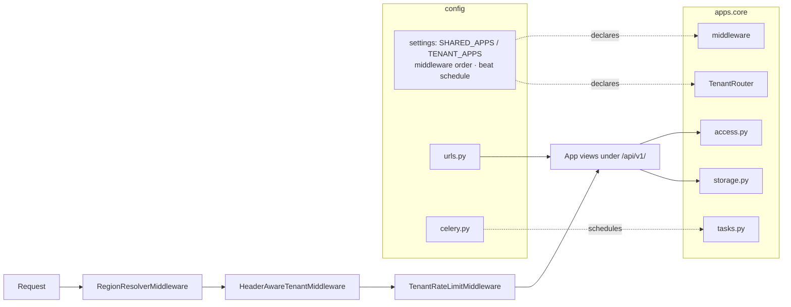

# Core Platform & Multi-Tenancy

# Core Platform & Multi-Tenancy

The foundation layer every Contentor request passes through before any feature code runs. It owns the Django project root, the schema-per-tenant machinery built on `django-tenants`, and the shared primitives (storage, email, access control, throttling) that every other app depends on.

Three questions get answered for each request, in order, by middleware defined here:

1. **Which region and locale?** — `RegionResolverMiddleware` → `resolve_host()`
2. **Which PostgreSQL schema?** — `HeaderAwareTenantMiddleware` (hostname or `X-Tenant-Domain`)
3. **Is this client still allowed to send requests?** — `TenantRateLimitMiddleware`

## Sub-modules

| Page | Owns |
|------|------|
| [Backend entry points](core-platform-multi-tenancy-backend.md) | `manage.py`, how the project root and platform layer fit together, the public-vs-tenant schema split |
| [`config`](core-platform-multi-tenancy-config.md) | Settings (base/dev/prod/test), `ROOT_URLCONF`, Celery app + beat schedule, WSGI/ASGI |
| [`apps.core`](core-platform-multi-tenancy-apps.md) | `Tenant` model, middleware implementations, provisioning, plans, `access.py`, storage/email/sanitization/throttling utilities |

## How they fit together

`config` declares the contract; `apps.core` implements it. The `SHARED_APPS` / `TENANT_APPS` split in `config/settings/base.py` decides which models land in the `public` schema, and `apps.core.routers.TenantRouter.allow_migrate` enforces it at migration time. The middleware chain in the same settings file is ordered so that region resolution precedes schema activation, which precedes rate limiting — `apps.core.throttling.allow_request` calls into `apps.core.net.client_ip` and records denials via `apps.core.ipblock.record_throttle_denial`, all of which need the tenant already resolved. `config/celery.py` registers the beat schedule that drives `apps.core.tasks`; `config/urls.py` mounts every app under `/api/v1/`.

## Cross-cutting workflows

**Tenant provisioning.** Signup creates a `Tenant` row in `public`, `apps.core` provisions the schema, and demo content is seeded through `core/demo/seed_template.py` (`seed_template_into_tenant` → `_seed_live_streams`, `_seed_subscription_plans`, `_seed_extra_photos`) with helpers from `apps.demo_seed.seeding_helpers`. `management/commands/seed_dev_tenants.py` drives the same path for local dev.

**Public → tenant mirroring.** `apps.core.signals` keeps platform-level rows in sync into tenant schemas — `subscription_mirror_plan_on_save` → `_mirror_plan_onto_tenant`, `curated_logo_mirror_on_save` → `_mirror_curated_logos`. This is why plan and curated-asset changes made in `public` show up inside every tenant without an explicit per-tenant write.

**Content access.** `access.py` is the single gate for "can this student open this content": `check_access` → `get_access_info` fans out to `_has_direct_purchase`, `_has_subscription_access`, `_has_any_active_subscription`, and `_is_in_any_plan`. `bulk_check_access` batches the same logic (`_batch_bundle_purchases`) for list endpoints, and `get_unlock_options` produces the upsell paths, both resolving price display through `content_currency`.

**Tenant-scoped storage.** `apps.core.storage.build_s3_path` → `get_tenant_slug` prefixes every object key with the active tenant, so a leaked key can't cross schemas. Other apps reach this from far away — inbound mail is the clearest case: `apps.mailbox.views.inbound` → `receive_inbound` → `store_attachment` → `build_s3_path`/`get_s3_client`, the same chain the public contact form takes via `core/contact/views.contact_submit` (which also uses `apps.core.email.send_email`).

## Gotchas

- Public endpoints must set `@authentication_classes([])` — `AllowAny` alone leaves `TenantJWTAuthentication` in the chain.
- Node's undici drops custom `Host` headers, so Next.js server-side fetches must send `X-Tenant-Domain` or they silently hit the `public` schema.
- `apps.mailbox` is dual-listed in `SHARED_APPS` and `TENANT_APPS`: public rows are the superadmin platform inbox, tenant rows are the per-coach mailbox.
- `config/settings/prod.py` fails fast on dev-grade configuration; dev-only fakes (email sink, live-class stub, billing bypass) are refused there by design.
