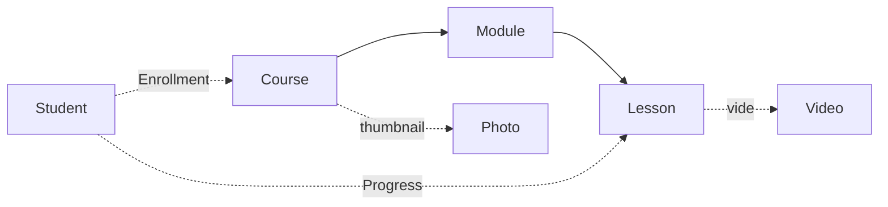

# Courses, Downloads & Media Library — apps

# Courses, Downloads & Media Library

The content layer of a Contentor tenant. Five per-tenant Django apps — `courses`, `downloads`, `media`, `filters`, `tags` — that together answer one question: *what can this coach publish, and which of it may this student see right now?*

All five live in `TENANT_APPS`, so every table exists once per tenant schema. There is no tenant foreign key anywhere in these models; isolation comes from `django-tenants` setting the Postgres `search_path` before the view runs. A `Course` row simply cannot reference another tenant's `Lesson`.

## Mount points

| App | URL prefix | Module |
|---|---|---|
| `courses` | `/api/v1/courses/` | `backend/apps/courses/urls.py` |
| `downloads` | `/api/v1/downloads/` | `backend/apps/downloads/urls.py` |
| `media` | `/api/v1/photos/` | `backend/apps/media/urls.py` |
| `filters` | `/api/v1/filters/` | `backend/apps/filters/urls.py` |
| `tags` | `/api/v1/tags/` | `backend/apps/tags/urls.py` |

Note the mismatch: the app is `apps.media`, the route is `photos/`, and the model is `Photo`. The app label is generic because it is the tenant's object-storage registry; today the only thing registered there is images.

## Domain model



**`Course`** (`apps/courses/models.py`) is the only sluggable content type here — `save()` derives the slug from the title and de-duplicates it with a `-1`, `-2` suffix loop before delegating to `super().save()`. Every course route is keyed on that slug, so renaming a course does *not* change its URL (the slug is only generated when empty, and `CourseCreateUpdateSerializer` never exposes it as writable — it's `read_only_fields` in the studio panel too).

**`Module` → `Lesson`** is a plain two-level tree, both ordered by an integer `order` column with a `Meta.ordering` default. Nothing enforces contiguity or uniqueness of `order`; the nested create path assigns 1-based positional values, and the module/lesson endpoints let a coach set anything.

**`Video`** is a standalone library object, not a child of a lesson. A lesson can point at a `Video` (`SET_NULL`) *or* carry a bare `video_url` string, and `LessonSerializer._get_s3_key()` resolves the pair — `video.s3_key` wins, `video_url` is the fallback. The same either/or shape repeats on `Course.thumbnail` (FK to `media.Photo`) vs `Course.thumbnail_url` (string). Both fields are the legacy-string escape hatch for content that was never uploaded through the media library; the FK is the modern path. New code should write the FK.

**`Enrollment`** and **`Progress`** are the student-side rows, each `unique_together` on `(user, …)`. `Enrollment.payment_id` is a bare `IntegerField`, not an FK to billing — it is a soft pointer only.

**`DownloadFile`** and **`Photo`** are flat single-table models. `Photo` uses a UUID primary key (hence `<uuid:pk>` in its routes); everything else uses BigAutoField.

## Access control: the one thing to understand

None of these apps decide who may see paid content. They all delegate to `ContentAccessService` in `apps/core/access.py`, which duck-types on any object exposing `pricing_type` and `price`. `get_access_info()` returns an `AccessInfo` dataclass, and the resolution order is fixed:

1. `role in ("owner", "coach")` → `access_reason="owner"`
2. `pricing_type == "free"` → `access_reason="free"`
3. direct purchase → `"purchased"`
4. bundle purchase → `"bundle"`
5. active subscription (plan-linked, or any active sub for `subscription`-priced content) → `"subscription"`

Serializers surface this as an `access_info` object (`asdict(AccessInfo)`) on `CourseListSerializer`, `CourseDetailSerializer`, and `DownloadFileSerializer`. All three share an identical `get_access_info` body, which:

- prefers a precomputed `access_map` from serializer context (keyed by pk),
- for anonymous users, synthesizes an `AccessInfo` locally rather than calling the service — free content is open, everything else is `has_access=False` with `unlock_methods=["purchase"]`,
- otherwise calls `ContentAccessService().get_access_info(request.user, obj)`.

**The `access_map` is the N+1 guard.** `_course_list` and `download_list_create` build it once per page via `service.bulk_check_access(request.user, page)` and hand it down in context. If you add a new list endpoint that serializes `access_info`, build the map — otherwise you get one full access resolution (several queries each) per row.

### Enrollment is not the same as access

This trips people up. Four of the five access reasons create **no `Enrollment` row at all** — a student who buys a course directly, gets it in a bundle, or unlocks it via subscription is never "enrolled". Two consequences, both handled explicitly:

- `_has_unlocked_access()` in `apps/courses/views.py` gates progress endpoints on `access_reason in ("purchased", "bundle", "subscription")` *in addition to* the `Enrollment` check. Free courses deliberately fall outside this set — a free course still requires an explicit `POST /enroll/` first.
- `enrolled_courses` unions the two populations by hand: it walks active `Enrollment` rows, then queries `Subscription` + `SubscriptionPlanAccess` (via `ContentType.get_for_model(Course)`) for plan-linked published courses not already seen, tagging those with `via_subscription: True`. Enrollment-sourced entries get `enrolled_at`; both get a computed `progress_percent`.

Those `apps.billing` imports are function-local, not module-level — keep them that way to avoid an app-loading cycle.

### Lesson content is gated twice

`LessonSerializer._is_unlocked()` decides whether a requester sees a lesson's paid payload. It returns `True` for `is_free_preview` lessons, `True` for owner/coach, and otherwise defers to a `course_has_access` boolean injected into context. `CourseDetailSerializer.get_modules()` computes that boolean *once* per course with `service.check_access(...)` and passes it down — a lesson serializer never resolves access on its own.

Two fields respect it: `get_video_signed_url()` (returns `None` when locked, and also for anonymous users regardless) and `get_content_html()` (returns `""` when locked). The written body is paid content just like the video; if you add another paid field to `Lesson`, route it through `_is_unlocked()`.

## Signed URLs

No S3 object is ever served directly. Every URL leaving these apps is a short-lived presigned GET from `apps/core/storage.py`:

- `generate_presigned_download_url(s3_key, expiry=3600)` — used by `LessonSerializer.get_video_signed_url`, `VideoSerializer.get_video_signed_url`, `PhotoSerializer.get_signed_url`, and `downloads.views.download_url`.
- `sign_if_s3_key(value)` — the tolerant variant used by `get_thumbnail_signed_url`, which handles the legacy `thumbnail_url` string that may be either an S3 key or an absolute URL.

`download_url` is the most complete example of the pattern and worth reading as the canonical flow:

```
GET /api/v1/downloads/<pk>/url/   (IsAuthenticated)
  ├─ 404 if file_url is empty              ("File not yet available.")
  ├─ ContentAccessService.check_access()   → 403 + access_info payload if denied
  ├─ F()-expression increment of download_count  (atomic, no read-modify-write)
  └─ {"url": generate_presigned_download_url(file_url)}
```

Because the URL is signed at request time rather than stored, revoking access is immediate for future requests but does not invalidate an already-issued link for its expiry window.

## Views: function-based, mixed-permission

Every endpoint here is a `@api_view` function, not a ViewSet. The recurring shape is a permissive class-level decorator plus a manual in-body role check, because a single function serves methods with different permission requirements:

```python
@api_view(["GET", "POST"])
@permission_classes([AllowAny])
def course_list_create(request):
    if request.method == "GET":
        return _course_list(request)
    if not is_coach_or_owner(request.user):
        return Response({"detail": "Permission denied."}, status=403)
    return _course_create(request)
```

`is_coach_or_owner()` (`apps/core/permissions.py`) is the single source of truth for that role test; the `IsCoachOrOwner` permission class wraps the same function. Use the class when *all* methods on the view are coach-only (`module_create`, `lesson_detail`, `video_list_create`, `photo_list_create`, everything in `filters` and `tags`); use the helper for per-branch checks.

Visibility filtering uses the same helper. `_course_list` restricts to `is_published=True` for non-coaches; `course_detail` returns **404, not 403**, for an unpublished course requested by a student — deliberate, so the existence of draft content isn't leaked. `download_list_create` similarly hides "orphan" rows (`file_url=""`) from students.

Deletion is stricter than editing: `course_detail`'s DELETE branch requires `role == "owner"` specifically, while PUT accepts coach or owner.

### List query conventions

`_course_list`, `video_list_create`, `download_list_create`, and `photo_list_create` all compose the same helpers from `apps/core/pagination.py`:

- `apply_tag_filter(qs, request)` — tag filtering by query param
- `apply_ordering(qs, request, allowlist)` — the third argument is an explicit allowlist of orderable fields, different per endpoint (`["title", "created_at", "file_size", "duration_seconds"]` for videos, `["title", "created_at"]` for courses)
- `StandardPagination`

Courses are the odd one out: pagination is **opt-in**, triggered only when `limit` or `offset` appears in the query string. Without either, `_course_list` returns a bare unpaginated array. Frontend code that assumes `{results: [...]}` from this endpoint will break unless it passes a limit.

## Writing courses

Two distinct authoring paths, intentionally separated:

**Nested create.** `CourseCreateUpdateSerializer` accepts a write-only `modules` array (`_NestedModuleSerializer` → `_NestedLessonSerializer`) and builds the whole curriculum in one `transaction.atomic()` block, assigning `order` positionally with `enumerate(..., start=1)`. This exists for AI-generated and demo-seeded courses that arrive whole.

**Incremental edit.** `validate_modules()` rejects `modules` outright when `self.instance is not None` — you cannot PUT a new curriculum over an existing course. Post-creation edits go through the dedicated `module_create` / `module_detail` / `lesson_create` / `lesson_detail` endpoints, each of which re-resolves the course by slug and scopes the child lookup to it (`get_object_or_404(Lesson, pk=lesson_id, module__course=course)`) so a lesson id from another course can't be addressed.

**HTML is a trust boundary.** Both `_NestedLessonSerializer` and `LessonCreateSerializer` define `validate_content_html()` calling `clean_rich_html()` from `apps/core/sanitize.py`. Coach-authored HTML is sanitized *before storage*, not on render. Any new serializer that writes `Lesson.content_html` must carry the same validator — there is no model-level or signal-level fallback.

## Taxonomy: `tags` vs `filters`

Two superficially similar apps with opposite audiences. Get this wrong and content ends up categorized in the invisible system.

| | `tags` | `filters` |
|---|---|---|
| Audience | Coach-only, admin-side | Public / student-facing |
| Shape | Flat free-text labels | `FilterGroup` (dimension) → `FilterOption` (value) |
| Scoping | Per content type via `scope` | Per content kind via `applies_to` |
| Attached to | courses, videos, photos, downloads, events | courses (and events) |

**Tags** are pools partitioned by `scope` — one of `course`, `video`, `photo`, `download`, `event` (all four live-event models share the single `event` pool). Uniqueness is `(scope, slug)`. The enforcement mechanism is `tag_ids_field(scope)` in `apps/tags/serializers.py`, a `PrimaryKeyRelatedField` whose queryset is pre-filtered to that scope — passing a video tag id to a course rejects it as "does not exist". Every content-create serializer in this module uses it (`CourseCreateUpdateSerializer`, `VideoCreateSerializer`, `PhotoCreateSerializer`, `DownloadFileCreateSerializer`), as does `apps/live/serializers.py`.

Tag creation is idempotent by design: `tag_list_create` slugifies the name, and if a tag already exists in that scope it returns the existing row with **200** rather than creating a near-duplicate — so clients must handle both 200 and 201 as success. `tag_detail` only allows renaming the display name, and forces re-slugification by blanking `tag.slug` before `save()`.

**Filters** are the structured dimension students actually browse by ("Level: Beginner"). `FilterGroup.slug` is globally unique; `FilterOption.slug` is unique per group via a named constraint. `applies_to` (`course` / `event` / `both`) drives the `group_list_create` query param, which expands to `applies_to__in=[requested, "both"]`. `Course.filter_options` is the M2M, written through `filter_option_ids` and read through the nested `FilterOptionSerializer`.

All filter and tag endpoints are `IsCoachOrOwner` — students only ever see this taxonomy embedded in serialized content.

## Two admin surfaces

`apps/courses/admin.py` registers the classic Django admin with `ModuleInline`/`LessonInline` — reachable at apex `/django-admin/`, used for support and debugging.

`apps/courses/admin_panels.py` registers `Course` on the adminkit `studio_site` (autodiscovered by `apps.adminkit`), which powers the coach-facing SPA admin. It is deliberately partial: `can_create = False` and `can_delete = False`, because creation needs slug generation plus module/lesson authoring and the dedicated course builder owns that flow. What it does add is bulk `publish` / `unpublish` actions via `@admin_action`, the second with a confirmation prompt. `downloads` and `media` have Django admin registrations only.

## Contributing notes

- **Adding a field that affects the frontend contract:** these serializers feed the generated OpenAPI schema. After changing one, run `npm run gen:api` in `frontend-customer` and review the diff of `src/types/api-generated.ts`.
- **Adding a paid content type:** give the model `pricing_type` and `price`, mirror the `get_access_info` serializer method (including the anonymous-user branch and the `access_map` lookup), and add a `bulk_check_access` call to its list view.
- **Duplication is real and mostly intentional.** The `get_access_info` body appears three times and the `_has_unlocked_access` guard twice. If you refactor, note that the two progress views' guards are byte-identical while the three `get_access_info` copies differ only in which model they close over.
- **Migrations run once**, from the gunicorn entrypoint (`migrate_schemas` across all tenants); celery containers skip them. A migration touching these apps costs one pass per tenant schema.
- Seeding hits `Course.save()` directly from `apps/demo_seed/seeding_helpers.py` and `core/demo/seed_template.py` — changes to slug generation affect both dev tenant seeding and the demo template.
