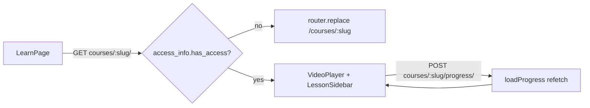
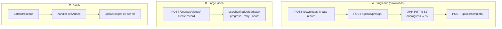

# Courses, Downloads & Media Library — src

# Courses, Downloads & Media Library (`frontend-customer/src`)

This module is the content half of the tenant portal: everything a coach uploads and everything a student consumes. It spans three distinct surfaces built on one set of shared types and one shared admin toolkit:

| Surface | Routes | Audience |
|---|---|---|
| Public catalog | `(public)/courses`, `(public)/courses/[slug]` | Anonymous visitors + logged-out students |
| Player | `(student)/learn/[slug]` | Enrolled students |
| Admin library | `admin/courses`, `admin/courses/new`, `admin/courses/[slug]`, `admin/downloads`, `admin/photos`, `admin/videos` | The coach (tenant owner) |

All four asset kinds — courses, downloadable files, photos, videos — are managed through the same generic `MediaBrowser` shell, and the same tagging/filtering primitives. Understanding `MediaBrowser` + `InlineEditPanel` + the presign upload dance gets you ~80% of the admin code.

---

## Data model (`src/types/`)

The TypeScript types mirror the Django serializers in `apps.courses`, `apps.downloads`, `apps.media`, `apps.tags`, and `apps.filters`. They are hand-maintained, *not* the generated `src/types/api-generated.ts` — if you change a backend serializer, update these too.

### Course hierarchy — `types/course.ts`

```
Course  ──(CourseDetail extends)──▶  Module[]  ──▶  Lesson[]
```

- **`Course`** — list-shape. Carries `slug` (the API identity, not `id`), `pricing_type: "free" | "paid" | "subscription"`, denormalized counts (`lesson_count`, `enrolled_count`), and optional `access_info` (from `types/billing`).
- **`CourseDetail extends Course`** — adds `modules`, `is_enrolled`, and `unlock_options` (`{ purchase?, bundles?, plans? }`) which drives the paywall on the public detail page.
- **`Lesson`** — note the two video fields: `video_url` is the raw S3 key/URL, `video_signed_url` is the short-lived presigned URL the `<video>` element actually consumes. The same split exists on `Course.thumbnail_url` vs `thumbnail_signed_url`. **Always render the signed URL with the raw one as fallback** — every render site in this module does `signed_url || url`.
- **`Progress`** — one row per `{student, lesson}`: `completed` + `watched_seconds`.

### Two independent taxonomies

This trips people up: courses (and live events) carry **both** classification systems, and they are unrelated.

- **`FilterGroup` / `FilterOption`** (`apps.filters`) — coach-defined *faceted* filters, structured and student-facing. A group has `applies_to: "course" | "event" | "both"`; options belong to a group. Surfaced publicly via `FacetPills`.
- **`Tag`** (`apps.tags`) — flat free-text labels scoped to a content-type pool (`TagScope = "course" | "video" | "photo" | "download" | "event"`). **Admin-only** — used solely to organize the library. Surfaced via `TagInput` (write) and `TagFilterBar` (read/filter).

Write-side, both use an id-array convention: `filter_option_ids` and `tag_ids` on PUT/PATCH bodies, while reads return the full `filter_options` / `tags` objects. Every admin edit path therefore maps back down before opening an editor:

```ts
item={{ ...dl, tag_ids: (dl.tags ?? []).map((t) => t.id) }}
```

### Assets — `types/download.ts`, `types/photo.ts`

`DownloadFile` is monetizable (`pricing_type` + `price` + `access_info`) and tracks `download_count`. `Photo` is a pure library asset — no pricing — with a **string `id`** (UUID) while downloads/videos/courses use numeric ids or slugs. `VideoItem` is declared locally inside `admin/videos/page.tsx` rather than in `types/` (it has no public-facing consumer).

---

## Public catalog

### `/courses` — block-driven, not hardcoded

`(public)/courses/page.tsx` renders nothing course-specific itself. It resolves the tenant, reads the coach's page composition, hydrates any dynamic blocks, and hands off:

```ts
const config = await fetchTenantConfig(slug);
const blocks = config?.pages?.courses?.blocks ?? [];
const dynamicData = await fetchDynamicData(blocks);
return <PageView pageKey="courses" blocks={blocks} dynamicData={dynamicData} … />;
```

The actual grid comes from `CourseGridBlock` → `CourseCatalogClient`. So **to change how the catalog looks, edit `CourseCatalogClient` / `CourseCard`, not this route.**

### `CourseCatalogClient` + `FacetPills`

`CourseCatalogClient` is fully client-side filtering over an already-fetched `Course[]` — there is no pagination or server round-trip here. Three filter layers compose:

1. Free-text `search` over `title` and `instructor_name`.
2. A pricing pill: `all | free | paid | accessible`. The `accessible` ("My Courses") pill only appears when the student actually has access to at least one non-free course.
3. Coach-curated facets via `matchesFacets`.

`facet-pills.tsx` holds the pure filtering logic, shared with `EventsCatalogClient`:

- **`buildFacets(items, groupIds)`** — derives facet rows from the options actually present on the items, restricted to (and ordered by) `groupIds`. **Empty `groupIds` → no facets**: facets are opt-in per block, so a coach who hasn't configured any sees a clean catalog.
- **`matchesFacets(item, selected)`** — **OR within a facet, AND across facets**. This is the semantics to preserve if you touch it.

`CourseCard` has four visual variants (`elevated | bordered | minimal | overlay`) selected by the block config; `overlay` uses a different DOM shape (caption over the thumbnail), the other three share `stackedWrapper`. Price rendering is delegated to `PriceBadge`, which reads `access_info` — don't reimplement price/access logic in cards.

### `/courses/[slug]` — server-rendered detail

`force-dynamic` server component fetching via `serverFetch` (which attaches `X-Tenant-Domain`; see the multi-tenancy notes in CLAUDE.md). A failed fetch is swallowed into a "Course not found" empty state rather than throwing — a 404 and a 500 look identical to the visitor.

It computes curriculum totals locally (`getTotalDuration`, `formatTotalDuration`) and renders the full lesson list to *everyone* — locked lessons show a `Lock` icon, `is_free_preview` lessons show `Play` + a "Free Preview" badge. Purchase/unlock is entirely `EnrollButton`'s job.

---

## Student player — `/learn/[slug]`

A client component orchestrating two independent loads and a small progress state machine.



Key behaviours:

- **Access gate is client-side redirect, not an error.** `loadCourse()` checks `data.access_info && !data.access_info.has_access` and `router.replace`s to the marketing page where unlock options live. The backend still enforces access — this is UX, not security.
- **Progress is a map, refetched after every write.** `loadProgress()` collapses `Progress[]` into `Record<lessonId, Progress>`; `VideoPlayer` calls `onProgressUpdate` → `loadProgress()` rather than mutating locally. Simple, at the cost of an extra GET per report.
- **`overallProgress`** is completed-lessons ÷ total-lessons, not watch-time weighted.
- **Auto-play** advances to the next lesson in the flattened `allLessons` order after a 1.5s delay, gated on the `autoPlay` toggle owned by `LearnPage` and rendered in `LessonSidebar`.

### `VideoPlayer` reporting rules

Two triggers, both funnelling into `reportProgress(watchedSeconds, completed)`:

- `timeupdate` — throttled via `lastReportedRef` to **one POST per 10 seconds of playhead movement**. Marks `completed` once `currentTime / duration_seconds >= 0.9`.
- `ended` — reports completion (if not already complete) and fires `onLessonComplete`.

`lastReportedRef` resets to 0 in the effect, so switching lessons re-arms the throttle. If `lesson.video_signed_url` is null the component renders a placeholder instead of a `<video>` — a lesson with an unattached video is a valid state, not an error.

---

## Admin library

### The shared shell: `MediaBrowser`

All four admin list pages (`courses`, `downloads`, `photos`, `videos`) are thin configuration around `MediaBrowser<T>`. The contract:

| Prop | Role |
|---|---|
| `fetchPage(params: FetchPageParams) → FetchPageResult<T>` | You build the query string; MediaBrowser owns `limit`/`offset`/`ordering`/`search` |
| `getItemId` | Identity for selection & delete — `slug` for courses, `id` elsewhere |
| `persistKey` | Persists view mode/sort per list |
| `filterSlot` + `filterKey` | Extra filter UI (always a `TagFilterBar` here); `filterKey` is the reload trigger |
| `renderGalleryItem` / `renderListRow` / `renderExpandedRow` | The three render modes |
| `onDelete(selection: BulkSelection)` | Bulk delete |
| `ref: MediaBrowserHandle` | `refresh()` after any mutation |

Two rules that are easy to get wrong when adding a page:

1. **`filterKey` must change when your external filter changes** (`filterKey={tagFilter.join(",")}`), or the list won't reload. `fetchPage` being a new closure is not enough.
2. **`selection.mode === "all"` means "everything matching the current query", not "the loaded page".** Downloads, photos and videos each hand-roll a paginate-to-collect-ids loop (limit 100 until `next` is null) before batch-deleting. Courses currently do *not* — `handleBulkDelete` only uses `selection.ids`, so a select-all delete there only deletes loaded rows. Worth knowing before you rely on it.

Deletes go through `batchedAsync` from `lib/api-client` (concurrency-limited fan-out), then `browserRef.current?.refresh()`.

### Inline editing: `InlineEditPanel` + `FieldConfig`

Row-level edits open inside `renderExpandedRow`, driven by a declarative `FieldConfig<T>[]`:

```ts
const courseFields: FieldConfig<Course>[] = [
  { key: "title", label: "Title", type: "text", required: true },
  { key: "pricing_type", label: "Pricing", type: "select", options: [...] },
  { key: "price", type: "number", showWhen: (v) => v.pricing_type === "paid" },
  { key: "is_published", type: "toggle" },
  { key: "thumbnail_id", type: "image", previewUrlKey: "thumbnail_signed_url" },
];
```

Field types in use across this module: `text`, `textarea`, `number`, `select`, `toggle`, `image` (renders `PhotoPicker`), `tags` (renders `TagInput`, needs `tagScope`). `showWhen` gives conditional fields; `previewUrlKey` points the image field at the signed-URL companion field.

Saves are always wrapped in `useAsyncAction(..., { errorToast })`, which supplies the loading flag passed back into the panel as `saving`. **The HTTP verbs are inconsistent across pages** — courses and photos and videos PUT, downloads PATCH. Match the existing page rather than assuming.

### `CourseForm` — the one genuinely stateful component

`components/admin/course-form.tsx` backs both `/admin/courses/new` and `/admin/courses/[slug]`, branching on `isCreate = !initialCourse`. The two modes differ fundamentally in how the curriculum is persisted:

- **Create mode** — modules and lessons are held in local state (`localModules: LocalModule[]`, keyed by a `tempId` from `Date.now()`) and submitted as a **single nested POST** to `/api/v1/courses/` with a `modules: [{ title, lessons: [...] }]` payload. No API call happens until the user hits save; owned children stay local until one atomic submit. On success it `navigate(...)`s to the edit route.
- **Edit mode** — every module/lesson operation is its own request against nested endpoints (`POST …/modules/`, `POST …/modules/{id}/lessons/`, `PUT …/lessons/{id}/`), each followed by `loadCourse()` to re-sync. `loadCourse` also calls `onCourseLoaded?.()`, which the detail page uses (`refreshCourse`) to update its header badge **without re-showing the skeleton**.

So there are two parallel lesson editors — `addLocalLesson` / `saveLocalLessonEdit` / `removeLocalLesson` for create mode, and `handleCreateLesson` / `handleSaveLesson` for edit mode — both driven by the same `newLesson: NewLessonState` scratch object (`EMPTY_LESSON` resets it). When adding a lesson field, add it in both paths.

Media and taxonomy are delegated: `PhotoPicker` (thumbnail), `VideoPicker` (per-lesson video), `FilterPicker` (`filterOptionIds`), `TagInput` (`tagIds`), `RichEditorProvider`/`useRichEditor` for `content_html`, rendered back through `RichHtml`.

### Upload paths — there are three



**A — `admin/downloads/page.tsx`.** Record first, then presign with `{ filename, content_type, category: "download", download_id }`, then a raw `XMLHttpRequest` PUT (used instead of `fetch` purely to get `upload.onprogress`), then `/upload/complete/` with the same `s3_key` + `download_id`. If you add a new uploadable content type, the `category` string must be recognised by the backend presign view in `apps.media`.

**B — `admin/videos/page.tsx`.** Only the *record creation* step is wrapped in `useAsyncAction`; the chunked transfer is owned by `useChunkedUpload()`, which surfaces its own `state.uploading / state.progress / state.error` plus `retry()` and `abort()` and is deliberately left outside the standard loading conventions. Duration is extracted client-side before upload via `extractDuration(file)` (loads the file into a detached `<video>` and reads `loadedmetadata`), and the title is pre-filled from `stripExtension(file.name)`. Remember `URL.revokeObjectURL` on the preview — `clearUpload()` handles it.

**C — `BatchDropzone`**, mounted unconditionally on the photos and videos pages, takes a `category` and calls back `onUploadComplete → refresh()`. This is the path in the traced execution flows (`PhotosPage → BatchDropzone → handleFilesAdded → uploadSingleFile → clientFetch`).

`PhotoPicker` and `VideoPicker` reuse `uploadToPresignedUrl` from `media-picker-base.tsx`, so picker-embedded uploads share one implementation.

### Photos & videos as a CDN library

Beyond CRUD, both pages expose "copy CDN link" and "copy HTML embed" actions writing to `navigator.clipboard` — the embed being a literal `` / `<video controls …>` snippet — plus a `LightboxModal` preview driven by a `MediaItemPayload` (`{ id, title, type, url, s3_key, file_size, created_at }`). These URLs are **presigned and therefore expire**; the copy action is a convenience for pasting into rich content, not a permanent asset URL.

---

## Cross-cutting conventions

- **Fetching** — `clientFetch` (client components) and `serverFetch` (server components) from `lib/api-client` / `lib/api-server`. Never call `fetch` directly; the tenant header and `ApiError` normalization live in there.
- **Async actions** — `useAsyncAction` from `@shared/hooks/use-async-action` for every mutating handler: gives `{ run, loading }`, a double-submit guard, and an `errorToast`. Feed `loading` into `<Button loading>` / `InlineEditPanel saving`.
- **Loading** — `PageState` with a skeleton for client-page initial loads (`admin/courses/[slug]`), `loading.tsx` per route segment (`learn/[slug]/loading.tsx`, `admin/courses/[slug]/loading.tsx`) built from `@/components/ui/skeletons` presets. `scripts/check-loading-patterns.mjs` in `make lint` enforces both.
- **Outcomes** — sonner toasts, never inline banners.
- **Formatting** — `formatDuration`, `formatFileSize`, `formatDate` from `lib/format`; file-type icons from `lib/file-icons` (`getFileIcon`, `getExtension`).
- **Demo content** — `DemoBadge` is rendered next to every admin item title (`type="courses" | "downloads" | "photos" | "videos"`); it pulls seeded-demo status from `lib/setup-assistant`, which is why the traced flows show `AdminCoursesPage → DemoBadge → useDemoContent → clientFetch`.
- **Monetization nudges** — `MonetizeNudge` appears next to price inputs on downloads and in `CourseForm`.

One deviation to be aware of: the public `CourseCard` and several admin pages import `Link` from `next/link` directly rather than the `NavLink` / `useNavigate` wrappers the repo conventions call for. `CourseForm` does use `useNavigate()`. If you touch navigation in these files, prefer moving toward `NavLink`.

---

## API surface used by this module

```
GET    /api/v1/courses/?limit&offset&ordering&search&tags
POST   /api/v1/courses/                       # supports nested modules[].lessons[]
GET    /api/v1/courses/{slug}/
PUT    /api/v1/courses/{slug}/
DELETE /api/v1/courses/{slug}/
GET    /api/v1/courses/{slug}/progress/       # Progress[]
POST   /api/v1/courses/{slug}/progress/       # {lesson, watched_seconds, completed}
POST   /api/v1/courses/{slug}/modules/
POST   /api/v1/courses/{slug}/modules/{moduleId}/lessons/
PUT    /api/v1/courses/{slug}/lessons/{lessonId}/
GET/POST/PUT/DELETE  /api/v1/courses/videos/[{id}/]
GET/POST/PATCH/DELETE /api/v1/downloads/[{id}/]
GET/PUT/DELETE       /api/v1/photos/[{id}/]
POST   /api/v1/upload/presign/                # {filename, content_type, category, <fk>_id}
POST   /api/v1/upload/complete/               # {s3_key, category, <fk>_id}
```

Note that videos live under `/api/v1/courses/videos/` (owned by `apps.courses`), while photos and downloads have their own top-level resources.

---

## Adding a new asset type — checklist

1. Add the type to `src/types/` (or locally, if it has no public consumer) with both `x_url` and `x_signed_url` if it's S3-backed, plus `tags` / `tag_ids`.
2. Add a `TagScope` value and make sure the backend `apps.tags` pool accepts it.
3. Create `admin/<thing>/page.tsx`: `SORT_OPTIONS`, a `fetchPage` closing over `tagFilter`, `MediaBrowser` with `filterSlot={<TagFilterBar scope=… />}` and `filterKey={tagFilter.join(",")}`, a `FieldConfig[]` for `InlineEditPanel`, and a `select-all`-aware `onDelete`.
4. Add a `loading.tsx` for the segment.
5. If uploadable, register the `category` string on the backend presign/complete views and reuse `BatchDropzone` or `useChunkedUpload` rather than writing a new XHR loop.
6. Run `npm run gen:api` in `frontend-customer` and review the `api-generated.ts` diff; run `make lint` (loading-pattern + e2e-map self-checks) and `make typecheck`.