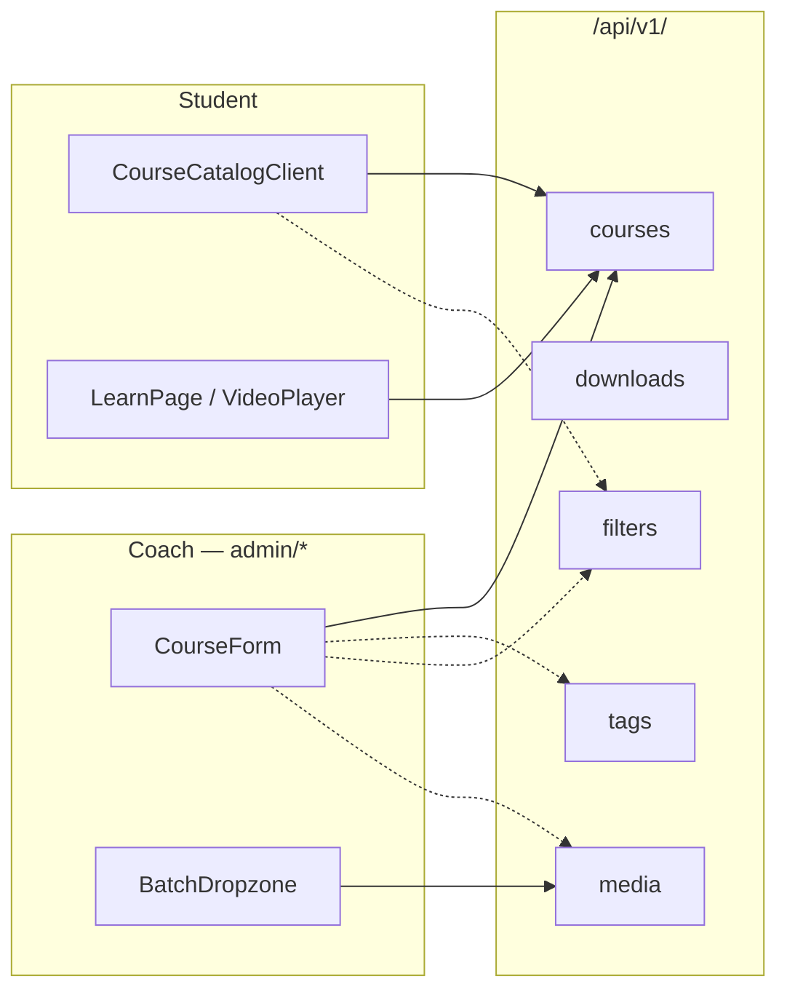

# Courses, Downloads & Media Library

# Courses, Downloads & Media Library

The content layer of a Contentor tenant, end to end: the five per-tenant Django apps that store and gate what a coach publishes, and the tenant-portal surfaces that let coaches manage it and students consume it.

| Sub-module | Covers |
|---|---|
| [Backend apps](courses-downloads-media-library-backend-apps.md) | `courses`, `downloads`, `media`, `filters`, `tags` — models, serializers, access gating, mount points under `/api/v1/` |
| [Frontend (`frontend-customer/src`)](courses-downloads-media-library-frontend-customer-src.md) | Public catalog, student player, and the `admin/*` library screens |

Both halves are strictly per-tenant. The backend relies on `django-tenants` setting the Postgres `search_path` (no tenant FK on any model); the frontend relies on `X-Tenant-Domain` reaching Django through `clientFetch` in `src/lib/api-client.ts`. Neither side carries a tenant identifier in its own data.

## How the halves meet

Three cross-cutting contracts do most of the work:

**Taxonomy is shared, not duplicated.** `tags` and `filters` are standalone apps consumed by the others — `CourseCreateUpdateSerializer` delegates to `tag_ids_field` from `apps/tags/serializers.py`, and on the frontend the same `TagInput` / `FilterPicker` components appear inside `CourseForm` while `TagFilterBar` drives both `AdminDownloadsPage` and `PhotosPage`. Facets a coach assigns in the admin library are the same facets `FacetPills` renders in the public catalog.

**Media is a library, not a per-course upload.** `media` owns photos and videos as first-class tenant assets. `MediaPickerBase` and `uploadToPresignedUrl` handle the browser→object-store leg for every kind of asset; `BatchDropzone` reuses that path for bulk drops on `admin/photos` and `admin/videos`. Courses then *reference* library items — `PhotoPicker` inside `CourseForm` selects an existing photo rather than uploading a new one — which is why a cover image can be swapped without touching the course.

**One generic admin toolkit, four asset kinds.** `MediaBrowser`, `LightboxModal`, and the shared picker base are kind-agnostic; courses, downloads, photos, and videos differ mainly in which endpoint they point at.

## Key workflows

**Publishing a course.** Coach uploads videos on `admin/videos` (chunked via `use-chunked-upload`, duration extracted client-side by `extractDuration`) → builds structure in `CourseForm` on `admin/courses/[slug]`, attaching lessons, a cover from `PhotoPicker`, and tags/filters → the `courses` API persists modules and lessons, resolving tag IDs through the `tags` app.

**Browsing and buying.** `CourseCatalogClient` renders `CourseCard`s and narrows them with `FacetPills` backed by `filters`; `courses/[slug]/page.tsx` is the server-rendered detail page (`formatTotalDuration` sums lesson durations for the syllabus).

**Learning.** `LearnPage` at `(student)/learn/[slug]` gates on enrollment server-side, mounts `VideoPlayer`, and round-trips progress — `loadProgress` on mount, `handleProgressUpdate` as playback advances — against the `courses` progress endpoints.

**Delivering files.** `downloads` serves gated files independently of courses; `AdminDownloadsPage` manages them with the same tag-filtering and row-action patterns as the media screens.

## Things worth knowing before editing

- Changing any serializer here moves the frontend contract — regenerate with `npm run gen:api` in `frontend-customer` and read the `src/types/api-generated.ts` diff.
- `tags` and `filters` are the highest-fan-in pieces in this group; a change there touches courses, downloads, and both media screens at once.
- Admin upload paths run through `clientFetch`, so failures surface as `ApiError` from `src/types/api.ts` rather than raw fetch rejections — error handling belongs at that boundary, not in each page.
