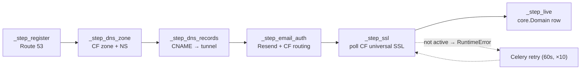
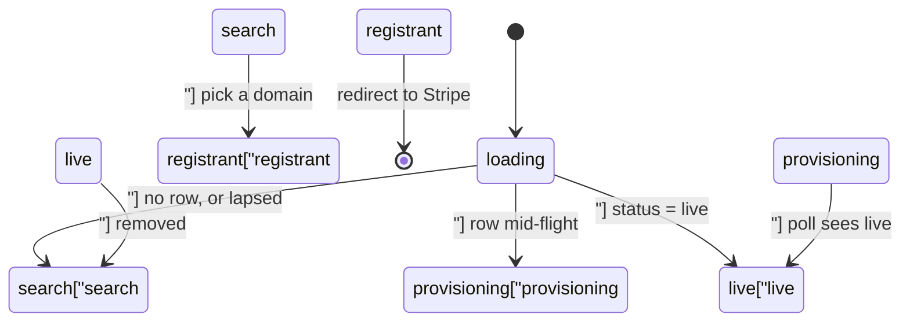

# Custom Domains

# Custom Domains (`apps.domains`)

Lets a coach buy a real domain (`yourbrand.com`) through Contentor and have their tenant site served on it, instead of the default `<slug>.contentor.app` subdomain. The module owns the whole lifecycle: availability search → priced checkout → domain registration → DNS zone → DNS records → email authentication → SSL → registration as a `django-tenants` domain → yearly renewal or lapse.

Everything here lives in the **public schema** (`apps.domains` is a SHARED_APP). Tenants are referenced by FK to `core.Tenant`, never resolved from `connection.schema_name` inside the service layer — this is what lets the same code serve both tenant-schema requests and public-schema account requests (see [Two mountings](#two-mountings-tenant-scoped-vs-account-scoped)).

---

## Data model (`models.py`)

**`CustomDomain`** — one row per purchased domain, the provisioning state machine's carrier.

| Group | Fields | Notes |
|---|---|---|
| Identity | `tenant`, `domain` (unique), `is_primary` | `domain` is globally unique across the platform |
| Registrar | `registrar` (default `route53`), `registrar_status`, `contact` (JSON) | `contact` is the raw Route 53 contact dict |
| External ids | `cloudflare_zone_id`, `resend_domain_id` | also serve as per-step idempotency markers |
| Mail | `forward_to_email`, `mailbox_local_part`, `mailbox_enabled` | drives Cloudflare Email Routing (worker vs. forward) |
| Money | `cost_minor` (registrar wholesale, USD), `price_minor` (coach-facing), `currency`, `fx_rate` | see [Pricing](#pricing) |
| State | `provisioning_status`, `failed_step`, `dns_records_done`, `expires_at`, `auto_renew` | statuses in `PROVISIONING_STATUSES` |

**`DomainSubscription`** — 1:1 with `CustomDomain`, mirrors the annual Stripe subscription (`provider_subscription_id` is indexed because webhooks look up by it).

**`PlatformMailboxAddress`** — a separate concern that happens to live here: a public-schema registry claiming `<local_part>@PLATFORM_MAIL_DOMAIN` for one tenant (`OneToOne`), with `local_part` unique platform-wide. Rows are deliberately **kept when a subscription lapses** — the address stops resolving (identity/webhook code checks the plan) but stays reserved so another tenant can't snipe it; freeing it is a superadmin action. `RESERVED_MAILBOX_LOCAL_PARTS` blocks RFC role addresses (`postmaster`, `abuse`, …), platform-operated names, and abuse-prone ones.

---

## Pricing

`pricing.compute_price(cost_minor_usd, currency) -> (price_minor, fx)`:

```
price = ceil(cost_usd × DOMAINS_FX_RATES[currency] × DOMAINS_MARKUP_MULTIPLIER)
```

rounded **up to a whole currency unit** (a multiple of 100 minor units), so coaches always see `€29.00`, never `€28.37`. An unknown currency falls back to the `USD` rate. Both the resulting price and the fx rate used are persisted on the row so a later rate change doesn't retroactively alter what the coach agreed to.

---

## Provider layer — three ports, each with a fake

The module talks to three external systems, and each one is an ABC + real client + offline double, chosen by a package-level factory that keys off `settings.DOMAINS_BYPASS_ENABLED`:

| Port | ABC | Real | Offline | Factory |
|---|---|---|---|---|
| Registrar | `registrar/base.Registrar` | `Route53Registrar` | `BypassRegistrar` | `get_registrar()` |
| DNS | `cloudflare/base.Cloudflare` | `CloudflareClient` | `FakeCloudflare` | `get_cloudflare()` |
| Email auth | `email_auth/base.ResendDomains` | `ResendDomainsClient` | `FakeResendDomains` | `get_resend_domains()` |

The real client is imported *inside* the factory, so a bypass environment never imports `boto3`/`requests` config it doesn't have. Every port raises one exception type carrying a `code` — `RegistrarError`, `CloudflareError`, `ResendError` — so callers never see a raw SDK traceback.

`BypassRegistrar` is deterministic rather than random: a domain is "taken" iff its name contains the substring `taken`, price is fixed at `$9.99`, and `suggest()` returns `<stem>1.com … <stem>N.com`. E2e and unit tests rely on that contract.

### Route 53 specifics worth knowing

- The client is built lazily behind a `client` property and **pinned to `us-east-1`** — Route 53 Domains is a global service with a single endpoint, so a general `AWS_REGION` like `eu-central-1` would point at a nonexistent host.
- Client construction is wrapped separately from calls: partial credentials (a common failure — `AWS_ROUTE53_ACCESS_KEY_ID` set without the secret) surface as `RegistrarError(code="REGISTRAR_MISCONFIGURED")` → HTTP 502, not an opaque 500.
- `_wrap()` translates any other SDK exception into `RegistrarError`; it re-raises `RegistrarError` untouched so codes aren't flattened.
- We register with `AutoRenew=False` — renewal is driven by Stripe (`invoice.paid`), not by AWS.
- `renew()` must read `get_domain_detail` first because `RenewDomain` requires `CurrentExpiryYear`.

---

## The provisioning pipeline



`provision(cd)` in `provisioning.py` walks `_STEPS`, a list of `(status_after, function_name)` pairs. Before each step it writes the status and clears `failed_step`; on any exception it writes `provisioning_status="failed"`, `failed_step=<status>`, logs, and re-raises. Reaching the end writes `live`.

Two design details that matter when you edit this file:

1. **Steps are resolved via `globals()[step_name]` at call time**, not captured as function objects. This is deliberate so tests can monkeypatch `provisioning._step_register = boom` and have `provision()` pick it up. If you refactor `_STEPS` to hold callables directly, you break every failure test.
2. **Each step is individually idempotent** via a persisted marker — `registrar_status == "registered"`, a non-empty `cloudflare_zone_id`, `dns_records_done`, a non-empty `resend_domain_id`. `_step_live` uses `get_or_create`. `provision()` itself short-circuits when already `live`. This is what makes the Celery retry safe: a retry after an SSL timeout re-enters at step 1 and no-ops its way back down.

What each step actually does:

- **register** — `Registrar.register(domain, contact, nameservers=[])`. Nameservers are empty here on purpose; they're set in the next step once Cloudflare hands them to us.
- **dns_zone** — creates the Cloudflare zone, stores the id, then `set_nameservers()` on the registrar to point the domain at Cloudflare.
- **dns_records** — proxied `CNAME` for both apex and `www.` pointing at `settings.CLOUDFLARE_TUNNEL_HOSTNAME` (falls back to `tunnel.contentor.app`). This is what routes the domain into the home-server Cloudflare tunnel → Caddy → `nextjs-customer`.
- **email_auth** — creates the Resend domain, then writes each returned SPF/DKIM/MX record into the zone **unproxied** (`proxied=False` — proxying a TXT/MX record would break verification). Then enables Cloudflare Email Routing: bound to `CLOUDFLARE_EMAIL_WORKER_NAME` if `mailbox_enabled`, otherwise a plain forward to `forward_to_email`, otherwise skipped.
- **ssl** — polls; raises `RuntimeError("SSL not yet active")` when pending. This is the expected path, not an error — the raise exists so Celery retries.
- **live** — creates the `apps.core.Domain` row, which is what `django-tenants` / `HeaderAwareTenantMiddleware` uses to resolve the Host header to this tenant. Until this row exists, the domain resolves to the public schema.

### Tasks (`tasks.py`)

- `provision_domain(custom_domain_id)` — `bind=True, max_retries=10, default_retry_delay=60`. Catches everything and calls `self.retry()`; the ~10-minute retry envelope is sized for SSL issuance.
- `renew_domain(custom_domain_id)` — calls `Registrar.renew()` and pushes `expires_at` out 365 days (from the existing expiry, or from now if unset).

---

## Stripe webhooks (`webhooks.py`)

Domain events ride the **same Stripe endpoint as the rest of billing**: `apps.billing.views.webhooks.stripe_webhook` calls `handle_domain_event(event)`, which returns `True` if the event belonged to a domain subscription and was consumed, `False` otherwise. The one-way dependency is load-bearing — `apps.billing.views.webhooks` imports this module, so **never import from `apps.billing.views.webhooks` here** (there's a comment on `_subscription_id_from_obj` saying exactly that).

Resolution order in `_resolve_custom_domain`:

1. `metadata["domains_custom_domain_id"]` — set by `billing.create_domain_checkout` on both the Checkout Session *and* `subscription_data`, so it survives onto the subscription object.
2. Fall back to subscription id → `DomainSubscription` lookup, for invoice events whose metadata lives on the subscription rather than the invoice.

`_subscription_id_from_obj` handles three shapes of the invoice→subscription link: the object's own `id` (subscription events), the legacy top-level `subscription` field (string *or* expanded dict), and the newer `parent.subscription_details.subscription`.

Handled events:

| Event | Effect |
|---|---|
| `checkout.session.completed` | subscription → `active`, store provider ids, enqueue `provision_domain` **inside `transaction.on_commit`** |
| `customer.subscription.created` / `.updated` | store ids; `active`/`trialing` → `active` |
| `customer.subscription.deleted` | delete the `core.Domain` row, domain → `lapsed`, subscription → `canceled` |
| `invoice.paid` | enqueue `renew_domain` **only if** the domain is already `live` (the first invoice must not trigger a renewal) |
| `invoice.payment_failed` | subscription → `past_due` |

The `on_commit` wrapper is not cosmetic: enqueuing inline would let a provisioning task run against a domain whose activation transaction later rolled back.

---

## HTTP API

### Two mountings: tenant-scoped vs account-scoped

`views.py` is deliberately split. The middle section holds tenant-agnostic core functions — `_search_response`, `_checkout_response`, `_current_response`, `_retry_response`, `_destroy_response` — that take an **explicit** tenant and only touch public-schema models plus the provider services. Two thin view layers wrap them:

| Layer | Mount | Tenant resolution | Permission |
|---|---|---|---|
| `search` / `checkout` / `current` / `retry` / `destroy` | `/api/v1/domains/*` (this app's `urls.py`) | `connection.tenant` — request already ran through tenant routing | `IsCoachOrOwner` |
| `account_*` | `/api/v1/me/tenants/<slug>/domain/*` (routed from `apps.core.me`) | `_owned_tenant()` — `slug` + `owner_email__iexact` of the JWT user | `IsAuthenticated` + ownership check |

The account variants exist because the coach dashboard lives on the **apex** (`contentor.app`), which resolves to the public schema, so the coach's public JWT is what authenticates. They're the ones the frontend actually uses. A slug the requester doesn't own returns `404`, not `403`.

### Endpoints

| Method / path (tenant-scoped) | Behaviour |
|---|---|
| `GET search/?q=` | `_normalize_query` → availability + suggestions, each priced via `_priced` |
| `POST checkout/` | re-check availability, price, create `CustomDomain` + `DomainSubscription` in one transaction, open Stripe Checkout |
| `GET ` (root) | latest `CustomDomain` for the tenant, or `null` |
| `POST <pk>/retry/` | re-enqueue `provision_domain`; `409 NOT_FAILED` unless status is `failed` |
| `DELETE <pk>/` | tear down (below) |

Input handling worth calling out:

- **`_normalize_query`** — coaches type a brand, not a FQDN, and Route 53 raises `InvalidInput` on a bare keyword. It lowercases, strips `https://`/`http://`/`www.`, drops any path, and appends `.com` when there's no dot.
- **`_safe_return_path`** — the checkout success/cancel URLs are built as `_apex_origin() + return_path`, so this rejects anything that isn't a single-leading-slash relative path (blocks `//evil.com`, backslashes, and query strings). Bad input → `400 BAD_RETURN_PATH`.
- **`_registrar_error_response`** — logs the full registrar/AWS text but returns only `{"error": <code>, "detail": "Domain service is temporarily unavailable."}` with `502`. Raw Route 53 errors can leak account details and must not reach the client.
- **Checkout rollback** — if `create_domain_checkout` raises `ProviderError`, the just-created `CustomDomain` is deleted (cascading to `DomainSubscription`) so a failed Stripe call doesn't leave an orphan row squatting the unique `domain`.
- **Currency** — `_currency(tenant)` prefers `tenant.billing_currency`, falling back to `DOMAINS_DEFAULT_CURRENCY`.

**Teardown (`_destroy_response`)** deletes the `core.Domain` row first (the site immediately falls back to its `contentor.app` address), marks the domain `lapsed`, then makes a **best-effort** Stripe cancellation — wrapped in a bare `except` on purpose, because the tenant-visible part of the teardown has already succeeded and must not be undone by a Stripe hiccup. The registered domain itself is not released at the registrar; it simply stops auto-renewing.

### Checkout (`billing.py`)

`create_domain_checkout` builds an inline-priced Stripe Checkout Session (`mode="subscription"`, `recurring.interval="year"`, `price_data` from `custom_domain.price_minor`/`currency`) — no pre-created Stripe Price object, since every domain has its own price. Under `DOMAINS_BYPASS_ENABLED` it returns a synthetic `CheckoutSession` pointing straight at `success_url?bypass=1&custom_domain_id=…`, so the wizard can be walked end-to-end offline. Note it uses `settings.STRIPE_SECRET_KEY` — the **platform** account, not a Connect account: the coach is buying from us, not from a student buying from the coach.

---

## Frontend (`frontend-main`)

The coach-facing flow lives on the marketing app under `/dashboard/domain/[slug]`.

**BFF layer** — `src/app/api/tenants/[slug]/domain/**/route.ts` (four handlers: `search`, `checkout`, `status`, `[id]`, `[id]/retry`). Each reads the httpOnly JWT cookie, forwards to the corresponding `/api/v1/me/tenants/<slug>/domain/…` endpoint with `Authorization: Bearer` and `X-Tenant-Domain: BASE_DOMAIN`. That header is mandatory — Node's undici drops a custom `Host`, and without `X-Tenant-Domain` Django resolves to the public schema (which is what these account endpoints want, hence `BASE_DOMAIN` rather than the tenant host). `status` and `search` set `cache: "no-store"`.

Note the BFF path `/status` maps to the Django *root* endpoint (`current`), and `DELETE` passes a bare `204` through without a JSON body.

**Client wrapper** — `src/lib/domains.ts` exports the typed calls (`searchDomains`, `startCheckout`, `getDomainStatus`, `retryProvision`, `removeDomain`), a shared `jsonOrThrow` that surfaces `detail || error`, and `formatPrice` (an `Intl.NumberFormat` currency format with a plain-string fallback for unknown codes). The `x-tenant-host` header it sends is consumed by nothing downstream — the route handlers override it with `X-Tenant-Domain` — so treat it as vestigial rather than as the tenant signal.

**Wizard** — `wizard.tsx` is a client component with a `Phase` state machine: `loading → search | provisioning | live`, plus `registrant` in between.



On mount it calls `getDomainStatus` and jumps straight to wherever the coach left off — critical, because the Stripe redirect returns them to this same page and the row already exists.

- `DomainSearch` — query form → results + suggestions, `Skeleton` rows while loading.
- `RegistrantForm` — collects the Route 53 contact. It assembles `PhoneNumber` as `+<dial>.<digits>` (Route 53's required format) from a friendly country/dial-code/number trio, and infers `ContactType` as `COMPANY` when an organization is given. `splitName` seeds first/last from the account name.
- `ProvisioningStatus` — a 3-second `setTimeout` poll (not `setInterval`) that renders the six `STEPS` as a checklist against `provisioning_status`. It stops polling on `live` (calling `onLive` via a ref so a changing callback doesn't restart the effect) and on `failed`, where it offers a Retry button that bumps `pollKey` to restart the loop. Transient fetch errors are swallowed and polling continues.
- `DomainManageCard` — price + renewal date, with a two-step inline confirm before `removeDomain`.

All async buttons go through `useAsyncAction` and `<Button loading>`, per the repo's loading conventions; `loading.tsx` supplies the route skeleton.

---

## Superadmin (`admin_panels.py`)

`CustomDomain` and `DomainSubscription` are registered on `platform_site` (the superadmin SPA's admin-kit site) with `can_delete = False` and effectively every field in `readonly_fields`. That's intentional: these rows mirror state in Route 53, Cloudflare, Resend, and Stripe, so hand-editing them silently desynchronizes the platform from the outside world. Use the provisioning pipeline and the retry endpoint instead.

---

## Settings

| Setting | Used by |
|---|---|
| `DOMAINS_BYPASS_ENABLED` | all three provider factories, `create_domain_checkout`, Stripe teardown |
| `DOMAINS_FX_RATES`, `DOMAINS_MARKUP_MULTIPLIER`, `DOMAINS_DEFAULT_CURRENCY` | `compute_price`, `_currency` |
| `AWS_ROUTE53_ACCESS_KEY_ID` / `AWS_ROUTE53_SECRET_ACCESS_KEY` | `Route53Registrar` |
| `CLOUDFLARE_API_TOKEN`, `CLOUDFLARE_ACCOUNT_ID` | `CloudflareClient` |
| `CLOUDFLARE_TUNNEL_HOSTNAME` | `_step_dns_records` (CNAME target) |
| `CLOUDFLARE_EMAIL_WORKER_NAME` | `_step_email_auth` (worker vs. forward routing) |
| `RESEND_API_KEY` | `ResendDomainsClient` |
| `STRIPE_SECRET_KEY` | domain checkout + best-effort cancellation |
| `CONTENTOR_DOMAIN`, `SITE_SCHEME` | `_apex_origin()` for Stripe redirect URLs |

---

## Local development and testing

Set `DOMAINS_BYPASS_ENABLED=true` and the entire pipeline runs with zero external calls: `BypassRegistrar` + `FakeCloudflare` + `FakeResendDomains`, and checkout returns a URL that lands directly on the success page. `FakeCloudflare.get_ssl_status` always returns `active`, so provisioning reaches `live` without the retry loop; keep that in mind when you're specifically testing retry behaviour — force it by monkeypatching the step.

The test suite in `apps/domains/tests/` is organized per seam: `test_pricing`, `test_registrar_bypass`, `test_route53` (including the credential-misconfiguration wrap), `test_cloudflare`, `test_email_auth`, `test_provisioning` (idempotency, failure recording, full run to `live`), `test_tasks`, `test_webhooks`, and `test_account_api` (including `_normalize_query`). Run with `make test-app APP=domains`.

## Notes for contributors

- **Adding a provisioning step**: write `_step_x(cd)`, give it a persisted idempotency marker (a field it can check to no-op), add `("x", "_step_x")` to `_STEPS` at the right position, add `"x"` to `PROVISIONING_STATUSES` with a migration, and add the matching label to the frontend `STEPS` array in `provisioning-status.tsx` — the two lists are coupled by status key and a mismatch silently mis-renders the checklist.
- **Adding a provider method**: add it to the ABC *and* the fake in the same change. The fakes are the contract the tests and e2e specs run against.
- **Anything that raises out of a step must be retry-safe**, because `provision_domain` will re-run the whole chain from step 1.
- **New views should call the `_*_response` core functions**, not reimplement logic — otherwise the tenant-scoped and account-scoped surfaces drift apart.