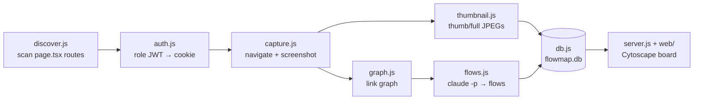

# Developer Tooling & Flowmap

# Developer Tooling & Flowmap

Repo-level tooling that supports development of Contentor but never ships to users: the selective test runner behind `make test-changed` / `make e2e-changed`, the prod→dev demo-asset mirror, two custom lint guards wired into `make lint`, and **Flowmap**, a self-contained visual flow-mapping tool for the two Next.js frontends.

> **Flowmap status:** `tools/flowmap/` was removed from the working tree in commit `e297d1ad` ("Wiki infrastructure, CLAUDE.md slim-down, flowmap removal") along with its `flowmap` / `flowmap-register` / `flowmap-show` Makefile targets. The last complete version lives at commit `1c0b0485` — recover any file with `git show 1c0b0485:tools/flowmap/<path>`. It is documented here because it remains the reference implementation for role-authenticated crawling and screenshotting of both frontends.

---

## Selective test running — `scripts/select_tests.py`

Maps a git diff to the *smallest sufficient* set of backend tests, vitest runs, and Playwright e2e specs. Invoked as `make test-changed` (`--mode backend`) and `make e2e-changed` (`--mode e2e`); `--plan` (the `PLAN=1` make variable) prints the selection without running anything, `--base REF` diffs against something other than `HEAD`.

### Design: a pure core with a thin shell

All selection logic lives in `build_plan(changed_files, importers, backend_apps, impact_map)`, a pure function returning a `Plan` dataclass (`backend_kind`, `backend_apps`, `vitest_kind`, `e2e_kind`, `e2e_specs`, plus human-readable `reasons`). Everything that touches git or the filesystem — `git_changed_files()`, `list_backend_apps()`, `build_import_graph()`, `load_impact_map()`, `execute()` — sits below a marked boundary in the file. This is what makes `--self-test` possible: `run_self_tests()` drives `build_plan` against fixture data (`_CASES`, `_FIX_IMPORTERS`, `_FIX_MAP`) with no git state involved.

### Selection rules

The guiding principle is **fail-closed**: any path the selector does not recognize widens the run rather than silently skipping coverage.

| Changed path | Effect |
|---|---|
| `docs/`, `.claude/`, `tools/`, `scripts/`, `*.md`, `Makefile`, root screenshots… (`IGNORED_*`) | Nothing runs |
| `backend/apps/<app>/…` (known app) | That app's tests **plus its direct importers** (from `build_import_graph`, which greps every app's `.py` files for `apps.<name>` references) |
| `backend/apps/core|accounts|adminkit/`, `backend/config/`, `backend/conftest.py`… (`WIDE_*`) | Full backend suite + all e2e specs |
| Any `*/migrations/*` under `backend/` | Full suite with `--create-db` (a reused test DB would miss the new schema) |
| `packages/shared/` | Full vitest suite + all e2e specs |
| `frontend-customer/…` | Vitest `--changed`, plus e2e specs from the longest matching prefix in `e2e/impact-map.json` (`_longest_prefix`); unmapped path → all specs |
| `frontend-main/…` | The impact map's `frontend-main` spec list (no unit suite exists; typecheck + e2e cover it) |
| `e2e/specs/X.spec.ts` | Spec `X` selects itself; any other `e2e/` file → all specs |
| Anything unrecognized (e.g. `Caddyfile`, compose files) | Full backend + all e2e |

Whenever *any* e2e impact exists, `00-smoke` (`SMOKE_SPEC`) is always included. Backend apps map to e2e specs through the `backend` section of `e2e/impact-map.json`; an app with no entry fails closed to all specs, and an explicit `"none"` entry means smoke-only.

### The self-test is a lint gate

`run_self_tests()` runs the fixture cases *and* two repo-level invariants: the import graph must contain a known real edge (`billing` → `courses`), and every spec in `e2e/specs/` must be referenced somewhere in `e2e/impact-map.json` (or its `manual` list), with no references to nonexistent specs. This runs inside `make lint`, so **adding a new e2e spec without an impact-map entry fails lint** — that is the mechanism keeping the map trustworthy.

`execute()` then runs the plan: backend suites via `docker compose exec django pytest` (skipping apps with no `tests/` dir, per `_has_tests`), vitest from `frontend-customer/`, and in e2e mode `npx playwright test` with the selected spec stems. In backend mode it only *prints* the e2e impact, since e2e needs the dev stack up.

---

## Demo-asset mirror — `scripts/mirror_demo_assets.py`

Copies the real `demo/photos/*` and `demo/videos/*` objects from the **prod bucket (read-only source)** into **dev MinIO**, so locally seeded demo tenants show the exact media prod shows. Runs on the host (not in Docker) with `boto3`: source creds come from `.env.prod`, destination from `.env` (`AWS_ENDPOINT_EXTERNAL`, the host-reachable MinIO endpoint).

Safety properties worth preserving when editing:

- **Write guard:** refuses to write unless the destination endpoint contains `localhost`, `minio`, or `127.0.0.1`, and refuses if source and destination endpoints are identical. Prod can never be a write target.
- **Graceful absence:** a missing `.env.prod` exits 0 with a note (expected on machines without prod creds — `make dev` must not be blocked); every *real* failure exits non-zero.
- **Idempotent:** existing destination keys are skipped via `head_object` unless `--force`; `--dry-run` lists without copying; `--prefix` (repeatable) narrows the mirror.
- Creates the destination bucket if the MinIO volume is fresh (safe only because of the endpoint guard).

The S3 client uses path-style addressing + SigV4 — the same choice as `backend/apps/core/storage.py`, keeping MinIO happy without breaking real S3-compatible stores.

---

## Lint guards (run by `make lint` and pre-commit)

### `scripts/check-i18n-parity.mjs`

Compares `messages/en/*.json` against `messages/tr/*.json` in both `frontend-main` and `frontend-customer`. Fails (exit 1) if a namespace file exists in one locale but not the other, or if the *flattened dotted key sets* of a shared namespace drift (`flatten()` recurses into nested objects). Output lists each `only in en:` / `only in tr:` key, so fixing drift is mechanical.

### `scripts/check-loading-patterns.mjs`

Enforces the loading-state conventions described in the project `CLAUDE.md`, across `frontend-main/src`, `frontend-customer/src`, and `packages/shared/src`. Three independent checks, each with its own allowlist:

1. **No raw animations** — `animate-spin` / `animate-pulse` (regex excludes the custom `animate-pulse-soft` utility) are banned outside the `Spinner`/`Skeleton`/`Button` primitives. `ALLOW` holds the justified exceptions (decorative "LIVE" badges, AI-thinking sparkles, admin-kit's self-contained skeleton) — **every entry must carry a trailing comment explaining why**; follow that convention when adding one.
2. **No `router.push()`** — navigation must go through `useNavigate()` so the top progress bar fires; `PUSH_ALLOW` contains the one real implementation site (`packages/shared/src/navigation/navigation-provider.tsx`) plus files that only mention the string in comments.
3. **Suspense coverage** — every `page.tsx` under either app's `src/app` must have a `loading.tsx` at or above its directory (`hasLoadingAncestor` walks up to the app root), so no route segment can ever navigate without a fallback.

---

## Flowmap — `tools/flowmap/` (archived at `1c0b0485`)

A local tool that answers "what does the app actually look like, and what journeys exist through it?" It crawls both frontends as every role, screenshots every page, builds a navigation graph, asks the `claude` CLI to identify coherent user flows, stores everything in SQLite, and serves an interactive Cytoscape board.

### Pipeline (`register.js`, was `make flowmap-register`)

1. **Preflight** — curls each frontend host through Caddy (`Host:` header against `http://localhost/`); if unreachable, tells you to run `make dev && make seed && make seed-demos`.
2. **Route discovery** (`crawler/discover.js`) — walks each app's `src/app` for `page.tsx` directories (skipping `api/`), strips Next.js route groups `(…)` from URLs, flags `[dynamic]` segments, and assigns a **role** from the frontend's `areaRole` map in `crawler/frontends.js` (e.g. customer `admin` → `coach`, `(student)` → `student`, everything else `anon`).
3. **Authentication** (`crawler/auth.js`) — per role, mints a JWT via `docker compose exec django python manage.py issue_login_token --role <role> [--tenant <slug>]` and plants it as the `contentor_access_token` cookie in a fresh Playwright context (1440×900 at `deviceScaleFactor: 2` for crisp downscaled images).
4. **Capture** (`crawler/capture.js`) — the subtle part; each behavior exists because of a real failure mode:
   - `resolveUrl()` maps dynamic routes to concrete seeded entities from `crawler/targets.json` (per-frontend map wins over the flat map; no entry → status `skipped`). The `tenantSlug`/IDs in `targets.json` must match a locally seeded demo tenant (`demo-yoga`) or every dynamic route skips.
   - Client-state-only pages (e.g. `/checkout`, which reads the cart from localStorage) get their state seeded via `addInitScript` from `targets.localStorage` so they capture populated, not empty.
   - `/live/` and `/live-stream/` never reach `networkidle` (the video SDK holds connections open), so `waitStrategy()` falls back to `domcontentloaded` + a paint delay.
   - The customer app's "Site not found" fallback renders with HTTP 200 on *transient* tenant-config fetch failures, so `isSiteNotFound()` detects it by its copy and the capture retries up to 3× before `classify()` accepts it as a real error.
   - `classify()` also flags HTTP ≥ 400 and authenticated routes that land on `/login` (auth failed). The Next.js dev overlay (`<nextjs-portal>`) is CSS-hidden so HMR warnings never appear in screenshots.
5. **Images** (`crawler/thumbnail.js`) — `makeImages()` downscales the PNG to `thumb`/`full` JPEG data URLs using a canvas in a neutral `about:blank` page (no native image dependency; neutral page so the captured site's CSP can't block the `data:` image).
6. **Graph** (`crawler/graph.js`) — `buildGraph()` resolves each page's `<a href>` links back to discovered routes (`routeMatches` handles dynamic segments), dedupes, drops self-loops, then applies **global-nav suppression**: a target linked from ≥ 70 % of a frontend's pages (`GLOBAL_NAV_THRESHOLD`) is navbar/footer chrome and its incoming edges are dropped, keeping the board readable.
7. **Flow identification** (`flows.js`) — `buildPrompt()` serializes screens + edges into a prompt asking for 4–10 user journeys as JSON; the pipeline shells out to `claude -p`, and `parseFlows()` defensively extracts the JSON array, dropping malformed flows/steps and warning on unknown screen keys.

Flags: `--reset` wipes the DB first; `--screens-only` refreshes screenshots while keeping the existing (human-verified) flows.

### Storage, serving, and verification

- **`db.js`** — `node:sqlite` (`DatabaseSync`, hence the `--experimental-sqlite` flag on every entry point) with three tables: `screens` (keyed `"<frontend>|<url>"`, thumbnails stored inline as data URLs), `flows`, `flow_steps`. `listFlows()` computes each flow's `primaryRole` (highest-privilege role among its screens, superadmin > coach > student, falling back to a role word in the name) for the sidebar grouping.
- **`server.js`** — dependency-free `node:http` server (port `FLOWMAP_PORT`, default 7878): JSON API (`GET/POST /api/screens`, `GET/POST/DELETE /api/flows`, `POST /api/reset`), vendored Cytoscape/dagre from `node_modules`, and path-traversal-guarded static serving of `web/`.
- **`web/app.js`** — the sidebar groups flows by role (Superadmin/Coach/Student/Public); selecting one renders its DAG with cytoscape-dagre using screenshot thumbnails as node textures. Clicking a node opens a lightbox that *walks the flow*: forward steps follow outgoing edges (numbered options at branches, drivable with `1,1,1…`), Back retraces your actual path. Right-clicking a flow copies a text reference suitable for pasting to Claude.
- **`query.js`** (was `make flowmap-show`) — read-only text dump of flows/screens, no server or browser needed.
- **`walk.js`** — verifier: live-walks one flow end-to-end (`node --experimental-sqlite walk.js <flowId> [outDir]`), logging in per role, resolving each screen through the same `resolveUrl`/`classify`/site-not-found-retry logic as capture, screenshotting every step to `walk-shots/flow-<id>/`, and printing a per-step JSON report. Exits non-zero on any skip, error, or auth redirect — the contract being that a registered flow is only trustworthy if every step renders a real screen.

### Reviving or reusing it

Flowmap depended only on: the dev stack up behind Caddy, seeded demo tenants (`make seed-demos`), the `issue_login_token` management command, Playwright + Cytoscape from its own `package.json`, and the `claude` CLI on PATH. `crawler/auth.js` in particular is the canonical pattern for driving either frontend as an authenticated role from Node — the same JWT-cookie approach described in the `browser-pane-coach-login` memory — and is worth extracting if a future tool needs role-authenticated crawling.
