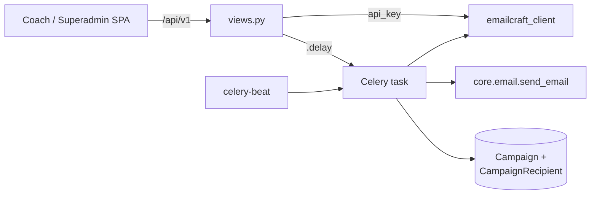

# Email Campaigns — backend-apps

# Email Campaigns — `backend/apps/email_campaigns` + `backend/apps/platform_email`

Two sibling Django apps that let a **coach email their students** (`email_campaigns`, tenant schema) and a **superadmin email their coaches** (`platform_email`, public schema). Both are thin orchestration layers over an external email builder — **MailCraft**, referred to in code as *EmailCraft* — plus Celery for the actual fan-out send.

The coach app is the original; `platform_email` is a deliberate mirror of it. Everything shared lives in `email_campaigns` and is imported by `platform_email` — most importantly the HTTP client (`emailcraft_client`) and the status enums.

---

## What the two apps actually do

Neither app renders email HTML itself, and neither stores template content. The division of labour:

| Concern | Owner |
|---|---|
| Template authoring (drag-and-drop builder) | MailCraft, embedded in the frontend via a session token |
| Template storage, per-recipient render | MailCraft (`render_template`) |
| Recipient resolution, quota, audit trail | these apps |
| Actual SMTP delivery | `apps.core.email.send_email` (Resend) |

A campaign row is therefore a *send record*: which MailCraft template id, which recipient filter, and per-recipient outcomes.

---

## Architecture at a glance



The request path never sends email. `send_campaign` validates, writes an `EmailCampaign` row, and hands off to Celery; the HTTP response is the freshly created campaign, always in `SCHEDULED` or `SENDING`.

---

## Key components

### `emailcraft_client.py` — the shared MailCraft HTTP client

Lives in `email_campaigns` but is imported verbatim by `platform_email`. Two auth modes:

- **Site-level** (`_site_headers`) — `Authorization: Token <EMAILCRAFT_TOKEN>`. Used for the two endpoints that operate *across* organizations: `provision_organization` and `configure_variables`.
- **Org-level** (`_org_headers`) — `X-API-Key: <per-org key>`. Everything else: templates, gallery, session, render, export.

All calls funnel through `_request_with_fallback(method, paths, ...)`, which exists because MailCraft's API prefix is unstable. Each call site passes both variants (`/api/templates` and `/api/v1/templates`), and `_variants()` additionally expands each into trailing-slash and non-trailing-slash forms. The helper walks that expanded list and returns the **first non-404** response; anything in `fallback_status_codes` (default `{404}`) is treated as "wrong path, try the next one". `export_html` and `render_template` widen this to `{404, 405}` because a wrong-prefix POST there can surface as a method-not-allowed.

Consequence worth knowing when adding an endpoint: a genuine 404 from the *correct* path is indistinguishable from a path miss, so it comes back as a raised `HTTPError` from the last attempt rather than a clean not-found. `get_template` failures in `copy_template` are mapped to a 404 response for exactly this reason.

`DEFAULT_VARIABLES` declares the single merge variable both apps use — `Name`. Personalization is deliberately minimal; `render_template` is called once per recipient with `{"Name": ...}`.

### Lazy org provisioning (`_get_api_key`)

Each app has its own `_get_api_key() -> (api_key | None, error | None)`, and every view calls it first. There is no explicit provisioning step in the data model — the first view call that finds an empty key provisions the MailCraft org on demand.

Where the key is stored differs, and that's the main structural difference between the apps:

- coach: `TenantConfig.emailcraft_api_key` (one org per tenant, keyed off `config.brand_name`)
- platform: `PlatformEmailConfig` singleton (`load()` does `get_or_create(pk=1)`), one org named `"Contentor"`, and it also persists `emailcraft_org_id`

Both guard against concurrent provisioning the same way — a conditional update rather than a lock:

```python
updated = TenantConfig.objects.filter(pk=config.pk, emailcraft_api_key="").update(emailcraft_api_key=api_key)
if not updated:
    config.refresh_from_db()
    return config.emailcraft_api_key, None
```

Whoever loses the race discards its own key and adopts the stored one. There's a second path for the same problem: if MailCraft returns no `api_key` (the org already existed), the code re-reads the row before giving up. `configure_variables` is best-effort — a failure there is logged as a warning and provisioning still succeeds.

`setup_email` exists purely so the frontend dashboard can trigger provisioning early rather than paying for it on the first template list. It returns `{"ready": True, "provisioned": <bool>}` where `provisioned` reports whether *this* call created the org.

### Recipient resolution

Two separate `recipients.py` modules with the same shape (`resolve_recipients(filter) -> QuerySet`, `get_recipient_count(filter) -> int`) but different audiences and filter vocabularies.

**Coach** (`email_campaigns/recipients.py`) — active `role="student"` users:

| `type` | extra keys | resolution |
|---|---|---|
| `all` | — | every active student |
| `course` | `course_ids` | via active `Enrollment` rows, `.distinct()` on user_id |
| `individual` | `user_ids` | direct pk filter, still constrained to active students |

**Platform** (`platform_email/recipients.py`) — active `role="coach"` users, with `FILTER_TYPES = ("all_coaches", "plan", "tenant", "individual")`. The plan/tenant filters go through an indirection: tenants don't FK to their owner, they carry `owner_email`, so `_emails_for_tenants()` collects owner emails from the matched tenants and the query becomes `email__in=emails`. Coaches without a matching public `User` row simply drop out.

Both modules return `User.objects.none()` for a non-dict filter, an unknown type, or an empty id list — never raise. That makes them safe to call from serializer validation.

### Serializers

`SendEmailSerializer` in each app does the real gatekeeping. `validate_recipient_filter` checks the `type` against the allowed set, requires a non-empty id list for list-shaped types, and then — notably — **calls `get_recipient_count()` and rejects a filter that matches nobody**. A validation pass therefore implies at least one recipient and costs a `COUNT` query.

The coach serializer adds `scheduled_at`, validated to be strictly in the future. `platform_email` has no scheduling.

Campaign serializers are fully read-only (`read_only_fields = fields`) and surface the sender as flattened `sender_name` / `sender_email` method fields so the frontend doesn't need a user lookup. `rendered_html` is included, which makes campaign-detail responses potentially large.

### Models & status lifecycle

`platform_email/models.py` re-exports `CampaignStatus` and `RecipientStatus` from `email_campaigns.models` rather than redefining them — same lifecycle, one source of truth.

```
                     scheduled_at set
   send_campaign ──────────────────────▶ SCHEDULED
        │                                   │ beat sweep claims at scheduled_at
        │ send-now                           ▼
        └──────────────────────────────▶ SENDING ──▶ SENT     (failure == 0)
                                                 ├──▶ PARTIAL  (some of each)
                                                 └──▶ FAILED   (success == 0)
```

`SENT` / `PARTIAL` / `FAILED` are terminal. Note `FAILED` is also the "couldn't even start" state — no API key, or an unhandled exception in the task — so it doesn't distinguish setup failure from total delivery failure; the recipient rows do.

`CampaignRecipient` (and `PlatformCampaignRecipient`) is the per-recipient audit row, written as the send progresses. It stores `user_id` as a plain `IntegerField` and denormalizes `user_name` / `user_email`, so the trail survives the user being renamed or deleted. `error_message` is truncated to 500 chars.

---

## The send path

`send_campaign_emails(campaign_id, schema_name)` is the interesting one — it straddles two schemas, so it opens `tenant_context` twice with a public-schema section in between.

1. **Tenant context #1** — load campaign, bail to `FAILED` if `TenantConfig.emailcraft_api_key` is missing, compute `from_name` as `"<coach name> via <brand_name>"`, materialize recipients into a plain list of dicts, and persist `recipient_summary` (built by `_build_recipient_summary`, which resolves course ids to titles).
2. **Public schema** — `get_or_create` this month's `TenantUsage`, then derive `remaining_quota = max(plan.max_campaign_emails - usage.emails_sent, 0)`. A plan with no `max_campaign_emails` means unlimited (`remaining_quota is None`).
3. **Tenant context #2** — the send loop. Per recipient: `render_template` → `send_email`, then a `CampaignRecipient` row recording the outcome. The first non-empty render is stashed on `campaign.rendered_html` as the preview shown in the UI.
4. Roll up counts, set terminal status, and — back in public — `TenantUsage.objects.filter(...).update(emails_sent=F("emails_sent") + success)`. The `F()` expression is what keeps this correct against concurrent campaigns.

Quota is enforced **twice**: optimistically at request time in `send_campaign` (403 if `usage.emails_sent + recipient_count > quota`) and again mid-loop in the task. If the budget runs out mid-batch, the remaining recipients are `bulk_create`d as `FAILED` with `"Email quota exceeded"` and the loop breaks — so a campaign that overruns lands as `PARTIAL` with a complete, honest recipient trail.

Error handling is per-recipient and deliberately non-fatal: `HTTPError` captures up to 2000 chars of the MailCraft response body for the log and 500 for the row; any other exception falls through to a generic handler. One bad address never aborts the campaign. The outermost `except` is the backstop that flips the campaign to `FAILED` if something unexpected escapes.

`max_retries=0` on both tasks is intentional. A retry would re-send to everyone who already succeeded — there is no per-recipient idempotency key.

`send_platform_campaign_emails(campaign_id)` is the same loop minus tenant context, minus quota, with `from_name` hardcoded to `PLATFORM_BRAND = "Contentor"` and the fallback greeting `"there"` instead of `"Student"`.

### Scheduling (coach only)

`dispatch_due_email_campaigns` is the beat sweep. It iterates tenants excluding `public` and **filtered to `provisioning_status="ready"`** — half-provisioned tenants have no schema and would raise `UndefinedTable`. Each tenant is wrapped in its own try/except so one failure doesn't stop the sweep. This mirrors `apps.blog.tasks.dispatch_due_blog_autopilot`.

Exactly-once claiming is a conditional update, same pattern as the API key race:

```python
claimed = EmailCampaign.objects.filter(pk=campaign.pk, status=CampaignStatus.SCHEDULED).update(
    status=CampaignStatus.SENDING
)
if claimed:
    send_campaign_emails.delay(campaign.id, schema_name)
```

Only the worker that wins the `SCHEDULED → SENDING` flip spawns the sender, so overlapping beat ticks or multiple beat processes can't double-send.

---

## HTTP surface

Both apps expose a near-identical route table (`urls.py`), differing in permission class and a couple of endpoints:

| Route | Coach (`IsCoachOrOwner`) | Platform (`IsSuperUser`) |
|---|---|---|
| `setup/` | ✅ | ✅ |
| `session/` | ✅ | ✅ |
| `templates/`, `templates/<id>/`, `templates/copy/`, `templates/preview/` | ✅ | ✅ |
| `gallery/` | ✅ | ✅ |
| `send/` | ✅ (accepts `scheduled_at`) | ✅ |
| `campaigns/`, `campaigns/<pk>/`, `campaigns/<pk>/recipients/` | ✅ (`DELETE` cancels a `SCHEDULED` campaign) | ✅ (read-only) |
| `recipient-options/` | — | ✅ |

Notes on individual endpoints:

- **`session/`** mints a short-lived MailCraft session token for the embedded builder iframe, scoped to an origin. The coach origin comes from `_get_tenant_origin()` — the primary `Domain` if the tenant has a custom one, else `https://<subdomain>.<CONTENTOR_DOMAIN>`. The platform origin is just `https://<CONTENTOR_DOMAIN>`.
- **`templates/copy/`** is a read-then-write against MailCraft: fetch the source, re-create it as `"Copy of <name>"`. There is no MailCraft-side duplicate call.
- **`templates/preview/`** batch-renders up to 20 templates through a `ThreadPoolExecutor(max_workers=4)` with a 10s per-future timeout, returning `{"previews": {...}, "errors": {...}}` — partial success is normal and the frontend must handle a template appearing in neither map.
- **`send/`** rejects a duplicate in-flight campaign with **409** when the same sender already has a `SCHEDULED`/`SENDING` campaign with the same `template_id` *and* `subject`. This is a double-submit guard, not a general uniqueness rule — the same email can be sent again once the first one finishes.
- **`campaigns/`** paginates with `limit` (default 20, clamped to 1–100) and `offset`, both parsed defensively. Response shape is `{"count", "results"}`.
- **`recipient-options/`** (platform only) returns coaches, active plans, and tenants in one payload for the recipient picker.
- **`DELETE campaigns/<pk>/`** (coach only) hard-deletes, and only for `SCHEDULED`. Anything else is a 400 — sent and in-flight campaigns are immutable history.

Status-code convention across both apps: **503** when MailCraft can't be provisioned or reached for a session, **502** when a MailCraft data call fails, **400** for validation, **403** for quota, **409** for duplicate submit.

---

## Connections to the rest of the codebase

- `apps.core.email.send_email` — the only delivery path. In dev, `EMAIL_SINK_ENABLED=true` captures sends; read them back via `GET /api/v1/dev/emails/latest/?to=`.
- `apps.tenant_config.TenantConfig` — holds the per-tenant MailCraft key and `brand_name` (used in `from_name`).
- `apps.core.models.TenantUsage` / `Tenant.plan.max_campaign_emails` — the quota substrate, in the public schema.
- `apps.core.models.Domain` — resolves the builder session origin.
- `apps.core.permissions.IsCoachOrOwner` / `IsSuperUser`.
- `apps.courses.Enrollment` and `Course` — course-based recipient filters and summary labels.
- `apps.accounts.User` — students (`role="student"`) and coaches (`role="coach"`).
- Settings: `EMAILCRAFT_BASE_URL`, `EMAILCRAFT_TOKEN`, `CONTENTOR_DOMAIN`.

Only `email_campaigns` registers a Django admin (`EmailCampaignAdmin`, read-only on `created_at`/`sent_at`).

---

## Contributor notes

- **Adding a MailCraft endpoint:** add a function to `emailcraft_client.py`, pass *both* path prefixes, pick `_site_headers` vs `_org_headers` by whether the call is cross-org, and widen `fallback_status_codes` to include `405` if it's a POST that might 405 on a wrong prefix.
- **Adding a recipient filter type:** it's three edits per app — the branch in `resolve_recipients`, the `type`/required-keys check in `SendEmailSerializer.validate_recipient_filter` (plus `FILTER_TYPES` on the platform side), and the label in `_build_recipient_summary`. Miss the third and campaigns silently show an empty summary.
- **Changing the send loop:** remember `max_retries=0` — the loop is not idempotent. Any retry story needs per-recipient dedup first.
- **Schema discipline:** in `send_campaign_emails`, model imports are function-local and the campaign is re-fetched inside each `tenant_context` block. Don't hoist them; querying a tenant model outside its context hits the wrong schema.
- **The two apps drift easily.** They are copies by design, not by abstraction. A fix to the send loop, the provisioning race, or the preview batch almost always belongs in both. `platform_email/tests/test_platform_email.py` currently covers only `resolve_recipients`.