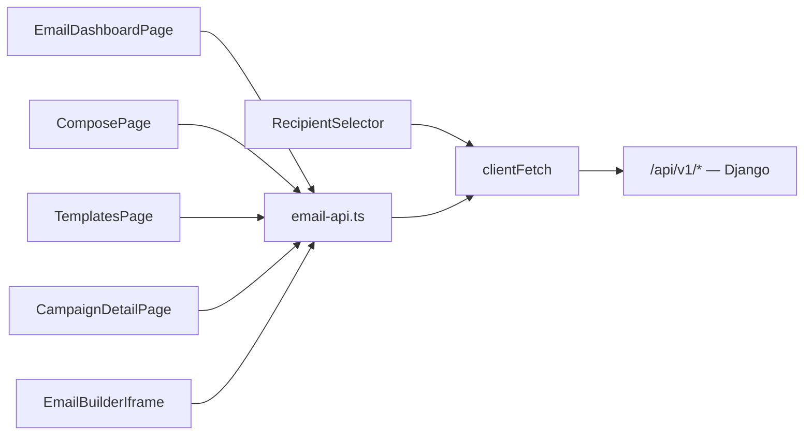

# Email Campaigns — frontend-customer-src

# Email Campaigns (frontend-customer)

The coach-facing email campaign UI inside the tenant admin. Lets a coach pick or design an email template in MailCraft, choose recipients from their student base, send or schedule the campaign, and inspect per-recipient delivery afterwards.

Everything here lives under the `/admin/email` route tree in `frontend-customer` and talks to the tenant-scoped Django app `apps.email_campaigns` through `/api/v1/email/*`.

## Layout

| Path | Role |
|---|---|
| `src/lib/email-api.ts` | The only place that knows the `/api/v1/email/*` contract. Thin typed wrappers over `clientFetch`. |
| `src/app/admin/email/page.tsx` | Campaign dashboard — list, filter, drill in. |
| `src/app/admin/email/compose/page.tsx` | Three-step wizard: choose → design → send. |
| `src/app/admin/email/templates/page.tsx` | Template library (mine / gallery) with preview + delete. |
| `src/app/admin/email/campaigns/[id]/page.tsx` | Campaign detail: metadata, rendered preview, recipient table. |
| `src/components/admin/email/recipient-selector.tsx` | Audience picker used by step 3 of the wizard. |

Shared building blocks come from `packages/shared` (`@shared/…`) — `EmailBuilderIframe`, `TemplateGrid`, `useAsyncAction`, `useNavigate` — so they can be reused by `frontend-main`. Only `RecipientSelector` is local, because "recipients" means tenant students and is meaningless outside this app.

## Data flow

`clientFetch` (`src/lib/api-client.ts`) is the single browser-side transport: it attaches auth, stamps the tracking session id from `src/tracking/session.ts`, and throws `ApiError` on non-2xx. Every function in `email-api.ts` is a one-liner over it — no retry, no caching, no normalization layer. That means:

- **Pages own their own loading/error state.** There is no data-fetching library here; each page holds `useState` for data + `loading` + `error` and renders through `<PageState>`.
- **Rejections are `ApiError`.** Pages that surface a message read `err.message`; pages that just need "something failed" pass the raw error to `<PageState error>`.

### API surface

`email-api.ts` mirrors the backend one-to-one:

- **Session/provisioning** — `createEmailSession()` (mints the short-lived token the MailCraft iframe authenticates with; called by `EmailBuilderIframe`, not by any page directly), `setupEmail()` (idempotent provisioning of the tenant's MailCraft workspace).
- **Templates** — `listTemplates()`, `getTemplate(id)`, `deleteTemplate(id)`, `copyTemplate(sourceTemplateId)`, `listGallery(category?)`, `previewTemplates(ids)`.
- **Campaigns** — `sendCampaign(data)`, `listCampaigns(limit, offset)`, `getCampaign(id)`, `listCampaignRecipients(campaignId)`.

Two contract quirks worth knowing before you touch this file:

1. **`listTemplates` and `listGallery` return `T[] | { results: T[] }`.** The backend shape depends on whether DRF pagination kicks in for the endpoint. Both `ComposePage` and `TemplatesPage` carry a local `asArray<T>()` helper that flattens bare arrays, `{results}`, and `{data}` into a plain array. If you add a third caller, copy that helper rather than assuming one shape.
2. **`previewTemplates` never rejects per-template.** It returns `{previews, errors}` keyed by template id — a template whose HTML fails to render shows up in `errors` while the rest still come back in `previews`. Callers only read `previews` and let missing ids fall through to the grid's placeholder.

`copyTemplate` is exported but currently unused by these pages — template selection in the wizard loads the source template's JSON directly and lets MailCraft's own save create the derived template (see below).

## Campaign dashboard (`admin/email/page.tsx`)

Fetches `listCampaigns(100, 0)` once on mount and does **all filtering client-side** — subject search, `status` (`sending`/`sent`/`partial`/`failed`), and a `7d`/`30d`/`all` date range via `isWithinRange`. The footer reads `{filtered.length} of {total}`, where `total` is the server's `count`, so once a tenant exceeds 100 campaigns the numbers will disagree with what's filterable. Adding real pagination means moving the filters server-side; `listCampaigns` already takes `limit`/`offset`.

On mount it also fires `setupEmail().catch(() => {})` — fire-and-forget MailCraft provisioning so the compose page's iframe has a workspace to talk to by the time the coach clicks "New Email". Deliberately silent: a provisioning failure shouldn't break the campaign list, and the compose flow surfaces it later if it matters.

Rows navigate with `useNavigate()` from `@shared/navigation/navigation-provider` (drives the top progress bar); the header's cross-page links are plain `next/link` here.

## Compose wizard (`admin/email/compose/page.tsx`)

The most involved component. A `Step` union (`"choose" | "design" | "send"`) drives which panel renders.

### URL as the source of truth for wizard state

Every meaningful selection is mirrored into the query string via `syncUrl()` + `window.history.replaceState`, and read back on mount:

- `?step=` — current step
- `?template=` / `?templateName=` — the saved MailCraft template
- `?subject=` — the subject line

Setters are wrapped so state and URL never diverge: `setStep`, `setSavedTemplateId`, `setSavedTemplateName`, and `setSubject` each call `syncUrl` alongside their `useState` setter. Use those wrappers, not the raw `…Raw` setters, when adding logic — bypassing them silently breaks refresh-resume.

`replaceState` (not `push`) is intentional: the wizard should not stack history entries per keystroke. The consequence is that browser Back leaves the wizard entirely rather than stepping back — in-wizard back is the explicit "Back to templates" / "Back to editor" buttons.

`?template=` also doubles as **edit mode**: when it's present on mount, the template-list effect short-circuits and a second effect loads that template's `json_data` for the builder. That's how `TemplatesPage`'s edit action (`/admin/email/compose?template=<id>`) lands mid-wizard, and why the "Back to templates" button is hidden in that case.

### Step 1 — choose

Loads `listTemplates()` and `listGallery()` in parallel, both `.catch(() => [])` so one failing source still renders the other. Gallery entries whose id already appears in "mine" are dropped, then previews are hydrated by chunking ids into batches of 20 through `previewTemplates`, each batch merging into `previewHtmlMap` as it lands. Results render via the shared `<TemplateGrid mode="picker">`, plus a "start from scratch" tile.

Selecting a template loads its full `json_data` and jumps to `design` with `hasSaved` already true (an existing template is, by definition, saved). Starting from scratch clears the template id/name and sets `hasSaved` false.

### Step 2 — design

Wraps `<EmailBuilderIframe>` (the MailCraft embed) with a ref of type `EmailBuilderIframeHandle`. Two inbound events matter:

- `onSave` → `MAILCRAFT_SAVE`: flips `hasSaved`.
- `onTemplateSaved` → `MAILCRAFT_TEMPLATE_SAVED`: carries `{templateId, templateName}`, which becomes the campaign's template — this is how a scratch design or a derived copy gets its id.

"Next: Send" is gated on `savedTemplateId` (`canGoToSend`) and, when a template id exists, calls `builderRef.current.requestSave()` first so the coach's latest edits are persisted before the send step reads them. The returned `templateId` overwrites local state — MailCraft may fork a new template on save.

### Step 3 — send

Renders the subject input, `<RecipientSelector>`, and a now/later delivery toggle. `handleSend` validates synchronously before touching the network:

- template saved, subject non-empty
- `course` filter has at least one course; `individual` filter at least one user
- when scheduling: a parseable datetime strictly in the future, converted to ISO via `toISOString()` (the `datetime-local` input is local time; the backend receives UTC)

Then `sendNow(scheduledIso)` posts through `sendCampaign` and redirects — `/admin/calendar` for scheduled campaigns (they show up as content-calendar entries), `/admin/email` for immediate sends.

One non-obvious bit: `redirecting` state exists purely to hold the button's spinner on. `useAsyncAction` clears its `loading` as soon as the promise settles, but `navigate()` resolves well before the route commits, so without `loading={sending || redirecting}` the button flashes idle right before unmount. Same class of problem as the `useTransition` caveat in CLAUDE.md.

Validation errors go to a local `error` string rendered inline (per the repo convention that field-level validation stays inline); `useAsyncAction`'s `onError` funnels API failures into that same string.

## Recipient selector (`components/admin/email/recipient-selector.tsx`)

Fully controlled — owns no filter state. Props: `value: RecipientFilter`, `onChange`, plus `recipientCount` / `onCountChange` so the parent can display and reset the count.

`RecipientFilter` is a discriminated union (`all` | `course` with `course_ids` | `individual` with `user_ids`) sent verbatim to the backend, which resolves it to actual students. Switching radio type resets to an empty selection of the new type.

Options come from two endpoints the component calls directly rather than through `email-api` (they aren't email endpoints): `/api/v1/courses/?limit=100` and `/api/v1/auth/students/?limit=100`, both tolerant of paginated-or-bare responses and both `.catch(() => [])`. Note the hard `limit=100` — tenants past 100 students get a truncated "individual students" picker, and student search filters only the loaded page. Fixing that means server-side search on the students endpoint.

The count is **estimated locally**, on a 250 ms debounce: `all` → `students.length` (itself capped at 100), `individual` → selected ids, `course` → `null`, i.e. "unknown" — there's no client-side course→enrollee mapping. The authoritative count is whatever `sendCampaign` returns as `recipient_count`. Treat the displayed number as a hint, not a guarantee.

## Template library (`admin/email/templates/page.tsx`)

Two tabs over the same `<TemplateGrid mode="library">`. "Mine" loads on mount; "Gallery" loads lazily on first visit and caches via `galleryLoaded`. Each tab has its own `loading`/`error` pair so `<PageState>` can retry the right fetch. Previews use the same batch-of-20 `previewTemplates` loop as the wizard, shared into one `previewHtmlMap`.

`onDelete` is only wired for the "mine" tab — gallery templates aren't the tenant's to delete.

The preview modal opens **immediately with a spinner** (per the repo's overlay convention), then resolves HTML in priority order: cached `previewHtmlMap` → `getTemplate(id)`'s `html`/`rendered_html` → a single-id `previewTemplates` call. All rendered HTML — here and in campaign detail — goes into `<iframe srcDoc sandbox="">`; the empty `sandbox` is load-bearing, since template HTML is coach-authored and must not execute or navigate.

`handleDelete` is deliberately **not** wrapped in `useAsyncAction`. The callback fires once per card in a `.map()`, and a single shared hook instance would drop card B's delete while card A's was in flight (`TemplateCard` in `packages/shared` exposes no per-row busy prop). It uses a `window.confirm` guard, optimistically removes the row on success, and reports failure with a `toast.error`. If you add per-row busy state to `TemplateCard`, this is the callsite to revisit.

## Campaign detail (`admin/email/campaigns/[id]/page.tsx`)

Reads `params.id`, coerces to a number, and fetches `getCampaign` + `listCampaignRecipients` in parallel. Recipients use `.catch(() => ({results: []}))` so a missing recipient log never blocks the campaign view — campaigns sent before per-recipient tracking existed legitimately return nothing, and the empty state says so explicitly rather than showing an error.

The effect uses a `cancelled` flag in its cleanup to avoid setting state after unmount, and a `reloadKey` counter that `<PageState onRetry>` bumps to re-run the fetch.

Rendered content is `campaign.rendered_html` — the HTML the backend actually materialized and handed to Resend, not a fresh render — so this view is a faithful record of what was delivered.

## Conventions to preserve

Contributing here means staying inside the repo-wide frontend rules (see CLAUDE.md's loading/feedback section):

- Async work goes through `useAsyncAction`, with the documented exception for per-row callbacks in a `.map()`.
- Buttons take `loading` / `loadingText`; no raw spinners. Standalone spinners are `<Spinner>`.
- Initial page loads render `<PageState loading error skeleton>` with presets from `@/components/ui/skeletons`. Every route segment here needs a `loading.tsx` at or above it — `scripts/check-loading-patterns.mjs` in `make lint` enforces this.
- Programmatic navigation is `useNavigate()`, never `router.push`.
- Status tints follow the shared pattern in this module: a theme-agnostic low-opacity fill plus a `dark:`-stepped foreground (`bg-emerald-500/15 text-emerald-700 dark:text-emerald-300`). `STATUS_COLORS` is duplicated between the dashboard and detail pages — keep them in sync or lift them.
- All four pages set `export const dynamic = "force-dynamic"`: they're tenant-scoped and auth-dependent, so nothing here may be statically prerendered.
- After changing an email serializer on the backend, run `npm run gen:api` in `frontend-customer` and review the `src/types/api-generated.ts` diff. `email-api.ts` types are hand-written and will *not* fail the build when the contract moves — a surprising generated diff is your only warning.
