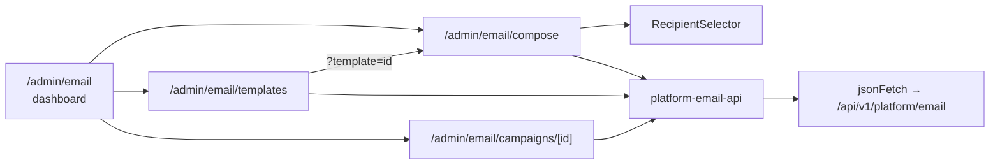

# Email Campaigns — frontend-main-src

# Email Campaigns — `frontend-main/src`

Platform-level email campaigns: the **superadmin** side of email. This module lets the platform owner design an email in the MailCraft builder and blast it to *coaches* (tenant owners) — filtered by plan, workspace, or hand-picked individuals — then inspect per-recipient delivery afterwards.

It is the mirror image of `frontend-customer`'s coach → student email UI. Same shape, same shared components, different audience and a different API namespace.

## Scope and boundaries

| Concern | Where it lives |
|---|---|
| Platform email API client | `src/lib/platform-email-api.ts` |
| Shared-package alias shim | `src/lib/email-api.ts` |
| Campaign list / dashboard | `src/app/admin/email/page.tsx` |
| 3-step compose wizard | `src/app/admin/email/compose/page.tsx` |
| Template library + gallery | `src/app/admin/email/templates/page.tsx` |
| Campaign detail + recipient log | `src/app/admin/email/campaigns/[id]/page.tsx` |
| Recipient targeting UI | `src/components/admin/email/recipient-selector.tsx` |
| `TemplateGrid`, `EmailBuilderIframe` | `packages/shared/src/email/*` — **out of this module** |
| Backend | `apps.platform_email` (public schema), `/api/v1/platform/email` |

Everything here is a client component (`"use client"`) with `export const dynamic = "force-dynamic"` — the data is superadmin-scoped and never prerendered.

## The alias shim

`src/lib/email-api.ts` is one line:

```ts
export * from "./platform-email-api";
```

`packages/shared/src/email/*` components (`TemplateGrid`, `EmailBuilderIframe`) are written against a module named `email-api`. Each app provides its own — `frontend-customer` resolves it to the coach client, `frontend-main` re-exports the platform client. **When you add a function to `platform-email-api.ts` that shared components need, the shared side must find the same export name in the customer app's `email-api` too.** Breaking that symmetry breaks the other app at build time, not here.

## API client

`platform-email-api.ts` is a thin, flat set of `async` functions over `jsonFetch` from `src/lib/api-client.ts` — no client class, no caching layer, no react-query. `BASE` is `/api/v1/platform/email`.

Auth is worth noting: unlike the tenant-facing frontend, there is no JWT threading and no `X-Tenant-Domain` header here. These calls ride the **same-origin admin cookie**, which `jsonFetch`/`clientFetch` handles. That is why every consumer is a client component — the browser holds the credential.

Endpoints, grouped by what they do:

**Session / provisioning**
- `createEmailSession()` → `POST /session/` — mints a short-lived `{session_token, expires_at}` for the MailCraft iframe. Not called directly by any page in this module; `EmailBuilderIframe` (shared) consumes it via the alias.
- `setupEmail()` → `POST /setup/` — idempotent provisioning of the platform's MailCraft workspace. The dashboard fires it fire-and-forget on mount.

**Templates**
- `listTemplates()`, `getTemplate(id)`, `deleteTemplate(id)`
- `listGallery(category?)` — MailCraft's stock gallery; `GalleryTemplate` adds `category` and `is_premium`
- `copyTemplate(sourceTemplateId)` → `{id, name}` — clones a gallery template into "mine"
- `previewTemplates(ids[])` → `{previews: Record<id, html>, errors: Record<id, string>}` — **batch** server-side render, one request for many thumbnails

**Campaigns**
- `getRecipientOptions()` → `{coaches, plans, tenants}` — everything the selector needs, in one call
- `sendCampaign({template_id, template_name?, subject, recipient_filter})` → `EmailCampaign`
- `listCampaigns(limit = 20, offset = 0)` → `PaginatedResponse<EmailCampaign>`
- `getCampaign(id)`, `listCampaignRecipients(id)`

### Two type shapes to know

`RecipientFilter` is a **discriminated union** on `type`, and the discriminant determines which id array is required:

```ts
type RecipientFilter =
  | { type: "all_coaches" }
  | { type: "plan";       plan_ids: number[] }
  | { type: "tenant";     tenant_ids: number[] }
  | { type: "individual"; user_ids: number[] };
```

This union is the contract shared by `RecipientSelector`, the compose page's validation, and the backend's `recipient_filter` field. Adding a target type means touching all three plus `TYPES` in the selector.

`EmailCampaign.status` is `"sending" | "sent" | "partial" | "failed"` — `partial` means some recipients failed, which is why `success_count`/`failure_count` are separate from `recipient_count`. Both the dashboard and the detail page key their badge colors off this literal set (`STATUS_COLORS` maps, duplicated in each file — a new status needs both).

### List-shape defensiveness

`listTemplates()` and `listGallery()` are typed as `T[] | { results: T[] }` because the backend's pagination is not guaranteed for these. Both consuming pages carry an identical local helper:

```ts
function asArray<T>(data: T[] | { results: T[] } | { data: T[] }): T[]
```

It exists twice — in `compose/page.tsx` and `templates/page.tsx`. If you touch one, touch the other, or lift it into the API client.

## Architecture



## The compose wizard

`compose/page.tsx` is the most intricate file here. Three steps — `choose` → `design` → `send` — with **all wizard state mirrored into the URL query string**.

### URL as the state backup

Every meaningful piece of wizard state has a paired setter that writes through to the query string via `syncUrl`:

```
setStep              → ?step=
setSavedTemplateId   → ?template=
setSavedTemplateName → ?templateName=
setSubject           → ?subject=
```

`syncUrl` uses `window.history.replaceState` deliberately — **not** `useNavigate`/`router.push`. A router push would remount the page and blow away the MailCraft iframe mid-edit. The consequence is that these URL updates are invisible to Next.js: `useSearchParams()` is read *once* at mount to derive initial state and never re-consulted. Treat the `initial*` values as bootstrap-only.

The payoff: a mid-wizard refresh or a shared link resumes at the right step with the right template and subject. `initialStep` falls back to `design` when a `?template=` is present (the edit-from-library entry point) and `choose` otherwise.

### Step 1 — choose

On mount (only when there's no `?template=`), the page fetches "my templates" and the gallery in parallel, dedupes gallery entries whose `id` already appears in mine, and renders one merged `TemplateGrid` in `mode="picker"` with `showStartFromScratch`.

Thumbnails are then filled in by chunking every id into **batches of 20** and firing `previewTemplates` per batch, each resolving independently into `previewHtmlMap`. Batches are intentionally not awaited in sequence — early batches paint while later ones are still in flight. Failures are swallowed per batch; a missing thumbnail is acceptable, a blocked grid is not.

`handleSelectTemplate` re-fetches the chosen template to get `json_data`, seeds `templateJson`, marks `hasSaved`, and advances to `design`. Note it does *not* call `copyTemplate` — selecting reuses the template id directly. `copyTemplate` is exported but currently unused by this module's pages.

### Step 2 — design

`EmailBuilderIframe` (shared) hosts MailCraft with `templateJson` + `templateId`. Two callbacks flow back: `onSave` just flips `hasSaved`, while `onTemplateSaved({templateId, templateName})` is the one that matters — a *new* template gets its server-assigned id here, which is what makes step 3 reachable.

`canGoToSend` is simply `Boolean(savedTemplateId)`. "Next: Send" additionally calls `builderRef.current.requestSave()` on the way out so unsaved iframe edits are flushed, adopting any returned `templateId`.

`handleBackToChoose` guards with a `window.confirm` when edits exist. The "Back to templates" button is hidden entirely when the page was entered with `?template=` — that entry came from the template library, so there is no choose step to return to.

### Step 3 — send

Validation is inline in the `useAsyncAction` body and runs per filter type: a saved template, a non-empty subject, and a non-empty id array for `plan` / `tenant` / `individual`. Errors land in local `error` state rendered as a destructive banner (this module predates full toast adoption for these paths).

The `redirecting` flag is a deliberate wart, and the comment in the source explains it: `useAsyncAction` clears `loading` the moment the promise settles, but `navigate("/admin/email")` is async, so the button would flash idle for a beat before unmounting. `loading={sending || redirecting}` holds it.

## Recipient targeting

`RecipientSelector` is the only bespoke component in this module. It's controlled — `value`/`onChange` over `RecipientFilter`, plus `recipientCount`/`onCountChange` lifted to the parent.

It loads all three option lists once via `getRecipientOptions()` and falls back to empty arrays on failure (the UI then shows "No plans found." etc. rather than erroring out). Switching radio type always emits a **fresh filter with an empty id array** — ids never leak across type changes.

Counting is client-side and honest about its limits:

- `all_coaches` → `options.coaches.length`
- `individual` → `value.user_ids.length`
- `plan` / `tenant` → `null`, surfaced to the user as *"Recipients resolved on send"*

The 250ms `setTimeout` before setting the count is a debounce so rapid checkbox clicking doesn't flicker the label; the effect nulls the count and sets `loadingCount` first, so the UI reads "Counting recipients…" in between. There is no server round-trip in that window — the delay is purely cosmetic. If you ever add a real count endpoint for plan/tenant, this is the hook to put it in, and the debounce becomes load-bearing.

The individual-coach list has a client-side search over name and email. Plan and tenant lists are unfiltered and capped by `max-h-48` scroll — fine at current platform scale, worth revisiting if tenant count grows.

## Dashboard

`page.tsx` fetches `listCampaigns(100, 0)` — a single page of up to 100 — and does **all** filtering in the browser: subject substring search, status equality, and a `7d`/`30d`/`all` date range via `isWithinRange`. `total` comes from the server's `count`, so the footer honestly reads "N of M campaign(s)" and will visibly disagree with server truth past 100 campaigns. That's the point at which this needs real server-side filtering and pagination.

It also calls `setupEmail().catch(() => {})` on mount — provisioning-on-first-visit, deliberately silent. Rows navigate via `useNavigate()` per the repo's navigation convention (never `router.push`).

## Campaign detail

`campaigns/[id]/page.tsx` loads campaign and recipients concurrently, with `listCampaignRecipients` degrading to `{results: []}` on failure so a missing recipient log never hides the campaign summary. Only `getCampaign` failing produces the error state.

The rendered HTML is shown in an `<iframe srcDoc={...} sandbox="">` — **`sandbox=""` with no allow-tokens is the security boundary here**, since campaign HTML is builder-authored and must not execute or navigate. The same pattern guards the template preview modal in `templates/page.tsx`. Preserve it in any change to either.

There is no polling: a campaign in `sending` status requires a manual refresh to advance.

## Template library

`templates/page.tsx` has two tabs. `mine` loads eagerly; `gallery` is lazy and latched by `galleryLoaded` so tab-flipping doesn't refetch. Both feed the same `previewHtmlMap`, warmed by the same 20-id batching (here sequential inside `fetchPreviews`, unlike compose's fire-and-forget).

`handlePreview` cascades through three sources before giving up: the warm `previewHtmlMap`, then `getTemplate`'s `html`/`rendered_html`, then a single-id `previewTemplates` call. The modal opens *immediately* with a loading body rather than waiting — the repo's overlay convention.

`handleDelete` is intentionally **not** wrapped in `useAsyncAction`, and the source comment says why: `TemplateCard` (shared package) has no per-row busy prop, and one shared hook instance across a `.map()` would swallow a delete on row B while row A is in flight. It uses a plain `try/catch` with a `toast.error` and optimistically drops the row from local state. Don't "fix" this into a single `useAsyncAction` without first giving `TemplateCard` per-row busy state.

`onDelete` is passed only on the `mine` tab — gallery templates aren't yours to delete. `handleEdit` routes to `compose?template=<id>`, which is the entry point that makes compose skip its choose step.

## Contributing notes

- **Conventions this module partially predates.** It uses raw `<Link>` and plain `<button>` in places where the repo standard is `<NavLink>` and `<Button>`, and inline "Loading…" text where the standard is `<PageState>` + skeleton presets. `Button` with `loading`/`loadingText` and `useAsyncAction` *are* used on the paths that matter (send, preview). New code here should follow the current conventions in `CLAUDE.md`; treat the older patterns as debt, not precedent.
- **Serializer changes ripple.** The interfaces in `platform-email-api.ts` are hand-written, not generated from the OpenAPI schema. A change to `apps.platform_email` serializers will not show up in a `npm run gen:api` diff for this app — update these types by hand.
- **Duplicated constants.** `STATUS_COLORS` (dashboard + detail) and `asArray` (compose + templates) each exist twice. Keep them in sync or consolidate.
- **`copyTemplate` and `createEmailSession`** are exported but not called from this module's pages — `createEmailSession` is consumed by the shared `EmailBuilderIframe` through the `email-api` alias, and `copyTemplate` is currently unused. Don't delete either without checking the shared package.
