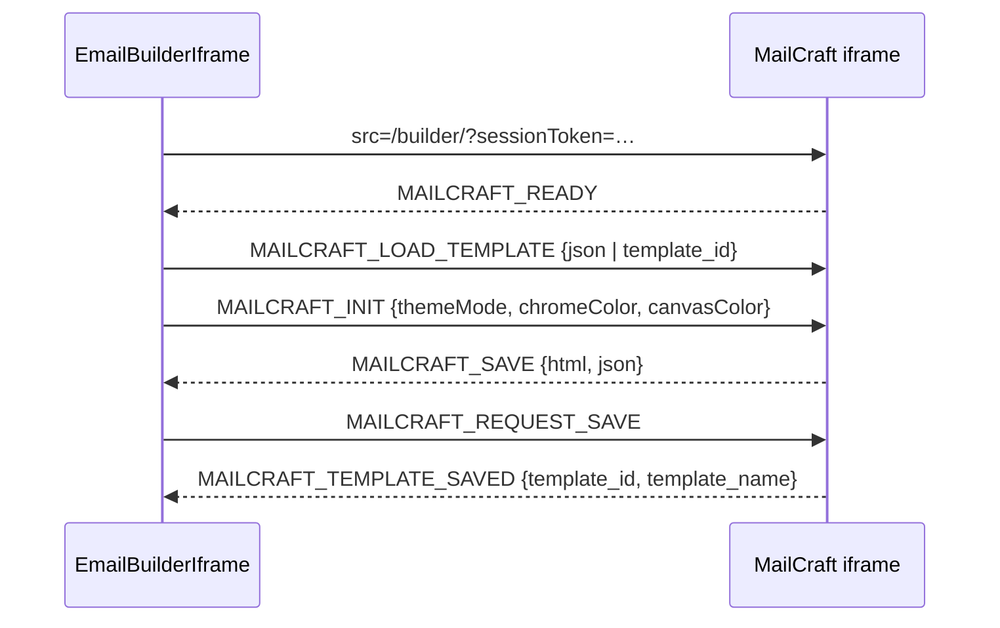

# Email Campaigns — packages-shared

# Email Campaigns — `packages/shared/src/email`

Shared UI for the coach-facing email campaign tooling. Three client components: an embedded MailCraft email builder (`EmailBuilderIframe`) and a template browser pair (`TemplateGrid` → `TemplateCard`). They are consumed by the tenant admin's `email/compose/page.tsx` and `email/templates/page.tsx`.

All three are `"use client"` — they depend on `window`, `postMessage`, `ResizeObserver`, and `MutationObserver`.

```
packages/shared/src/email/
  email-builder-iframe.tsx   EmailBuilderIframe, EmailBuilderIframeHandle
  template-grid.tsx          TemplateGrid  (filters + layout)
  template-card.tsx          TemplateCard  (single tile + preview)
```

---

## `EmailBuilderIframe`

Embeds the MailCraft drag-and-drop builder (the sibling SaaS at `mailcraft.contentor.app`) as a cross-origin iframe and brokers a `postMessage` protocol between it and the host page.

### Bootstrapping

On mount the component calls `createEmailSession()` from `@/lib/email-api`. The returned `session_token` is the only thing that authenticates the iframe — the builder is a different origin, so cookies and JWTs do not travel with it. Until the token resolves, the component renders a `<Spinner>` placeholder; if the call rejects it renders `"Email builder temporarily unavailable."` and never mounts the iframe. With no token, the component renders `null`.

The iframe URL is built from `EMAILCRAFT_BASE` (`NEXT_PUBLIC_EMAILCRAFT_URL`, falling back to `https://mailcraft.contentor.app`):

```
${EMAILCRAFT_BASE}/builder/?sessionToken=…&themeMode=light|dark[&chromeColor=#rrggbb][&canvasColor=#rrggbb]
```

Theme is passed twice — once in the query string so the builder paints correctly on first frame, and again as a `MAILCRAFT_INIT` message whenever it changes afterwards.

### Theme bridging (`detectTheme`, `resolvedColorToHex`)

The builder lives on another origin and cannot read the host's Tailwind tokens, so the component resolves them to concrete hex and ships them across.

`detectTheme()` reads `dark` off `document.documentElement.classList`. A `MutationObserver` on `<html>`'s `class` attribute re-runs the resolution whenever the theme toggles.

`resolvedColorToHex(cssVar)` handles the harder half. Contentor's design tokens are `oklch()`, which the builder can't parse, and `getComputedStyle` returns them in whatever format the browser chose. The function:

1. Appends a throwaway `<div>` with `background-color: var(--card)` to the body and reads back the computed value.
2. Paints that value into a 1×1 `<canvas>` and reads the pixel back through `getImageData`.
3. Formats the RGB triple as `#rrggbb`.

The canvas round-trip is what normalizes `oklch`/`hsl`/named colors into RGB. It returns `""` when running server-side, when the color resolves to fully transparent, or when no 2D context is available — callers treat empty as "omit the param". Defaults are `--card` for `chromeColor` and `--background` for `canvasColor`; explicit `chromeColor`/`canvasColor` props win.

### Message protocol

Every outbound message carries `source: "mailcraft-host"` and is targeted at `emailcraftOrigin` (derived once via `new URL(EMAILCRAFT_BASE).origin`, with the production origin as fallback if the env var is unparseable). Inbound messages are dropped unless `event.origin` matches exactly and `event.data.type` starts with `MAILCRAFT_`.



**Host → builder**

| Type | When | Payload |
|---|---|---|
| `MAILCRAFT_LOAD_TEMPLATE` | after `READY`, and on `templateJson`/`templateId` change | `{json}` if `templateJson` is set, else `{template_id}` — `templateJson` takes precedence and short-circuits |
| `MAILCRAFT_INIT` | after `READY`, and on any theme/color change | `{context: {themeMode, chromeColor?, canvasColor?}}` |
| `MAILCRAFT_REQUEST_SAVE` | on imperative `requestSave()` | — |

**Builder → host**

| Type | Effect |
|---|---|
| `MAILCRAFT_READY` | sets `builderReady`, fires `onReady` — gates all outbound messages |
| `MAILCRAFT_SAVE` | fires `onSave({html, json})`, defaulting to `""`/`{}` |
| `MAILCRAFT_TEMPLATE_SAVED` | fires `onTemplateSaved` and resolves a pending `requestSave()` |

`MAILCRAFT_TEMPLATE_SAVED` is read defensively in both casings — `template_id`/`templateId`, `template_name`/`templateName` — because the builder has shipped both. It is ignored entirely when the id is empty.

### Imperative save

The parent (typically a "Send" or "Save & continue" button in `ComposePage`) drives saving through the ref:

```tsx
const builderRef = useRef<EmailBuilderIframeHandle>(null);
const saved = await builderRef.current?.requestSave();
if (!saved) { /* builder never confirmed — do not proceed */ }
```

`requestSave()` stashes the promise's `resolve` in `saveResolverRef`, posts `MAILCRAFT_REQUEST_SAVE`, and waits. Note the two ways it yields `null`:

- The iframe has no `contentWindow` — resolves `null` synchronously.
- Five seconds elapse without a `MAILCRAFT_TEMPLATE_SAVED` — the timeout resolves `null`, but only if `saveResolverRef.current` is still the same `resolve` (so a late timer can't clobber a newer in-flight save).

Only `MAILCRAFT_TEMPLATE_SAVED` settles the promise; `MAILCRAFT_SAVE` does not. A builder that emits HTML but fails to persist the template will time out. Treat a `null` return as a failed save and surface it to the user rather than continuing.

Only one save can be pending at a time — a second `requestSave()` overwrites the resolver and orphans the first promise. Callers should already be guarding with `useAsyncAction`, which prevents double-submit.

---

## `TemplateGrid`

Renders a filterable grid of `EmailTemplate`s. It owns filter state only — fetching templates and their preview HTML is the page's job; the grid receives `templates` and `previewHtmlMap` (keyed by template id) as props.

### Modes

`mode` is threaded straight through to every card:

- `"library"` — the templates management page. Cards expose Edit / Preview / Delete on hover.
- `"picker"` — choosing a template while composing. The whole card is clickable and shows a "Use Template" affordance.

`showStartFromScratch` prepends a dashed-outline tile that calls `onStartFromScratch` — used by the picker to open an empty builder. When it's set, the "No templates found." empty state is suppressed (the scratch tile stands in for it).

### Filters and URL sync

Four filters, each initialized from `window.location.search` and written back through `syncParam`:

| State | Param | Default | Values |
|---|---|---|---|
| `search` | `q` | `""` | free text, matched case-insensitively against `template.name` |
| `category` | `category` | `All` | All / Welcome / Newsletter / Promotional / Transactional / Event |
| `source` | `source` | `All` | All / Saved / Gallery |
| `gridSize` | `size` | `medium` | small / medium / large |

`syncParam(key, value, defaultValue)` deletes the param when the value equals its default and rewrites the URL with `history.replaceState` — no Next.js navigation, so filtering never re-renders the route or refetches. The trade-off is that filter changes don't create history entries and the Back button won't step through them. Every `updateX` callback goes through `syncParam`; add new filters the same way rather than calling `replaceState` directly.

The initializers guard on `typeof window === "undefined"` for SSR, so the first client render starts from URL state without a hydration flash.

### `template_type` and the cast pattern

Source filtering, gallery badging, and delete-button suppression all key off fields that the generated `EmailTemplate` type doesn't declare — `template_type`, `category`, `thumbnail_url`. Both files reach them via `(template as Record<string, unknown>).field`. The values in play:

- `template_type === "user"` — coach-owned, shows under **My Saved**, deletable.
- `template_type === "provided"` — platform gallery template, badged "Gallery", **not** deletable (`TemplateCard` drops `onDelete` regardless of whether the parent passed it).
- The `Gallery` source filter is `!== "user"`, so anything with a missing or unexpected `template_type` sorts into Gallery rather than vanishing.

The **My Saved / Gallery** toggle row only renders when at least one template has `template_type === "user"` — new coaches don't see a toggle with an empty side.

If `template_type` is added to the OpenAPI schema (regenerate with `npm run gen:api`), these casts can and should be replaced with direct property access.

### Sizing

`SIZE_CONFIG` maps each grid size to three values consumed together: the responsive column classes, the `previewAspectRatio` passed to each card (75% / 100% / 130% bottom-padding), and the height of the start-from-scratch tile so it matches the card rows. Changing one without the others will desync the tile from the grid.

---

## `TemplateCard`

A single tile. The preview area picks the first available of three renderers:

1. **`thumbnail_url`** — a plain `` with `object-cover object-top`. Cheapest; preferred for gallery templates that ship a pre-rendered thumbnail.
2. **`previewHtml`** — a sandboxed iframe rendering the template's HTML.
3. **Fallback** — "No preview available".

### Scaled HTML preview

The preview iframe is fixed at the email-canvas size (600×900) and scaled down with `transform: scale()` from `origin-top-left`, rather than being resized — that keeps the email's own layout at its intended 600px width instead of triggering responsive breakpoints inside the template.

The scale factor is computed in a ref callback: a `ResizeObserver` on the parent element sets both the `--preview-scale` custom property and the inline `transform` to `parentWidth / 600`. `pointerEvents: "none"` keeps clicks on the card, and `sandbox=""` (empty, i.e. all restrictions on) means template HTML can't run scripts, navigate, or reach same-origin storage. Never loosen that attribute — the HTML is coach-authored and, for gallery templates, comes back from MailCraft.

One caveat when touching this file: the `ResizeObserver` is created inside the ref callback and never disconnected, so a new observer is attached on every ref invocation. It's tolerable at current grid sizes but is the first thing to fix if template lists grow or preview scaling starts misbehaving — move it into a `useEffect` with a `disconnect()` cleanup.

### Actions

`onEdit`, `onPreview`, and `onDelete` render as hover-overlay buttons in `library` mode only, and each calls `e.stopPropagation()` so it doesn't also trigger the card's `onSelect`. `onSelect` is wired to the card's `onClick` only in `picker` mode. Passing `undefined` for any handler omits that button entirely — `TemplateGrid` relies on this, forwarding `undefined` rather than a no-op when the page didn't supply a handler.

`loading` (driven by `loadingTemplateId` on the grid) covers the preview with a "Copying template..." overlay and hides both hover overlays — the picker sets it while copying a gallery template into the coach's own library.

---

## Integration notes

- **`@/lib/email-api`** is the only backend dependency: `createEmailSession()` and the `EmailTemplate` type. `@/` resolves per consuming app, so each app supplies its own `email-api` implementation — keep the session/template shapes identical across both or the shared components break in one of them.
- **Backend counterpart** is `apps.email_campaigns`, which mints the builder session and calls MailCraft's `/api/v1/export/html` to materialize templates per recipient. Every personalized render counts against the MailCraft plan quota; the builder session itself does not.
- **Env**: `NEXT_PUBLIC_EMAILCRAFT_URL` must be set for local/dev pointing at a local MailCraft; otherwise the components talk to production MailCraft even from a dev container.
- **Loading conventions**: `EmailBuilderIframe` uses `<Spinner>` from `../ui/spinner` per the repo-wide rule (no raw `Loader2`/`animate-spin`). `TemplateCard`'s "Copying template..." overlay is text-only and intentionally not a spinner.
- **Styling** is raw Tailwind utility classes against the design tokens (`bg-card`, `text-muted-foreground`, `bg-primary`), not the shared `<Button>` component — these hover overlays predate the button conventions. New interactive elements added here should use `<Button>`.