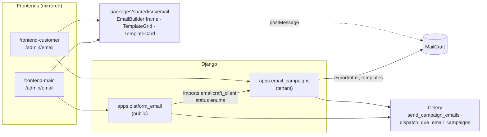

# Email Campaigns

# Email Campaigns

Two parallel email products built from one set of parts: **coach → student** campaigns inside a tenant, and **superadmin → coach** campaigns at the platform level. Neither side renders email HTML itself — both delegate design and rendering to **MailCraft** (called *EmailCraft* in backend code) and use Celery for the actual fan-out.

The coach side came first; the platform side is a deliberate mirror of it, sharing the backend HTTP client, the status enums, and the React components — differing only in audience, recipient filters, and API namespace.

## Sub-modules

| Page | Contains |
|---|---|
| [Email Campaigns — backend-apps](email-campaigns-backend-apps.md) | `apps.email_campaigns` (tenant schema) + `apps.platform_email` (public schema): models, `emailcraft_client`, `recipients.py`, Celery tasks, `/api/v1/email/*` and platform-email views |
| [Email Campaigns — packages-shared](email-campaigns-packages-shared.md) | `EmailBuilderIframe`, `TemplateGrid`, `TemplateCard` — the builder embed and template browser used by both apps |
| [Email Campaigns — frontend-customer-src](email-campaigns-frontend-customer-src.md) | Coach UI under `/admin/email`, `src/lib/email-api.ts` |
| [Email Campaigns — frontend-main-src](email-campaigns-frontend-main-src.md) | Superadmin UI under `/admin/email`, `src/lib/platform-email-api.ts` (plus an `email-api.ts` alias shim so shared components resolve) |

## How the pieces fit

**The API-key hop.** Neither frontend ever holds a MailCraft key. Both `views.py` files resolve one through their own `_get_api_key` before any template call (`template_list`, `template_detail`, `send_campaign`, `setup_email`), and `emailcraft_client` splits its headers by scope — `_site_headers` for provisioning (`provision_organization`), `_org_headers` for per-tenant template operations (`list_templates`, `delete_template`, which also goes through `_request_with_fallback`).

**Templates are MailCraft's, not ours.** Template browsing and previews are proxied live: `TemplatesPage` → `fetchPreviews` → `previewTemplates` → `clientFetch`, on both sides. The same `TemplateGrid` renders the results for coach and superadmin.

**Recipients are ours.** `recipients.resolve_recipients` is the single audience resolver, shared by `get_recipient_count` (the compose-time live count) and `send_campaign_emails` (the send). Coach-side filters target students; platform-side filters target coaches by plan, workspace, or hand-picked list.

**Sending and scheduling.** `send_campaign_emails` renders each recipient's personalized HTML through MailCraft's export endpoint and sends via Resend — note each render counts against the MailCraft quota. Scheduled campaigns are picked up by the beat task `dispatch_due_email_campaigns`, which loops tenants via `_dispatch_email_for_current_tenant`.

## Key workflows

**Compose (identical shape in both apps).** A three-step wizard in `email/compose/page.tsx`, with step and template selection mirrored into the URL — `setStep` / `setSavedTemplateId` / `setSavedTemplateName` all funnel through `syncUrl`, so a compose session survives reload. Step 1 is either `TemplateGrid` (pick an existing template) or `handleStartFromScratch` (open `EmailBuilderIframe` empty); step 2 picks recipients with a live count; step 3 sends or schedules.

**Inspect.** `admin/email/page.tsx` (`EmailDashboardPage` / `PlatformEmailDashboardPage`) lists campaigns via `fetchCampaigns` → `listCampaigns`, and `campaigns/[id]/page.tsx` drills into per-recipient delivery via `getCampaign` — the same component shape against the two different API clients.

## Working notes

- Changes to shared components in `packages/shared/src/email` land in **both** admins — check the superadmin side too, not just the coach side.
- `frontend-main/src/lib/email-api.ts` exists only to satisfy the shared components' import path; the real client is `platform-email-api.ts`.
- Anything added to `email_campaigns` (client methods, enums) is a candidate for reuse by `platform_email` rather than duplication — that's the existing direction of dependency.