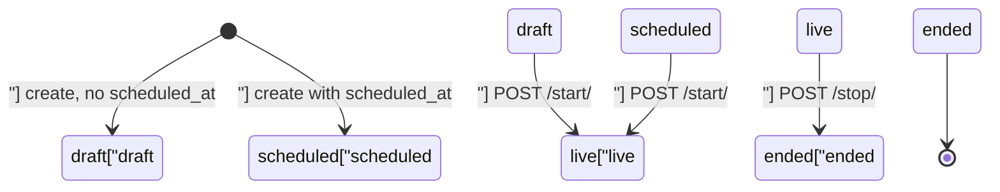

# Live Events & Calendar — apps

# Live Events & Calendar (`backend/apps/live/`)

`apps.live` is a **TENANT_APP** — every row lives inside a tenant's Postgres schema. It owns the four kinds of scheduled events a coach can sell, the GetStream video integration that powers two of them, and two distinct calendar feeds (one student-facing, one coach-facing).

---

## The four event types

All four models are structurally near-identical. What differs is *how the event is delivered* and *what secret the coach hands out*:

| Model | Delivery | Secret field(s) | Live status label | GetStream? |
|---|---|---|---|---|
| `LiveClass` | In-app WebRTC call (`default` call type) | `room_name` (server-generated) | `"live"` | yes |
| `LiveStream` | In-app broadcast (`livestream` call type, backstage → live) | `room_name` | `"live"` | yes |
| `ZoomClass` | External Zoom meeting | `zoom_link`, `zoom_meeting_id` | `"live"` | no |
| `OnsiteEvent` | In-person venue | `address` (`location` stays public) | `"ongoing"` | no |

Shared fields across all four: `title`, `description`, `instructor` (FK to the tenant user), `status`, `pricing_type`/`price`, `duration_minutes`, `scheduled_at`/`started_at`/`ended_at`, `thumbnail`/`thumbnail_url`, plus M2M `filter_options` (`filters.FilterOption`) and `tags` (`tags.Tag`). `LiveClass` and `LiveStream` additionally carry `recording` (FK to `courses.Video`), `recording_url`, and `auto_recording`.

### Two notions of status

This is the single most common source of confusion in this app. There are **two** status values and they are not the same thing:

- **`status` (DB column)** — the lifecycle field. Written by the start/stop endpoints and by `_ScheduledOnCreateMixin`. Used for *queryset filtering* (hiding drafts from students) and as a guard on start/stop.
- **`computed_status` (property)** — derived on the fly from `scheduled_at + duration_minutes` via `_EventStatusMixin._computed_status()`:

```
scheduled_at is None            → "draft"
now < scheduled_at              → "scheduled"
now < scheduled_at + duration   → "live"  (or "ongoing" for OnsiteEvent)
otherwise                       → "ended"
```

The calendar feeds report `computed_status`; the CRUD serializers report the stored `status`. A class whose scheduled window has passed will read `"ended"` on the calendar even if nobody ever pressed Stop. `computed_ended_at` follows the same pattern — the real `ended_at` if set, otherwise the projected end of the scheduled window.

`_ScheduledOnCreateMixin` exists to bridge a gap in that lifecycle: models default to `"draft"`, student lists filter drafts out, and nothing else promotes draft→scheduled (start goes draft/scheduled→live, stop goes live→ended). So the create serializers set `status = "scheduled"` when `scheduled_at` is supplied. Without it, a scheduled class would stay invisible forever.

### `room_name`

`LiveClass.save()` and `LiveStream.save()` mint `room_name` on first save if empty — `{tenant_slug}-{uuid12}` and `{tenant_slug}-ls-{uuid12}` respectively, with the slug read off `connection.tenant`. It's `editable=False` and `unique`. The tenant prefix means GetStream call IDs are globally unique across tenants, which matters because GetStream is a single shared account for the whole platform.

---

## URL surface

Five separate `urls_*.py` modules, each mounted independently under `/api/v1/` by the project URLconf:

| Module | Routes |
|---|---|
| `urls.py` | `""`, `"<pk>/"`, `"<pk>/start/"`, `"<pk>/stop/"`, `"<pk>/token/"` → `LiveClass` |
| `urls_streams.py` | same five → `LiveStream` |
| `urls_zoom.py` | `""`, `"<pk>/"` → `ZoomClass` (no start/stop/token) |
| `urls_onsite.py` | `""`, `"<pk>/"` → `OnsiteEvent` |
| `urls_calendar.py` | `""`, `"<event_type>/<pk>/"` → student calendar |
| `urls_content_calendar.py` | `""` → `/api/v1/admin/content-calendar/` |

All views are function-based (`@api_view`), not ViewSets.

---

## Permissions

Deliberately layered, and worth reading carefully before adding an endpoint:

- **List/detail GET** — `AllowAny`. Anonymous students can browse the catalog. Drafts are filtered out in-queryset for anyone failing `is_coach_or_owner(request.user)`.
- **POST/PUT** — `AllowAny` at the decorator, then an explicit `is_coach_or_owner` check returning 403 inside the handler.
- **DELETE** — stricter still: `request.user.role != "owner"` → 403. Coaches can edit but not delete.
- **start/stop** — `IsCoachOrOwner`.
- **token** — `IsAuthenticated` plus a `ContentAccessService.check_access` gate.
- **Coach content calendar** — `IsCoachOrOwner`.

Note the two-tier pattern (`AllowAny` decorator + in-body role check) is intentional: it lets one view serve both the public catalog and the admin CRUD.

---

## Access gating — what gets hidden from whom

Everything routes through `apps.core.access.ContentAccessService`. Three separate gates:

**1. Join secrets.** `_viewer_has_access(context, instance)` in `serializers.py` decides whether a viewer sees the secret. Anonymous users only ever see secrets of `pricing_type == "free"` content (`check_access` assumes an authenticated user for the purchase lookup). `ZoomClassSerializer.to_representation` blanks `zoom_link`/`zoom_meeting_id`; `OnsiteEventSerializer.to_representation` blanks `address` but keeps `location`, so a paid on-site event can still be advertised by city without leaking the door number.

**2. Recordings.** `get_recording_signed_url` returns `None` for anonymous users, returns the URL unconditionally for `owner`/`coach`, and otherwise runs `check_access`. Only then does it presign via `generate_presigned_download_url`.

**3. `access_info`.** `get_access_info` first checks `context["access_map"]` (a caller-supplied pk → `AccessInfo` map for bulk N+1 avoidance), then falls back to per-object resolution. For anonymous viewers it constructs `AccessInfo` directly: free → `has_access=True, access_reason="free"`; paid → `has_access=False, unlock_methods=["purchase"]` with `content_currency(obj)`.

Because `access_info` is serializer-level, the *existence* and price of paid content is always public — only the join details and recordings are gated.

---

## GetStream integration

`stream_service.py` is the only module that talks to GetStream. Every public function begins with a `_fake()` check on `settings.LIVE_FAKE_ENABLED` and delegates to `fake_stream_service.py` when set — the fake logs and returns `None`/a sentinel token, so create/join/stop flows work offline end-to-end (the browser video canvas can't actually connect; the UI is testable up to the join screen). Dev `.env` sets `LIVE_FAKE_ENABLED=true`; unset it to exercise real keys.

User IDs are `f"u{pk}"` — GetStream requires ≥2 characters, so the `u` prefix is a safety margin, not decoration.

```mermaid
graph LR
    A[live_class_start] --> B[create_call]
    B --> C[upsert_user]
    B --> D["client.video.call('default', room_name)"]
    E[live_class_token] --> C
    E --> F[generate_user_token]
    F --> G["_create_token(call_cids=...node[")"]"]
    B -.LIVE_FAKE_ENABLED.-> H[fake_stream_service]
    F -.LIVE_FAKE_ENABLED.-> H
```

### Token scoping — do not regress this

`generate_user_token(user_id, call_cids=None, channel_cids=None)` has two paths:

- **Scoped** (`call_cids` and/or `channel_cids` given) — drops to the SDK's lower-level `client._create_token()`, because it is the only builder accepting `channel_cids`. The token is valid only for those CIDs.
- **Unscoped** — `client.create_token()`, a broad user token, kept for callers that legitimately need one.

The view layer always scopes:

- `live_class_token` → `call_cids=[f"default:{room_name}"]`
- `live_stream_token` → `call_cids=[cid]` **and** `channel_cids=[cid]` where `cid = f"livestream:{room_name}"` (the video call and the chat channel share the CID)

Without scoping, a token minted for one paid class could be replayed to join any other call in the tenant — or any other tenant's, since GetStream is shared. If you add a new event type with video, scope its token the same way.

`api_key()` returns the publishable key for browser SDKs, or the sentinel `"fake-local"` under the fake.

### Recording

`create_call` / `create_livestream` set `RecordSettingsRequest(mode="auto-on" if auto_recording else "available", quality="1080p")`. `create_livestream` additionally calls `call.go_live()` to leave backstage. Both stop functions wrap `stop_recording()`, `stop_live()` and `end()` in individual try/excepts — a call that was never recording shouldn't block the DB state transition.

---

## Start / stop / token lifecycle



`live_class_start` refuses anything not in `("draft", "scheduled")` with 400. It calls GetStream **first** and returns 500 without mutating the row if that fails — so a failed provider call never leaves a class marked live with no room behind it. Only on success does it set `status="live"`, `started_at=now()` and `save(update_fields=[...])`.

`live_class_stop` requires `status == "live"`, calls `stop_call(room_name)` (which swallows its own provider errors), then sets `status="ended"`, `ended_at=now()`.

`live_class_token` requires the class to be live, runs `check_access`, and on denial returns 403 with the serialized `AccessInfo` in the body — the frontend uses that payload to render the purchase prompt rather than a bare error. On success it returns `{token, api_key, call_id, role}`, where `role` is `"host"` if the caller is the instructor or an `owner`, else `"viewer"`.

`live_stream_*` mirrors all of this exactly, differing only in the GetStream call type and the token's channel scoping.

---

## List query helpers

Two small helpers in `views.py` are shared by all four list endpoints:

- `_search_and_order_live_queryset(request, qs)` — `?search=` does an `icontains` OR across `title`/`description`, then delegates to `apply_tag_filter` and `apply_ordering` (allowed fields: `title`, `created_at`, `scheduled_at`) from `apps.core.pagination`.
- `_serialize_list_response(request, qs, serializer_class)` — **opt-in pagination**. Only paginates when `limit` or `offset` is present in the query string; otherwise returns a bare list. Callers that assume a `{results: [...]}` envelope will break if they omit those params.

---

## Two calendars — and why they're separate

### Student calendar (`views.py`: `calendar_events`, `calendar_event_detail`)

`AllowAny`, live-only, drafts excluded via `scheduled_at__isnull=False`. Filters on `?from=`/`?to=` (raw values passed straight to `scheduled_at__gte/__lte`) and `?types=`. Note the type mapping quirk: `types=live_class` pulls in **both** `LiveClass` and `ZoomClass` rows, and in `calendar_event_detail` a `zoom_class` URL is re-labelled to `"live_class"` in the response — Zoom classes are presented to students as ordinary live classes. `MODEL_MAP` still accepts all four type strings on the detail route.

Each row is built by `_to_calendar_event`, which uses `computed_status` and `computed_ended_at`, presigns the thumbnail via `sign_if_s3_key`, and inlines serialized `filter_options` (querysets are `prefetch_related("filter_options")`). Results are merged across models in Python and sorted by `scheduled_at`. The detail route additionally attaches `access_info` — from `ContentAccessService` when authenticated, or constructed inline for anonymous callers.

### Coach content calendar (`content_calendar.py`: `coach_content_calendar`)

`GET /api/v1/admin/content-calendar/?from=&to=&types=live,blog,email`, gated by `IsCoachOrOwner`. This is a **different feed with a different shape** — it spans three apps and deliberately includes drafts and scheduled items:

- **live** — iterates `LIVE_SOURCES`, the `(model, source_key, label)` table covering all four event models. Filters in SQL on `scheduled_at`.
- **blog** — `apps.blog.models.BlogPost`, keyed on `published_at or created_at`.
- **email** — `apps.email_campaigns.models.EmailCampaign`, keyed on `scheduled_at or sent_at or created_at`, with status translated through `EMAIL_STATUS_MAP` (`sent` → `completed`).

Blog and email are imported lazily inside the branches and window-filtered in Python via `_in_window`, because their timestamp is a coalesce across columns rather than a single indexable field.

Item IDs are namespaced `"<source>-<pk>"` so a `LiveClass` pk can't collide with a `BlogPost` pk in the frontend's key space. Each item carries an `href` pointing at the right admin route (`/admin/live`, `/admin/blog`, `/admin/email/campaigns/<id>`).

`_parse_bound(value, *, end)` accepts either a date or a full datetime. A bare date becomes start-of-day for `from` and end-of-day for `to` (`time.min` / `time.max`), so an inclusive `[from, to]` window written in dates behaves the way a coach expects rather than silently excluding the last day. Naive values are made aware with the current timezone.

---

## Serializer layout

Each model has a **read serializer** (full fields, computed URLs, `access_info`, nested `filter_options`/`tags`) and a **create serializer** (writable fields only, `filter_option_ids` / `tag_ids` write-through). All four create serializers mix in `_ScheduledOnCreateMixin`.

`_tag_ids_field()` calls `tag_ids_field("event")` — all four event models share one `"event"` tag pool, so tags are interchangeable across live classes, streams, Zoom classes and on-site events.

`instructor`, `status`, `room_name`, `started_at`, `ended_at`, `created_at` and all recording fields are read-only on the read serializers; `instructor` is set server-side in the view (`serializer.save(instructor=request.user)`).

`CalendarEventSerializer` / `CalendarEventDetailSerializer` / `AccessInfoSerializer` are plain `serializers.Serializer` classes describing the dict shape built by `_to_calendar_event` — they exist mainly so drf-spectacular emits a real schema for the calendar routes.

---

## Contributing notes

- **Adding a field to one event type usually means adding it to four places** — model, read serializer `fields`, create serializer `fields`, and (if it should surface on the calendar) `_to_calendar_event`. There is no shared abstract base model; only `_EventStatusMixin` is shared, and it's a plain mixin, not a `models.Model`.
- **After any serializer change**, run `npm run gen:api` in `frontend-customer` and review the `src/types/api-generated.ts` diff.
- **New video-backed event type?** Mint a tenant-prefixed `room_name` in `save()`, add a `_fake()`-guarded function pair to `stream_service.py` + `fake_stream_service.py`, and scope its token with `call_cids`.
- **New source in the coach calendar?** Add to `LIVE_SOURCES` if it's a live model; otherwise add a `want(...)` branch with a lazy import, a namespaced `"<source>-<pk>"` id, and an `href`.
- **E2e**: `make e2e-spec SPEC=04-live-class` covers the live-class journey; it relies on `LIVE_FAKE_ENABLED=true` to run without GetStream credentials.
- **Known cost**: `calendar_events` and `coach_content_calendar` both fan out across models and merge in Python. They don't paginate. On tenants with large histories this will need a bounded default window.