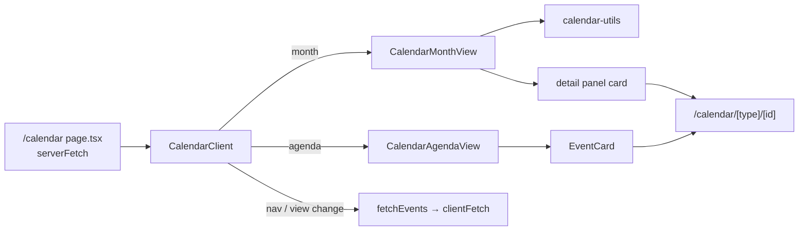
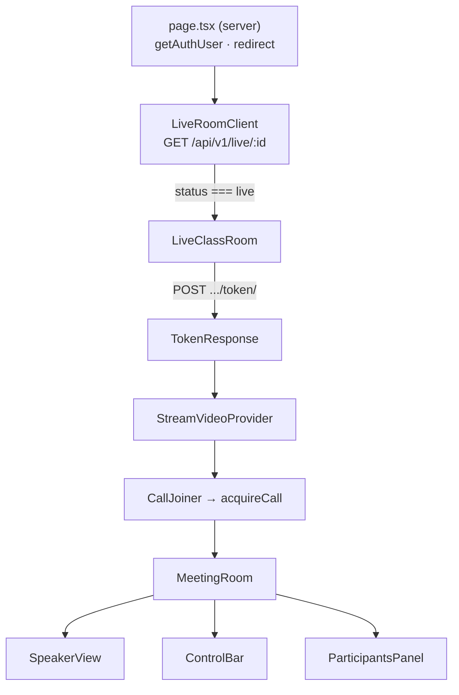

# Live Events & Calendar — src

# Live Events & Calendar (`frontend-customer/src`)

Student-facing surface for everything time-based a coach sells: live classes (video calls), live streams (broadcast + chat), Zoom classes, and in-person onsite events. The module spans three concerns that share a type vocabulary but very little code:

1. **Discovery** — calendar and event-list pages that read a unified `/api/v1/calendar/` feed.
2. **Detail & purchase** — a per-event page that resolves access and routes the student to buy, log in, or join.
3. **Realtime rooms** — GetStream-backed video for live classes (`/live/[id]`) and live streams (`/live-stream/[id]`).

## Type vocabulary — `src/types/live.ts`

Four resource types map 1:1 to backend models in `apps.live`: `LiveClass`, `LiveStream`, `ZoomClass`, `OnsiteEvent`. They are near-identical in shape; the differentiators are the delivery fields — `room_name` (GetStream call id) on the two streaming types, `zoom_link`/`zoom_meeting_id` on `ZoomClass`, `location`/`address`/`max_capacity` on `OnsiteEvent`.

The discovery surface never consumes those types directly. It consumes the flattened union:

```ts
type CalendarEventType = "live_class" | "live_stream" | "onsite_event" | "zoom_class";
interface CalendarEvent { id; type; title; scheduled_at; status; pricing_type; price; location; thumbnail_signed_url; … }
interface CalendarEventDetail extends CalendarEvent { access_info: AccessInfo }
```

`(id, type)` is the composite key — `id` alone is not unique across the feed, which is why every list render keys on `` `${event.type}-${event.id}` `` and every href is `/calendar/${type}/${id}`.

**Contract note:** `CalendarEvent.scheduled_at` is a non-nullable `string`, while `LiveClass.scheduled_at` etc. are `string | null`. The backend serializer only emits scheduled rows into the calendar feed. Code in this module relies on that — e.g. `EventsPage` sorts with `a.scheduled_at.localeCompare(b.scheduled_at)` without a null guard.

## Discovery: calendar & events pages

Two entry points over the same endpoint, both `force-dynamic` server components that fetch through `serverFetch` (which attaches the `X-Tenant-Domain` header — see the multi-tenancy notes in `CLAUDE.md`):

| Route | Range | Client |
|---|---|---|
| `/calendar` | derived from `?view=` + `?date=` via `getDateRangeParams` | `CalendarClient` |
| `/events` | today → +90 days | `EventsList` |

Both wrap the fetch in `try/catch` and fall back to `events = []` — a calendar page never fails hard on a backend hiccup, it renders empty.

`CalendarClient` (`components/public/calendar/calendar-client.tsx`) owns all interaction after hydration:

- **Views:** `month` (`CalendarMonthView`) and `agenda` (`CalendarAgendaView`). On mount it auto-switches to agenda below 768px unless `?view=` was explicit.
- **Navigation:** `navigate(±1)` shifts a month (month view) or 30 days (agenda), then calls `updateURL` (`router.replace`, `scroll: false`) *and* `fetchEvents` — the URL is kept in sync for shareability but the refetch is client-side; it does not rely on a server re-render.
- **Refetch failure keeps the previous events** and surfaces a `toast.error`. The stale grid dims via `opacity-60` rather than blanking.
- **Type filter:** `activeTypes` is a `Set<CalendarEventType>`, filtered client-side over the already-fetched list. Deselecting the last remaining type is refused (`if (next.size > 1)`). `zoom_class` has no chip of its own — it rides under the `live_class` chip, since both read as "Live Class" to a student.
- **Timezone** comes from `useTenant()?.timezone`, defaulting to `"UTC"`, and is threaded down to every `formatTime` / `groupEventsByDate` call.



### Date math lives in `src/lib/calendar-utils.ts`

Shared by the public calendar *and* the admin `UnifiedCalendar`. The functions this module leans on: `getDateRangeParams(view, date)` (the `from`/`to` query params — internally builds the month grid so the fetched range covers leading/trailing days), `getMonthGridDates(year, month)`, `groupEventsByDate(events, tz)` → `Map<dateKey, CalendarEvent[]>`, `toDateKey`, `isSameDay`, `isToday`, `formatTime`, `formatMonthYear`, `formatDateHeader`. Grouping is timezone-aware; the day cell keys are plain `YYYY-MM-DD` strings, so grid lookups are string-keyed and cheap.

Per-type colors are centralized in `src/lib/event-colors.ts` as `EVENT_TYPE_CONFIG[type]` → `{ label, dotClass, bgClass, borderClass, textClass }`. Every card, pill, badge and month-cell dot reads from it; **add a new `CalendarEventType` and you must add an entry here or renders crash on `config.label`.**

### Month view specifics

`CalendarMonthView` keeps its own `selectedDate` state (independent of `currentDate`, which drives the month being displayed). The right-hand detail panel shows that day's events; when the day is empty it falls back to `upcomingEvents` — the next 3 events strictly after the selected day, computed in a `useMemo`. Desktop cells show up to `MAX_VISIBLE_EVENTS = 2` pills plus a "+N more" counter; mobile cells collapse to colored dots.

## Event detail & access

`/calendar/[type]/[id]` server-fetches `CalendarEventDetail` and `getAuthUser()` in parallel, renders a not-found panel if the fetch throws, and otherwise hands off to `EventDetailClient` with `isLoggedIn`. All access logic is driven by `event.access_info` (`AccessInfo` from `types/billing`) — `has_access`, `price`, `currency` — so the frontend never re-derives entitlement; it renders whatever the backend decided. Status branching (`live`/`ongoing`, `ended`, `scheduled`) drives both `EventStatusBadge` and which CTA the sidebar `EventAction` shows.

The student's own list at `/live-classes` is a separate, simpler client page: it fetches `/api/v1/live/` via `clientFetch`, partitions by `status` into a "Live Now" banner plus Upcoming/Past tabs, and links live rows to `/live/${id}`. Loading and error states go through `PageState` + `SkeletonCardGrid` per the project's loading conventions.

## Realtime rooms

Both room routes follow the same three-hop shape:

**Server page** (`force-dynamic`) → `getAuthUser()`, redirect to `/login?toast=...` if anonymous → **thin client** (`LiveRoomClient` / `LiveStreamClient`) that fetches the resource and gates on `status === "live"` → **room component** (`LiveClassRoom` / `LiveStreamRoom`) that mints a GetStream token and joins.

The status gate matters: a non-`live` class renders a "hasn't started yet" / "has ended" panel and never mints a token or opens a socket. Note these two client wrappers use raw `fetch(..., { credentials: "same-origin" })` rather than `clientFetch`, since they only need the status and tolerate a bare `res.ok` check.

Token exchange is a `POST` to `/api/v1/live/{id}/token/` (or `/api/v1/live-streams/{id}/token/`) returning:

```ts
{ token: string; api_key: string; call_id: string; role: "host" | "viewer" }
```

`role` is the sole source of host authority in the UI — everything gated behind `isHost` (recording, screen share, mute-all, kick/block, end class) trusts the backend's determination. GetStream user ids are namespaced as `` `u${userId}` `` to avoid colliding with other id spaces in the Stream app.

### StrictMode survival: `call-session.ts` and the deferred disconnect

React StrictMode double-mounts in dev, and naively joining/leaving a Stream call across that cycle races the SFU — the UI strands in "Joining…" or "Class Ended". Two coordinated mechanisms fix this:

- **`acquireCall(client, type, id)` / `releaseCall(type, id)`** (`components/live/call-session.ts`) — a module-level `Map` keyed `` `${type}:${id}` `` holding `{ call, joinPromise, refs }`. The first acquire creates the call and starts `call.join({ create: false })`; a remount gets the *same in-flight promise* rather than a second join. `releaseCall` decrements and defers teardown by a `setTimeout(…, 0)` tick, so a remount that re-acquires within the tick cancels it. Teardown chains off `joinPromise` — never `leave()` mid-join.
- **`StreamVideoProvider`** (`components/live/stream-video-provider.tsx`) — uses `StreamVideoClient.getOrCreateInstance` (a second `new` client for the same user orphans the first call session) and applies the same deferred-teardown trick to `disconnectUser()`, keyed by `` `${apiKey}:${user.id}` ``.

If you touch join/leave lifecycle here, **verify in dev with StrictMode on** — the bugs this guards against are invisible in production builds.



### Live class room (`components/live/`)

`LiveClassRoom` fetches the token, then `CallJoiner` acquires the call (`type: "default"`) and waits on `joinPromise` before rendering `<StreamCall>`. `MeetingRoom` holds the chrome state: `showParticipants`, `fitScreen`, and a fullscreen auto-hide (`startHideTimer` blanks the overlay after 3s of no mouse movement while `document.fullscreenElement` is set). Leaving is detected via `CallingState.LEFT` or the local `ended` flag set by `onCallEnded`.

- **`SpeakerView`** picks the main tile by priority: explicit `pinnedId` → active screen sharer (`publishedTracks.includes(3)`) → the participant whose `roles` include `"host"` → the local participant. Everyone else lands in a paginated filmstrip (`FILMSTRIP_PAGE_SIZE = 6`), horizontal on mobile / vertical on desktop. When a screen share is up, the sharer's *camera* tile stays in the filmstrip.
- **`VideoTile`** wraps Stream's `ParticipantView` with a name/mic overlay and an initials `Placeholder`. Track-type numbers are used raw throughout the module: `1 = audio`, `2 = video`, `3 = screen share`.
- **`ControlBar`** — mic/camera/screen-share/recording/fullscreen plus role-conditional actions. Students without `SEND_AUDIO` get a "Raise Hand" button backed by `useRequestPermission(OwnCapability.SEND_AUDIO)`; the host receives `call.permission_request` events and renders inline Allow/Deny toasts calling `call.grantPermissions`. Ending the class is a `clientFetch` `POST` to `/api/v1/live/{id}/stop/` (errors swallowed — it may already be ended) followed by `onCallEnded()`; a student's Leave just calls `call.leave()`.
- **`ParticipantsPanel`** — host moderation. Note the semantics: the mic/camera toggles **grant and revoke permissions** rather than muting, so a revoked student cannot simply unmute themselves. Bulk actions use `call.muteAllUsers("audio" | "video")`; `kickUser({ user_id })` removes and `kickUser({ user_id, block: true })` blocks rejoining, both behind an inline confirm.

### Live stream room (`components/live-stream/`)

`LiveStreamRoom` is a single component rather than a provider/joiner split, and adds chat. Its effects run in sequence: fetch token → create the video client (`getOrCreateInstance`) *and* a `StreamChat` client (`StreamChat.getInstance`, `connectUser`, then `channel("livestream", call_id).watch()`) → `acquireCall(videoClient, "livestream", call_id)`. Note the call type is `"livestream"` here, versus `"default"` for live classes.

The view splits on `tokenData.role`:

- **`StreamHostView`** — self-preview with a PiP camera tile during screen share, LIVE badge, viewer count, recording indicator, and an `End Stream` action posting to `/api/v1/live-streams/{id}/stop/`.
- **`StreamViewerView`** — read-only; finds the broadcaster via `p.roles?.includes("host")`, shows their screen share with a PiP camera, and offers only fullscreen.

**`StreamChatPanel`** deliberately does *not* use `stream-chat-react` components — it renders a minimal list from `channel.query({ messages: { limit: 50 } })` plus a `message.new` listener. Emoji reactions are transported as **regular chat messages prefixed `reaction:`**, intercepted in the `message.new` handler and turned into a floating animation instead of a chat line. That's a deliberate shortcut over Stream's reaction API; anything else parsing this channel must strip that prefix.

## Backend contract summary

| Endpoint | Used by |
|---|---|
| `GET /api/v1/calendar/?from=&to=` | `/calendar`, `/events`, `CalendarClient.fetchEvents` |
| `GET /api/v1/calendar/{type}/{id}/` | event detail page (returns `access_info`) |
| `GET /api/v1/live/` | `/live-classes` student list |
| `GET /api/v1/live/{id}/`, `POST .../token/`, `POST .../stop/` | live class room |
| `GET /api/v1/live-streams/{id}/`, `POST .../token/`, `POST .../stop/` | live stream room |

Server components call these via `serverFetch` (`src/lib/api-server.ts`); client code via `clientFetch` (`src/lib/api-client.ts`), which adds the tracking session id and throws `ApiError`.

## Contributing notes

- **Adding an event type** requires, at minimum: the union member in `CalendarEventType`, an `EVENT_TYPE_CONFIG` entry, a chip in `EventTypeFilter` (or an explicit grouping like `zoom_class`→`live_class` in `CalendarClient`'s filter), and a `/calendar/[type]/[id]` route that the backend serves.
- **Never key event lists on `id` alone** — use `` `${type}-${id}` ``.
- **Time formatting always takes an explicit timezone** from `useTenant()`. Bare `toLocaleDateString` calls exist (e.g. the weekday label in `CalendarAgendaView`, `formatDate` in `/live-classes`) and render in browser-local time; keep new date output going through `calendar-utils` unless local time is genuinely what you want.
- **Room lifecycle changes go through `acquireCall`/`releaseCall`** — don't call `client.call().join()` directly, and don't `leave()` outside the release path.
- `LiveClassesPage` declares a local `LiveClass` interface rather than importing from `types/live.ts`; if you touch it, prefer converging on the shared type.
- The room routes are the only place in this module that bypass `clientFetch`; the video SDK components are heavy and client-only, so everything under `live/` and `live-stream/` is `"use client"` below the server page boundary.