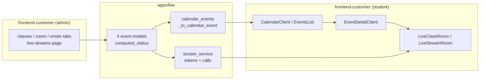

# Live Events & Calendar

# Live Events & Calendar

Everything time-based that a coach sells: **live classes** (in-app WebRTC calls), **live streams** (in-app broadcast + chat), **Zoom classes** (external link), and **onsite events** (physical address). The four event types share one shape end to end — near-identical models, one unified calendar feed, one detail page — and diverge only in *how the event is delivered* and *what secret the student receives on access*.

Two halves:

- **[Backend — `apps/live/`](live-events-calendar-apps.md)** — the four TENANT_APP models, their create/list endpoints, the GetStream integration (`stream_service`), and the two calendar feeds (student-facing and coach-facing).
- **[Frontend — `frontend-customer/src`](live-events-calendar-src.md)** — discovery (calendar + events list), the per-event detail/purchase page, the realtime rooms, and the coach admin tabs.

## How the halves meet

Three contracts carry the whole module:

| Contract | Backend | Frontend |
|---|---|---|
| Unified feed | `calendar_events` → `_to_calendar_event` flattens all four types into one event shape | `CalendarClient.fetchEvents` / `EventsList` render it type-agnostically |
| Access + secret | detail endpoint resolves entitlement, returns `room_name` / Zoom link / address only when granted | `EventDetailClient` branches to buy, log in, or join |
| Realtime token | `generate_user_token` (via `get_client`, faked under `LIVE_FAKE_ENABLED`) | `LiveStreamRoom.fetchToken` / `CallJoiner`, both releasing via `call-session.releaseCall` |

## Key cross-cutting workflows

**Discovery → purchase → join.** `CalendarClient` (month grid or `CalendarAgendaView`, toggled by `ViewToggle`) requests a date window computed by `src/lib/calendar-utils.ts` (`getDateRangeParams` → `getMonthGridDates` / `toDateKey`) and renders `EventCard`s from the unified feed. Clicking through hits `/[type]/[id]`, where `EventDetailClient` resolves access; only then does the student reach a room or the external Zoom link. The room components fetch a per-user GetStream token at mount and always release the call on unmount — the single most common source of stale-call bugs.

**Status is derived, never stored.** `computed_status` / `_computed_status` on the models decides scheduled/live/ended from timestamps, so the calendar, the detail page, and the coach tabs all show the same label without a background job keeping a status column in sync. Each type carries its own live label (a live class is `"live"`, a live stream goes backstage → live).

**Coach authoring mirrors the same four shapes.** The admin tabs (`classes-tab`, `zoom-tab`, `onsite-tab`, plus the standalone `live-streams` page) share `admin/live/shared.tsx` (e.g. `PricingBadge`) and each keep their own `resetForm`; on the server the create serializers likewise share `_filter_option_ids_field` / `_tag_ids_field` so pricing options and tags validate identically across types.

## Where to be careful

- **Adding a fifth event type** means touching all three contracts, not just a model: `_to_calendar_event`, the type union in `src/types/live.ts`, and the detail-page routing.
- **Changing a serializer** shifts the frontend contract — regenerate `api-generated.ts` and read the diff.
- **Live rooms can't be exercised offline without `LIVE_FAKE_ENABLED=true`**, which routes `stream_service` through `_fake`; that flag is what lets the live-class e2e specs run without GetStream credentials.
