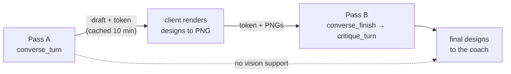

# Logo Studio & Brand Identity — backend-apps

# Logo Studio & Brand Identity — Backend

The backend half of Logo Studio: everything that turns a coach's brief (or free-text nudge) into a **validated logo recipe** the frontend composer can render, plus the platform-wide curated logo catalog the studio's "Browse" entrance reads from.

Two Django apps are involved:

| Path | Role |
|---|---|
| `backend/apps/tenant_config/logo_*.py` | Per-tenant AI design: schemas, prompts, geometry compiler, image generation, vectorizer, recipe validator, service layer |
| `backend/apps/core/curated_logos/` | Public-schema curated logo library (read API, PNG normalization, tracing) |
| `backend/apps/core/models.py` | `LogoAiUsage` (quota/spend), `CuratedLogo` (catalog rows) — both SHARED_APPS |

The frontend composer (`frontend-customer/src/lib/logo/`) owns rendering. The backend never produces SVG markup — only **path `d` strings and role tokens**. That split is what makes the injection boundary below tractable.

---

## The one invariant

> **Every mark path that leaves this module has passed through `logo_recipe.validate_recipe`.**

Recipes render inline as SVG for every visitor of a tenant site and get exported to files. A mark's `d` string is therefore untrusted content on a hot path, and `logo_recipe._PATH_D_RE` is the trust boundary:

```python
_PATH_D_RE = re.compile(r"^[MmLlHhVvCcSsQqTtAaZz0-9 ,.\-eE]+$")
```

Nothing else is permitted — no `url()`, no markup, no external references. `_custom_mark` drops any path that fails the whitelist or exceeds `MARK_CUSTOM_MAX_D_LEN` (12000), caps the list at `MARK_CUSTOM_MAX_PATHS` (12), and **degrades to plain initials** if nothing survives, because a recipe must always render.

Because the boundary lives in exactly one function, every AI producer routes through it via a shim rather than re-implementing the checks:

- `logo_ai._validate_pack_mark(item)` — compiles typed elements (`logo_geometry.compile_elements`), stuffs them into `_DUMMY_RECIPE` (a minimal already-valid v2 skeleton), runs `validate_recipe`, and returns `{rationale, paths, elements}` or `None`. If validation degraded the mark to `initials`, the whole mark is dropped — never half-degraded.
- `logo_ai._validate_custom_paths(paths)` — same trip for geometry that already arrives in path form (traced images, client-supplied pinned marks).

`validate_recipe` itself follows the app-wide philosophy: **unknown enums are a hard `ValidationError` (→ 400); free text and numbers are clamped**. The studio and composer never emit bad enums, so an unknown one means a contract break worth surfacing loudly; a stray number just gets pulled into range.

Note the version numbers: `upgrade_recipe` migrates v1 → **v2**, and `validate_recipe` emits **v3** (v3 added `colors.mark` / `mark2` / `mark_accent` accepting a shaped `Fill` dict as well as a hex string, via `_fill_or_hex`). `upgrade_recipe` has a TypeScript twin at `frontend-customer/src/lib/logo/migrate.ts` with a parity fixture on both sides.

---

## `logo_geometry.py` — the drafting engine

Pure math, no Django imports. Its job is a division of labour stated in the prompts: **the model designs, this module drafts.** The model picks forms, positions, counts and angles; all trig, arc and offset math happens here, so marks come out optically precise instead of freehand-bezier wobbly.

`compile_elements(elements) -> [{d, fill[, fill_rule][, opacity]}, ...]`

Canvas is a `0 0 100 100` viewBox, **fills only, no strokes**. Angle convention is designer-intuitive: `0°` points straight up, positive turns clockwise (`_polar` does the -90° rotation).

Primitives: `circle`, `ring`, `dot_ring`, `dot_grid`, `rounded_rect`, `polygon`, `arc`, `star`, `petal`, `crescent`, `blob`, `wave`, `curve`, plus raw `path`. Combinators: `repeat` (child spun evenly around a center) and `mirror` (child + reflection across `x=axis_x`). Any element may set `"cut": true`, which merges its `d` into the *preceding* path and forces `fill_rule: "evenodd"` — that's how negative space works.

Three things to know before touching this file:

1. **The clamps are the contract.** `_clamp` with `_COORD` / `_RADIUS` / `_THICKNESS` bounds, plus `_fit_radius` (shrinks radial extents so an edge-placed disc scales down instead of getting viewBox-clipped). The pydantic schema in `logo_ai.py` is *deliberately loose* so one stray out-of-range number can't fail a whole turn at parse time — it gets clamped here instead.
2. **`_fmt` is whitelist-aware.** Max 2 decimals, no scientific notation, no negative zero — output must satisfy `_PATH_D_RE` downstream.
3. **Compilation is deterministic**, including `blob`: `_prng` is mulberry32, matched to the frontend's `abstract.ts`, chosen over `random.Random` for cross-version stability. Determinism is load-bearing — see the traced-mark rule below.

Combinators transform their child *parametrically* (`_rotated_child`, `_reflected_child`) rather than transforming compiled paths, hence `_CHILD_ROTATE_KEYS` and the arc special-case in `_reflected_child` (a mirrored arc needs `start_deg = -(start + sweep)`). `blob` is excluded from `_MIRRORABLE` because a seeded shape can't be param-reflected.

`_MAX_D = 2000` is a local budget for *authored* marks, deliberately tighter than `logo_recipe.MARK_CUSTOM_MAX_D_LEN` (12000, sized for traced line art). Marked KEEP IN SYNC because this module must stay Django-free.

---

## Design-with-AI: the staged conversation

`logo_converse.py` implements a live design session over three stages — `STAGES = ("icon", "name", "tagline")` — each with its own system prompt and pydantic output model:

| Stage | Prompt | Output model | What the model decides |
|---|---|---|---|
| `icon` | `ICON_STAGE_PROMPT` | `_IconTurn` | 1–3 marks + palette + `image_prompt`. No lockup, no fonts. |
| `name` | `NAME_STAGE_PROMPT` | `_LockupTurn` | Full lockups around the pinned mark: layout, badge, font, typography, `mark_scale`, optional `mark_gradient` |
| `tagline` | `TAGLINE_STAGE_PROMPT` | `_LockupTurn` | Same design, different tagline text |

All three prompts are assembled from shared blocks that live in `logo_ai.py` so they exist in exactly one place: `_ELEMENT_VOCABULARY_AND_PRINCIPLES` (the element reference + eight non-negotiable design principles, ending in the favicon test) and `_FONT_CATALOG` (KEEP IN SYNC with `frontend-customer/src/lib/logo/catalog.ts` `LOGO_FONTS`). `_SESSION_FRAME` sets the conversational stance — respond to what the coach just said, never re-offer a rejected candidate.

### Two passes per turn



**Pass A** (`converse_turn`) is one structured Claude call, validated into a `TurnResult`. **Pass B** (`critique_turn`) sends the client's actual renders back to the model under `CRITIQUE_PROMPT` — "would a $5,000 studio ship this?" — with a six-point checklist (collisions, balance, spacing rhythm, contrast, favicon survivability, type pairing). The model keeps good designs byte-identical and fully redraws failures.

Pass B is skipped entirely when `core_ai.supports_vision()` is false (the `cli` provider), in which case Pass A's response is already `phase: "final"`. **Pass B never costs a turn, and any failure serves the draft** (`source: "draft"`).

### The icon stage's extra hop: generate → vectorize

`apply_image_marks_stream` runs after validation on the icon stage only. It pops each candidate's `image_prompt`, has Gemini draw it (`logo_image.generate_mark_images`), vectorizes the PNG (`logo_trace.trace_mark`), re-validates through `_validate_custom_paths`, and swaps the traced paths into the design.

It is **per-candidate fail-open**: a missing prompt, a generation failure, a rejected trace — any of these leaves that candidate on its Claude-authored paths. A turn never comes back blank because of the image path. Gemini's spend is folded into `result.cost_usd` so the caller's single `record_attempt_cost` covers image spend under the same kill-switch.

`apply_image_marks` (blocking) is a thin drain of the generator, so the streamed and blocking paths cannot diverge on that fail-open behaviour. Same pattern for `_finish_turn`, shared by `converse_turn` and `converse_turn_stream`. `_finish_turn` deliberately starts *after* the provider call: routing the blocking path through the streaming provider would change the wizard's behaviour and its cli-provider fallback for no benefit.

---

## Traced marks are immutable

This is the subtlest rule in the module and the source of a class of real bugs.

A **traced** mark's paths came from vectorizing a raster — there is no source geometry that compiles to them. An **authored** mark's paths are exactly what its `elements` compile to. `is_traced_mark` exploits compiler determinism to tell them apart:

```python
def is_traced_mark(elements, paths):
    return paths != _validate_custom_paths(compile_elements(elements or []))
```

Why it matters: a model that "keeps a design unchanged" re-emits its `elements`, and every validator recompiles them — which would silently swap organic traced geometry for the authored primitives underneath it. The model *cannot* re-author paths it never wrote, so any attempt to "fine-tune" a traced mark is a silent downgrade.

Four enforcement points, one rule — **restyling applies, mark geometry is pinned**:

| Function | Situation |
|---|---|
| `logo_converse._inherit_traced_paths` | Pass B critique of a turn. Layer 1: elements match a draft design → inherit its exact paths. Layer 2: a traced draft mark is stamped back **by position**, because element-echo matching alone proved brittle in live runs (models drift the JSON they echo). |
| `logo_converse._stamp_pinned_traced_mark` | `name`/`tagline` stages. Reads the client's `pinned` payload via `_pinned_reference_designs`; a traced pin is stamped into every design. Later-stage pin (`lockup`) wins over the icon pin. |
| `logo_converse.critique_refine` | Pass B of a refinement — cached traced mark survives the critique. |
| `logo_ai._keep_traced_mark` | `refine_design` — a traced mark in the incoming editor draft is pinned. |

Note that `_pinned_reference_designs` and `_keep_traced_mark` both re-run the client's path data through `_validate_custom_paths` before trusting it. The `pinned` payload round-tripped through the browser: it is untrusted JSON, and a validation failure just drops that entry so the design falls back to freshly recompiled safe paths.

---

## `logo_image.py` — Gemini image generation

`enabled()` is simply `bool(settings.GEMINI_API_KEY)`. Unset means the feature is entirely off and the icon stage ships Claude-authored paths as before.

Deliberately **not** routed through `core_ai` / `AI_PROVIDER`: that switch selects who runs Claude-shaped *structured* calls; image generation is a different modality with its own key.

`generate_mark_images(prompts) -> (images, cost_usd)` returns one PNG-bytes-or-`None` per prompt, position-aligned, generated in a `ThreadPoolExecutor` capped at 3. `_generate_one` never raises. `_STRICT_MARK_SUFFIX` is appended server-side to every prompt: the icon must be a bare mark with no text of any kind, flat solid colors, pure-white background. The stage prompt asks Claude to restate these, but the guarantee can't depend on model compliance — and text in the raster also ruins quantize/trace.

Cost comes from `usageMetadata` where present, else the `_FLAT_IMAGE_USD` fallback (`$0.067`, roughly one 1K image). Re-check Google's pricing page when bumping `LOGO_IMAGE_MODEL`.

---

## `logo_trace.py` — raster → paths

```
trace_mark(png_bytes) -> [{"d", "fill": "mark"|"mark2"|"accent"}, ...] | None
```

Pipeline:

1. **`_prepare`** — flatten alpha onto white, cap at 1024px, quantize to 4 colors (MEDIANCUT). Split colors into background (every channel ≥ `_WHITE_MIN` 240) and foreground, ranked by area. **Reject** when there's no white background, no foreground, or more than 3 foreground colors — the prompt demands a white background, so its absence means the model ignored the constraints and this isn't a traceable mark.
2. **`_trace_once`** per tier — vtracer with `hierarchical="cutout"`, `mode="spline"`. Cutout is mandatory, not a preference: `"stacked"` encodes holes as white shapes painted on top, which this code drops as background, turning line art into a solid silhouette. Cutout punches holes as extra subpaths, so dropping white layers is loss-free.
3. **`_rescale_d`** — vtracer emits pixel coordinates relative to a `transform="translate(x,y)"`; this folds the offset in, scales into the `0-100` viewBox with `_MARGIN` 4, and rejects any non-absolute or exotic command (`_ALLOWED_COMMANDS = MLCQZ`). Coarser retry or outright rejection beats silently wrong geometry.
4. **`_VTRACER_TIERS`** — detail-first. Tier 0 preserves fine line art (a continuous one-line figure traces to a single ~5–7k-char outline path, which is exactly the image model's best output). Each later tier trades fidelity for fit when the previous one blows the caps.

Output is **candidate** input to the trust boundary, never trusted output — every caller re-validates. `_MAX_PATHS` / `_MAX_D_LEN` are local copies of the `logo_recipe.MARK_CUSTOM_*` caps (same pattern as `logo_geometry._MAX_D`).

---

## `logo_api.py` — the service layer

Extracted out of `tenant_config.views` so **two auth contexts share one implementation**:

- the coach studio (JWT, `connection.tenant`), and
- the signup wizard (wizard token; the tenant is resolved from the token and **its schema does not exist yet**).

Hence the shape: every function takes the tenant **explicitly** and returns a plain dict; callers own `Response()` and brief construction. Quota accounting works in both because `LogoAiUsage` lives in the public schema keyed by `tenant.schema_name` — valid before the schema exists.

### Entry points

| Function | Purpose |
|---|---|
| `ai_status(tenant)` | `{enabled, eligible, turns_remaining, refine_remaining, reason}` for the UI's gate |
| `converse(tenant, brief, data)` | Blocking Pass A |
| `converse_stream(tenant, brief, data)` | SSE Pass A: `phase` → `preview*` → `done` |
| `converse_finish(tenant, data)` | Pass B for both kinds of cached draft |
| `refine(tenant, data)` | One-shot free-text refinement of the current editor draft |

`_converse_guards` is the shared preflight, run **before any model call** so the streaming path can answer a gated turn with plain JSON exactly like the blocking one. Gate order: provider availability → `tenant.has_paid_platform_plan` → valid stage → turn quota → global budget kill-switch. Every gated response is a non-empty body with a `source` discriminator (`disabled`, `upgrade_required`, `quota_exhausted`, `error`, `draft`, `ai`), which is the frontend's whole error contract — there is no error-status path here.

`_converse_guards` also does the input clamping: transcript truncated to 12 dicts, `message` to 500 chars, `pinned` coerced to a dict.

### Draft cache

Pass A caches its result under `logo_draft:<token>` (`secrets.token_urlsafe(24)`, 600s TTL) with a `kind` of `"converse"` or `"refine"` and the owning `tenant` schema. `converse_finish` verifies the tenant matches, deletes the token (single use), and branches on `kind`. Client renders arrive as data URLs and go through `_decode_images`: 1–3 images, each ≤ 700,000 base64 chars, and the decoded head must start with the PNG magic bytes. Anything off returns the draft with `source: "error"` rather than reaching the model.

### Streaming metering

`converse_stream` commits the turn **the moment the model emits its first preview** — cancelling or dropping the connection consumes a turn exactly like a completed one. Without that, watching the concepts appear and bailing would be a free reroll, and on the icon stage the expensive image + trace work happens *after* the preview, so a cancel there has genuinely cost the platform money. Attempt cost is recorded in a `finally`, which also runs on `GeneratorExit`, so an abandoned turn still accrues spend against the kill-switch.

`_turn_preview` shapes each partial into `{message, concepts}` (capped at `MAX_PREVIEW_CONCEPTS = 6`) — enough for the coach to tell whether the model understood the brief while the slow steps are still ahead. Phase names the coach sees: `designing` → `illustrating` → `tracing`.

---

## Refinement

`logo_ai.refine_design(recipe, elements, instruction)` is one uncached call under `REFINE_PROMPT`, returning a `RefineResult` with the same field parity as a full conversation design (mark, palette, `font_vibe`, layout, badge, font, typography, `color_roles`, `mark_scale`, `mark_gradient`). The prompt explicitly licenses touching all of them — `"warmer and bolder"` usually spans everything — and demands a cohesive whole, never a half-applied patch.

Two input modes:
- `elements` present → `"Current mark elements (redesign these): ..."`. Capped at 12 elements / 4000 JSON chars: it's untrusted request input, only ever used as descriptive prompt text (never compiled or persisted directly), but a hostile payload shouldn't be able to inflate the prompt without bound.
- no elements (image/icon/initials/abstract marks, or a pre-`elements` recipe) → `_describe_recipe` builds a defensive plain-text summary and the model designs a new custom mark from scratch.

`RefineError` carries `cost_usd` — the call already billed, so the caller must still record it against the budget kill-switch even though nothing usable came back. `ConverseError` does the same for the conversation path.

---

## Quota and budget accounting

Durable in the DB (`LogoAiUsage`), not cache, keyed `(tenant_schema, month)` where month is `YYYY-MM` UTC. All writes are `F()`-expression updates on a `get_or_create`d row, so concurrent turns don't clobber each other.

| Function | When charged |
|---|---|
| `record_attempt_cost` | **Every** Anthropic/Gemini attempt, success or failure — so a systematic-failure loop still trips the kill-switch |
| `record_successful_turn` | Only after a validated Pass A. The critique pass and failed calls never consume a turn |
| `record_successful_refinement` | Only after a validated refinement |
| `record_successful_pack` | Legacy — the batch Brand Pack endpoint is retired; kept for the historical `packs_used` column |

`global_spend(month)` sums `usd_spent` across all tenants; when it reaches `settings.LOGO_AI_MONTHLY_BUDGET_USD`, both `converse` and `refine` return `source: "disabled"` and log a warning. That's the platform-wide kill-switch. Per-coach limits are `LOGO_AI_MONTHLY_TURN_LIMIT` and `LOGO_AI_MONTHLY_REFINE_LIMIT`.

The asymmetry is the design: **cost is charged on attempts, quota on successes.** A coach never burns a turn on a failure; the platform never under-counts its own spend.

---

## Curated logo catalog (`apps/core/curated_logos/`)

Platform-global, public-schema library that backs the studio's "Browse" entrance and the wizard gallery.

`views.curated_catalog` (`GET .../curated/`, routed by `urls.py`) is **unauthenticated by design** — marketing-style content — with `@authentication_classes([])` per the project's DRF rule. Two things it must keep doing:

1. Wrap the queryset in `schema_context("public")`. `CuratedLogo` is a SHARED_APPS model whose table only exists in the public schema, but this endpoint is called from tenant hosts.
2. Skip any row whose `image_key` doesn't start with `platform/` before signing. A bad key must not become a presigned URL into tenant storage.

Each row returns `{id, title, filename, prompt, tags, image_url, mark_paths}` — `image_url` is a 24-hour presigned download, `mark_paths` is the vector version when tracing succeeded.

**`clean.py` — `clean_curated_png(data)`.** Source art ships as a small mark centered on a huge opaque near-white canvas, which renders as a white box on a non-white navbar. `_background_mask` flood-fills from every near-white opaque *border* pixel, so **enclosed white details survive**; the mask goes transparent, the image is cropped to the artwork with `PAD` 16 of breathing room, and bounded to `MAX_SIZE` 1024. Best-effort like `trace.py`: anything unparseable comes back **unchanged**, never raises.

**`trace.py` — `trace_curated_mark(png_bytes)`.** A guarded, import-inside-function delegation to `apps.tenant_config.logo_trace.trace_mark`, reusing the AI flow's tracer so a saved coach recipe still passes recipe validation. Called from `apps.core.signals.curated_logo_trace_on_save`, so `mark_paths` is populated as a side effect of saving a row. Returns `None` when the art can't become a clean mark, and the studio falls back to the raster PNG.

**`seed_curated_logos` management command.** Idempotent migration of the static catalog (`logo_meta.json` + PNGs) into rows + platform object storage. `position` is derived from array index; `update_or_create` keys on `image_key`. Dev runs it via `make seed` against the bind-mounted repo catalog; prod has no mount, so pass an explicit `--dir` through a one-off bind mount (the docstring has the exact command). `CURATED_LOGO_SYNC_DIR` is the default.

---

## Cross-repo sync points

Every one of these is a real divergence risk, and each is marked KEEP IN SYNC in the source:

| Backend | Frontend / other |
|---|---|
| `logo_recipe.upgrade_recipe` | `frontend-customer/src/lib/logo/migrate.ts` (parity fixtures: `tests/test_logo_recipe.py` ↔ `__tests__/migrate.test.ts`) |
| `logo_recipe.PALETTE_IDS` | `PALETTES()` in `src/lib/logo/catalog.ts` (ids only; color values live client-side) |
| `logo_ai._FONT_CATALOG` | `LOGO_FONTS` in `src/lib/logo/catalog.ts` |
| `logo_api.THEME_PRIMARY_HEX` | `src/lib/themes.ts` |
| `logo_geometry._MAX_D` | `logo_recipe.MARK_CUSTOM_MAX_D_LEN` (intentionally different values, same concept) |
| `logo_trace._MAX_PATHS` / `_MAX_D_LEN` | `logo_recipe.MARK_CUSTOM_*` |
| `logo_geometry._prng` | `mulberry32` in `src/lib/logo/abstract.ts` |

Serializer changes here need `npm run gen:api` in `frontend-customer` and a review of the `src/types/api-generated.ts` diff.

---

## Contributing notes

**Adding a new element type** touches five places, in order:
1. `logo_ai.py` — a pydantic `_ElementBase` subclass, added to the `_Element` discriminated union (and `_RepeatChild` if it should be repeatable/mirrorable).
2. `logo_ai._ELEMENT_VOCABULARY_AND_PRINCIPLES` — the model can only use what the prompt describes; write the entry the way the existing ones are written (what it *is for*, not just its parameters).
3. `logo_geometry.py` — a `_compile_*` function with clamps for every parameter, wired into `_compile_single`.
4. `logo_geometry._REPEATABLE` / `_MIRRORABLE` / `_CHILD_ROTATE_KEYS` if it can be a combinator child.
5. The frontend composer, if the element needs anything beyond the existing `{d, fill, fill_rule, opacity}` path contract — ideally it doesn't.

Keep the pydantic schema loose and the geometry clamps tight. That asymmetry is deliberate: parse-time strictness would let one bad number kill a whole turn.

**Never bypass `_validate_pack_mark` / `_validate_custom_paths`.** Any new path producer — a different image model, an SVG import, a template library — is a candidate feeding the trust boundary, not a trusted source.

**Preserve fail-open per-candidate, fail-closed per-boundary.** Generation, tracing, and the critique pass all degrade gracefully; validation does not.

**Test coverage** lives in `backend/apps/tenant_config/tests/test_logo_geometry.py` (polar convention, per-primitive path shape, clamping, canvas containment), `test_logo_recipe.py` (v3 output, fill shaping, malformed-input fallbacks), `test_logo_ai_elements_roundtrip.py` (the elements→paths→recompile identity that `is_traced_mark` depends on), and `backend/apps/core/tests/test_curated_logo_clean.py` (border-white removal, enclosed-white preservation, cropping, idempotency, unparseable passthrough). `apps/core/dev/views.py::logo_image_debug` is a dev-only page for exercising generation + tracing against `_validate_custom_paths` with a model override.

**Design docs:** `docs/superpowers/specs/2026-07-10-logo-brand-pack-quality-design.md` (geometry compiler), `2026-07-11-logo-vision-critique-conversation-design.md` (staged conversation + Pass B), `2026-07-11-logo-image-mark-vectorize-design.md` (generate → vectorize), `docs/superpowers/plans/2026-07-10-logo-studio-session-undo-refine.md` (why refine results aren't cached).