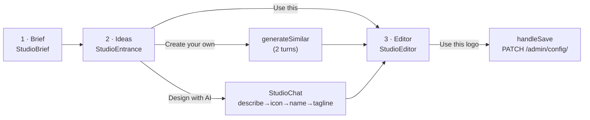

# Logo Studio & Brand Identity — frontend-customer-src

# Logo Studio & Brand Identity (`frontend-customer/src`)

The Logo Studio is the coach-facing tool that turns a brand name and a one-paragraph brief into a real, exportable logo. It is a single full-screen modal mounted from the site-settings **Brand** tab, backed by a JSON *recipe* (not a bitmap) that is rendered live as SVG, edited by direct manipulation, optionally designed/refined by AI, and finally rasterized in the browser and uploaded as `logo`/`icon` PNGs on the tenant config.

Everything visual is a pure function of one `LogoRecipe`. That single invariant is what makes the whole module work: previews, gallery cards, chat candidates, the editor canvas, the dark variant, the two-pass AI critique renders, and the brand-kit zip all feed the *same* `LogoRenderer`/`MarkRenderer` pair.

---

## Where the code lives

| Path | Role |
|---|---|
`components/logo/logo-studio.tsx` | The container. Owns recipe, undo history, step, brief, chat reducer, AI status, session persistence, save. |
`components/logo/studio-brief.tsx` | Step 1 — brand name, niche, tagline, vibe, style chips. |
`components/logo/studio-entrance.tsx` + `curated-gallery.tsx` | Step 2 — the "Ideas" wall: two entry cards (ready-made vs Design with AI) over a grid of composed curated concepts. |
`components/logo/studio-chat.tsx` | Design-with-AI: the Describe → Icon → Name → Tagline wizard and the async turn driver. |
`components/logo/create-similar.ts` | One-shot "Create your own" from a curated logo — chains two converse turns headlessly. |
`components/logo/studio-editor.tsx`, `studio-canvas.tsx`, `studio-panel/*` | Step 3 — canvas + contextual control rail + real-context previews + brand-kit download. |
`lib/logo/*` | Non-React logic: API clients, pure reducers, ranking, composition, brand-kit export. Each has a sibling test in `lib/logo/__tests__/`. |
`packages/shared/src/logo/*` | The engine shared with `frontend-main`'s signup wizard: renderer, catalog, composer, recipe types, migration, rasterizer, curated ranking. |

Files like `components/logo/logo-renderer.tsx`, `abstract-mark.tsx`, `render-draft.tsx` and `lib/logo/{catalog,composer,migrate,abstract}.ts` are **one-line re-export shims** over `@shared/logo/*`. Edit the shared source; the shims exist only to keep app-internal import paths stable.

---

## The recipe

`packages/shared/src/logo/types.ts` defines the schema. `LogoRecipe` is **v3**; `LogoRecipeV1`/`V2` survive only as input types for `migrateRecipe`. The backend validator (`backend/apps/tenant_config/logo_recipe.py`) is the source of truth — every recipe this module emits must pass it, so enum values come exclusively from the shared catalogs.

```ts
{
  version: 3,
  layout: "horizontal" | "horizontal_reversed" | "stacked" | "name_only" | "emblem",
  name, tagline,                          // tagline === "" means "no tagline element"
  mark: { type: "icon" | "initials" | "abstract" | "image" | "custom", ... },
  badge: { shape: BadgeShape, outline: boolean },
  typography: { name: TextStyle, tagline: TextStyle },
  colors: { palette_id, badge: Fill, mark: MarkFill, text, tagline, mark2?, mark_accent? },
  elements: { mark, name, tagline }       // per-element { offset: [x,y], scale }
}
```

Two details drive a lot of downstream code:

- **`mark.type === "custom"`** is the AI/traced vector mark: a list of `CustomMarkPath` whose `fill` is a *role token* (`"mark" | "mark2" | "accent"`), never raw hex. That indirection is why one AI mark can be recolored by a palette swap, by the `MarkControls` secondary/accent pickers, and by `darkVariant()` without touching path data.
- **`elements`** holds placement only. The canvas drags/scales write here; nothing else does. `LogoRenderer.place()` composes `offset` with a scale-about-center translate so scaling doesn't drift the element.

`seedRecipe()` in `logo-studio.tsx` is the single entry into the schema: `isRecipe(config.logo_recipe) ? migrateRecipe(...) : defaultRecipe(brand_name, primaryHex)`.

---

## Three steps, one container

`LogoStudio` renders one of three steps inside a `ModalPortal`. The stepper buttons are gated: **Ideas** unlocks once `ideasReady`, **Editor** once `draftReady`.



On open, `LogoStudio` re-seeds from the freshest `config` (it stays mounted across opens, so a stale in-memory recipe would otherwise linger). If `loadStudioSession()` returns a session it restores brief + recipe + AI elements + chat snapshot + step; otherwise a coach with a saved `logo_recipe` lands in the **Editor** and a fresh coach lands in the **Brief**.

### Step 1 · Brief

`StudioBrief` collects the `Brief` (`brandName`, `niche`, `tagline?`, `vibe?`, `styleChips`). Only the name is required; chips cap at 3 so the composer's style pools stay opinionated. `startIdeas()` re-ranks the already-fetched catalog against the brief and moves to Ideas.

### Step 2 · Ideas

Two sources sit side by side on the same wall.

**Ready-made (free).** `fetchCuratedCatalog()` pulls `GET /api/v1/logos/curated/` and normalizes the comma-string `tags` into an array. `rankForBrief()` delegates to the shared `briefKeywords` + `rankCuratedLogos`: whole-tag hits on the coach's own words score 4, word-family hits (5+ shared prefix — cheap stemming so "dancer" reaches "dance") score 2, niche-vocabulary hits score 1, catalog position breaks ties. `CuratedGallery` then shows only the top `IDEAS_COUNT = 20` — the wall is a shortlist, not a catalog browser.

Each card is a **complete concept**, not a bare mark. `composeCuratedPreview()` picks a `StyleProfile` from the logo's tags (elegant/bold/playful/minimal/organic/tech, with a default pool) and deterministically varies font vibe, layout, badge shape and palette from `hashString(filename) + index`. Same logo always previews the same way; different logos on the wall look different. Traced logos (`markPaths` present) become `mark: {type: "custom"}` and may get a badge; untraced PNG art becomes `mark: {type: "image"}` with `badge: "none"`, because the raster already carries its own colors and silhouette.

`onUse` hands back *exactly the previewed recipe*. `handleUseCurated` short-circuits for traced marks; for untraced PNGs it fetches the image, uploads it via `uploadPng`, and swaps the display-only `photo_id: ""` for a real one before entering the editor.

**Design with AI (paid).** The entrance card and the per-card "Create your own" button both check `logoAiStatus.eligible`, falling back to `handleUpgrade()` → `/admin/billing/subscription`.

### Step 3 · Editor

`StudioEditor` composes:

- `StudioCanvas` — direct manipulation. Click any `[data-part]` group to select; drag to move (offsets clamped to ±120, snapped to 0 within 6 units with dashed guide lines); corner handles scale about the element's center (0.4–3×); arrows nudge 1 (10 with Shift); Escape deselects and `stopPropagation()`s so the studio's document-level Escape doesn't close the whole modal. Selection chrome lives in a **separate overlay `<svg>`** so exports never capture it. `partAtPoint()` is a bounding-box fallback hit test — SVG pointer events only fire on painted pixels, so clicks inside a hollow outline badge would otherwise fall through to the background.
- Real-context previews: a fake browser-tab chip and a rounded app icon, both `MarkRenderer`. The app-icon one carries `markSvgRef` — the same node that gets rasterized to `logo-icon.png` on save.
- A hidden, off-screen `LogoRenderer` for `darkVariant(recipe)`, feeding the brand kit.
- `StudioPanel` — the contextual rail: undo/redo, then `RefinePromptBox` (always at the top, since refinement's scope is the whole design), then exactly one of `GlobalControls` (nothing selected — layout, palette, badge, name/tagline text), `TextControls` (name or tagline — font by vibe, weight, case, tracking, size, color), or `MarkControls` (initials styles, abstract families with click-again-to-shuffle, the grouped Lucide icon picker, upload, mark fill incl. gradient, and the secondary/accent pickers that only appear for `type: "custom"` marks).

---

## Undo/redo and edit coalescing

`lib/logo/history.ts` is a pure past/present/future reducer. `LogoStudio` owns the slot and exposes two writers:

- `patch(part, coalesceKey?)` — shallow merge.
- `updateRecipe(updater, coalesceKey?)` — functional update.

Both `push` into history and both **clear `activeElements` when the mark changes** — AI-sourced geometry is no longer valid once the coach swaps the mark.

`push` coalesces when `coalesceKey` matches the top of `past` within 400ms, which is how a slider drag or a burst of keystrokes collapses into one undo step. The subtlety worth preserving: a coalesced push keeps the **original pre-burst value** as the undo target and only refreshes the timestamp — otherwise undo would step back a single keystroke at a time. Coalesce keys in use: `"name-text"`, `"tagline-text"`, `"canvas-drag"`, `"mark-scale"`, `"badge-color"`, `"mark-color"`, `` `${element}-tracking` ``, `` `${element}-scale` ``.

The ⌘/Ctrl+Z / ⇧⌘Z / ⌘Y listener attaches only while `open && step === "editor"` — including inside text inputs, so typed edits are undoable. `handleUndo`/`handleRedo` read history via functional `setState`, so the listener never goes stale despite `editHistory` not being a dependency.

`confirmReplaceDraft()` guards anything that would overwrite the editor draft (Use this / Create your own): it's a no-op when `!canUndo(editHistory)` (no real edits yet) and a `window.confirm` otherwise.

---

## Session persistence

`lib/logo/studio-session.ts` writes `contentor_logo_studio` in `localStorage`, schema v3, 14-day TTL. `LogoStudio` debounces the write ~500ms while open. Both read *and* write are fully try/caught — a disabled, full, or private-mode `localStorage` degrades to "no restore" and never breaks the studio. `loadStudioSession` still accepts v1/v2 payloads (a v1 restore simply has no `chat` slice). `clearStudioSession()` fires on successful save and on "Start over".

The persisted chat slice is the `ChatSnapshot` — stage, transcript, pins — deliberately *without* the transient `status`/`done`, which always start fresh via `chatDispatch({type: "hydrate", snapshot})`.

---

## Design with AI

### Gating

`fetchLogoAiStatus()` → `GET /api/v1/admin/config/logo-ai/status/` returns `{enabled, eligible, turns_remaining, refine_remaining, reason}`. `deriveAiBannerState()` (`lib/logo/ai-banner.ts`) keys **only** off the server-authoritative `reason` and never re-derives eligibility from `enabled`/`remaining`, precisely so the client can't drift from the backend. Turn/refine counters are updated optimistically from each response's `turns_remaining` / `refine_remaining`.

### The wizard state machine

`lib/logo/chat-state.ts` is React-free and unit-tested. `ChatState` = `{stage, messages, pinnedIcon, pinnedLockup, status, done}` where `stage: "icon" | "name" | "tagline"` mirrors the backend. `chatReducer` handles `user_message` (→ `designing`), `draft_received` (→ `reviewing`), `final_received`, `turn_failed`, `pin`, `use_brief_tagline`, `back`, `hydrate`. `pin` is the advance: icon→name, name→tagline, tagline→`done`. `back` to an earlier stage clears the pins downstream of it.

`lib/logo/wizard-view.ts` derives the view: `activeStep` (an empty transcript means the coach hasn't described their brand, so **Describe** is a fourth, client-only step in front of the three backend stages), `stepStatus`, `currentCandidates` (only the *latest* assistant turn **for the current stage** renders; older turns stay purely as backend context), `currentSelection` (drives "Your logo so far"), and `briefTaglineButtonLabel`.

Assistant messages carry the `stage` they were generated for, which is what keeps "Pick this" from letting an icon candidate be re-pinned as a lockup after the coach has moved on.

### Turn mechanics — the two-pass loop

Every AI turn is render → critique:

1. `fetchConverseTurnStream(body, {onPhase, onPreview}, signal)` → `POST /api/v1/admin/config/logo-converse/`, streamed via `streamAi`. Server phases (`designing`, `illustrating`, `tracing`) drive `AiProgress`; rows are built from phases the server *actually announced*, since image generation and tracing only happen on the icon stage and only when enabled. `TurnPreview` shows the reply and concept headings forming.
2. If `phase === "draft"` with a `token`: `renderDraftPngs(designs, stage, brandName)` composes each design into a recipe and rasterizes it **off-screen** (`createRoot` into a detached, fixed, `left:-10000px` container; `flushSync` + one `requestAnimationFrame` so layout settles and fonts warm; `MarkRenderer` at 512² for icon stage, `LogoRenderer` at 600-wide otherwise).
3. `fetchConverseFinish(token, images)` → the AI critiques its own rendered work and returns polished finals.

**Any failure in steps 2–3 falls back to the drafts the client already holds.** That rule is repeated verbatim in `studio-chat.tsx`, `create-similar.ts` and `handleRefine` — a step must never land blank.

Two honesty details: cancelling via `abortRef` reports *"Cancelled — that used one of your design turns"*, because the server commits the turn at the first preview; and pass B (`status === "reviewing"`) shows a plain spinner rather than a phase list, since it has no server-side steps to report.

### Auto-fetch

Entering a stage auto-fires `AUTO_PROMPTS[stage]` so a step lands on options, not an empty box — guarded by a per-stage `fetchedRef` set so a *failed* turn shows its notice instead of looping. Describe never auto-fetches; `submitDescribe` pre-marks `"icon"` as fetched so a failed describe isn't silently re-fired with the generic prompt. Effects call through `runTurnRef.current` so auto-fetch never sends against a stale transcript.

When `state.done && state.pinnedLockup`, a `usedRef`-guarded effect hands `composeConverseDesign(pinnedLockup, brandName)` up exactly once via `onUseDesign` → `handleCustomize`.

### "Create your own" (`generateSimilar`)

The headless twin of the wizard, for one-click "make me something like this curated logo". It runs the *same* staged endpoints and the same two-pass loop — no new backend surface — for a cost of 2 turns:

1. **icon stage** — "Recreate this icon concept in the same spirit…" seeded from the curated logo's `prompt` (or `title`).
2. **name stage** — pins the chosen mark with the chat's exact pin shape (`{mark_elements: picked.elements, mark_paths: picked.paths}`; traced paths must be inherited verbatim because they can't be recompiled from elements) and asks for the full lockup.

A gated or empty turn throws `SimilarError` with a coach-readable message from `GATE_NOTICES`. If the *name* turn fails after a good icon, it returns `kind: "icon"` — the icon wrapped in `composeIconPreview`'s clean default lockup — so the spent turn isn't wasted, and `LogoStudio` surfaces "style the text in the editor".

### Refinement

`RefinePromptBox` (paid, hidden entirely when `!eligible`) posts an instruction plus the current recipe and `activeElements` to `POST /api/v1/admin/config/logo-refine/`. `handleRefine` runs the same two-pass (`renderRecipesToPngs` → `fetchRefineFinish`, which shares the `/logo-converse/finish/` endpoint but returns a single `design`), then folds the result on with `applyRefinedDesign(base, design, {keepMark: !redrawMark})`. The failure reason is a persistent inline notice, not a toast — `useAsyncAction`'s default error toast is overridden via `onError`. On success the notice slot shows the AI's `rationale`.

### Composition (`@shared/logo/composer.ts`)

The trust boundary between AI output and the renderer:

- `composeIconPreview(design, brandName)` — stage-1 candidate → minimal badge-less recipe for `MarkRenderer` cards (only the mark and its three color roles exist that early).
- `composeConverseDesign(design, brandName)` — stage-2/3 candidate → complete recipe, materialized faithfully (no dice).
- `applyRefinedDesign(recipe, design, {keepMark})` — folds a refinement onto the current draft, leaving name, tagline text and element placement untouched.

All three treat the AI response as untrusted: font family must be in `LOGO_FONT_FAMILIES`, weight must exist in the resolved family (`taglineWeight` snaps to the heaviest available for single-weight Script families rather than requesting a 404ing Google Fonts variant), `tracking` clamps to −0.1…0.4, `mark_scale` to 0.6…1.8, gradient `angle` to 0…360. Palette *roles* (`primary`/`secondary`/`accent`/`ink`/`white`) are resolved to hex through `resolveRole`, and a `white` mark with no badge behind it is guarded to `ink` so it can't vanish.

---

## Saving and export

`handleSave` (guarded by `useAsyncAction`, so no double-submit):

1. `svgToPngBlob(logoSvgRef, vb.w*2, vb.h*2, fonts)` — the visible canvas SVG at 2× — and `svgToPngBlob(markSvgRef, 1024, 1024, fonts)` — the app-icon `MarkRenderer`.
2. `uploadPng` each through the existing presign → PUT → complete photo flow (`lib/logo/export.ts`; customer-only because it needs `clientFetch`'s tenant session).
3. `PATCH /api/v1/admin/config/` with `{logo_id, logo_url, icon_id, icon_url, logo_recipe}`.

One wire-level nuance: for `mark.type === "image"` the recipe sent over the wire has `mark.url` blanked. The backend re-derives it from `photo_id` on read and `validate_logo_recipe` always resets it anyway, so sending the base64 data URL would double the payload for nothing. The `body` handed to `onSaved` keeps the real data URL, so this session's re-editing and preview still work.

### Brand kit

`buildBrandKit` (`lib/logo/brand-kit.ts`) zips 8 transparent PNGs — `logo`/`logo@2x`, `logo-dark`/`logo-dark@2x`, `mark`, and favicons at 512/192/48 — plus `logo.svg` and `logo-dark.svg` as **true vectors**: `svgWithTextPaths` clones the SVG, inlines every `<image>` as a data URI, and replaces every `<text>` with real glyph paths via `opentype.js`, reproducing the renderer's own `text-anchor`, `letter-spacing` and `dominant-baseline: central` metrics.

Two constraints shaped this file:

- TTFs come from **fontsource's jsDelivr mirror**, not `fonts.googleapis.com`: Google's css2 endpoint serves woff2 to browser user agents (`fetch` can't spoof UA) and opentype.js can't parse woff2. `fontCache` memoizes by `family:weight` and deletes failed entries so a transient failure isn't cached.
- If any font fetch fails the kit degrades to **PNGs only** (`svgIncluded: false` → inline note) rather than shipping a broken vector.

`darkVariant(recipe)` produces the dark artwork: `luminance()` (WCAG-ish) below 0.4 lightens to a fallback, so dark inks/grays lift while genuinely bright hues (amber, sky) are left alone. It lightens the badge fill only when that fill is what actually paints the mark (`shape === "none"` or `outline`), and `lightenFill` handles gradients by lightening both stops while preserving type and angle.

---

## Contracts with the rest of the codebase

**Mounted from** `components/owner/brand-tab.tsx`, which owns nothing but `studioOpen`/`onStudioOpenChange` — hoisted to `EditSidebar` so `?studio=1` can deep-link the studio open. `onSaved` merges the patch into the live `TenantConfig`.

**Backend endpoints** (all `apps.tenant_config`):

| Endpoint | Client |
|---|---|
`GET /api/v1/logos/curated/` | `fetchCuratedCatalog` (plain `fetch`) |
`GET /api/v1/admin/config/logo-ai/status/` | `fetchLogoAiStatus` |
`POST /api/v1/admin/config/logo-converse/` | `fetchConverseTurn`, `fetchConverseTurnStream` |
`POST /api/v1/admin/config/logo-converse/finish/` | `fetchConverseFinish`, `fetchRefineFinish` |
`POST /api/v1/admin/config/logo-refine/` | `fetchLogoRefine` |
`POST /api/v1/upload/{presign,complete}/` | `uploadPng` |
`PATCH /api/v1/admin/config/` | `handleSave` |

**Shared with `frontend-main`.** `packages/shared/src/logo/` is the engine; the signup wizard's logo step consumes the same `rankCuratedLogos`, renderer and catalog. Changes there affect both apps — verify with `make typecheck` and `make test-frontend`.

**Conventions this module follows.** Async buttons use `<Button loading loadingText>`; async handlers go through `useAsyncAction`; `<Spinner>`/`SkeletonCardGrid` for loading. Two deliberate deviations from the "outcomes are toasts" rule: brand-kit failures and refine failures render as **persistent inline notices** (`kitNote`, `refineNotice`), because the coach needs the reason to stay on screen while they retry.

**Accessibility.** `ModalPortal` is a bare portal with no Radix Dialog underneath, so the studio hand-rolls what Radix would provide: `role="dialog"` + `aria-modal` + `aria-labelledby`, focus moved into `panelRef` on open and restored to `previousFocusRef` on close, and a document-level Escape handler sharing `handleClose`'s save-guard. The canvas is `role="application"` with `aria-label="Logo canvas"` and a real `tabIndex`.

---

## Testing

Unit tests (`make test-frontend`) cover the pure layer one-to-one: `chat-state`, `wizard-view`, `history`, `studio-session`, `composer`, `curated-preview`, `library-catalog`, `catalog`, `migrate`, `brand-kit`, `ai-banner`, `abstract`. Anything branchy belongs in `lib/logo/`, React-free, for exactly this reason.

E2E: `15-logo-studio`, `17-logo-curated-library`, `18-curated-library-admin`, `23-wizard-ai-logo`, and `90-logo-eval` (an AI-scored eval). Test hooks in the DOM: `data-testid` on `studio-canvas`, `selection-box`, `studio-chat`, `chat-design-card`.

Note that `17-logo-curated-library` asserts against `IDEAS_COUNT`; the spec is brittle against catalog growth, and running the curated specs can leave `logo_meta.json` churn in the tree.
