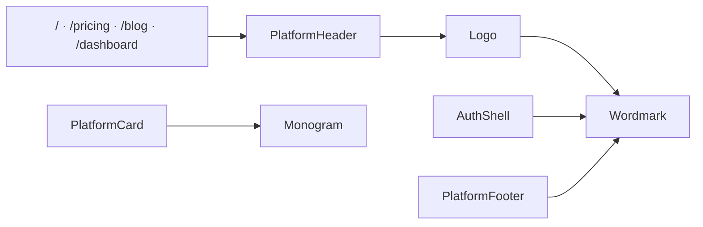
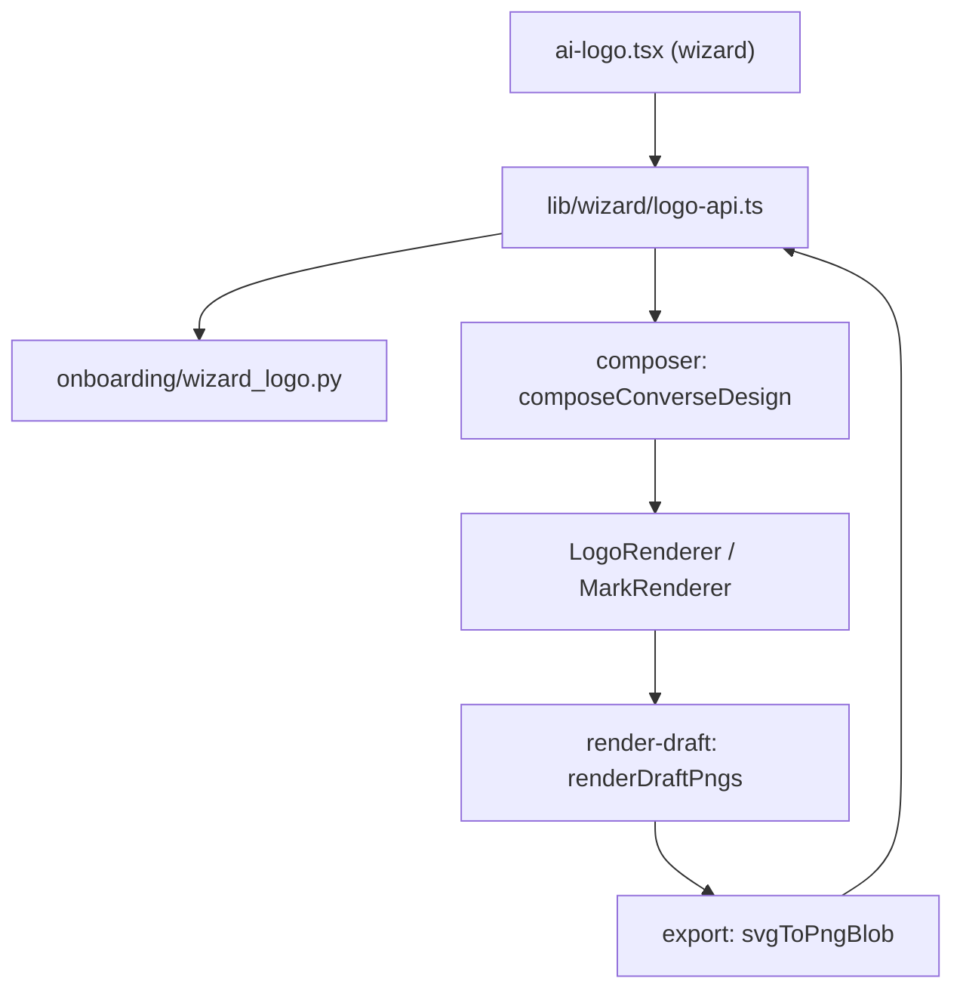

# Logo Studio & Brand Identity — frontend-main-src

I have what I need. Writing the documentation now.

# Logo Studio & Brand Identity — `frontend-main/src`

Two distinct concerns share this module's name, and keeping them apart is the first thing to understand:

1. **Contentor's own brand lockup** (`components/shared/logo-mark.tsx`) — the *platform's* wordmark and monogram, rendered as pure text in house design tokens. Used by the marketing site chrome.
2. **The Logo Studio engine** (`lib/logo/*`, `components/logo/*`, `types/logo.ts`) — the recipe-based logo *authoring and rasterizing* system a coach uses to design **their own** brand mark. In `frontend-main` every one of these files is a one-line re-export of `packages/shared/src/logo/*`; the implementation lives in the shared package, and `frontend-main` consumes it only from the onboarding wizard.

## Part 1 — Contentor's brand lockup

`components/shared/logo-mark.tsx` is the only file in this module with real implementation code in `frontend-main`. It contains no SVG asset; both marks are typography.

### `Wordmark({ className })`

The primary lockup: the literal string `Content` + `or`, with the second span painted `text-marketing-accent` (a Tailwind alias for `var(--marketing-accent)`, see `frontend-main/tailwind.config.ts`). Base classes are `font-semibold tracking-tight text-foreground select-none`; callers size it via `className` (e.g. `PlatformHeader`'s `Logo` passes `text-base`).

Because it's text in tokens, it inherits the active theme and needs no dark-mode variant, no image request, and no layout-shift budget.

### `Monogram({ size = 32, label = "C", className })`

An app-icon-style square: `rounded-[28%] bg-primary text-primary-foreground`, with `width`/`height` set to `size` and `fontSize` computed as `Math.round(size * 0.5)` via inline style — the one place inline style is correct here, since Tailwind can't express an arbitrary runtime px pair. It is `aria-hidden`, so any accessible name must come from the wrapping element (`PlatformHeader`'s `Logo` supplies `aria-label="Contentor"` on the `NavLink`).

`export const LogoMark = Monogram` is a back-compat alias for pre-rename call sites. New code should import `Monogram` directly.

### Where it renders

`Wordmark` reaches nearly every marketing page through a single chokepoint — `PlatformHeader`'s internal `Logo` component — plus `PlatformFooter`, `AuthShell`, and `HeroSection`. `Monogram` is used where a square tile is wanted: `PlatformCard` on the dashboard and `FinalCtaSection`.

The practical consequence: **changing the header lockup is a one-file, one-component edit**, but changing `Wordmark`'s base classes touches every marketing route. Size and spacing belong in the call site's `className`, not in the component.

## Part 2 — The Logo Studio engine (re-export surface)

`frontend-main` mirrors the shared package with `export * from "@shared/logo/…"` files so that app code can import `@/lib/logo/composer` rather than reaching across the workspace. `@shared/*` maps to `../packages/shared/src/*` in `frontend-main/tsconfig.json`. `frontend-customer` does exactly the same thing, file for file — that is what makes the studio's core shareable between the coach-facing studio and the wizard.

| Local path | Shared module | What it provides |
|---|---|---|
| `types/logo.ts` | `logo/types` | `LogoRecipe` (v3, live), `LogoRecipeV1`/`V2` (migration inputs only), `AnyLogoRecipe`, `LogoMark`, `Fill`, `TextStyle`, `RecipeLayout`, `BadgeShape` |
| `lib/logo/catalog.ts` | `logo/catalog` | `LOGO_ICONS` / `ICON_GROUPS` (curated lucide set), `LOGO_FONTS` / `LOGO_FONT_FAMILIES` / `fontEntry`, `PALETTES(primaryHex)`, `applyPalette`, `TEXT_COLORS`, `initialsFor`, `defaultRecipe` |
| `lib/logo/composer.ts` | `logo/composer` | AI Brand Pack → recipe: `composeIconPreview`, `composeConverseDesign`, `applyRefinedDesign`, plus `ConverseDesign` / `RefinedDesign` / `Brief` / `StyleChip` types |
| `lib/logo/abstract.ts` | `logo/abstract` | `abstractSpec(family, seed)` + `mulberry32` seeded PRNG, `ABSTRACT_FAMILIES` |
| `components/logo/abstract-mark.tsx` | `logo/abstract-mark` | `AbstractMark` — paints an `abstractSpec` into an SVG `<g>` |
| `components/logo/logo-renderer.tsx` | `logo/logo-renderer` | `LogoRenderer` (full lockup), `MarkRenderer` (square mark), `logoViewBox`, `MARK_VIEWBOX`, `Badge`, `MarkContent`, `asFill`/`solidOf` |
| `lib/logo/export.ts` | `logo/export` | `svgToPngBlob(svg, w, h, fonts)`, `imageToDataUrl`, `FontSpec` |
| `lib/logo/render-draft.tsx` | `logo/render-draft` | `fontsFor(recipe)`, `renderRecipesToPngs`, `renderDraftPngs` — off-screen rasterizer |
| `lib/logo/migrate.ts` | `logo/migrate` | `isRecipe`, `migrateRecipe` |

Note the gap: **`curated-rank` has no local re-export.** `app/signup/verify/wizard/logo-review-steps.tsx` imports `briefKeywords` / `rankCuratedLogos` / `applyAiRank` straight from `@shared/logo/curated-rank`. If you add a local `lib/logo/curated-rank.ts`, migrate that import too rather than leaving both paths live.

### The recipe is the data model

`LogoRecipe` (version 3) is a flat, JSON-serializable description of a lockup: `layout`, `name`, `tagline`, `mark`, `badge`, `typography.{name,tagline}`, `colors`, and per-element `elements.{mark,name,tagline}.{offset,scale}`. Everything downstream — rendering, PNG export, backend persistence — is a pure function of it.

Two sync constraints are load-bearing and called out in the source headers:

- `backend/apps/tenant_config/logo_recipe.py` is the **validation source of truth**. `catalog.ts`'s `PALETTES` ids must match its `PALETTE_IDS`, and any recipe the composer emits must pass its `validate_recipe`.
- `migrate.ts`'s v1→v2 upgrade is implemented identically in Python in that same file, with parity fixtures at `packages/shared/src/logo/__tests__/migrate.test.ts` and `tests/test_logo_recipe.py`. Change both together.

`migrateRecipe` short-circuits on v3, treats v2 as a version bump, and expands v1's flat `font` / `colors` / `overrides` into the v3 `typography` / `colors` / `elements` trees.

### Rendering and export

`LogoRenderer` takes a recipe plus an optional `width` and `svgRef`, derives a viewBox from the layout (`logoViewBox`), lays out slots, and auto-fits the name's font size to its slot budget; the tagline is capped at `nameSize * 0.42`. `MarkRenderer` renders the square `MARK_VIEWBOX` (256) mark only — never name or tagline — and quietly substitutes an initials mark with a non-`none` badge when the layout is `name_only` and there's no real drawable mark.

`svgToPngBlob` exists because of two browser constraints documented at length in `export.ts`, and they explain nearly every line of it:

1. An SVG rasterized through ``/canvas is a separate rendering context and does **not** inherit the page's webfonts. Fonts must be embedded as an inline `@font-face` with a `data:` `src`.
2. Canvas tainting: any remaining `http(s):` reference inside the serialized SVG — a font `url()`, an `<image href>` — makes the canvas non-origin-clean, so `toBlob()` throws `SecurityError` or the resource renders blank. Every external reference must be inlined as a `data:` URI first (that's what `imageToDataUrl` is for). A failed *font* fetch degrades gracefully; a failed *mark image* fetch throws, because there's no acceptable fallback.

If you touch export and see a blank glyph or a `SecurityError`, assume something reintroduced an external reference into the serialized SVG.

## How the wizard uses it

`frontend-main`'s only consumer of the studio engine is onboarding step "Design with AI": `app/signup/verify/wizard/ai-logo.tsx`, backed by the client in `lib/wizard/logo-api.ts`.

`ai-logo.tsx` is a four-state door — `locked` (plan cards → Stripe checkout), `syncing` (the `?upgraded=1` round-trip, posting `session_id` to `checkout/sync/` with a wizard-state poll as fallback), `chat` (a staged `icon → name → tagline` conversation), and `picked`. The chat stage reuses the studio's **two-pass converse flow**: a turn returns *draft* designs; `renderDraftPngs` mounts them off-screen via `createRoot` into a detached container, rasterizes each with `svgToPngBlob` (bare `MarkRenderer` at 512 square for the icon stage, full `LogoRenderer` at 600-wide for later stages), and posts the PNGs back so the model can critique its own output and return polished finals. Rasterization is best-effort per card — a card that fails is skipped, and the caller still holds the raw drafts.

`lib/wizard/logo-api.ts` is deliberately **not** a mirror of the studio's `converse-api.ts` / `refine-api.ts`. It's a separate set of wizard-token-authenticated fetchers against `backend/apps/core/onboarding/wizard_logo.py`, following `lib/wizard/api.ts`'s `request()` idiom, with the token in the request **body**, never the URL. It borrows only the `ConverseTurnResponse` / `RefineResponse` shapes, and its `designRecipe` wraps `composeConverseDesign` — the same accessor the coach-facing studio's design cards use.

## Contributing notes

- **Editing brand chrome** — change `Wordmark`/`Monogram` in `components/shared/logo-mark.tsx`. Both are token-only by design; don't introduce a hex color or an image asset. The `LogoMark` alias exists for old call sites, not new ones.
- **Editing the studio engine** — edit `packages/shared/src/logo/*`, never the `frontend-main` re-export stubs. A change there lands in `frontend-customer` simultaneously; the coach-facing studio (`frontend-customer/src/components/logo/logo-studio.tsx`, `studio-chat.tsx`) is the heavier consumer, so check it too.
- **Adding a shared module** — add the local one-line `export * from "@shared/logo/<name>"` stub in both apps so imports stay `@/`-relative, and don't leave a mix of `@/lib/logo/x` and `@shared/logo/x` for the same module.
- **Adding a palette, font, icon, or enum value** — the client catalog and `backend/apps/tenant_config/logo_recipe.py` must agree, or the backend will reject recipes the UI happily produced. Same rule for anything `migrate.ts` touches.
- **New recipe fields** — every renderer, `defaultRecipe`, `migrateRecipe`, and the backend validator need the field before it's safe to persist; `fontsFor` needs it too if it affects which `(family, weight)` pairs get embedded on export.