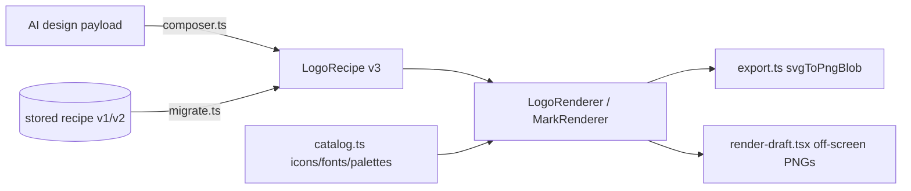

# Logo Studio & Brand Identity — packages-shared

# Logo Studio & Brand Identity — `packages/shared/src/logo`

The shared brand-identity core: a versioned **logo recipe** schema, a pure SVG renderer for it, the client-side catalogs (icons / fonts / palettes), the AI-design materializers, a canvas-based PNG export pipeline, and the curated-library ranker.

Everything here is framework-light and consumed by **both** Next.js apps — the signup wizard's logo step (`frontend-main`) and the coach-facing Logo Studio (`frontend-customer`). Nothing in this directory talks to the network except `export.ts` (Google Fonts + signed image URLs) — API calls live in the consuming apps.

---

## The central idea: a recipe is the only source of truth

A logo is never stored as an image. It's stored as a `LogoRecipe` (`types.ts`) — a small JSON document describing layout, mark, badge, typography, colors and per-element placement. Every surface renders that same document through `LogoRenderer` / `MarkRenderer`:

- the live editor canvas,
- the fine-tune canvas (drag/scale),
- AI suggestion cards and the wall/gallery tiles,
- the off-screen rasterizer that produces PNGs for AI self-critique,
- the final PNG/SVG export.

Because they all go through one renderer, a tile can never disagree with the exported file. Treat that as the module's core invariant: **if you add a visual feature, it goes in `logo-renderer.tsx`, not in a consumer.**

### Schema versions

| Version | Status | Notes |
|---|---|---|
| `LogoRecipeV1` | input-only | flat `font`, `colors.badge_bg/mark_fg/text`, `overrides.*` |
| `LogoRecipeV2` | input-only | current shape, but mark colors are plain hex strings |
| `LogoRecipe` (v3) | **live** | mark color roles widen to `MarkFill = string \| Fill`, enabling gradient marks |

`migrate.ts` is the only upgrade path: `isRecipe(value)` narrows unknown JSON to `AnyLogoRecipe` (accepting versions 1, 2, 3), and `migrateRecipe` normalizes to v3. v2→v3 is a pure version bump (the widened type is backward-compatible); v1→v3 is a lossless field remap — `badge_name`/`icon_name` collapse to `horizontal`, `overrides` become `elements`, and the tagline style is synthesized at weight 500 / `tracking 0.08` / `case: "upper"`.

> **Parity requirement:** `backend/apps/tenant_config/logo_recipe.py` implements the identical migration in Python, with fixtures on both sides (`__tests__/migrate.test.ts`, `tests/test_logo_recipe.py`). Change them together or the server will reject recipes the client happily produces.

### Mark types

`LogoMark` is a five-way union, and `MarkContent` in `logo-renderer.tsx` dispatches on it:

- `icon` — a curated lucide icon by key, `outline` (stroke 1.75, no fill) or `solid`.
- `initials` — derived from `recipe.name` via `initialsFor`; four styles (`plain`, `monogram`, `split`, `overlap`) drawn by `InitialsMark`. Also the universal fallback for an unknown icon key or a missing image URL.
- `abstract` — a seeded parametric mark (see below).
- `image` — an uploaded/curated PNG at `mark.url`.
- `custom` — an **AI Brand Pack** vector mark: a list of `CustomMarkPath` in a `0..100` viewBox whose `fill` is a *role token* (`mark` / `mark2` / `accent`), never raw hex. That indirection is what lets one AI mark be recolored across all 24 palettes and re-exported as a dark variant without regenerating geometry.

---

## Rendering (`logo-renderer.tsx`)

Two entry points:

- **`LogoRenderer`** — the full lockup. `logoViewBox(layout)` picks the canvas (`640×200` horizontal, `480×360` stacked, `480×400` emblem), `computeSlots` returns pixel slots for mark/name/tagline, and each slot is wrapped in a `<g data-part="…">` so the fine-tune canvas can hit-test parts. Accepts `svgRef` plus pointer handlers — that's how the drag-to-nudge canvas and the export pipeline get at the live DOM node.
- **`MarkRenderer`** — the square mark only (`MARK_VIEWBOX = 256`), for favicons, avatars and square exports. It never draws name or tagline. The one special case: a `name_only` recipe has no real mark, so it substitutes `initials` and forces a `rounded` badge if the badge was `none`.

### Layout & fitting details worth knowing

- **Text never overflows** by construction: `fitFontSize` estimates width as `length × (0.58 + tracking)` and shrinks to fit the slot's `budget`, floored at 22px. The tagline is additionally capped at `0.42 ×` the name size, so the hierarchy holds at every brand-name length.
- **Element placement scales about the slot center**, not the origin: `translate(offset + c·(1 − scale)) scale(scale)`. That's why nudging and scaling in the fine-tune canvas feel independent.
- **Emblem is inverted**: the badge becomes the container and the name is drawn *on top of it*, so `nameColor` switches from `colors.text` to `solidOf(colors.mark)` for contrast, and `ComposedMark` shrinks the mark content to `0.3 × size` and lifts it (`padY = 0.18 × size`) to leave room.
- **Badge-aware mark color** (`ComposedMark`): with a filled badge the mark paints with its own fill; with no badge or an outline-only badge it takes the badge's solid color so it stays visible on white.

### Fills and gradients

`Fill` is `solid | linear | radial`. `useFillPaint` converts a `Fill` into `{ paint, defs }` — a color string for solids, or `url(#id)` plus a `<linearGradient>`/`<radialGradient>` keyed off `useId()` so multiple logos on one page can't collide.

`useFillPaint` is a hook, so `ComposedMark` calls it **unconditionally and in a fixed order** for badge, `mark`, `mark2` and `mark_accent` (the latter two falling back to `colors.mark`) even when the recipe has no custom mark. Don't make those calls conditional. Two helpers exist for the places that can't accept a gradient: `asFill` normalizes a `MarkFill` up to a `Fill`, and `solidOf` flattens one down (a gradient degrades to its `from` stop) for color inputs and emblem name text.

### Unit-space paths

`Badge`'s hexagon/shield/diamond and `AbstractMark`'s `path` shapes are authored in `0..1` space and scaled with a `transform`, which also scales `stroke-width`. So those `strokeWidth` values are **not** multiplied by `size` — the circles/rects/lines in the same files are. Getting this backwards produces hairlines or slabs; check which space you're in.

---

## Abstract marks (`abstract.ts` + `abstract-mark.tsx`)

A deliberate split: `abstract.ts` is pure data, `abstract-mark.tsx` is pure JSX.

`abstractSpec(family, seed)` returns `AbstractShape[]` in unit space, driven by `mulberry32(seed)` — a 3-line deterministic PRNG. Six families (`ABSTRACT_FAMILIES`): `orbits`, `bloom`, `waves`, `prism`, `knot`, `grid`. Each generator consumes randomness in a fixed order, so `(family, seed)` → geometry is a stable mapping, and vitest can assert determinism without a DOM. `AbstractMark` maps a spec to SVG at a given `size` and single brand `color`, using stroke + opacity layering for depth.

**Consuming randomness in a different order changes every existing seeded logo.** If you edit a generator, only append draws — or accept that stored recipes will re-render differently.

`mulberry32` is exported because the composer needs the same determinism guarantees.

---

## Catalogs (`catalog.ts`)

The single source of truth for every enum the coach can pick, and the file with the most cross-repo coupling:

- **`LOGO_ICONS`** — key → `LucideIcon`, grouped for the UI by `ICON_GROUPS` (8 niche groups × 8 icons: Wellness, Fitness, Music, Education, Business, Creative, Food, Lifestyle).
- **`LOGO_FONTS`** — 24 Google Fonts, 4 per `FontVibe` (Modern / Elegant / Bold / Playful / Minimal / Script). Each `FontEntry.weights` lists **only the weights that family actually ships**; `fontEntry(family)` looks one up with a first-entry fallback. Requesting an unavailable weight from Google Fonts 404s and silently drops the export to `sans-serif`, so all weight selection must go through `entry.weights`.
- **`PALETTES(primaryHex)`** — 24 curated palettes (solid and gradient badges), the first being `theme`, seeded from the tenant's own primary color. `applyPalette(recipe, p)` swaps the whole `colors` block and stamps `palette_id`.
- **`defaultRecipe(brandName, primaryHex)`** — the v3 blank slate every flow starts from.
- Small helpers: `TEXT_COLORS(primaryHex)`, `initialsFor(name)` (first letters of up to two words, `"A"` if empty), `LOGO_FONT_FAMILIES`.

### Keep-in-sync contracts

| Client | Backend | What drifts if you forget |
|---|---|---|
| `PALETTES()` ids | `logo_recipe.py` `PALETTE_IDS` | `validate_recipe` rejects a palette the UI offers |
| `LOGO_FONTS` families | `logo_ai.py` `_FONT_CATALOG` | AI returns a font the client can't resolve → silent fallback to Inter |
| `migrateRecipe` | `logo_recipe.py` upgrade | client and server disagree on the same stored row |
| `BrandPackPath` / `_Element` | `logo_ai.py` structured-output schema | AI marks fail to materialize |

---

## The AI path (`composer.ts`)

The backend's AI Brand Pack (`backend/apps/tenant_config/logo_ai.py`) returns bespoke vector marks and brand palettes; `composer.ts` materializes those payloads into `LogoRecipe`s. **Every recipe it emits must pass the backend's `validate_recipe`** — which is why all enums come from the Phase-1 catalogs and nothing here trusts the model's output verbatim.

### Palette roles, not hex

An AI design carries a `BrandPackPalette` (`primary`/`secondary`/`accent`/`ink`) plus `color_roles` naming which role each slot uses. `resolveRole` maps a `PaletteRole` to hex (`"white"` → `#ffffff`); `markFillFor` turns an optional `MarkGradient` into either a flat hex or a `linear` `Fill` from the mark's own color to the target role's, with the angle clamped to `0..360`.

### Three entry points

- **`composeIconPreview(design, brandName)`** — stage-1 of the staged "Design with AI" (converse) flow, where only an icon candidate exists. Produces a badge-less recipe carrying just the mark and its three color roles, for `MarkRenderer` preview cards.
- **`composeConverseDesign(design, brandName)`** — stage-2/3, the complete lockup. Faithful materialization: no dice-rolling, layout/badge/font/typography come straight from the design.
- **`applyRefinedDesign(recipe, design, { keepMark })`** — folds a `RefinedDesign` from the `logo-refine/` endpoint onto the coach's current draft. Replaces mark, palette, badge, typography and color roles; leaves name, tagline **text** and element placement alone. `keepMark: true` re-palettes and re-typesets while preserving the mark the coach already likes.

### Defensive normalization (the part not to remove)

An AI response is untrusted input. Both compose paths apply the same guards, and they must stay identical:

- **Font** must be in `LOGO_FONT_FAMILIES`. `applyRefinedDesign` has a richer fallback chain: explicit font → the draft's current font if it's in the requested `font_vibe` pool → first font of that pool → `Inter`.
- **Weight** must be in `entry.weights`, else snap to the family's heaviest.
- **`taglineWeight`** prefers 500 but snaps to the heaviest available — single-weight Script families (Great Vibes, Pacifico) have only 400.
- **`clampTracking`** → `[-0.1, 0.4]`; **`clampScale`** → `[0.6, 1.8]`.
- **White-mark guard:** if `badge_shape === "none"` or `layout === "name_only"`, a `white` mark role is forced to `ink` — otherwise the mark is invisible on the page.
- `palette_id` is set to `null`, marking the recipe as off-catalog.

`BrandPackElement` is deliberately `Record<string, unknown>`: it is the mark's pre-compile source geometry, **opaque to the client**, only ever round-tripped back to `logo-refine/`. Don't start interpreting it here.

`Brief` (brandName / niche / styleChips / vibe / tagline) and `STYLE_CHIPS` are the request-side types for those endpoints; `vibe` is free text consumed only by the backend.

---

## Two-pass drafts (`render-draft.tsx`)

The AI critiques its own work by *looking* at it. A converse turn or a refine returns **draft** designs; the coach's browser rasterizes them and posts the PNGs back so the model can return polished finals. This file is the client half of that loop, and it's browser-only.

`renderRecipesToPngs(recipes, stage)`:

1. creates a detached, `aria-hidden`, off-screen (`left:-10000px`) container,
2. `createRoot` + `flushSync` renders every recipe at once — `MarkRenderer` for the `icon` stage, `LogoRenderer` otherwise,
3. awaits one `requestAnimationFrame` so layout settles and page fonts warm,
4. rasterizes each via `svgToPngBlob` — `512×512` for icons, `600`-wide at the layout's aspect for lockups — and converts to data URLs,
5. unmounts and removes the container in a `finally`.

Per-card failures are swallowed: the caller still gets images for the rest and always has the raw drafts to fall back on. `renderDraftPngs(designs, stage, brandName)` is the convenience wrapper that composes designs into recipes first. `fontsFor(recipe)` returns the `(family, weight)` pairs a recipe actually paints — name always, tagline only when non-empty — and is reused by the final save/export path.

---

## Export (`export.ts`)

`svgToPngBlob(svg, width, height, fonts)` rasterizes a live `<svg>` DOM node to a PNG blob. Two browser behaviors dictate nearly the whole file, and both are documented at length in the source — read that header before touching it:

1. **An SVG drawn through ``/canvas is a separate rendering context** and does *not* inherit the page's webfonts, no matter what `document.fonts` reports. To get `<text>` in the brand font, an `@font-face` with a `data:` URI `src` must be embedded inside the SVG.
2. **Canvas tainting.** Drawing an SVG-as-image that references *any* external `http(s):` resource makes the canvas non-origin-clean — `toBlob()` throws `SecurityError`, or the resource renders blank. Permissive CORS headers on the inner resource don't help; that context doesn't do per-resource CORS negotiation. The only reliable fix: **leave zero external references in the serialized SVG.**

So, in order: clone the SVG and stamp explicit `width`/`height`; inline every `<image href>` via `imageToDataUrl`; inline an `@font-face` per unique `(family, weight)`; serialize, load as a blob URL, `img.decode()`, `drawImage`, `toBlob`, and revoke the URL in a `finally`.

Two failure policies, intentionally different:

- **Mark images fail closed** — `imageToDataUrl` throws and the export aborts, because a logo silently exported without its mark is worse than an error.
- **Fonts fail open** — an unreachable Google Fonts degrades to the `<text>` element's own `sans-serif` fallback rather than blocking the export.

### The Latin-subset trap

`fontFaceCss` fetches `fonts.googleapis.com/css2`, which returns one `@font-face` block per unicode-range subset. **The base Latin block is not first** — for every family in `LOGO_FONTS` it's actually last (Poppins' first block is Devanagari). Naively grabbing the first `url(...)` embeds a font with no ASCII glyphs, and the export silently falls back to generic sans. The block is therefore selected **by content** — `unicode-range: U+0000-00FF` — never by position. Results are memoized in `fontCssCache` per `family:weight` (a brand-kit export rasterizes ~8 PNGs); rejected promises are evicted so failures aren't cached.

---

## Curated-library ranking (`curated-rank.ts`)

Orders the curated logo catalog for one coach so relevant marks surface first. Used by the wizard's logo step and the Studio's Browse entrance.

- **`briefKeywords(brief)`** splits the brief into two tiers: `primary` (the coach's own words — niche, description, style chips) and `secondary` (`NICHE_KEYWORDS` vocabulary we associate with the niche — a weaker signal). Tokenization drops sub-3-character words and a small `STOPWORDS` set.
- **`rankCuratedLogos(logos, keywords)`** is a stable sort by score: whole-tag hit on a primary keyword `+4` (a `"pole dance"` tag for a pole-dance coach), word-family hit `+2`, niche-vocabulary hit `+1`, and a title word `+1` only if it wasn't already credited via tags. Ties break on original catalog position. Both tiers empty → the list is returned unchanged.
- **`matches(a, b)`** is cheap stemming: exact, or a shared prefix of 5+ characters on two 5+ character words — so `pregnant` reaches the `pregnancy` tag and `dancer` reaches `dance`. Short words require exact equality, which keeps false positives down.
- **`applyAiRank(items, aiRank)`** overlays a server-computed ordering of logo ids on top of the keyword ranking: AI picks move to the front in their given order, everything else keeps its relative order. Absent/empty rank is a no-op.

The scoring functions are pure and cheap by design — they run on every keystroke in the wizard's brief.

---

## Consumers

| Consumer | Uses |
|---|---|
| `components/logo/logo-studio.tsx` | `defaultRecipe`, `isRecipe`/`migrateRecipe` (seeding a draft), `applyRefinedDesign`, `svgToPngBlob`, `imageToDataUrl`, `renderRecipesToPngs`, `logoViewBox` |
| `components/logo/studio-chat.tsx` | `composeIconPreview` / `composeConverseDesign` per card, `LogoRenderer`/`MarkRenderer`, `renderDraftPngs` per turn |
| `components/logo/studio-canvas.tsx`, `studio-editor.tsx` | `LogoRenderer`, `MarkRenderer`, `logoViewBox` (hit-testing + fine-tune) |
| `components/logo/curated-gallery.tsx` | `LogoRenderer` for tiles |
| `components/logo/create-similar.ts` | `composeIconPreview`/`composeConverseDesign`, `renderDraftPngs` |
| `logo/studio-panel/global-controls.tsx` | `applyPalette` |
| wizard `verify/wizard/ai-logo.tsx` + `lib/wizard/logo-api.ts` | `composeConverseDesign` (via `designRecipe`), then `LogoRenderer`/`MarkRenderer` in `renderFinalPngs` |

Note the wizard flow: `useThisLogo → designRecipe → composeConverseDesign` builds the recipe, and `useThisLogo → renderFinalPngs → LogoRenderer/MarkRenderer` rasterizes it — the same two halves the Studio uses, wired to a different UI.

---

## Contributing notes

- **Client-only files** are marked: `logo-renderer.tsx` and `render-draft.tsx` carry `"use client"`, and `export.ts` / `render-draft.tsx` touch `document`, `FileReader`, `canvas` and `requestAnimationFrame`. `types.ts`, `catalog.ts`, `composer.ts`, `migrate.ts`, `abstract.ts` and `curated-rank.ts` are import-safe from a server component.
- **Some header comments carry pre-move paths** (`lib/logo/migrate.ts`, `types/logo.ts`, `components/logo/abstract-mark.tsx`) from before this code became a shared package. The referenced modules are now siblings in this directory; fix them opportunistically.
- **Adding a badge shape, layout, palette, font or abstract family is a two-repo change** — extend the union in `types.ts`, the catalog, the renderer *and* the backend validator/AI catalog in the same commit.
- **New AI-supplied fields need a clamp.** Follow `clampScale`/`clampTracking`/`markFillFor`: resolve against a catalog or clamp to a range, and apply the identical rule in both `composeConverseDesign` and `applyRefinedDesign`.
- **Purity is the test strategy.** `abstractSpec`, `migrateRecipe`, `briefKeywords`/`rankCuratedLogos`, and the compose functions are all DOM-free so vitest can assert determinism and cross-language parity directly; keep new logic on that side of the line wherever possible.
