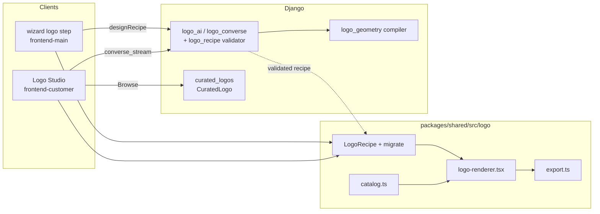

# Logo Studio & Brand Identity

# Logo Studio & Brand Identity

Coaches design their own brand mark inside Contentor — no external tool, no uploaded bitmap. The whole module rests on one invariant: **a logo is a `LogoRecipe` (versioned JSON), never an image.** Everything downstream — live SVG preview, the editor canvas, AI critique renders, the dark variant, the brand-kit zip, the final `logo`/`icon` PNGs — is a pure function of that recipe. Rasterization happens once, in the browser, at export time.

## Sub-modules

| Page | Owns |
|---|---|
| [packages-shared](logo-studio-brand-identity-packages-shared.md) | The recipe schema + migrations, the pure SVG renderer, the icon/font/palette catalogs, AI-design materializers, the canvas PNG export pipeline, the curated ranker |
| [backend-apps](logo-studio-brand-identity-backend-apps.md) | AI design/refine/converse endpoints, geometry compiler, recipe validation, quota accounting (`LogoAiUsage`), and the public-schema curated catalog (`CuratedLogo`) |
| [frontend-customer-src](logo-studio-brand-identity-frontend-customer-src.md) | The coach-facing full-screen Logo Studio — gallery, chat, direct-manipulation editor, export/upload |
| [frontend-main-src](logo-studio-brand-identity-frontend-main-src.md) | The signup wizard's logo step, plus Contentor's *own* platform lockup (`logo-mark.tsx` — unrelated to the engine) |

`packages/shared/src/logo` is the load-bearing piece: `frontend-main`'s `lib/logo/*` and `types/logo.ts` are one-line re-exports of it, so both apps render byte-identical output from the same recipe.

## How the pieces fit

The backend never emits pixels for a tenant logo — it emits recipes. `logo_ai.py` and `logo_converse.py` funnel every model response through `validate_recipe` (plus `_validate_lockup`, `_validate_pack_palette`, `_validate_custom_paths`) so a malformed or hallucinated design is rejected before it reaches a client; `logo_geometry.py` compiles abstract mark descriptions into concrete SVG path data. The curated catalog is the one place real PNGs live, and it's platform-wide (SHARED_APPS), normalized on ingest by `clean_curated_png`.

## Key cross-module workflows

**Wizard → finished PNGs.** `useThisLogo` (`verify/wizard/ai-logo.tsx`) → `designRecipe` → backend `logo_ai` → `composeConverseDesign` / `defaultRecipe` → `renderFinalPngs` → `LogoRenderer` → `svgToPngBlob`. The single flow that spans all four sub-modules, and the reason the shared renderer must stay framework-light.

**Studio conversation.** The coach types a nudge; `StudioChat` posts to `converse_stream`, which runs `_converse_guards`, validates each turn, and streams back candidate recipes. Candidates render as SVG immediately — no round-trip for a preview. The two-pass critique path (`critique_turn` → `critique_refine`) renders candidates to PNGs via `renderRecipesToPngs` and feeds them back to the model as images.

**Browse → customize.** `handleCreateFromCurated` seeds from a `CuratedLogo` row, then either hands off to `handleCustomize` (direct edit) or `generateSimilar` (style-matched variations). `composeCuratedPreview` applies the tenant palette so browsed marks preview in the coach's colors before commit.

**Edit → export.** `StudioEditor`/`StudioCanvas` mutate the recipe under an undo stack (`lib/logo/history.ts`), session state persists via `studio-session.ts`, and export rasterizes to `logo`/`icon` PNGs uploaded onto the tenant config.

## Gotchas

- Recipes are versioned — always route incoming JSON through `migrateRecipe` rather than trusting the stored shape.
- AI design costs quota; `LogoAiUsage` is the ledger and `_converse_guards` the gate. Client code must handle refusal, not just error.
- The curated catalog lives in the public schema. Adding rows is a seeding operation (`seed_curated_logos`), not tenant data — see the `collect-curated-logos` skill.
- `components/shared/logo-mark.tsx` in `frontend-main` is Contentor's own wordmark and shares nothing with the engine beyond the word "logo".