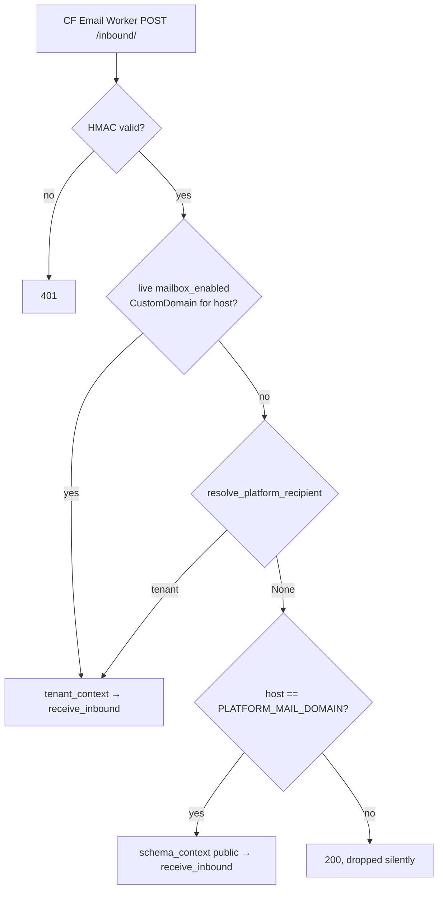

# Mailbox & Notifications — backend-apps

# Mailbox & Notifications — `backend/apps/mailbox`, `backend/apps/notifications`

Two tenant-facing communication subsystems. **Mailbox** is a real email client: threaded conversations with students over SMTP-ish transport (Resend out, a Cloudflare Email Worker in). **Notifications** is push + in-app announcements: Web Push subscriptions, coach-authored announcements with audience filters, recurring rules, and an optional email fallback.

They share almost no code — the one deliberate seam is `apps.core.email.send_email`, plus `sanitize_rich_text` from `apps.tenant_config.defaults` for anything HTML that a coach typed.

---

## Part 1 — Mailbox

### Why it's dual-listed

`apps.mailbox` appears in **both** `SHARED_APPS` and `TENANT_APPS` (see `CLAUDE.md` → SHARED_APPS). The same three tables (`Conversation`, `Message`, `MessageAttachment`) therefore exist in the public schema *and* in every tenant schema:

| Schema | What it is | Who reads it | Sends from |
|---|---|---|---|
| tenant | Coach ↔ student mailbox | `IsCoachOrOwner` (`urls.py`) | `sending_identity(connection.tenant)` |
| public | Superadmin platform inbox | `IsSuperUser` (`urls_platform.py`) | `settings.PLATFORM_SUPPORT_FROM` |

This is why `views.py` is structured as thin permission wrappers around shared private bodies — `conversation_list` and `platform_conversation_list` both call `_conversation_list`; same for `_conversation_detail`, `_compose`, `_reply`, `_upload_attachment`. There is exactly one behavioural fork in the whole app, and it lives in `services.send_message`:

```python
if connection.schema_name == get_public_schema_name():
    from_email = settings.PLATFORM_SUPPORT_FROM
else:
    from_email, _can_receive = sending_identity(connection.tenant)
```

**Consequence to internalize:** any unqualified mailbox write runs against the ambient `search_path`. Writing to the platform inbox from a request that happens to be in a tenant context silently lands in that coach's mailbox. `views.inbound` guards this explicitly with `schema_context(get_public_schema_name())` rather than trusting the ambient schema — keep that habit for any new inbound path.

### Sending identity — three tiers

`identity.sending_identity(tenant) -> (from_email, can_receive)`:

1. A `CustomDomain` that is `provisioning_status="live"` **and** `mailbox_enabled=True` → `<mailbox_local_part>@<domain>`, receiving enabled.
2. Otherwise `platform_address(tenant)` → `<local_part>@PLATFORM_MAIL_DOMAIN`, receiving enabled. Requires the feature domain configured, a claimed `PlatformMailboxAddress` row, **and** `tenant.has_paid_platform_plan`.
3. Otherwise `settings.RESEND_FROM_EMAIL`, `can_receive=False` — send-only.

`CustomDomain` and `PlatformMailboxAddress` both live in `apps.domains` in the **public** schema, so these helpers are safe to call from inside a tenant request. A lapsed subscription keeps the registry row reserved but makes the address stop resolving — tier 2 silently degrades to tier 3 (there are tests for exactly this: `test_paid_without_claim_is_send_only`, `test_free_plan_with_claimed_row_does_not_resolve`).

Outside the app, `core/contact/views.contact_submit` reuses `sending_identity` so the public contact form answers from the coach's real address.

### Inbound routing

`views.inbound` is the webhook the Cloudflare Email Worker posts to. It is `@authentication_classes([])` + `AllowAny` + `@csrf_exempt`, authenticated instead by HMAC-SHA256 over the raw body: `signing.verify_inbound_signature(request.body, HTTP_X_MAILBOX_SIGNATURE)` against `settings.MAILBOX_INBOUND_SECRET`. Missing secret or missing header ⇒ 401, never a pass.



**Correctness depends on the Worker posting to the apex URL.** The `CustomDomain` lookup is a public-schema query; if the Worker posted to a tenant subdomain, `HeaderAwareTenantMiddleware` would put the request in a tenant schema, the lookup would return `None`, and every message would fall through to the platform-inbox branch. The comment in `views.inbound` says this — don't remove it.

Foreign domains return 200 with no side effect: never leak which addresses exist.

### `inbound.receive_inbound`

Idempotency is belt-and-braces. First a `Message.objects.filter(message_id=...).exists()` check; then the whole write runs in `transaction.atomic()` and an `IntegrityError` (from the `uniq_message_id_when_present` partial unique constraint) is caught and treated as a duplicate redelivery. Empty `message_id` is exempt from the constraint, so provider-less messages (e.g. the contact form) can coexist.

Threading is by counterparty, not by `References` header. `services.get_or_create_conversation` looks up the single **open** conversation for that email address — enforced by `uniq_open_conversation_per_counterparty` (`UniqueConstraint(counterparty_email, condition=Q(is_archived=False))`). Archiving a thread frees the slot so the next message starts a fresh one. It also links `Conversation.student` by case-insensitive email match, so an inbound from a registered student is attributed.

`unread_count` is bumped with `F("unread_count") + 1` via a queryset `.update()` — no read-modify-write race — followed by `refresh_from_db()`.

### Attachments

`attachments.py` is the whole policy: `MAX_FILE_BYTES = 10 MB`, `MAX_FILES_PER_MESSAGE = 4`, MIME allowlist (`image/`, `video/`, `audio/` prefixes plus a fixed set of document types). `validate_attachment` returns a **user-facing message string or `None`** — `None` means valid, which reads backwards at call sites if you're skimming.

Storage goes through `apps.core.storage` (`build_s3_path("mailbox", uuid4().hex, filename)` → S3/MinIO). Two directions:

- **Outbound:** the composer POSTs each file to `attachments/` *before* send. `MessageAttachment.message` is nullable precisely for this — the row exists unlinked. `send_message` then claims them: `filter(id__in=ids, message__isnull=True)`, and a count mismatch raises `ValueError("Unknown or already-sent attachment.")` (surfaced as a 400 by `_compose`/`_reply`). This makes attachment IDs single-use and prevents attaching someone else's already-sent file. Unclaimed rows are orphans — nothing reaps them today.
- **Inbound:** attachments arrive base64-inline in the webhook payload. Anything failing validation, missing content, or flagged `omitted` by the Worker gets a row with `omitted=True` and an empty `storage_key`. A storage exception is logged and downgraded to `omitted` rather than failing the whole message — receiving the text matters more than the file.

`MessageAttachmentSerializer.download_url` returns `""` for omitted rows, otherwise a presigned URL minted per serialization.

### Outbound send

`services.send_message` builds RFC-ish threading headers itself: `new_message_id(sender_domain)` for `Message-ID`, the previous message's `message_id` as `In-Reply-To`, and an accumulated `References` chain. HTML is `sanitize_rich_text(html)` or, absent HTML, `<p>{escape(text)}</p>`. Delivery is `apps.core.email.send_email(..., headers=..., attachments=[{filename, content}])` with attachment bytes re-base64'd from storage.

The `Message` row is created **only after** `send_email` returns truthy; a falsy return raises `RuntimeError("mailbox send failed")` and nothing is persisted. That's a deliberate trade: no phantom sent messages, at the cost of losing the draft on transport failure.

### Endpoints

Coach (`urls.py`, all `IsCoachOrOwner`):

| Path | Methods | Notes |
|---|---|---|
| `conversations/` | GET | `select_related("student").prefetch_related("messages__attachments")` — the serializer's `_last_message` walks the prefetched list, so dropping the prefetch is an N+1 |
| `conversations/<pk>/` | GET, PATCH, DELETE | GET marks inbound messages read and zeroes `unread_count`; PATCH accepts only `is_archived` / `is_spam` |
| `conversations/<pk>/reply/` | POST | |
| `compose/` | POST | creates-or-reuses the open conversation |
| `attachments/` | POST | `MultiPartParser` |
| `settings/` | GET, PUT | address picker |
| `inbound/` | POST | unauthenticated, HMAC-signed |

Platform (`urls_platform.py`, all `IsSuperUser`): the same five handlers minus `settings/` and `inbound/`.

`mailbox_settings` PUT is overloaded on payload shape: presence of `platform_local_part` routes to `_claim_platform_address` (validates against `_LOCAL_PART_RE`, `RESERVED_MAILBOX_LOCAL_PARTS`, and uniqueness, returning coded errors like `taken` / `upgrade_required` / `reserved_local_part`); otherwise it updates the custom domain's `mailbox_local_part`/`mailbox_enabled`. Enabling also binds the Cloudflare catch-all to the inbound Worker via `get_cloudflare().enable_email_routing(...)` — **which replaces any existing forward-to-Gmail rule on the zone**, and is skipped entirely (with `mailbox_enabled` still persisted) when `CLOUDFLARE_EMAIL_WORKER_NAME` or `cloudflare_zone_id` is missing. That's the usual cause of "I enabled the mailbox but receive nothing."

Changing a claimed platform local part releases the old one for anyone else to claim — acceptable pre-launch, a squatting vector after.

---

## Part 2 — Notifications

### Surface

| Layer | File | Audience |
|---|---|---|
| Student API, prefix `/api/v1/notifications/` | `urls.py` / `views.py` | `IsAuthenticated`, except `vapid-key/` and `email/unsubscribe/` (both `authentication_classes([])` + `AllowAny`) |
| Coach admin API | `admin_urls.py` / `admin_views.py` | `IsCoachOrOwner` |
| Background | `tasks.py` | Celery worker + beat |

Student endpoints: `vapid-key/`, `subscribe/`, `unsubscribe/`, `feed/`, `feed/<pk>/read/`, `email/unsubscribe/`.
Coach endpoints: announcement CRUD + `announcements/preview/`, `templates/`, `recurring/`.

### Web Push transport (`services.py`)

`send_to_subscription(sub, payload)` wraps `pywebpush.webpush`. Three details that matter:

- `_vapid_key_path()` is `@lru_cache(maxsize=1)` — pywebpush wants a PEM **file path**, not PEM text, so `settings.VAPID_PRIVATE_KEY` is materialized to a `0o600` temp file once per process.
- A 404/410 response means the browser dropped the subscription: the `PushSubscription` row is **deleted** and `False` returned. Any other exception is logged, not raised.
- `timeout=getattr(settings, "WEBPUSH_TIMEOUT", 10)` — a hostile push endpoint must not hang a worker.

`send_to_subscriptions(queryset, payload)` returns a success count; `broadcast_to_tenant(payload)` is that over all subscriptions in the current schema. These two are the app's public transport API and are called from **outside** notifications: `apps/blog/tasks._notify_coach`, `apps/community/tasks.fanout_community_post` and `notify_post_comment`. Likewise `payloads._brand` is reused by `apps/community/payloads`, and `recurrence.next_occurrence` by blog autopilot (`apps/blog/views.blog_autopilot`, `apps/blog/tasks._dispatch_for_current_tenant`). Treat all four as cross-app contracts.

`subscriptions_with_access(content)` gates paid content: free content returns every subscription untouched; otherwise each subscriber is run through `ContentAccessService.check_access` in Python and the survivors re-queried by pk. Correct, but O(subscribers) access checks — used only on the live-reminder path.

### Announcement lifecycle

```mermaid
flowchart LR
    C[POST announcements/] --> N{scheduled_at?}
    N -- none_past["none/past"] --> Q[fanout_announcement.delay]
    N -- future --> S[status=scheduled]
    S --> B[beat: dispatch_due_announcements] --> Q
    R[RecurringAnnouncement] --> BR[beat: dispatch_due_recurrences] --> A[new Announcement]
    Q --> F[send_announcement_to_recipients]
    A --> F
    F --> P[push per recipient] --> E{also_email?}
    E -- yes --> M[send_announcement_emails]
```

`Announcement.status` has only two values and doubles as the concurrency lock:

- Rows are created with `status="scheduled"` **always** — `admin_views` comments this explicitly. `fanout_announcement` guards on it.
- `fanout_announcement` claims with `Announcement.objects.filter(pk=..., status="scheduled").update(status="sent")`; a zero-row claim returns immediately. That's what makes a duplicate dispatch (slow fan-out re-enqueued by the per-minute beat) a no-op rather than a double send.
- `AnnouncementCreateSerializer.validate_scheduled_at` normalizes a past/now timestamp to `None`, i.e. send-now.
- `PATCH` is refused with 409 once `status == "sent"`; clearing `scheduled_at` on a PATCH triggers an immediate `fanout_announcement.delay`.

Both `fanout_*` tasks take `(id, schema_name)` and re-enter the schema via `tenant_context` — Celery has no ambient tenant. A vanished tenant is a silent return.

`services.send_announcement_to_recipients` does the work: snapshot the audience (`bulk_create(..., ignore_conflicts=True)` against the `(announcement, user)` unique constraint), push to every device the user has, then finalize `recipient_count` / `push_sent_count` / `status` / `sent_at`. Note the `any([...])` with an explicit list and a `noqa: C419` — a generator would short-circuit on the first success and skip the user's other devices, so a stale endpoint that still returns 201 would mask a live one. Per-recipient `push_status` distinguishes `failed` (subscriptions still exist) from `expired` (cleanup inside `send_to_subscription` removed them all).

### Audience filters (`audience.py`)

`resolve_audience(filters)` starts from `User.objects.filter(role="student")` and narrows by:

- `app_type` ∈ `{pwa, browser}` → `last_display_mode`
- `platform` (str or list) → `last_platform__in`
- `push_enabled is True` → `push_subscriptions__isnull=False` distinct
- `content_type` + `content_id` (`course` | `bundle`) → per-user `ContentAccessService.check_access` in a Python loop, then re-query by pk

The content filter is the expensive one — it materializes the whole student list. `audience_counts` (behind `announcements/preview/`) runs the same resolution twice-ish for `{audience, push_reachable}`; it's a coach-triggered preview so the cost is bounded, but adding filters means adding them to `resolve_audience` only — `audience_counts`, preview, and fan-out all inherit them.

### Email fallback

Opt-in per announcement via `also_email`. `send_announcement_emails` renders `email_render.announcement_email_html(announcement, cfg, base_url)` — a theme-branded inline-styled email whose accent colour comes from `THEME_EMAIL_COLORS`, keyed by `TenantConfig.theme`. **Those keys must stay in sync with `TenantTheme`'s choice values** (`ocean, ember, forest, sunset, violet, slate`); an unknown theme falls back to `#0391F9` rather than erroring, so a drift is invisible.

The unsubscribe link is a `django.core.signing` token (`salt="notifications.email.unsubscribe"`, 90-day max age) carrying `{schema, user_id, email}`, pointed at `{tenant_base_url}/api/v1/notifications/email/unsubscribe/?t=...`. It is passed to the renderer through a **transient attribute** — `announcement.email_unsub_url`, set per recipient before each render, not a DB field. Miss that and every recipient gets the previous one's link (or `base_url`, via the `getattr` default). The same URL is emitted as a `List-Unsubscribe` header.

`views.email_unsubscribe` decodes the token and `get_or_create`s an `EmailOptOut` keyed on lowercased email (unique). `send_announcement_emails` loads the whole opt-out set once and filters in Python.

Note the asymmetry: `email/unsubscribe/` builds its URL with the tenant's own base URL but the handler resolves the opt-out from whatever schema the request lands in — it relies on the link being on the tenant's own host, not on the `schema` field inside the token.

### Recurrence (`recurrence.py`)

Pure schedule math, zero DB access: `next_occurrence(frequency, send_time, weekday, day_of_month, after_utc, tz_name, start_date) -> aware UTC datetime`. It computes in the tenant's timezone (`TenantConfig.timezone`, defaulting `"UTC"`) and converts back. `_monthly` clamps to `min(dom, calendar.monthrange(...))`, so day 31 lands on Feb 28/29. `weekly` scans up to 15 days forward and raises rather than looping forever. The `floor` term (`max(after_local, start_at - 1s)`) is what makes a rule starting in the future fire on its start date rather than immediately.

`RecurringAnnouncementSerializer` owns validation (weekly needs `weekday`, monthly needs `day_of_month`, `end_date >= start_date`) and recomputes `next_run_at` on both create and update — `next_run_at` is read-only over the API.

`_dispatch_recurrences_for_current_tenant` uses a compare-and-swap for exactly-once semantics: compute `new_next`, then `filter(pk=..., next_run_at=old_next).update(next_run_at=new_next, is_active=still_active)`. Only the worker that successfully advanced the cursor spawns the `Announcement`. `is_active` flips false when the next occurrence would pass `end_date`. Unlike `fanout_announcement`, the spawned announcement is delivered **inline** in the beat-triggered task, not re-enqueued.

### Beat tasks and per-tenant iteration

All four scheduled tasks share one shape — iterate `get_tenant_model().objects.exclude(schema_name="public").filter(provisioning_status="ready")`, enter `tenant_context`, and wrap the body in `try/except Exception` + `logger.exception` so **one bad tenant cannot break the rest**. Keep that when adding tasks.

- `send_live_reminders` — 15-minute horizon over `(LiveClass, LiveStream, ZoomClass, OnsiteEvent)`. Dedupe is a `LiveReminderLog` row keyed `f"{model_name}:{pk}"` created with `get_or_create`; `created is False` means already reminded. Recipients are narrowed by `subscriptions_with_access(event)`, so paid events only reach students who can attend — new-content and broadcast fan-outs stay deliberately broad.
- `dispatch_due_announcements` — per-minute; enqueues `fanout_announcement` for every `scheduled` row with `scheduled_at <= now`.
- `dispatch_due_recurrences` — as above.
- `fanout_new_content` — not a beat task; triggered by signals.

### Signals

`NotificationsConfig.ready()` imports `signals`, which tracks `Course.is_published` across a `pre_save`/`post_save` pair (`instance._was_published`) and calls `fanout_new_content.delay(pk, connection.schema_name)` only on the false→true edge. Republishing an already-published course sends nothing.

### Templates

`templates_builtin.builtin_templates(brand)` returns six code-constant templates with `{brand}` interpolated and synthetic ids of the form `"builtin:<key>"`. `template_collection` GET concatenates those with serialized `AnnouncementTemplate` rows. The frontend therefore sees a list whose `id` is sometimes a string and sometimes an int, and `builtin: true|false` is the discriminator — `template_detail` (DELETE) only accepts `<int:pk>`, so built-ins are structurally undeletable.

---

## Cross-cutting conventions

- **Anything a coach typed goes through `sanitize_rich_text`** — on the way in (`validate_body` on the announcement, template, and recurring serializers) *and* on the way out (`MessageSerializer.get_html`, `announcement_email_html`, `send_message`). Belt and braces, because rows predate the input-side sanitizer.
- **Push bodies are plaintext.** `payloads.strip_to_text` uses `nh3.clean(html, tags=set(), attributes={})` plus `html.unescape` — don't hand raw HTML to a push payload.
- **Public endpoints must set `@authentication_classes([])`.** `TenantJWTAuthentication` is the DRF default; `AllowAny` alone still runs the authenticator and 401s on a malformed token. `vapid_key`, `email_unsubscribe`, and `inbound` all do this (`views.py` even carries the CLAUDE.md reminder inline).
- **Celery never has an ambient tenant.** Every task signature carries `schema_name` or iterates tenants itself.
- **Denormalized counters** (`Conversation.unread_count`, `Announcement.recipient_count` / `push_sent_count`) are maintained by the writers above. `AnnouncementListSerializer.get_read_count` prefers the `read_count_annotated` annotation that `announcement_collection` adds and falls back to a per-row `COUNT` — the fallback is the N+1 path.

## Test surface

`backend/apps/mailbox/tests/` covers the parts with real branching: `test_identity.py` and `test_platform_address.py` (all three sending tiers, plan lapse, plus-addressing, wrong domain), `test_inbound.py` (idempotency by `message_id`, the DB constraint including multiple-empty-ids, threading into an existing conversation, student linking), `test_attachments.py` (validation rules, storage failure → `omitted`). `recurrence.next_occurrence` is pure and the cheapest thing in either app to test directly. Run a single app with `make test-app APP=mailbox` / `APP=notifications`.
