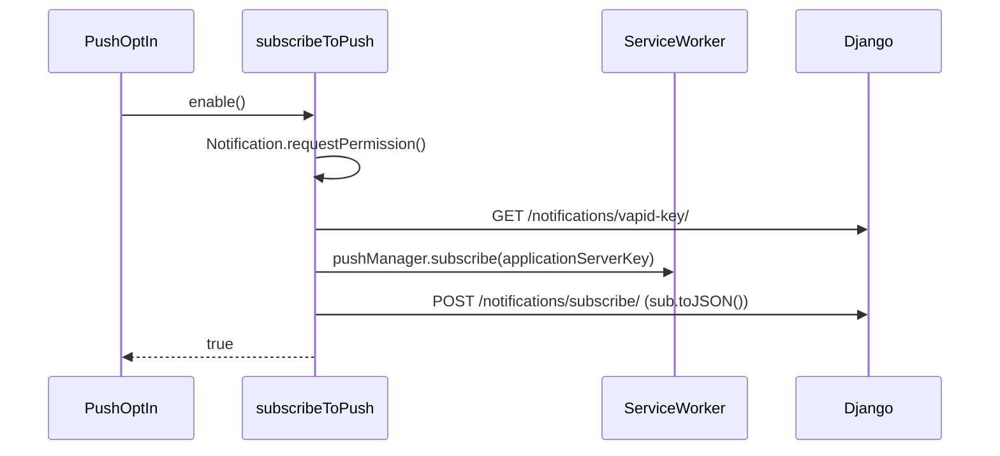

# Mailbox & Notifications — frontend-customer-src

# Mailbox & Notifications — `frontend-customer/src`

The coach-facing side of two related communication surfaces inside the tenant portal:

- **Mailbox** — real email conversations between a coach and their students, sent and received through the coach's own address.
- **Notifications** — in-app *announcements* (optionally mirrored as push and email) that a coach broadcasts to a filtered slice of their students, plus the student-facing feed those announcements land in.

Both are thin clients over `/api/v1/…` endpoints in the tenant schema. This module owns the API bindings, the admin UI, and the PWA push subscription handshake. It deliberately owns *very little* mailbox UI — the conversation list/thread/composer live in the shared package and are consumed here.

---

## File map

| Path | Role |
|---|---|
| `lib/mailbox.ts` | Typed bindings for `/api/v1/mailbox/*` |
| `lib/announcements.ts` | Typed bindings for `/api/v1/admin/notifications/*` and `/api/v1/notifications/*` |
| `lib/push.ts` | Web Push capability checks + VAPID subscribe handshake |
| `app/admin/inbox/page.tsx`, `loading.tsx` | Inbox route (`force-dynamic`) + its skeleton |
| `components/admin/mailbox/inbox-client.tsx` | Tenant wrapper around the shared inbox; renders the upsell banner |
| `components/admin/mailbox/mailbox-settings.tsx` | `MailboxSettingsSection` — address picker, three-way by plan/domain |
| `app/admin/notifications/page.tsx` | Compose + tabbed History / Recurring / Templates |
| `app/admin/notifications/[id]/page.tsx` | `ReceiptPage` — per-recipient delivery receipt |
| `components/admin/announcement-compose.tsx` | The composer, incl. `TemplatePickerModal` |
| `components/admin/announcement-history.tsx` | Sent + scheduled announcements |
| `components/admin/announcement-recurring-list.tsx` | Recurring schedules (pause/resume/delete) |
| `components/admin/announcement-templates-list.tsx` | Saved (non-builtin) templates |
| `components/shared/announcement-bell.tsx` | Student-facing feed dropdown |
| `components/shared/push-optin.tsx` | Student-facing push opt-in prompt |

Everything in `components/admin/**` and `app/admin/**` is coach-only. `components/shared/announcement-bell.tsx` and `push-optin.tsx` are the *student* halves — `PushOptIn` is mounted globally from `src/app/layout.tsx` and self-suppresses on `/admin` routes.

---

## API layer

All three `lib/` files go through `clientFetch` (`@/lib/api-client`) — the single browser-side fetch wrapper that attaches auth, the session id (`getSessionId`), and throws `ApiError` on non-2xx. There is no server-side fetching in this module; every consumer is a client component.

### `lib/mailbox.ts`

Base `"/api/v1/mailbox"`. The interesting shape is the three-level tier model in `MailboxSettings`:

- `has_custom_domain` — the tenant has its own verified domain, so `local_part@domain` is claimable.
- `platform_eligible` + `platform_domain` / `platform_local_part` — paid coach without a custom domain; can claim `<x>@platform_domain`.
- Neither — free plan, send-only from a no-reply `from_email`.

`can_receive` is the single boolean the UI keys off for "students can actually reply to you".

Note the two writes both `PUT /settings/` but send disjoint payloads: `saveSettings({local_part, enabled})` for the custom-domain path, `savePlatformAddress(localPart)` sending only `platform_local_part`. Both return the full refreshed `MailboxSettings`, which callers use to reset local form state.

`uploadAttachment` is the only multipart call — it builds `FormData` and passes it as `body` without a `Content-Type` header so the browser sets the boundary. `MessageAttachment.omitted` flags attachments the backend chose not to store (size/type limits) but still wants to show in the thread.

### `lib/announcements.ts`

Two unrelated route families in one file, which is worth knowing before you add to it:

- `ADMIN_BASE = "/api/v1/admin/notifications"` — announcements (`${ADMIN_BASE}/announcements`), `templates/`, `recurring/`. Coach-only.
- `"/api/v1/notifications/feed/"` — `getFeed` / `markRead`. Student-facing, used by `AnnouncementBell`.

`previewAudience(filters)` is the dry-run: it returns `{audience, push_reachable}` for a filter set without creating anything. `AnnouncementFilters` combines device facts (`app_type`, `platform[]`, `push_enabled`) with content ownership (`content_type`, `content_id`) — omitted keys mean "no constraint", which is why the composer sets fields back to `undefined` rather than `false`/`""` when toggling off.

`AnnouncementTemplate.id` is `number | string` because builtin templates ship from the backend with string ids and cannot be deleted — `TemplateRow` calls `deleteTemplate(Number(item.id))`, and the templates list filters `!t.builtin` before rendering so builtins never reach that path.

### `lib/push.ts`

Three exports, no React:

- `pushSupported()` — `serviceWorker` + `PushManager` + `Notification` all present.
- `isStandalone()` — display-mode match plus the legacy iOS `navigator.standalone`. Also consumed outside this module by `components/install/install-guide.tsx` and `lib/usage.ts` (PWA-vs-browser usage reporting).
- `subscribeToPush()` — the full handshake, returning `false` (never throwing) for every "user said no" path.



`urlBase64ToUint8Array` converts the URL-safe base64 VAPID key the API returns into the `ArrayBuffer` `applicationServerKey` requires — don't hand the raw string to `subscribe()`, it will reject.

---

## Mailbox UI

### Inbox

`app/admin/inbox/page.tsx` is a two-line server component (`dynamic = "force-dynamic"`) rendering `InboxClient`. The local `InboxClient` is a **wrapper**, not the inbox:

```
admin/inbox/page.tsx
  └─ components/admin/mailbox/inbox-client.tsx   (local: fetch settings → build banner)
       └─ @shared/mailbox/inbox-client            (all conversation UI)
```

The shared component owns list/thread/reply/archive/spam/delete and polling — it calls `listConversations`, `getConversation`, `reply`, `updateConversation`, `deleteConversation` from `lib/mailbox.ts` directly (its `tick` poller re-hits `listConversations` and `getConversation`). Sibling shared components pull the rest: `compose-card.tsx` → `compose`, `message-editor.tsx` → `uploadAttachment`.

The local wrapper's only job is `topBanner`. It fetches `getSettings()` and, when `can_receive` is false, renders a dismissible upsell whose copy and CTA fork on `platform_eligible`:

- eligible → "Pick your email address…" → `/admin/settings`
- not eligible → "students can't reply to `from_email`" → `/admin/billing`

`canReceive` defaults to `true` when settings fail to load (`settings?.can_receive ?? true`) so a transient API error shows no banner rather than a wrong upsell. Dismissal is component state only — it returns on remount, by design.

### Settings

`MailboxSettingsSection` is mounted by `app/admin/settings/page.tsx`. It splits fetch from render: the outer component owns `loading`/`error`/`reloadKey` and wraps a `PageState`; `MailboxSettingsBody` receives non-null `settings` and owns the form. That split matters — the body seeds `useState` from props, so remounting it (which `PageState` does after a retry) is how form state gets re-synced.

Three mutually exclusive renders, in the order the code checks them:

1. `!has_custom_domain && platform_eligible` → platform address picker (`savePlatformAddress`).
2. `!has_custom_domain` → read-only send-only card with a plan upsell. No form.
3. otherwise → custom-domain picker + "Enable inbox" switch (`saveSettings`).

Both writable paths validate the local part client-side against `LOCAL_PART_RE = /^[a-zA-Z0-9._-]+$/` and disable Save while unchanged (`isUnchanged` / `platformUnchanged`) so a no-op PUT can't be fired. Server-side rejections on the platform path are mapped through `CLAIM_ERRORS` — `taken`, `reserved_local_part`, `invalid_local_part`, `upgrade_required`, `feature_unavailable` — read out of `ApiError.data.detail` in `useAsyncAction`'s `onError` and surfaced *inline* under the field, not as a toast, because they're field-level validation. The custom-domain path has no equivalent map and just uses `errorToast`; if you add server-side claim errors there, mirror the `CLAIM_ERRORS` treatment.

---

## Announcements UI

`app/admin/notifications/page.tsx` is the shell: a `RichEditorProvider` (needed by the composer's body editor), `AnnouncementCompose`, and a three-tab switcher. Cross-component refresh uses the `refreshKey` counter pattern — `bump()` on `onSent` increments a number passed to all three lists, each of which has `useEffect(load, [refreshKey])`. There is no shared cache; each tab refetches.

### Composer

`AnnouncementCompose` is the largest component here and holds ~15 pieces of form state. Its notable behaviours:

- **Live audience preview.** A `useEffect` on `filters` calls `previewAudience` with a `cancelled` guard. On failure `reach` is set to `null`, which the UI renders as "Calculating who will receive this…" — indistinguishable from in-flight. Worth knowing when debugging a preview that never resolves.
- **Zero-audience warning.** `reach.audience === 0` renders a destructive-styled block, but does **not** disable Send. Only an empty title does (`disabled={!title.trim()}`).
- **Filter toggles clear to `undefined`.** `app_type` and `push_enabled` toggle to `undefined`; `togglePlatform` builds a `Set` and drops `platform` entirely when empty. This keeps the payload minimal and matches the backend's "absent = unconstrained" reading.
- **One button, two endpoints.** The once/repeating switch decides whether `send` calls `createAnnouncement` (with `scheduled_at` as an ISO string or `null`) or `createRecurring` (with `frequency`/`send_time`/`weekday`/`day_of_month`/`start_date`/`end_date`). Frequency-specific fields are nulled for the other frequencies before send. Validation for the repeating path is toast-based and returns early from inside `useAsyncAction`.
- **Body is rich HTML.** Set via `editor.openRichEditor({value, title, onSave: setBody})` from `useRichEditor`, and rendered back through `dangerouslySetInnerHTML` in the preview button, the bell dropdown, and the receipt page. The backend is the trust boundary for that HTML.
- **Link picking** goes through `LinkPickerModal`, which returns `(href, label)`; `linkLabel` falls back to the href.
- **`saveAsTemplate`** uses `window.prompt` for the name and is only offered once a title exists.

`TemplatePickerModal` lives in the same file. It renders through `ModalPortal`, opens immediately with a `Spinner` body while `listTemplates()` is in flight (per the overlay convention — never held closed while fetching), filters client-side on name + title, and shows builtins with a "built-in" chip.

### Lists

The three tab components share a shape — local `items` state, a `load()` that swallows errors into an empty list plus a toast, and per-row `useAsyncAction` for mutations with `confirm()` guards on destructive ones. Differences worth noting:

- `AnnouncementHistory` is the only one tracking `loading`, and wraps rows in `StaleContainer pending={loading && items.length > 0}` so a `refreshKey` refetch dims in place instead of blanking. Row copy forks on `status`: scheduled rows show the time and a "Cancel" button; sent rows show `recipient_count / push_sent_count / read_count` and "Delete". Both hit the same `deleteAnnouncement`.
- `AnnouncementRecurringList` renders a human summary via `summary()` (`Daily at HH:MM` / `Every Monday at HH:MM` / `Monthly on day N at HH:MM`) plus `next_run_at`, and toggles `is_active` through `patchRecurring` for pause/resume.
- `AnnouncementTemplatesList` filters out builtins on load, so the list is only user-saved templates.

Each row's title in history links to the receipt page.

### Receipt page

`ReceiptPage` (`admin/notifications/[id]/page.tsx`) is the delivery report: four `Stat` tiles (recipients, push sent, read, failed) over a filterable per-recipient table. `read_count` from the list serializer is *not* used here — the page recomputes `readCount` from `data.recipients` alongside the failed count, so both stats derive from the same array as the rows. The status filter (`all | sent | failed | expired | none`) is client-side over the already-loaded `recipients`, memoized on `[data, statusFilter]`. Loading uses `PageState` with an `onRetry` that bumps `reloadKey`; the fetch effect uses the same `cancelled` guard as elsewhere.

### Student side

`AnnouncementBell` fetches the feed once on mount and renders a badge with `unread_count`. `openItem` optimistically updates: it awaits `markRead` (taking the authoritative `unread_count` from the response), patches `read_at` locally, and then navigates via `window.location.href` if the item has a link — a hard navigation, since announcement links may point outside the SPA. `markRead` failures are silently swallowed, so a read that didn't persist reappears unread on the next load.

`PushOptIn` gates itself on four conditions in `useEffect`: no `pwa-push-dismissed` in `localStorage`, `pushSupported()`, `isStandalone()` (iOS only allows push in installed PWAs), and permission not already `granted`. It also returns `null` on `/admin` paths — coaches don't get the student prompt. `enable()` calls `subscribeToPush()`, toasts `pwa.pushFailed` on a falsy return or a throw, and dismisses persistently either way, so declining once doesn't re-prompt.

---

## Conventions this module follows

Per the repo's loading/feedback rules, and enforced by `scripts/check-loading-patterns.mjs` in `make lint`:

- Async buttons use `<Button loading loadingText>`; standalone spinners are `<Spinner>`. The list rows here are the plain-`<button>` exception — they render `<Spinner size="sm" />` in place of their label while a mutation runs.
- Mutations go through `useAsyncAction` (`@shared/hooks/use-async-action`) for the loading flag, double-submit guard, and default error toast.
- Client-page first loads use `PageState` with `skeleton`; the inbox route has a matching `loading.tsx`.
- Outcomes are sonner toasts; field validation stays inline (see `CLAIM_ERRORS`).
- Every fetch effect uses a `let cancelled = false` cleanup rather than `AbortController`.

Two divergences to be aware of if you're matching style: several `<Link>`/`href` usages here predate the `<NavLink>` convention (inbox banner CTA, history row titles), and the async list components don't all use `PageState` — `AnnouncementRecurringList` and `AnnouncementTemplatesList` render an empty-state paragraph while their first load is in flight, so "No recurring announcements yet." briefly shows before data arrives.

## Extending it

- **New mailbox endpoint** → add the binding to `lib/mailbox.ts`; if it's conversation UI, the consumer probably belongs in `@shared/mailbox`, not here.
- **New announcement filter** → add the optional field to `AnnouncementFilters`, add a toggle in `AnnouncementCompose` that clears to `undefined`, and confirm `previewAudience` and the create endpoints both honour it. The composer's preview is the only place a filter gets validated before send.
- **After changing a backend serializer** → run `npm run gen:api` in `frontend-customer` and diff `src/types/api-generated.ts`. The interfaces in `lib/mailbox.ts` and `lib/announcements.ts` are hand-written and drift silently; a surprising diff in the generated types means these need updating too.
