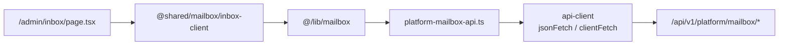

# Mailbox & Notifications — frontend-main-src

# Mailbox & Notifications — `frontend-main`

The superadmin-facing half of Contentor's mailbox. `frontend-main` is the marketing/platform app, and its `/admin/inbox` route is where **we** (the platform owner) read and answer mail from coaches. This module is deliberately thin: it supplies a *platform* HTTP client and a route shell, then hands all UI to the shared mailbox components that `frontend-customer` also uses.

## Why it exists

`apps.mailbox` is dual-listed in Django — the same models live in the public schema (platform inbox: superadmin ↔ coaches) and in every tenant schema (coach mailbox: coach ↔ students). Two inboxes, one set of UI components, two different API bases and auth mechanisms.

The shared UI in `packages/shared/src/mailbox/*` imports from `@/lib/mailbox`. Each app resolves that path to its own client:

| App | `@/lib/mailbox` resolves to | Base path | Auth |
|---|---|---|---|
| `frontend-main` | `src/lib/platform-mailbox-api.ts` | `/api/v1/platform/mailbox` | same-origin admin cookie |
| `frontend-customer` | its own tenant mailbox client | tenant mailbox endpoints | tenant JWT |



`src/lib/mailbox.ts` is the whole indirection — a single `export * from "./platform-mailbox-api"`. It carries no logic and should stay that way; it is the alias contract, not a place for platform-specific behaviour. If a shared component needs something the platform inbox can't provide, the fix is to make the shared component tolerate its absence, not to bolt a shim onto the alias.

## `platform-mailbox-api.ts`

The client mirrors the coach mailbox API surface **minus settings** — the platform inbox has no per-tenant mailbox configuration (no forwarding address, no signature), so there is no `getSettings`/`updateSettings` pair here. Shared components that offer settings must feature-detect rather than assume the export exists.

Every request goes through the shared `api-client` (`src/lib/api-client.ts`), which is the consolidated `clientFetch` used across `frontend-main`. Auth is implicit: the admin session cookie is same-origin, so no header threading is needed and — unlike the tenant side — there is no `X-Tenant-Domain` concern, because these calls target the public schema by design.

### Operations

| Function | Request | Returns |
|---|---|---|
| `listConversations()` | `GET conversations/` | `ConversationListItem[]` |
| `getConversation(id)` | `GET conversations/:id/` | `ConversationDetail` (list item + `messages`) |
| `compose(body)` | `POST compose/` | `{ conversation_id, message_id }` |
| `reply(id, body)` | `POST conversations/:id/reply/` | `{ message_id }` |
| `uploadAttachment(file)` | `POST attachments/` | `MessageAttachment` |
| `updateConversation(id, patch)` | `PATCH conversations/:id/` | updated `ConversationListItem` |
| `deleteConversation(id)` | `DELETE conversations/:id/` | `void` |

`compose` takes `OutgoingMessage & { to: string; subject: string }` — a new thread needs a recipient and subject; `reply` reuses the existing thread's, so it takes bare `OutgoingMessage`.

### The `clientFetch` exception

Six of the seven functions call `jsonFetch`, which sets `Content-Type: application/json` and serializes/parses for you. `uploadAttachment` is the one that calls `clientFetch` directly:

```ts
const fd = new FormData();
fd.append("file", file);
// No Content-Type header — the browser sets the multipart boundary.
return clientFetch<MessageAttachment>(`${BASE}/attachments/`, {
  method: "POST",
  body: fd,
});
```

This is not stylistic. A `FormData` body must carry a `Content-Type: multipart/form-data; boundary=…` header whose boundary token the browser generates. Any hand-set `Content-Type` — including `jsonFetch`'s JSON default — destroys the boundary and the server sees an unparseable body. **If you add another file-upload endpoint here, route it through `clientFetch` with no explicit `Content-Type`.**

### Attachment flow

Attachments are uploaded before the message that references them:

1. `uploadAttachment(file)` per file → collect the returned `id`s.
2. Pass them as `attachment_ids` on the `compose`/`reply` body.

`MessageAttachment.omitted` flags an attachment the backend chose not to store or serve (size/type policy) — render it as unavailable rather than linking `download_url`.

## Types

`ConversationDetail extends ConversationListItem`, so a detail response is a superset of a list row and the same components render both. Two naming details matter when reading `ConversationListItem`:

- `counterparty_email` / `counterparty_name` — the platform-inbox framing (the coach you're talking to).
- `student_email` / `student_name` — carried for shape parity with the tenant mailbox, where the counterparty *is* a student. On the platform side treat `counterparty_*` as authoritative.

`MailboxMessage.direction` is `"inbound" | "outbound"` relative to the mailbox owner: inbound is mail the superadmin received, outbound is what we sent. Both `text` and `html` are present — prefer `html` for display and keep `text` for previews and search.

Note there are no notification-specific exports in this module. Action feedback follows the project convention: sonner toasts (see the loading & feedback conventions in `CLAUDE.md`), driven from the shared mailbox components, not from this client. In-app notification models (`apps.notifications`) are tenant-scoped and have no platform-inbox counterpart here.

## `/admin/inbox` route

```tsx
import { InboxClient } from "@shared/mailbox/inbox-client";

export const dynamic = "force-dynamic";

export default function InboxPage() {
  return <InboxClient />;
}
```

The route is a shell. `force-dynamic` opts out of static generation — inbox contents are per-session and change constantly, so there is nothing worth prerendering, and the server has no admin cookie at build time anyway. All fetching happens client-side inside `InboxClient` via this module's client.

Per the route conventions, this segment needs a `loading.tsx` at or above it — `scripts/check-loading-patterns.mjs` (run in `make lint`) fails the build otherwise.

## Contributing

**Adding an endpoint.** Add the function to `platform-mailbox-api.ts`; `mailbox.ts` re-exports it automatically. Keep the signature identical to the tenant client's equivalent so shared components need no branching — divergence in this pair is the main source of bugs in the shared mailbox UI.

**Changing a serializer.** These interfaces are hand-maintained, not generated. The generated contract lives in `frontend-customer/src/types/api-generated.ts` (`npm run gen:api`); after touching `apps.mailbox` platform serializers, regenerate there, review the diff, and mirror any shape change into the interfaces here.

**Error handling.** `jsonFetch`/`clientFetch` throw on non-2xx; nothing in this module catches. Callers wrap actions in `useAsyncAction` (`@shared/hooks/use-async-action`), which supplies the double-submit guard and the default error toast — don't add try/catch here.
