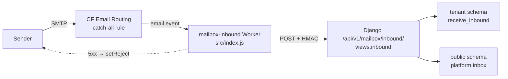

# Mailbox & Notifications — infra-cloudflare

# Mailbox Inbound — Cloudflare Email Worker (`infra/cloudflare/mailbox-worker`)

The inbound half of Contentor's coach mailbox. Cloudflare Email Routing cannot deliver mail into a Postgres schema, so this Worker sits at the edge of every mailbox-enabled coach zone, parses the raw MIME message, and hands a signed JSON envelope to Django's `/api/v1/mailbox/inbound/` webhook.

It is deliberately tiny: **parse → sign → POST → decide whether to bounce**. All tenant resolution, deduplication, threading and attachment storage happen on the Django side.

## Position in the system



One account-level deployment (`name = "mailbox-inbound"`, `wrangler.toml`) serves **every** tenant zone. There is no per-tenant Worker, no per-tenant secret, and no per-zone script config — the only per-zone artifact is the Email Routing catch-all rule that points at this Worker, created by Django during domain provisioning (see [Provisioning link](#provisioning-link)).

## Entry point

`export default { async email(message, env) }` — the Cloudflare [Email Worker](https://developers.cloudflare.com/email-routing/email-workers/) handler. `message` is an `EmailMessage` (`.from`, `.to`, `.raw`, `.setReject()`); `env` supplies the two bindings:

| Binding | Source | Value |
|---|---|---|
| `WEBHOOK_URL` | `[vars]` in `wrangler.toml` (committed) | `https://contentor.app/api/v1/mailbox/inbound/` |
| `MAILBOX_INBOUND_SECRET` | `wrangler secret put` (never committed) | 32-byte hex, must equal Django's `MAILBOX_INBOUND_SECRET` |

The handler flow is linear:

1. `PostalMime.parse(message.raw)` → structured mail (subject, text, html, message ids, attachments).
2. Build the JSON payload — note that `from`/`to` come from the **envelope** (`message.from`, `message.to`), not from the parsed headers, so a forged `From:` header can't redirect delivery.
3. `sign(env.MAILBOX_INBOUND_SECRET, payload)` → hex HMAC-SHA-256, sent as `X-Mailbox-Signature`.
4. `fetch(env.WEBHOOK_URL, …)` with `Content-Type: application/json`.
5. On a non-2xx response: `console.error` always; `message.setReject(...)` only for `>= 500`.

### Payload contract

```json
{
  "from": "student@example.com",
  "to": "info@coachdomain.com",
  "subject": "…",
  "text": "…",
  "html": "…",
  "message_id": "<…>",
  "in_reply_to": "<…>",
  "references": "<a> <b>",
  "attachments": [
    { "filename": "…", "content_type": "…", "size": 1234, "content_b64": "…" },
    { "filename": "…", "content_type": "…", "size": 99999999, "omitted": true }
  ]
}
```

Every field is a string (never `null`) — `parsed.x || ""` throughout — because the Django side does `payload.get(k) or ""` into non-nullable model fields. `references` is normalised from postal-mime's array-or-string into a single space-joined string to match `Message.references`.

The key names are snake_case on purpose: `views.inbound` passes them almost verbatim as `**inbound_kwargs` into `apps.mailbox.inbound.receive_inbound(...)`. **Renaming a payload key here silently breaks inbound mail** — the Django side would fall back to `""` rather than error. If you change the shape, update `receive_inbound`'s signature and `backend/apps/mailbox/tests/test_inbound_api.py` in the same change.

## Key components

### `sign(secret, body)` → `toHex(buf)`

Workers have no Node `crypto` module, so signing goes through WebCrypto: `crypto.subtle.importKey("raw", …, {name: "HMAC", hash: "SHA-256"}, false, ["sign"])` then `crypto.subtle.sign`. `toHex` renders the resulting `ArrayBuffer` as lowercase hex to match Python's `hmac.new(...).hexdigest()`.

The signature is computed over the **exact bytes that are sent** (the `JSON.stringify` output), and Django verifies against `request.body` — see `apps/mailbox/signing.py`:

```python
def verify_inbound_signature(body: bytes, signature: str) -> bool:
    secret = settings.MAILBOX_INBOUND_SECRET
    if not secret or not signature:
        return False
    return hmac.compare_digest(sign_payload(body, secret), signature)
```

Two consequences worth remembering: any middleware or proxy that re-serialises the body invalidates the signature, and an **empty** `MAILBOX_INBOUND_SECRET` on the Django side fails closed — every inbound request gets a 401, which the Worker turns into a bounce. (That is exactly the state prod was in per `docs/PRODUCT.md`: the code is deployed but inbound stays dark until the secret is set on both ends.)

### `packAttachments(parsedAttachments)` → `toBase64(u8)`

Attachments are inlined as base64 rather than uploaded to storage from the edge, so the Worker enforces its own size budget:

```js
const MAX_FILE_BYTES  = 10 * 1024 * 1024;  // per file — mirrors apps/mailbox/attachments.py
const MAX_TOTAL_BYTES = 20 * 1024 * 1024;  // per message, Worker-only
```

An attachment that is too large, pushes the running total over budget, or has no `ArrayBuffer` body is still reported — as `{filename, content_type, size, omitted: true}` — instead of being dropped. `receive_inbound` creates a `MessageAttachment` row with `omitted=True` and an empty `storage_key`, so the coach sees *"an attachment was here and we didn't keep it"* rather than nothing. Preserve that behaviour when touching this function; silently skipping is a worse failure mode than an omitted marker.

`toBase64` chunks at `0x8000` bytes before `String.fromCharCode(...)` because spreading a multi-megabyte `Uint8Array` into a single call blows the argument limit.

Note the asymmetry with the backend: Django's `MAX_FILES_PER_MESSAGE = 4` is an *outbound/upload* rule and is **not** applied to inbound mail, so a message with twenty small attachments passes through. Django independently re-validates each inlined file with `validate_attachment` (size + MIME allowlist) before `store_attachment` writes it to S3, and flips `omitted=True` on rejection — so the Worker's caps are a bandwidth guard, not the security boundary.

## Failure handling and retry semantics

| Webhook response | Worker action | Effect on the sender |
|---|---|---|
| 2xx | nothing | delivered |
| 4xx (401 bad signature, 400 bad JSON) | log only | silently consumed, no retry |
| 5xx | `message.setReject("Temporary failure delivering to mailbox")` | Cloudflare bounces with a temporary failure |
| `fetch` throws | handler rejects | Cloudflare treats it as a delivery failure |

A subtlety: **unknown recipients never reach the 4xx path.** `views.inbound` returns `200` for foreign domains ("drop without leaking") — it deliberately does not signal whether an address exists. So in practice 4xx means *misconfiguration* (secret mismatch, mangled body), which is why it's logged loudly but not bounced: bouncing on a bad secret would spray failure notices at real senders while an operator fixes an env var.

## Backend counterpart — what the payload becomes

`views.inbound` (`backend/apps/mailbox/views.py`) is `@authentication_classes([])` + `@permission_classes([AllowAny])` + `@csrf_exempt`; the HMAC *is* the auth. It resolves the recipient in two tiers, then a fallback:

1. **Custom domain** — `CustomDomain.objects.filter(domain=…, mailbox_enabled=True, provisioning_status="live")` → `tenant_context(cd.tenant)`.
2. **Platform address** — `resolve_platform_recipient(to_email)` for a paid coach's `<x>@contentor.app`.
3. **Platform inbox** — if the domain equals `PLATFORM_MAIL_DOMAIN` but nobody claimed it, `schema_context(public)` stores it in the superadmin inbox.
4. Otherwise `200` and drop.

This is why `WEBHOOK_URL` **must be the apex host**. `CustomDomain` lives in the public schema; if the Worker posted to a tenant subdomain, `HeaderAwareTenantMiddleware` would put the request in that tenant's schema, every `CustomDomain` lookup would return `None`, and mail would land in the wrong mailbox. The comment block in `views.inbound` says this explicitly — treat `WEBHOOK_URL` as load-bearing, not cosmetic.

Deduplication also lives on the Django side: `receive_inbound` returns early when `message_id` already exists, and catches `IntegrityError` for the concurrent-redelivery race. That means the Worker is safe to have Cloudflare retry — but it also means an inbound message with an **empty** `message_id` can be stored twice on redelivery, since there's nothing to dedupe on.

## Provisioning link

The Worker is never bound to a zone by hand. `apps.domains.provisioning._step_email_auth` does it while a coach's custom domain is being provisioned:

```python
if cd.mailbox_enabled and settings.CLOUDFLARE_EMAIL_WORKER_NAME:
    cf.enable_email_routing(zone_id=cd.cloudflare_zone_id, worker_name=settings.CLOUDFLARE_EMAIL_WORKER_NAME)
elif cd.forward_to_email:
    cf.enable_email_routing(zone_id=cd.cloudflare_zone_id, forward_to=cd.forward_to_email)
```

`CLOUDFLARE_EMAIL_WORKER_NAME` must match `name` in `wrangler.toml` (`mailbox-inbound`). Domains provisioned *before* the Worker existed keep a plain forwarding rule — set `mailbox_enabled=True` and re-run `_step_email_auth` for those, as the README describes.

## Local development

There is no dev path for real inbound mail — no MinIO-style fake, and no Cloudflare in the dev compose stack. To exercise the inbound path locally, POST a hand-signed payload at the Django endpoint directly; `backend/apps/mailbox/tests/test_inbound_api.py` shows the pattern:

```python
headers["HTTP_X_MAILBOX_SIGNATURE"] = signing.sign_payload(raw, SECRET)
```

with `@override_settings(MAILBOX_INBOUND_SECRET=SECRET)` and the **apex** `HTTP_HOST`. `test_platform_inbox.py` and `test_platform_address.py` cover tiers 2 and 3.

For the Worker itself, `npx wrangler dev` can be driven with a synthetic email event, but the practical safety net is that the Worker holds no business logic — everything it can get wrong is a payload-shape or signing question, both covered by the Django tests above. Keep it that way; logic that grows here is logic without a test harness.

## Deploy checklist

```bash
cd infra/cloudflare/mailbox-worker
npm install
npx wrangler deploy                        # or npm run deploy
npx wrangler secret put MAILBOX_INBOUND_SECRET   # openssl rand -hex 32
```

Then on the server, in `.env.prod`:

```
MAILBOX_INBOUND_SECRET=<same value>
CLOUDFLARE_EMAIL_WORKER_NAME=mailbox-inbound
```

Rotating the secret is a two-sided operation with no overlap window — the Worker signs with exactly one key and Django verifies against exactly one key, so bounce a few messages or accept the gap.