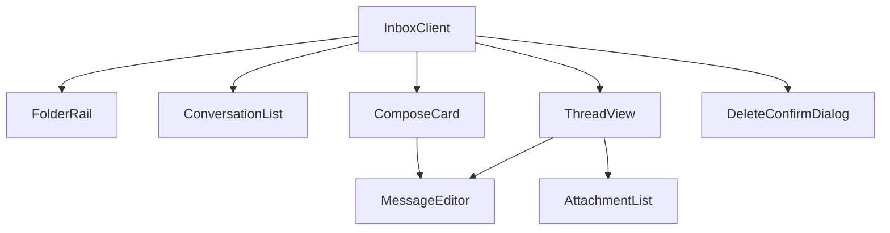

# Mailbox & Notifications — packages-shared

# Mailbox — `packages/shared/src/mailbox`

The shared inbox UI: a Gmail-shaped, three-pane-ish email client used by **both** Next.js apps. It renders conversation folders, threads, a rich-text composer with attachments, and the archive/spam/delete actions — all against an API client the *consuming app* provides.

There are no notification components in this directory. Every user-visible outcome in this module is a **sonner toast** (`toast.success` / `toast.error`) plus per-action loading state from `useAsyncAction`; that is the whole "notifications" surface here. Student/in-app notifications live elsewhere (backend `apps.notifications` and app-local UI).

## The one seam that matters: `@/lib/mailbox`

`packages/shared` is source-only, consumed through the `@shared/*` tsconfig alias, and its house rule is *never import `@/...`* (that alias is app-local). This module is the deliberate exception:

```ts
import { compose, reply, listConversations, getConversation,
         updateConversation, deleteConversation, uploadAttachment } from "@/lib/mailbox";
import type { ConversationListItem, ConversationDetail,
              MailboxMessage, MessageAttachment } from "@/lib/mailbox";
```

`@/lib/mailbox` resolves per-app, and that is how one UI drives two different backends:

| Consumer | Resolves to | API base |
|---|---|---|
| `frontend-customer` (coach admin) | `src/lib/mailbox.ts` | `/api/v1/mailbox` — tenant-schema coach ↔ student mailbox |
| `frontend-main` (superadmin) | `src/lib/mailbox.ts` → `platform-mailbox-api.ts` | `/api/v1/platform/mailbox` — public-schema platform inbox |

Both modules export structurally identical functions and types (the platform one drops `getSettings`/`saveSettings`). **The implicit contract is that duplication** — add a call site in this module and you must add the function to *both* app-side clients, or the other app fails `make typecheck`. Everything else imported here is relative (`../ui/button`, `../hooks/use-async-action`).

## Component map



`InboxClient` is the only exported entry point (named export); every other file default-exports a presentational component. All state, all API calls except `compose`/`uploadAttachment`, and all toasts for list-level actions live in `InboxClient` — the children take props and callbacks.

## `inbox-client.tsx` — the state owner

Holds `conversations`, `folder`, `query`, `thread`, `composeOpen`, `deletingId`, plus `loading` for the initial list fetch.

**Folders and search are client-side.** `listConversations()` returns the whole list, unpaginated; the `visible` memo filters by folder (`!is_archived && !is_spam` / `is_archived` / `is_spam`) and then substring-matches the query against `counterparty_name`, `counterparty_email`, `student_name`, `student_email`, `subject`, and `last_message_preview`. Fine for a coach inbox; it is the first thing to change if a tenant ever accumulates thousands of threads.

**Live updates** are a single 15-second `setInterval`, created once on mount (empty dep array). Because the callback must stay stable yet see current values, `liveRef` mirrors `{ threadId, replySending }` and is reassigned **during render**:

```ts
liveRef.current = { threadId: thread?.id ?? null, replySending };
```

`tick()` re-fetches the list, and the open thread if one is open. It bails while a reply is in flight, re-checks `liveRef.current.threadId` before applying the detail (so a thread switch mid-fetch doesn't clobber the new thread), and swallows errors silently — polling never toasts. Don't "fix" this into a dependency-driven effect without preserving those three guards; the alternative re-creates the interval on every keystroke.

**Action paths:**

- `openConversation` (via `useAsyncAction`) → `getConversation(id)` then `loadList()`. The refetch is what clears the unread dot: the backend marks messages read on GET, so the list must be re-pulled.
- `sendReply` (via `useAsyncAction`) → `reply(thread.id, draft)`, `editorRef.current?.clear()`, re-fetch the thread, success toast.
- `patchConversation(id, patch, doneMsg)` → `updateConversation`, toast, close the thread if it was the one moved, `loadList()`. Note this one is a hand-rolled `try/catch`, *not* `useAsyncAction`, so archive/spam have no loading state — the optimistic-feeling UX comes from the toast, not from a pending indicator.
- `doDelete` (via `useAsyncAction`) → `deleteConversation(deletingId)`; `deletingId` doubles as "dialog is open".

**Layout:** `topBanner` (optional `ReactNode`) renders above everything — `frontend-customer` uses it for the send-only / upgrade upsell driven by `getSettings().can_receive`; `frontend-main` passes nothing. Below it, `FolderRail` sits beside *either* the search-box + list *or* the thread view. Thread view fully replaces the list (a mobile-first choice that also applies on desktop). Overlays stack above: `ComposeCard` at `z-[120]`, `DeleteConfirmDialog` (in a `ModalPortal`) at `z-[130]`.

## `message-editor.tsx` — TipTap + attachments

The most reusable piece, used by both `ComposeCard` and `ThreadView`'s reply box. `forwardRef` with an imperative handle:

```ts
interface MessageEditorHandle { clear: () => void; isEmpty: () => boolean }
interface OutgoingDraft { text: string; html: string; attachmentIds: number[] }
```

TipTap config: `StarterKit` with `heading`, `codeBlock`, and `horizontalRule` disabled, plus `Underline`, `Link` (`openOnClick: false`, `autolink: true`), and `Placeholder`. `immediatelyRender: false` is required — this is an App Router client component and SSR hydration mismatches otherwise. The editor returns `null` until `useEditor` resolves, so nothing renders on the server pass.

Toolbar buttons go through the local `ToolbarButton`, which `preventDefault`s on `onMouseDown` to keep the selection alive while clicking. `setLink(editor)` uses `window.prompt` — deliberately primitive; an empty string unsets the link, cancel is a no-op.

Attachments upload eagerly on pick via `uploadAttachment(file)`, one at a time, so `attachmentIds` is just a list of already-persisted IDs by send time. Client-side limits are `MAX_FILES = 4` and `MAX_FILE_BYTES = 10 * 1024 * 1024`, each with its own toast; oversized files are skipped (`continue`) while hitting the file cap breaks the loop. Removing a chip drops it from local state only — no delete call, the orphan row is the backend's problem.

`send()` refuses an empty draft with no attachments, and substitutes the text `"(attachment)"` when there's a file but no prose. `Ctrl/Cmd+Enter` on the editor wrapper sends; the hint text says so.

The reply flow relies on `MessageEditorHandle.clear()` because `ThreadView` stays mounted across sends. `ComposeCard` creates an `editorRef` but never calls it — the card unmounts on `onSent`, which clears by construction.

## `thread-view.tsx`

Messages render oldest → newest; only the last is expanded by default (`expandedDefault={i === thread.messages.length - 1}`), earlier ones collapse to a 90-character snippet button. `MessageCard` alternates a zebra background by index (`bg-accent/15` — the inline comment explains why `muted` was rejected: in these themes it's ~0.03 lightness off the background and reads as no stripe) and marks authorship with a left border (`border-l-primary` for outbound, muted for inbound). An effect scrolls `endRef` into view whenever `thread.messages.length` changes.

`msg.html` is injected with `dangerouslySetInnerHTML`. **This is safe only because the backend sanitizes with `nh3` before serving** — the comment in the file is the contract. If you ever add a code path that serves unsanitized HTML, this is the sink. Plain-text fallback uses `whitespace-pre-wrap`.

Header actions are folder-aware: in `inbox` you get Archive + Mark-as-spam; in `archived`/`spam` you get a single "Move to inbox" that calls `onArchive(false)` or `onSpam(false)` depending on the current folder. `ConversationList`'s hover actions follow exactly the same rule — keep the two in sync when adding a folder.

## `conversation-list.tsx` and `folder-rail.tsx`

`Folder` (`"inbox" | "archived" | "spam"`) is declared in `folder-rail.tsx` and imported by everything else — that file is the folder source of truth, including the `FOLDERS` array that drives the rail's buttons.

The list row swaps its timestamp for quick actions on hover (`group-hover:hidden` / `group-hover:flex`), so there is no persistent action affordance — keyboard users open the row (`Enter`) and act from the thread header. Every `QuickAction` `stopPropagation`s so it doesn't also open the thread. `relativeTime` renders `just now` / `12m` / `5h` / `3d` and falls back to a localized `MMM d` past a week. Loading shows `<Spinner size="lg" />`, empty shows `<EmptyState icon={Inbox} title="Nothing here." />`, per the repo's spinner/skeleton lint rules.

## `attachment-list.tsx`

Partitions attachments into inline images (`content_type.startsWith("image/")` and not omitted) rendered as thumbnails, and everything else as file chips with a `humanSize` label. Both link straight to `download_url` (a presigned S3/MinIO URL) in a new tab — hence the `@next/next/no-img-element` disable, since the presigned host varies and can't be in `next.config` image domains.

`omitted: true` is the backend's signal that an inbound attachment was too large to store; it renders as a dashed, non-clickable chip reading *"too large, ask the sender to share another way."* Preserve that branch — it's the only user-facing explanation for a missing file.

## Contributing notes

- **Both apps compile this from source.** Any change here ships to the coach admin *and* the superadmin inbox. Verify with `make typecheck` and `make test-frontend`, not just one app's dev server.
- Adding an API call means touching three files: this module, `frontend-customer/src/lib/mailbox.ts`, and `frontend-main/src/lib/platform-mailbox-api.ts`.
- `humanSize` is duplicated in `attachment-list.tsx` and `message-editor.tsx`. If a third copy appears, lift it into `src/lib/`.
- Async buttons here already use `<Button loading={...}>` and `<Spinner>`; raw `animate-spin` will fail `scripts/check-loading-patterns.mjs` in `make lint`.
- Rough edge worth knowing before you touch it: the thread-open path renders a bare `"Loading…"` string rather than a skeleton, and archive/spam have no pending state at all. Both are safe places to improve without touching the polling logic.