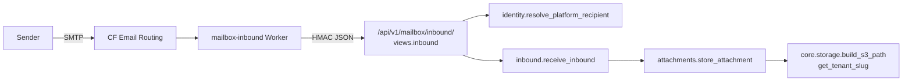

# Mailbox & Notifications

# Mailbox & Notifications

Two tenant-facing communication subsystems that share a name in the wiki but almost no code. **Mailbox** is a real email client — threaded conversations between a coach and their students (and between us and coaches), with Resend on the way out and a Cloudflare Email Worker on the way in. **Notifications** is broadcast — Web Push subscriptions, coach-authored announcements with audience filters, recurring rules, and an optional email fallback.

The deliberate seams between them are `apps.core.email.send_email` and `sanitize_rich_text` from `apps.tenant_config.defaults` for any coach-typed HTML.

## Sub-modules

| Page | Owns |
|---|---|
| [Backend apps](mailbox-notifications-backend-apps.md) | `apps.mailbox` (dual-listed, threading, identity, attachments) and `apps.notifications` (push, announcements, audience, recurrence, Celery fanout) |
| [Cloudflare Email Worker](mailbox-notifications-infra-cloudflare.md) | Inbound edge: parse MIME → HMAC-sign → POST `/api/v1/mailbox/inbound/` → bounce or accept |
| [Shared mailbox UI](mailbox-notifications-packages-shared.md) | `packages/shared/src/mailbox` — `InboxClient`, `ConversationList`, `ThreadView`, `MessageEditor` |
| [Tenant portal](mailbox-notifications-frontend-customer-src.md) | Coach mailbox route, announcement admin (`announcement-compose`, `-history`, `-recurring-list`, `-templates-list`), receipt page, PWA push handshake |
| [Platform app](mailbox-notifications-frontend-main-src.md) | Superadmin `/admin/inbox` route shell + platform HTTP client |

## The dual-listing, and why the UI is shared

`apps.mailbox` is listed in **both** `SHARED_APPS` and `TENANT_APPS`. The same models exist twice: public-schema rows are the platform inbox (superadmin ↔ coaches), tenant-schema rows are a coach's mailbox (coach ↔ students). Two inboxes, two API bases, two auth mechanisms — one set of components.

That is what `@/lib/mailbox` is for. The shared package is source-only and imports its API client through that alias; each consuming app supplies its own implementation (`frontend-customer` talks to the tenant API with the coach JWT, `frontend-main` talks to the platform API as superadmin). `InboxClient` calls `listConversations` / `updateConversation` without knowing which inbox it is looking at.

## Inbound mail

The Worker stays deliberately dumb — parse, sign, POST, decide whether to bounce. Tenant resolution, dedup, threading, and attachment storage are all Django's job. Note that `receive_inbound` has a second caller: `core/contact/views.contact_submit` drops website contact-form submissions into the same conversation machinery, so a form fill and a real email land as the same kind of thread.

Outbound is the mirror: `views.compose` → `_compose`, with `identity.sending_identity` (→ `platform_address`) deciding the From address, and `_settings_payload` exposing that same identity to the settings UI.

## Announcements

Coach composes in `announcement-compose.tsx`, picking an audience filter; `audience.audience_counts` → `resolve_audience` gives the live "this will reach N students" number before send. Delivery fans out through `apps/notifications/tasks.py` — `fanout_new_content` builds a payload via `payloads.new_content_payload` and pushes with `services.send_to_subscriptions`, with email fallback via `core.email.send_email`. Recurring rules (`recurrence.next_occurrence`) drive scheduled sends including live-class reminders (`_send_reminders_for_current_tenant` → `payloads.live_reminder_payload`). Afterwards the receipt page (`notifications/[id]/page.tsx`) reads back per-announcement `Stat` tiles via `getAnnouncement`.

All announcement CRUD in the portal goes through one binding file, `src/lib/announcements.ts` (`listAnnouncements`, `listTemplates`, `deleteRecurring`, `getAnnouncement`) — the admin components are thin lists over it.

## Where things are *not*

- No notification components live in `packages/shared/src/mailbox` — its only "notification" surface is sonner toasts plus `useAsyncAction` loading state.
- `frontend-main` owns no mailbox UI at all; it is a route shell plus a platform API client.
- Student-facing announcement feed lives in `frontend-customer`, not in the shared package.