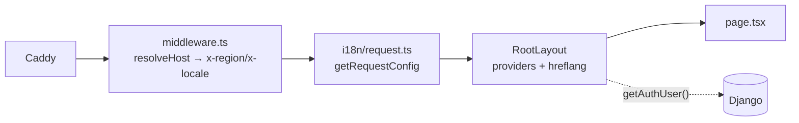
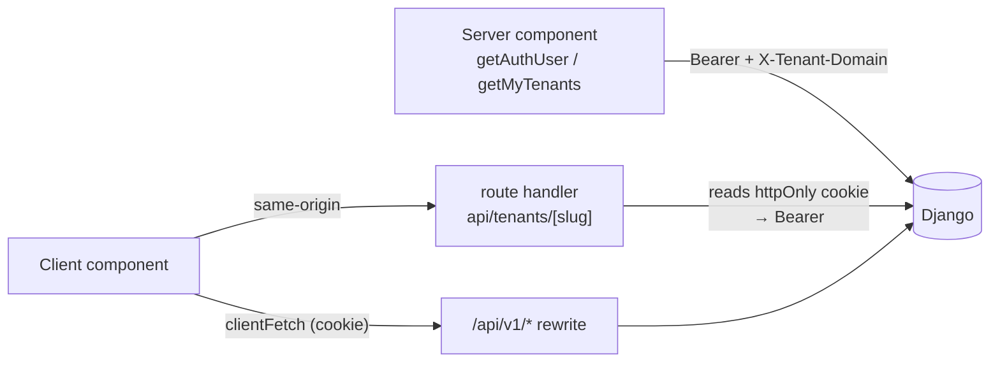

# Marketing Site App (frontend-main)

# Marketing Site App (`frontend-main`)

The public face of Contentor: the marketing site, auth entry points, coach signup/onboarding, the coach's "my platforms" dashboard, and the superadmin console. It is one of two independent Next.js 14 App Router apps in the repo (the other, `frontend-customer`, serves tenant subdomains).

Caddy decides which app a request reaches:

| Host | App |
|---|---|
| `contentor.app`, `tr.contentor.app` (dev: `localhost`, `tr.localhost`) | **`frontend-main`** |
| anything else (`*.contentor.app` tenant subdomains) | `frontend-customer` |
| `/api/*`, `/static/*`, apex `/django-admin/*` | Django, directly — never proxied through Next |

So this app only ever serves two hosts per environment, and the only thing it needs to derive from the `Host` header is **which locale/region to render** — not which tenant. Tenancy lives in `frontend-customer`.

## Surfaces

```
src/app/
  page.tsx                    landing page (composed of components/landing/*)
  pricing/, blog/, blog/[slug]/   public marketing + platform blog
  (auth)/login, (auth)/callback   magic-link + OAuth entry
  signup/, signup/verify/     coach signup + the onboarding wizard
  dashboard/                  coach: list of owned tenants, publish controls
  dashboard/domain/[slug]/    custom-domain wizard
  admin/                      superadmin console (email, blog, logs, inbox,
                              tenants, community, health, generic model admin)
  api/                        route handlers (see "Talking to Django")
  sitemap.ts                  force-dynamic; enumerates platform blog posts
```

`src/app/admin/layout.tsx` gates the whole console with `requireSuperuser()` and wraps children in `AdminShell`, which renders `AppSidebar` (desktop) + `MobileHeader` (mobile) from `components/shared/`. Both take the same `NavSection[]` shape, so nav is defined once per shell.

## Request pipeline



**`middleware.ts`** (repo root, next to `package.json`) reads `host`, runs `resolveHost`, and forwards `x-region` / `x-locale` as request headers. Its matcher skips `_next`, static assets and anything with a file extension.

Two caveats worth knowing before you touch locale code:

- There is also a `src/middleware.ts` — a no-op with an empty matcher. It is dead weight, but the app is not fragile to which one Next resolves: **nothing consumes `x-region`/`x-locale`.** Both real consumers (`RootLayout` and `i18n/request.ts`) call `resolveHost()` on the `host`/`x-forwarded-host` header themselves. If you add a consumer, read the host directly rather than trusting the injected headers.
- Always prefer `x-forwarded-host` over `host` when resolving — behind Caddy + cloudflared, `host` can be the internal service name.

### Locale resolution — `src/i18n/config.ts`

`resolveHost(host)` is the single source of truth for "what language does this host serve?". It returns `{ region, locale, apex, otherApex }` driven by one table:

```ts
const APEX_PAIRS = [
  ["contentor.app", "tr.contentor.app"],
  ["localhost",     "tr.localhost"],
] as const;
```

Matching order: exact TR apex → any host ending in `.<trApex>` → global fallback. Ports are stripped, hosts lowercased. **Adding a region means adding one pair here** (e.g. `["eu.contentor.app", "tr.eu.contentor.app"]`) — `otherApex`, the `<link rel="alternate">` tags, and the footer language switcher all fall out of it. `otherLocaleUrl(host, path, scheme)` is the helper for building the cross-locale URL server-side.

`src/i18n/request.ts` (wired via `createNextIntlPlugin('./src/i18n/request.ts')` in `next.config.mjs`) resolves the locale from the host, validates it against `locales`, and loads five namespaces in parallel from `messages/<locale>/`: `marketing`, `pricing`, `auth`, `common`, `wizard`. Every namespace must exist in **both** `messages/en/` and `messages/tr/` — a missing key is a runtime error in that locale only, so it is easy to ship an EN-only regression.

### Root layout

`src/app/layout.tsx` is the only place providers are mounted, in this order: `NextIntlClientProvider` → `ThemeProvider` (three themes: `light`, `dim`, `dark`) → `NavigationProvider` → `NavigationProgress`, children, `HelpBubble`, `<Toaster>`, `TrackPageView`.

It also emits SEO head links derived from `resolveHost`: `canonical` for the current apex, `hreflang` for both locales, and `x-default` pointing at the global apex. The scheme is inferred from `host.includes("localhost")`.

`generateMetadata()` currently hardcodes the EN/TR title+description inline rather than reading from `messages/` — if you localize more metadata, move it into the `marketing` namespace instead of extending the `if (locale === "tr")` branch.

## Talking to Django

Two distinct paths, and mixing them up is the most common bug in this app.



**Server-side (`src/lib/auth.ts`, `src/lib/tenants.ts`)** — read the JWT from the httpOnly cookie (`COOKIE_NAME`, re-exported from `@shared/auth/cookies`) and call `DJANGO_API_URL` directly with:

```ts
headers: {
  Authorization: `Bearer ${token}`,
  "X-Tenant-Domain": BASE_DOMAIN,   // non-negotiable
}
```

`X-Tenant-Domain` is required because Node's undici drops a custom `Host` header, so Django would resolve the public schema by accident. For this app the target *is* the public schema, but the header must still be explicit. Both `getAuthUser()` and `getMyTenants()` swallow errors and return `null`/`[]` — pages decide what to do with an empty result rather than crashing the render.

`requireAuth()` / `requireSuperuser()` are the redirecting variants used by layouts.

**Client-side** — never send the token from the browser (it's httpOnly). Two options:

1. A **route handler** under `src/app/api/` that reads the cookie and proxies. `api/tenants/[slug]/route.ts` is the canonical 25-line example: 401 if no cookie, forward the JSON body to `/api/v1/me/tenants/<slug>/` with the bearer + tenant header, pass Django's status straight back.
2. **`clientFetch` / `jsonFetch`** from `src/lib/api-client.ts`, for the superadmin `/api/v1/platform/*` endpoints that authenticate on the same-origin admin cookie (`next.config.mjs` rewrites `/api/v1/:path*` to Django). This module replaced four drifted per-feature clones (`platform-email-api`, `platform-logs-api`, `platform-blog-admin`, `platform-mailbox-api` all now call into it). Two behaviours it encodes that you should not re-implement:
   - `clientFetch` deliberately does **not** set `Content-Type` — FormData uploads need the browser to pick the multipart boundary. `jsonFetch` layers JSON on top.
   - Empty success bodies are read via `res.text()` and treated as no payload; Cloudflare can strip `Content-Length` and `res.json()` would turn a 200 into a UI error.
   - `extractDetail` unwraps both DRF shapes (`{detail}` and `{field: [...]}`) so validation messages reach the toast.

`ApiError` in `src/types/api.ts` carries `status` + `data` for callers that need to branch on the response.

## Landing page

`src/app/page.tsx` is a server component: it fetches the user (for the header's signed-in state) and stacks sections, each wrapped in a `<ScrollReveal direction="up" duration={0.7}>` — one restrained reveal motion throughout, deliberately uniform.

Sections live in `components/landing/`: `HeroSection`, `ProductMockup`, `SocialProofBar`, `FeaturesSection`, `StatsSection`, `HowItWorksSection`, `FoundingCreatorsSection`, `FaqSection`, `FinalCtaSection`.

All copy-bearing sections are `"use client"` and pull strings via `useTranslations("marketing.<section>")`. They share a pattern: a frozen `as const` key array drives the render, and the keys index into the message files.

```ts
const FAQ_KEYS = ["freePlan", "technical", /* … */] as const;
// renders t(`items.${key}.q`) / t(`items.${key}.a`)
```

`FeaturesSection` extends this with parallel lookup tables — `FEATURE_ICONS` (lucide icon per key), `POINT_KEYS` (bullet keys per feature), and an `illustrations` record mapping each key to a local presentational component (`CourseIllustration`, `LiveClassIllustration`, `BrandingIllustration`, `AutomationIllustration`). **Adding a feature means touching four places plus both locale files**; the `as const` typing will surface three of them as type errors, but the missing translation keys will not.

`ProductMockup` is the one section with hardcoded English demo data (fake stats, fake course names) — it's a screenshot, not copy.

### Motion primitives

Three small client components, all `prefers-reduced-motion`-aware and all IntersectionObserver-driven:

- **`ScrollReveal`** — adds a `.visible` class to an `.animate-on-scroll` wrapper on intersect and passes `--reveal-x/y/delay/duration/from-scale` CSS vars; the actual animation lives in `styles/globals.css`. `variant` picks `translate` (default) / `scale` / `zoom` / `blur`; `once` (default `true`) unobserves after the first reveal.
- **`Counter`** — used by `StatsSection`. Parses a leading number out of a display string (`"$19"`, `"5 min"`, `"1.2M+"`) with `/^(\D*)([\d,.]+)(.*)$/`, eases it up with `easeOutCubic` over `duration`, then settles on the exact original string. Anything unparseable renders as-is, so translated stat values are safe.
- **`Parallax`** — rAF-throttled scroll-linked translate for ambient layers; only updates while in view. Used on the pricing page.

## Coach dashboard

`src/app/dashboard/page.tsx` redirects anonymous users to `/login` and superusers to `/admin` (the surface is coach-only by design), then renders one `PlatformCard` per `MyTenant` from `getMyTenants()`, or an `EmptyState` CTA to `/signup`.

A card shows provisioning state via the `STATUS_COPY` map (`ready` / `provisioning` / `pending` / `failed`), the tenant domain, plan, created date, links to `tenant.studio_url`, and `PlatformCardDomainCta` for the custom-domain wizard. "Open studio" is only enabled when `provisioning_status === "ready" && is_active`.

`components/dashboard/publish-controls.tsx` is the interactive piece, rendered only for ready tenants. It PATCHes `/api/tenants/<slug>` through the local route handler for two fields:

- `is_published` — optimistic toggle with rollback on failure.
- `preview_password` — gates the tenant site while unpublished; saving an empty string clears it. The server returns only `has_preview_password`, never the value.

Both handlers go through `useAsyncAction` (`@shared/hooks/use-async-action`) for the loading state and double-submit guard. Note this component reports failures with inline red text rather than a sonner toast — a deliberate local choice for an inline control, but it is a deviation from the app-wide "action outcomes are toasts" rule; follow the toast convention for new work unless you have the same reason.

## Shared chrome

- **`PlatformHeader`** — sticky pill header on every public page. Takes `user?: User | null` from the server component above it; swaps sign-in/get-started for a user chip + sign-out (`POST /api/auth/logout`, then `navigate("/")` + `router.refresh()`). Deep-links signed-in users to `/admin` or `/dashboard` based on `is_superuser`.
- **`PlatformFooter`** — link columns from the `common.footer` / `common.nav` namespaces, plus `LanguageSwitcher`. The switcher computes the other-locale URL from `window.location` **inside a `useEffect`**, deliberately: branching on `typeof window` during render made the server emit nothing and the client an `<a href>`, which hydration-mismatched. Keep the "render href-less, fill in after mount" shape if you touch it.
- **`AppSidebar`** — collapsible admin nav. Groups default to open on both server and client render (matching markup), then layer persisted collapse state from `localStorage["admin-nav-open-sections"]` in an effect. Active-section detection uses `isNavItemActive({ pathname, pendingHref }, href)` from `@shared/navigation/navigation-state`, so a group auto-opens for a *pending* navigation, not just a committed one. `toggleSection` resolves `prev[id] ?? true` before flipping, because schema-driven groups have no key in the initial state.
- **`ThemeToggle`** — thin wrapper injecting `MODES = ["light", "dim", "dark"]` into the shared toggle, so every mount cycles all three.

Several `components/shared/*` and `components/ui/*` files are pure re-exports of `@shared/*` (e.g. `empty-state.tsx`, `lib/utils.ts`). Prefer importing through the local alias so a future divergence has one place to live.

## Conventions this app is held to

Enforced by `scripts/check-loading-patterns.mjs` in `make lint`, and by convention elsewhere:

- Internal navigation uses `<NavLink>` (`@/components/ui/nav-link`), never raw `next/link`, and programmatic navigation uses `useNavigate()` from `@shared/navigation/navigation-provider`, never `router.push`. (`PlatformHeader`/`PlatformFooter` still use plain `<Link>` for a few button-wrapped CTAs — new nav should use `NavLink`.)
- Every route segment needs a `loading.tsx` at or above it, built from `@/components/ui/skeletons` presets. `app/loading.tsx` is a bare centered `<Spinner size="lg" center />`; `app/dashboard/loading.tsx` mirrors the real page layout (pill header + `SkeletonPageHeader` + `SkeletonCardGrid`) — copy that shape, not the bare spinner, for content pages.
- No raw `<Loader2>`/`animate-spin` in app code: `<Button loading>` or `<Spinner>`.
- Wrap async handlers in `useAsyncAction`.
- Motion is CSS-only and `motion-safe:`-gated; the primitives above also check `matchMedia("(prefers-reduced-motion: reduce)")` before starting any rAF loop.
- `useTransition`'s `isPending` is not a usable "navigation in flight" signal here — `NavigationProvider` derives `isNavigating` from a pending href cleared on route commit. Use `useNavigation()`.

## Build & config notes

`next.config.mjs`:

- `output: "standalone"` for the Docker image.
- `experimental.externalDir: true` plus a webpack `resolve.modules` fallback — required because `packages/shared` (the `@shared/*` alias) sits outside this app and has no `node_modules` ancestor of its own.
- `staleTimes: { dynamic: 30, static: 180 }` — Next 14.2 defaults `dynamic` to 0, which refetches the RSC payload on every back-navigation and made the admin console feel slow. The router cache holds the payload, not component state, so client pages still remount and re-`clientFetch`.
- `rewrites()` maps `/api/v1/:path*` to `DJANGO_API_URL`, which is what makes the same-origin cookie auth in `api-client.ts` work.

Environment: `NEXT_PUBLIC_API_URL` (default `http://django:8000`) and `NEXT_PUBLIC_BASE_DOMAIN` (default `localhost`), both surfaced through `src/lib/constants.ts`. `sitemap.ts` hardcodes `https://contentor.app` and is `force-dynamic` because it enumerates platform blog posts via `fetchPlatformPosts()`.

Scripts: `npm run dev | build | lint | typecheck | test` (vitest). Repo-level: `make typecheck` covers both apps; `make lint` runs pre-commit including the loading-pattern check.