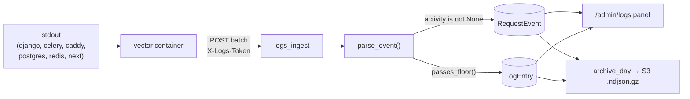

# Observability & Usage Analytics

# Observability & Usage Analytics

Two independent telemetry subsystems live under this umbrella:

| Subsystem | App | Schema | Audience | Answers |
|---|---|---|---|---|
| **Logbook** | `apps.logbook` | public | superadmin | "What happened on the platform, to whom, and how fast?" |
| **Usage** | `apps.usage` | per-tenant | coach/owner | "Are my students installing the PWA?" |

They share nothing but a philosophy: telemetry is best-effort and must never break the thing it observes. Every capture path here is wrapped in a suppressor, a `try`, or a fire-and-forget `fetch().catch(() => {})`.

There is no Prometheus/Grafana/Loki stack — observability is an in-app feature (superadmin → Logs / Health). That is a deliberate choice recorded in `CLAUDE.md`.

---

## Part 1 — Logbook

### The core idea: logs *are* the event bus

The request path performs **zero DB writes**. `RequestActivityMiddleware` emits one JSON line to stdout; Docker collects it; the `vector` container ships it to Django's ingest endpoint; ingest parses it back into rows. The same transport carries ordinary container logs (`LogEntry`) and structured request activity (`RequestEvent`) — they diverge only at parse time, based on the logger name.



Vector is intentionally dumb — it knows nothing about line formats. **All** format knowledge lives in `parsing.py`.

### Capture

#### `activity.py` — the API request trail

`RequestActivityMiddleware` wraps every response, then `_record()` logs a JSON payload under the `apps.logbook.activity` logger:

```python
{"kind": "api", "tenant": …, "user": …, "ip": …, "session_id": …,
 "method": …, "path": …, "status": …, "duration_ms": …, "user_agent": …}
```

Two ordering constraints, both load-bearing:

- **Registered LAST in `MIDDLEWARE`** so its `process_response` runs *first* on the way out — by then DRF has set `request.user` (DRF's `Request.user` setter propagates to the underlying `HttpRequest`). Move it earlier and every authenticated request logs as anonymous.
- `_record()` runs inside `contextlib.suppress(Exception)`. A bug in activity capture must never turn a 200 into a 500.

Skipped: `OPTIONS` preflights, and any path matching `settings.LOGBOOK_ACTIVITY_EXCLUDE_PREFIXES` (keeps the ingest endpoint from logging itself into a feedback loop, among other things).

Two helpers are shared with the pageview beacon:

- `client_ip(request)` — `CF-Connecting-IP` → first hop of `X-Forwarded-For` → `REMOTE_ADDR`. Behind Cloudflare + Caddy, `REMOTE_ADDR` is always the proxy, so this priority order matters.
- `redact_path(full_path)` — replaces the value of any query param named in `settings.LOGBOOK_REDACT_PARAMS` with `"redacted"`, then caps at 512 chars (matching `RequestEvent.path`'s column width).

#### `context.py` — attributing arbitrary log lines to a user

Ordinary log lines (`logger.warning("...")` anywhere in the codebase) also want a user label, but middleware can't provide one: DRF resolves the JWT at *view* level, after middleware has already run. The fix is a `ContextVar`:

1. `TenantJWTAuthentication.authenticate()` calls `set_current_user(label)` on success.
2. `UserContextFilter` (a `logging.Filter` wired into the Django log formatter) stamps `record.user` on every record.
3. `UserContextMiddleware` calls `reset_current_user()` in a `finally`.

Step 3 is not optional hygiene. Gunicorn runs `gthread` workers that **reuse threads** — without the reset, a line logged between requests (Celery-adjacent code, a background thread, a signal handler) would carry the *previous* request's user.

`UserContextFilter.filter()` swallows every exception and falls back to `"-"`: logging must never raise.

#### `views/track.py` — the pageview beacon

Client-side navigations never touch Django, so the activity middleware can't see them. `PageViewTrackView` accepts a POST from the frontend and emits the same JSON shape with `kind: "pageview"` (and `status`/`duration_ms` as `None`).

- `authentication_classes = [TenantJWTAuthentication]` + `AllowAny` — auth is *optional*; an invalid token returns `None` and the visitor is recorded as anonymous.
- `PageViewThrottle` overrides `get_cache_key()` to bucket by `client_ip(request)`. DRF's default anon ident would resolve to Caddy's address, making one shared bucket for every anonymous visitor on the internet. Rate from `settings.LOGBOOK_PAGEVIEW_RATE` (default `"60/min"`).
- Validation is one check: `path` must start with `/`. Both `path` and `referrer` go through `redact_path()`.
- Returns `202` — the caller gets no useful information back and shouldn't wait.

#### Frontend beacon (`packages/shared/src/tracking/`)

`<TrackPageView />` mounts once per app in the root layout and fires on `usePathname()` changes.

- **`pathname` only, never `useSearchParams()`** — that hook forces a Suspense boundary and a CSR bailout in the static marketing layout. Server-rendered query strings are captured (redacted) by the activity middleware instead, so nothing is lost.
- `shouldTrack(prev, path, now)` dedupes: same path within 1000ms is dropped (React strict-mode double-effects, rapid re-renders).
- `referrer` is the previous in-app pathname if there is one, else `document.referrer` — so journeys stitch across the entry hop.
- `keepalive: true` so the beacon survives the navigation that triggered it.

`getSessionId()` returns a per-tab UUID from **`sessionStorage`**, sent as `X-Session-Id`. This is a privacy stance, not an oversight: anonymous visitors get no persistent identifier. Storage blocked (private mode) → returns `""` and the event is tracked without journey stitching. The shared `clientFetch` attaches this header to all API calls, which is why the server-side activity rows carry session IDs too.

### Parsing (`parsing.py`)

`parse_event(raw: dict) -> ParsedEvent | None` is the single entry point. It returns `None` only for blank lines.

Container name → service via `service_from_container()`, which strips the `contentor-` prefix and `-dev` / `-1` suffixes so `contentor-django-dev-1`, `django`, and `/contentor_django_1` all collapse to `django`.

Per-family dispatch:

| Container | Strategy |
|---|---|
| `django`, `celery-worker`, `celery-beat` | `_parse_app_line()`: `_DJANGO_RE` (level / logger / `[tenant=…]` / optional `[user=…]` / message) → `_GUNICORN_RE` → heuristic |
| `caddy` | JSON line, read `level` |
| `postgres` | `_POSTGRES_RE` (`LOG:` / `ERROR:` / `STATEMENT:` …) |
| `redis` | `_REDIS_RE`; only the `#` mark is a WARNING |
| anything else (Next.js, unknown) | `_heuristic_level()` — `⨯` or word-boundary `error`/`warn` |

**Unparseable lines are kept as INFO with the raw line as the message.** A parser bug must degrade fidelity, never silently drop logs. Every regex uses `re.DOTALL` so a multi-line Python traceback stays one event.

Two functions drive the routing decision downstream:

- **The activity fork:** if `logger_name == ACTIVITY_LOGGER` (`"apps.logbook.activity"`), the body is `json.loads`-ed into `ParsedEvent.activity`. Non-dict or invalid JSON → `activity = None`, and the line falls through as an ordinary log entry rather than vanishing.
- **`passes_floor(container, level)`** — per-container minimum level from `settings.LOGBOOK_LEVEL_FLOORS`, with a `"*"` fallback (default `WARNING`). This is the volume control: chatty containers get a high floor without touching their logging config.

`parse_ts()` tolerates `Z`, truncates nanoseconds to microseconds (`_TS_NANO_RE` — Go/Vector emit 9 digits, Python's `fromisoformat` accepts 6), and falls back to `timezone.now()` rather than failing. `_norm_level()` maps aliases (`WARN`→`WARNING`, `FATAL`/`PANIC`→`CRITICAL`, `LOG`/`NOTICE`→`INFO`, `TRACE`/`DBG`→`DEBUG`) and defaults unknown levels to `INFO`.

### Ingest (`views/ingest.py`)

`POST /api/v1/platform/logs/ingest/` — a public URL (`@authentication_classes([])`, `AllowAny`) guarded by a shared secret:

- `settings.LOGS_INGEST_TOKEN` empty → `503 ingest disabled`.
- `X-Logs-Token` compared with `hmac.compare_digest` → `403` on mismatch.
- More than `MAX_BATCH` (500) events → `413`.

Vector reaches Django on the compose-internal network, but the token guards the endpoint regardless of exposure.

The body of the loop is a fan-out: `parsed.activity is not None` → `RequestEvent`, else `passes_floor(...)` → `LogEntry`. Both are written with `bulk_create(..., ignore_conflicts=True, batch_size=500)`.

**Poison-batch hardening.** Vector retries failed batches, so a single malformed field that raises inside `bulk_create` would 500 the batch *forever*. Hence:

- `_ip_or_none()` validates through `ipaddress.ip_address()` before the `inet` column, coercing to `str()` first — `ip_address(123)` is a valid packed address (`0.0.0.123`), which is never what a caller meant.
- `_int_or_none(value, max_value)` rejects non-ints, rejects `bool` explicitly (it's an `int` subtype, so `true` must not persist as `1`), and clamps to the column's range — `status=99999999999` would otherwise raise `DataError`.
- Everything else is `str(...)[:width]`, matched to the model field.

`line_hash` comes from `line_digest(message)` — MD5 with `usedforsecurity=False` (it's a dedupe key, not a security primitive). Combined with the `(container, ts, line_hash)` and `(kind, ts, line_hash)` unique constraints plus `ignore_conflicts`, a redelivered Vector batch is idempotent.

Response: `{"accepted": n, "logs": n, "activity": n}`.

### Storage (`models.py`)

All three models live in the **public schema** — the logbook is platform-wide; `tenant` is a plain `CharField` holding a schema name, not an FK.

- **`LogEntry`** — `ts, container, stream, level, logger_name, tenant, user_label, message, line_hash`. Indexed on `(level, ts)`, `(container, ts)`, `(tenant, ts)`, `(user_label, ts)`, `(ts)`, plus a **`GinIndex` with `gin_trgm_ops` on `message`** — that's what makes the panel's `icontains` full-text filter usable at volume.
- **`RequestEvent`** — the activity/pageview trail; `kind` ∈ `api | pageview`, plus `ip`, `session_id`, `method`, `path`, `status`, `duration_ms`, `referrer`, `user_agent`. Indexed on `(kind, ts)`, `(tenant, ts)`, `(user_label, ts)`, `(session_id, ts)`, `(ip, ts)`, `(ts)`.
- **`LogArchiveDay`** — the archive ledger, unique on `(date, kind)`, recording `object_key` and `line_count`.

> **No `Meta.ordering` anywhere, on purpose.** A default ordering would inject the ordered column into the facet endpoints' `GROUP BY` and silently break the counts. Every query orders explicitly.

### The superadmin panel (`views/panel.py`)

Four `IsSuperUser` endpoints, mounted from `urls_platform.py`:

```
GET /api/v1/platform/logs/              → keyset page of LogEntry
GET /api/v1/platform/logs/facets/       → levels, containers, tenants, users
GET /api/v1/platform/activity/          → keyset page of RequestEvent
GET /api/v1/platform/activity/facets/   → kinds, methods, status_classes, tenants, users
```

**Faceted-search semantics.** Each facet dimension is counted under every *other* active filter (plus `q`/`since`/`until`) but never its own. `_facet(build_qs, params, param_name, field, ...)` calls `build_qs(params, skip=param_name)` to achieve this. Practical effect: selecting `level=ERROR` narrows the *container* options to containers that actually have errors, while the *level* facet keeps showing the alternatives you could switch to. Zero-count options are omitted; `tenants`/`users` are capped at `FACET_LIMIT` (20), and the logs-facets endpoint accepts `users_q` for server-side search within that truncated list.

**Keyset pagination.** `_paginate()` orders by `(-ts, -id)` and encodes the cursor as `"<iso-ts>|<id>"`, resuming with `Q(ts__lt=cts) | (Q(ts=cts) & Q(id__lt=id))`. The `id` tiebreak is what makes equal-timestamp rows (very common — one request emits several lines in the same millisecond) paginate without duplicates or gaps. It over-fetches `PAGE_SIZE + 1` (100 + 1) to decide whether `next_cursor` is set.

**Malformed params are `400`, never ignored.** `_apply_time_and_q` raises `ValidationError` for an unparseable `since`/`until`; `_paginate` raises for a malformed `cursor`; `_activity_queryset` raises for an unknown `status_class` or a non-IP `ip`. An unfiltered result set mid-incident is worse than an error — you'd read it as "no errors" when it's actually "your filter didn't apply." Note that `status_class`/`ip` are validated *even when that dimension is skipped* for facet-building, so the contract doesn't depend on which facet happens to construct the queryset first.

`status_class` maps `2xx`/`3xx`/`4xx`/`5xx` to half-open ranges via `_STATUS_CLASSES`; multiple values OR together (`_status_class_q`). The status facet is computed with per-class `.count()` calls rather than through `_facet`, since it aggregates over ranges rather than distinct values.

Free-text `q` targets `message` for logs and `path` for activity.

**Client:** `frontend-main/src/lib/platform-logs-api.ts` — `fetchLogs`, `fetchLogFacets`, `fetchActivity`, `fetchActivityFacets`, all through the shared `clientFetch` (same-origin cookie auth). `LogsFilters` is a flat `Record<string, string>` of comma-joined values, serialized by `qs()`. `sinceForRange(range)` converts the UI's `TimeRange` (`15m`…`14d`) into the ISO `since` param.

### Retention: archive then purge (`archive.py`, `tasks.py`)

Two Celery-beat tasks implement a hot-store/cold-store split.

**`archive_logbook_days`** walks every un-archived elapsed day (`_day_range` excludes today, and floors at `today - LOGBOOK_HARD_CAP_DAYS`), calling `archive_day(day, kind)` for both kinds in `ARCHIVE_MODELS` (`{"logs": LogEntry, "activity": RequestEvent}`). Failures are logged with `logger.exception` and retried tomorrow — one bad day never blocks the others.

`archive_day()` is idempotent (returns the existing `LogArchiveDay` if present), streams the day's rows with `.iterator(chunk_size=2000)` into an in-memory gzip NDJSON buffer, and uploads via `get_s3_client()` to `{LOGBOOK_ARCHIVE_PREFIXES[kind]}YYYY/MM/DD.ndjson.gz`. **An empty day still creates a ledger row with `object_key=""`** — that's what lets the purge treat it as archived. Serialized field sets (`_LOG_FIELDS` / `_ACTIVITY_FIELDS`) deliberately exclude `id` and `line_hash`; the archive is the long-term record for `zcat | grep`, not a restore image.

**`purge_logbook`** does two things per kind:

1. **Hard cap** — deletes anything older than `LOGBOOK_HARD_CAP_DAYS` regardless of archive status, at `logger.error` level. A persistently failing archive must not grow the table forever. Because the error is itself a log line, it lands in the panel — the system reports its own data loss.
2. **Normal purge** — deletes days older than `LOGBOOK_RETENTION_DAYS` *that have a `LogArchiveDay` ledger row*.

The ledger row is the safety interlock: no archive record, no deletion (until the hard cap).

---

## Part 2 — Usage analytics (`apps.usage`)

A much smaller, tenant-scoped system answering one product question: are students installing the PWA, or just using the browser?

### `UsageEvent`

`(user, mode, platform, day)` with `unique_together` on all four — so it's a **daily unique**, not a session counter. `mode` ∈ `pwa | browser`; `platform` ∈ `ios | android | desktop | other`. Lives in TENANT_APPS, so the row lands in whatever schema the request ran in — no tenant column needed.

### Recording — `record_usage` (`POST /api/v1/me/usage/`)

`IsAuthenticated`. Validates `mode`/`platform` against `_MODES`/`_PLATFORMS` (400 otherwise), then:

- **Non-students short-circuit to `204`.** Coaches and owners use the admin app and are out of scope for adoption metrics.
- `get_or_create` inside `contextlib.suppress(IntegrityError)` — two tabs POSTing concurrently both miss the SELECT and race the unique constraint; the loser swallows it rather than 500ing.
- Denormalizes onto the `User` for cheap querying: `last_display_mode`, `last_platform`, and a write-once `first_pwa_at`. Only changed fields go into `save(update_fields=…)`.

Always `204` — the client has nothing to do with a response.

**Client side.** `<UsageReporter authed />` (`frontend-customer`) gates on `authed` (anonymous would just 403) and skips `/admin` paths, then calls `reportUsageOncePerSession()`. That function sets the `sessionStorage` flag **before** the fetch, so a failure never re-fires on the next navigation, and swallows all errors — telemetry must never affect the page. `mode` comes from `isStandalone()` (shared with the push subsystem); `platform` from `detectPlatform()`'s user-agent sniff, where an empty UA is `"other"`.

### Reporting — `usage_summary` (`GET /api/v1/admin/usage/summary/`)

`IsCoachOrOwner`. `?days=` is coerced and clamped to `[1, 365]` (default 30) — a bad value falls back rather than erroring, since this feeds a dashboard card. Returns:

```json
{"pwa_sessions": n, "browser_sessions": n, "pwa_pct": n,
 "installed_students": n, "daily": [{"day": "…", "pwa": n, "browser": n}]}
```

`installed_students` counts tenant users with `role="student"` and a non-null `first_pwa_at` — the all-time install count, deliberately not windowed. Totals and the daily series come from two `Count(filter=Q(...))` aggregates over one queryset.

`<UsageAdoptionCard />` renders it in the coach dashboard: a `PageState` with skeleton and retry, an install headline, a PWA/Web split bar, and a dependency-free CSS bar chart for the 30-day trend (per-day height scaled to the max day, inner bar = PWA share). It returns `null` when there's no data and no error — a tenant with zero telemetry sees nothing rather than an empty card.

---

## Part 3 — Health page

`frontend-main/src/app/admin/health/page.tsx` polls `GET /api/health/` (Django's own liveness endpoint, outside `/api/v1/`) and renders three status cards: Overall, Database, Redis. It uses `useAsyncAction` for the refresh button's loading state and error toast-free inline error, plus a local `HealthSkeleton` for the first load and `loading.tsx` (`SkeletonPageHeader` + `SkeletonCardGrid`) for the route segment — per the repo-wide loading conventions.

---

## Configuration reference

| Setting | Used by | Purpose |
|---|---|---|
| `LOGS_INGEST_TOKEN` | `logs_ingest` | Shared secret; empty disables ingest (`503`) |
| `LOGBOOK_LEVEL_FLOORS` | `passes_floor` | Per-container minimum level, `"*"` fallback (default `WARNING`) |
| `LOGBOOK_ACTIVITY_EXCLUDE_PREFIXES` | `RequestActivityMiddleware` | Paths that produce no activity row |
| `LOGBOOK_REDACT_PARAMS` | `redact_path` | Query params whose values become `redacted` |
| `LOGBOOK_PAGEVIEW_RATE` | `PageViewThrottle` | Beacon rate limit per real client IP (default `60/min`) |
| `LOGBOOK_ARCHIVE_PREFIXES` | `archive_day` | S3 key prefix per kind |
| `LOGBOOK_RETENTION_DAYS` | `purge_logbook` | Hot-store window for archived days |
| `LOGBOOK_HARD_CAP_DAYS` | `purge_logbook`, `_day_range` | Unconditional deletion age |
| `AWS_BUCKET_NAME` | `archive_day` | Archive bucket (MinIO in dev, Hetzner in prod) |

Middleware ordering in `settings`: `UserContextMiddleware` needs to wrap the request; `RequestActivityMiddleware` must be **last**.

---

## Invariants to preserve when contributing

1. **Nothing on the request path writes to the DB.** If you need a new dimension on activity, add it to the JSON payload in `activity.py`/`track.py`, to `_request_event()` in `ingest.py`, to `RequestEvent`, and to `ACTIVITY_FIELDS` in both `panel.py` and `archive.py`. Four places — grep for an existing field like `session_id` to find them all.
2. **`RequestActivityMiddleware` stays last in `MIDDLEWARE`.** Otherwise `request.user` is unset and every row is anonymous.
3. **`reset_current_user()` must run per request.** Thread reuse leaks user labels across requests otherwise.
4. **Ingest must not be able to raise on untrusted input.** New fields go through a `_*_or_none` guard or a `str(...)[:width]` truncation, sized to the column. A raising `bulk_create` is a permanently poisoned Vector retry loop.
5. **Never add `Meta.ordering` to a logbook model.** It breaks the facet `GROUP BY`s.
6. **Malformed panel params return 400.** Don't "helpfully" ignore them.
7. **Parser changes must not drop lines.** New formats fall back to `_heuristic_level()` with the raw message preserved.
8. **Purge stays gated on the `LogArchiveDay` ledger** (hard cap excepted), and the hard-cap deletion stays at `ERROR` level so it's visible in the panel.

## Tests

`backend/apps/logbook/tests/` covers each layer independently:

- `test_parsing.py` — per-container format cases, multi-line tracebacks staying one event, nanosecond timestamps, message truncation at `MESSAGE_MAX`, the activity-JSON fork, `service_from_container` variants, and `passes_floor` defaults/overrides.
- `test_context.py` — default `"-"`, filter stamping, JWT auth setting the context, and the middleware resetting after the response.
- `test_models.py` — `line_digest` stability (32 hex chars) and both dedupe constraints under `ignore_conflicts`.
- `test_activity.py` — `client_ip` header priority and `redact_path` length capping.
- `test_panel_logs.py` / `test_panel_activity.py` — keyset pagination without duplicates, and the equal-timestamp `id` tiebreak.

Run one file with `make test-app APP=logbook`, or the whole suite with `make test`.
