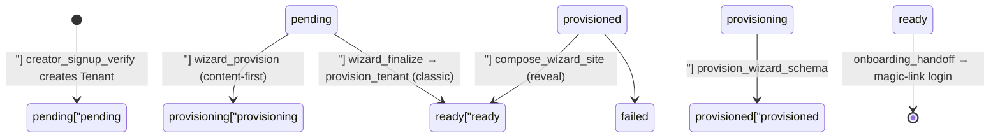

# Onboarding Wizard & Site AI — backend-apps

# Onboarding Wizard & Site AI (`backend/apps/core/onboarding/`)

Everything between "a coach typed a brand name on the marketing site" and "a fully composed, AI-written tenant site is live" lives in this package. It is mounted at `/api/v1/onboarding/` (`config/urls.py:43`) and runs entirely in the **public schema** until a tenant schema exists — which is itself one of the steps it orchestrates.

Two things make this module unusual compared to the rest of the backend, and they explain most of its shape:

1. **There is no JWT yet.** The coach has no user session for most of the flow, so every endpoint is `@authentication_classes([]) + AllowAny` and authenticates on a signed **wizard token carried in the request body** (never the query string, so it stays out of access logs).
2. **The tenant schema may not exist yet.** Answers accumulate on `Tenant.wizard_state` (a JSONField on the public row). Only later do Celery tasks create the schema and materialize those answers into `TenantConfig`.

---

## The two flows

There are two paths through the wizard, selected by a 50/50 holdout bucket (`experiments.py`).

**Classic ("control"):** answer every step → `wizard_finalize` → one Celery task (`provision_tenant`) creates the schema, seeds niche content, composes the site, and marks `ready`.

**Content-first ("treatment"):** the schema is provisioned *early* so the coach can write a real course/event/post inside the wizard, then the site is composed from that real content at the reveal.



`WIZARD_OPEN_STATUSES = ("pending", "provisioned")` in `wizard.py` encodes the subtlety: `provisioned` is *mid-wizard* for the content-first flow, so `wizard_state` PATCHes must keep working there. `provisioning` / `ready` / `failed` are closed.

### Signup → tenant row

`views.py` owns the pre-wizard steps:

| View | Purpose |
|---|---|
| `check_brand_name` | Read-only slug availability probe (throttled, no email, no token) |
| `creator_signup` | Validates via `CreatorSignupSerializer`, mints a signup token, emails the verification link. **No tenant row yet.** |
| `creator_signup_authenticated` | A logged-in coach adding a second platform — the JWT already proves email ownership, so the token is handed back directly with no email round-trip |
| `creator_signup_verify` | Consumes the token and creates `Tenant` + `Domain`. Assigns `wizard_bucket` here **and only here**, so a resuming coach keeps their bucket |
| `seed_from_template` / `skip_template` | Legacy entry points that record niche/goals and enqueue `provision_tenant` |
| `provisioning_status` | Public poll endpoint; also surfaces `wizard_state["provisioning_stage"]` for the progress screen |
| `onboarding_handoff` | Exchanges the wizard token for a magic-link login URL on the tenant's own domain (409 unless `ready`) |

Region matters throughout: TR tenants get schema `tr_<slug>` and FQDN `<slug>.tr.<domain>`; the `(slug, region)` pair — not slug alone — is the uniqueness key everywhere.

### Token resolution

Two nearly-identical resolvers exist and the difference is deliberate:

- `views._resolve_tenant_from_signup_token` — `verify_signup_token`, for the legacy template endpoints.
- `wizard._resolve_tenant_from_wizard_token` — `verify_wizard_token`, which accepts **both** purposes (the 15-minute email link and the 7-day wizard/recovery links). This is the one nearly every endpoint in the package uses, including `onboarding_handoff`, all logo endpoints, all content endpoints, and site-edit.

Both return `(payload, tenant, error_response)` with exactly one of `tenant`/`error` set, and both re-check `tenant.owner_email == payload["email"]` (403 otherwise) — the token brand name resolves the tenant, the email claim authorizes it.

---

## Wizard state: catalog + validation

`wizard_catalog.py` is the single source of truth for every answer the wizard may store: `GOALS`, `THEMES`, `THEME_RANKING` (per-niche), `FONTS`, `NAVBAR_LAYOUTS`, `HERO_STYLES`, `LOGO_MODES`, `PAGE_LAYOUTS`, `HOME_GOAL_BLOCKS`. It is pure data plus helpers — no model access — so views, Celery tasks, and tests can all import it.

- `catalog_payload()` → `GET /wizard/catalog/`. The frontend renders steps from this and never hardcodes option ids. Labels deliberately live in the frontend message catalogs (`messages/{en,tr}/wizard.json`) so the i18n parity guard stays the single translation workflow.
- `validate_answers(partial)` is the write-side gate. **Unknown keys are errors, not ignored** — the client is generated from this catalog, so drift means a bug or a probe. The `logo` key gets the deepest validation: AI mode re-runs `logo_recipe.validate_recipe(upgrade_recipe(...))` and requires `export_keys` to live under `wizard/`.
- `recommended_answers(niche)` is what "finish the rest for me" and finalize-with-gaps apply.

`wizard_state` (POST = read/resume, PATCH = merge-save) writes:

```
{ version, answers: {...}, step_timestamps: {key: iso}, current_step, finished_rest_for_me,
  provisioning_stage, ai_compose_status, ai_photos_status, ai_blog_status,
  curated_logo_rank: [...], reveal_applies_used }
```

PATCH is last-write-wins per answer key (one coach, no contention). A PATCH that completes the "business chapter" (niche + description present) fires `rank_curated_logos.delay(...)` so the logo gallery is pre-ranked by the time the coach reaches that step, several steps later.

`wizard_provision` deserves a note: the `pending` guard flips **synchronously under `select_for_update`** before enqueueing, because the frontend polls it every 1.5s and the Celery task may not start for many polls — without the synchronous flip, every intervening tick re-enqueued a duplicate.

---

## Deterministic compose (`compose.py`)

`build_config_overrides(answers, brand_name, landing_sections, locale)` turns wizard answers into `TenantConfig` field values: `theme`, `font_family`, `navbar_config`, `enabled_modules`, and `pages`. It's pure dict-in/dict-out and is called by `tasks._apply_wizard_answers` **after** the niche seeder has run — the seeder-merged `landing_sections` (niche copy + injected photo ids) is the raw material, and everything returned here deliberately overrides what the seeder wrote.

- Nav links and `enabled_modules` are derived from goals: `ALWAYS_MODULES` (analytics, billing, courses, pages) plus `GOAL_MODULES` mappings.
- `_build_pages` assembles six pages (home/about/courses/pricing/faq/contact) from the layout ids in `answers["page_layouts"]`, falling back to each page's first (recommended) option when the id is unknown. Block builders (`_hero`, `_about_image_text`, `_course_grid`, `_testimonials`, `_faq`, `_cta`, `_intro`, `_contact`) produce the actual block dicts; `wizard_catalog.PAGE_LAYOUTS[*]["blocks"]` is the parallel type sequence the frontend draws thumbnails from. **If you add a layout option, add it in both places.**
- `COPY` holds the EN/TR strings. These are tenant *content* (coach-editable after provisioning), not UI chrome — that's why they live here and not in a frontend message catalog.

`apply_wizard_logo(config, answers, tenant)` is the module's only model-touching function and handles the three `LOGO_MODES`:

- `wordmark` — store nothing; with no logo image the public header renders the brand name as text, which *is* the wordmark promise.
- `ai` — paid plans only. Re-validates the recipe defensively, then attaches staged PNGs. `export_keys` are trusted **only** when they equal this tenant's own staged path (`wizard/<schema_name>/{logo,icon}.png`); forged, stale, or another tenant's key is silently dropped. `show_brand_name` off (studio lockups already contain the wordmark).
- `curated` — a tenant `Photo` row pointing at the shared `platform/` key (no S3 copy; a DB-only erase can't orphan it), plus `show_brand_name` so mark + text form a lockup. Idempotent via the `s3_key` lookup.

---

## The AI layer

Five AI touchpoints share one budget, one brief format, and one failure philosophy.

| Module | Call | Output | On failure |
|---|---|---|---|
| `ai_compose.compose_pages` | 1 structured | rewritten page copy + extras | raises `ComposeError` → static pages kept |
| `ai_photos.pick_photos` | 1 structured | `{slot: CuratedPhoto}` | raises `CurateError` → no photos |
| `ai_curate.rank_logos` | 1 structured | ordered `CuratedLogo` ids | re-raises `AiError` → client keyword rank |
| `course_outlines.generate_course_outlines` | 1 structured | 3 course outlines | deterministic `_fallback()` |
| `wizard_followups.generate_questions` | 1 structured | ≤2 questions | `[]` (step skipped) |
| `starter_post.generate_starter_draft` | delegates to `apps.blog.ai` | BlogPost fields | raises → status recorded, no post |

**Budget + metering.** `ai_compose.compose_available()` is the single gate: `ONBOARDING_AI_ENABLED`, then `core_ai.available()`, then `_global_spend() < ONBOARDING_AI_MONTHLY_BUDGET_USD`. Note the budget is **platform-global per month**, not per tenant — but spend is *recorded* per tenant on `OnboardingAiUsage(tenant_schema, month)` via `record_spend`, which every AI module in this package calls, **including on failure** (a failed call still burned tokens; not charging it would break the kill switch). `_record_success` bumps `composes_used` separately.

**The trust boundary** is `ai_compose`'s central design idea, reused by everything that edits pages:

- The model may only submit `(page, block_id)` pairs that **already exist** — `_apply` builds an index of real blocks and silently drops anything else.
- Only fields in `WRITABLE_FIELDS[block_type]` are applied. `testimonials` is deliberately absent from that dict (no fabricated social proof); `hrefs`, images, and layout are never writable.
- Every value is clamped to `FIELD_CAPS`, `body` additionally passes through `sanitize_rich_text`, FAQ items are capped at `MAX_FAQ_ITEMS`, block updates at `MAX_BLOCK_UPDATES`.
- `extras` (`meta_description`, `navbar_cta`, course/download retitles) are clamped, and retitle ids are intersected with the ids actually sent — hallucinated ids are dropped.

**Prompt caching.** Every `SYSTEM_PROMPT` in this package is a module-level constant and must stay **byte-identical across tenants**. Everything coach-specific goes through `ai_curate.brief_block()` or a module's `_brief()` / `_user_turn()` in the user turn. Don't interpolate tenant data into a system prompt.

**`CoachBrief`** (`ai_curate.py`) is the shared, frozen input: `CoachBrief.from_tenant(tenant, locale)` reads `wizard_state["answers"]` and produces niche/description/followups/goals/theme/font/brand/locale. `tasks.py` builds one per AI step.

**The non-LLM prefilter.** `shortlist(rows, brief, limit)` ranks catalog rows by plain lowercase token overlap between the coach's own words and each row's `tags`/`title`, with catalog `position` breaking ties and zero-score rows filling the tail (a thin match must never shrink the model's choice set to nothing). Same idea as `apps.blog.curated`. Only the shortlist is ever sent to the model, and model-returned ids are validated back against it.

### Photos (`ai_photos.py`)

`build_slots(answers, courses, events)` produces up to `MAX_SLOTS` named slots — `hero` (skipped for `hero_style == "minimal"`), `about`, `course:<pk>`, `event:<ModelName>:<title>` — each tagged with a candidate group (`hero` or `content`). `event_groups()` collapses repeated seeded event titles so covers are picked per template, not per occurrence.

The split between `pick_photos` and `apply_photo_picks` is a **threading contract**: `pick_photos` is pure + public-schema-only so it can run inside `tasks._run_ai_step`'s capped worker thread (which gets a fresh DB connection pointing at `public`), while `apply_photo_picks` does the tenant-schema writes (materializing `media.Photo` rows, patching `bgImage`/`image` in the pages dict, setting course/event thumbnails) in the caller's thread inside `tenant_context`. Break this and photo picks silently stop finding tenant content.

### Content seeding

- `starter_post.py` — one draft welcome post at provisioning, generated through the blog writer's own machinery (`blog_ai.generate_post` + curated candidates) so it's indistinguishable from a coach-initiated draft, but spend lands on the **onboarding** budget rather than the coach's blog quota. `create_starter_post` returns `None` if any post already exists (retry safety).
- `seeding_content.py` — the reveal's "complete site" pass: `seed_starter_posts` (noindex AI drafts, from `STARTER_TOPICS`) and `seed_draft_products` (unpublished courses from `generate_course_outlines`). Both are fail-soft and return counts; they seed fewer items rather than raising, because `compose_wizard_site` must always still reach `ready`.

Everything seeded goes through `apps.tenant_config.seeding.register_seeded(...)` so the coach can erase demo content later. **Content the coach authors in `content.py` is deliberately *not* registered** — it must satisfy the publish gate's `_has_own` check.

---

## Wizard content endpoints (`content.py`)

Available only once the schema exists. `_wizard_content_setup(request)` returns `(tenant, owner, err)` and 409s with `{"detail": "provisioning"}` when `provisioning_status` isn't in `READY_STATUSES` — that 409 is the frontend's signal to keep polling. There's no `request.user`, so every row is authored as the tenant's `role="owner"` user found by `_owner()` inside `tenant_context`.

- `wizard_create_course` — **published on create**, because the publish gate counts only published courses.
- `wizard_create_event` — `kind="live"` → `LiveClassCreateSerializer`, `"onsite"` → `OnsiteEventCreateSerializer`; both get `instructor=owner`.
- `wizard_create_blog` — mirrors `BlogPostAdminViewSet.perform_create` (server-derived `unique_slug`, `published_at` stamped only on publish) since the viewset is bypassed.
- `wizard_course_outlines` — AI suggestions for the course step.

---

## Logo endpoints (`wizard_logo.py`)

Thin wizard-token wrappers over the coach studio engine in `apps.tenant_config.logo_api` — same engine, quotas, and budget; only the auth context and brief source differ (`_wizard_brief` builds from `Tenant` + `wizard_state.answers`, since no `TenantConfig` exists yet).

Watch the **key collision**: these endpoints receive the wizard *auth* token in `data["token"]`, but `logo_api.converse_finish` reads the *draft-cache* token from the same key. `_engine_data()` strips the auth token and promotes `draft_token` → `token` before delegating. Any new delegating endpoint must go through `_engine_data`.

`wizard_logo_upload` stages the client-rendered PNG at the deterministic key `wizard/<schema_name>/<kind>.png` (paid plans only, PNG magic-byte checked, 1 MB cap) — the exact key `compose.apply_wizard_logo` later re-derives and compares against.

---

## Site AI (`site_ai.py`)

Two separate concerns share this file, and conflating them is the easiest bug to introduce here.

**Metering for the paid admin panel.** `SiteAiUpdateUsage(tenant_schema, month)` tracks `usd_spent` and `updates_used`. `record_attempt_cost` is charged on **every** call attempt (preview or apply) for kill-switch integrity; `record_update` consumes a quota credit only on a successful persisted apply. `availability(tenant)` reads `plan.max_site_ai_updates` and mirrors `apps/blog/ai.py`'s reason precedence: no allowance at all → `upgrade_required`; allowance spent → `quota_exhausted`.

**The edit engine.** A site edit is just a re-compose with an instruction — `preview_edit` calls `ai_compose.compose_pages` with the coach's free-text instruction threaded in as one synthetic `{q, a}` followup pair, deliberately reusing the existing whitelist/sanitization boundary instead of inventing a second editing path. It returns `(pages, extras, Decimal("0"))`; the zero is intentional, since `compose_pages` already recorded the USD against `OnboardingAiUsage` and the caller records it again against the site-AI meter. `apply_edit` persists `pages` (+ `meta_description`) and nothing else.

**The reveal's free apply is a different counter.** `wizard_site_edit_preview` (SSE, free) and `wizard_site_edit_apply` in `wizard.py` gate on `wizard_state["reveal_applies_used"]` against `REVEAL_FREE_APPLIES = 1`, returning 402 when spent. `wizard_site_edit_apply` deliberately does **not** call `site_ai.record_update()` — that would make the free reveal edit show up as spent monthly allowance in the coach's own `/admin/site-ai` panel.

---

## Billing inside the wizard

`wizard_checkout` creates a Stripe Checkout session for a platform plan *before* provisioning. The tenant row already exists, so the standard `checkout.session.completed` webhook attaches the `PlatformSubscription` with no wizard-specific completion handling. Two non-obvious details: the coach's real `User` row is `get_or_create`d here with the same `(email, region)` key `provision_tenant_schema` later uses (a pk-less placeholder would serialize into Stripe metadata as the literal `"None"` and silently drop the paid subscription), and `billing_currency` is filled under `select_for_update`.

`wizard_checkout_sync` is the return-from-checkout probe: it activates the subscription server-side from a `session_id` rather than waiting for a webhook local dev never receives. Idempotent with the webhook, and it answers the same `_state_body(tenant)` shape as `wizard_state` so the client reads one shape from both.

---

## Drop-off recovery & reclamation (`recovery.py`)

Three lifecycle stages, all driven by Celery beat tasks in `apps/core/tasks.py`:

| Stage | Selector | Sender | Beat task |
|---|---|---|---|
| Nudge (once) | `recovery_candidates()` | `send_recovery_email` | `send_wizard_recovery_emails` (hourly) |
| Final warning | `find_abandoned_tenants()[0]` | `send_abandon_warning` | `cleanup_abandoned_signups` |
| Delete | `find_abandoned_tenants()[1]` | `tenant.delete(force_drop=True)` | `cleanup_abandoned_signups` |

Idleness is `_last_activity(tenant)` — the max of `wizard_state["step_timestamps"]`, falling back to `created_at`. Selection prefilters in SQL on cheap columns and refines in Python (a handful of rows/day, never a hot path). Thresholds: `WIZARD_RECOVERY_IDLE_HOURS=24`, `WIZARD_RECOVERY_MAX_AGE_DAYS=7`, `WIZARD_ABANDON_WARN_DAYS=14`, `WIZARD_ABANDON_DELETE_GRACE_DAYS=7`.

Safety properties worth preserving if you touch this:

- Timestamps (`recovery_email_sent_at`, `abandon_warned_at`) are stamped **only on a successful send**, so a provider failure is retried next beat — and since deletion keys off `abandon_warned_at`, **a tenant can never be deleted without having been warned**.
- Both senders refuse when `slugify(tenant.name)[:63] != tenant.slug`. The wizard resolver looks tenants up by slugified token brand name, so a superadmin rename would mint a link resolving to nothing (or to a *different* tenant). Refusing leaves the tenant unwarned and therefore undeletable.
- `find_abandoned_tenants` only ever considers `is_published=False` tenants in `{pending, provisioned, failed}` — never `ready`, never in-flight `provisioning`, never the public row.

`wizard_recover` (the resume screen's re-send button) accepts **expired but signature-valid** tokens via `decode_wizard_token_allow_expired` — that's the whole point: the 7-day link died, the answers didn't. It always emails `tenant.owner_email`; the caller never chooses the address. It returns `{"detail": "sent"}` even when the provider errored, so probers get no send-failure oracle, and a `RESEND_COOLDOWN` of one hour per tenant backstops the per-IP throttle (which alone would let a replayed token spam the owner's inbox from many IPs).

---

## A/B bucketing (`experiments.py`)

`assign_wizard_bucket(seed)` is the whole feature-flag primitive: the low bit of `sha256(seed)`, so it's stable, reproducible across runs, and independent of Python's hash randomization. The seed is `f"{email}:{region}"`, assigned once in `creator_signup_verify` and persisted on `Tenant.wizard_bucket` purely for cheap funnel queries. `_state_body` exposes it to the frontend.

> E2E specs must pin the bucket via `e2e/helpers/holdout.ts` — it derives from the signup email, so a random test email lands in a random flow.

---

## Orchestration: where the Celery tasks fit

The tasks themselves live in `apps/core/tasks.py`, not here, but they're the only callers of most of this package:

- `provision_tenant_schema` — schema + owner user (public **and** tenant schema) + default `TenantConfig`. Idempotent; every step reuses existing rows.
- `provision_wizard_schema` — content-first early provision: schema only, no seed, no compose. Accepts `pending`/`provisioning`/`failed` (it must run from the handoff state the endpoint sets synchronously).
- `provision_tenant` — the classic full path: schema → niche seed → `_apply_wizard_answers` → `_seed_starter_post` → `ready`.
- `compose_wizard_site` — the reveal: `_apply_wizard_answers` on the already-provisioned tenant, then best-effort `seeding_content` passes, then `ready`.
- `rank_curated_logos` — the wizard-time logo pre-rank; re-reads the tenant right before writing, because the coach is actively PATCHing the same JSON.

`_apply_wizard_answers` is the join point: it calls `build_config_overrides`, then `_compose_pages_with_ai`, `_apply_compose_extras`, `_pick_photos_with_ai`, and finally `apply_wizard_logo` before saving the config. Each AI step is idempotency-guarded by its `wizard_state` status key (`ai_compose_status`, `ai_photos_status`, `ai_blog_status`), so a Celery retry doesn't re-bill a step that already ran.

`_run_ai_step(label, tenant, fn, timeout)` runs each AI call in a single-worker `ThreadPoolExecutor` with a hard timeout (90s compose, 60s photos, 90s starter post) and **never raises** — it returns `(result, "ok")` or `(None, "failed")`. The thread gets fresh DB connections landing on the **public** schema, which is why `pick_photos`/`compose_pages`/`generate_starter_draft` must be public-schema-only and all tenant reads (`_gather_content_items`) happen in the caller's thread.

---

## Conventions and gotchas for contributors

- **Public endpoints need `@authentication_classes([])`.** `TenantJWTAuthentication` is DRF's default auth class project-wide; `AllowAny` alone is not enough and will 401.
- **Function-local imports are load-bearing.** `apps/core` is full of them to dodge import cycles (see `apps/core/CLAUDE.md`). Don't hoist them to module level without checking the cycle.
- **Fail-soft is the contract, not a nicety.** A coach must never be blocked from finishing signup by our model. New AI steps should either fall back deterministically (`course_outlines`) or record a status and move on (`_seed_starter_post`) — never propagate to the wizard UI.
- **Charge on failure.** Any new provider call must `record_spend` in its `except AiError` branch, or the monthly kill switch under-counts.
- **Adding a writable field** means touching `WRITABLE_FIELDS`, `FIELD_CAPS`, and the system prompt's field list in `ai_compose.py` — all three, or the model's output is silently dropped by `_apply`.
- **Adding an answer key** means touching `validate_answers` (unknown keys are hard errors), `recommended_answers`, `catalog_payload`, and usually `compose.build_config_overrides`.
- Tests are per-concern under `backend/apps/core/tests/` — `test_wizard_state_endpoints`, `test_wizard_catalog`, `test_wizard_compose`, `test_wizard_finalize`, `test_wizard_provision`, `test_wizard_content`, `test_wizard_followups`, `test_wizard_logo_ai`, `test_wizard_checkout`, `test_wizard_holdout`, `test_wizard_recovery`, `test_abandoned_cleanup`, `test_ai_compose`, `test_ai_curate`, `test_reveal_compose`, `test_site_ai`. Run with `make test-app APP=core`.

**Design docs:** `docs/superpowers/specs/2026-07-19-ai-touch-onboarding-design.md` (curated photos, logo rank, starter post), `docs/superpowers/plans/2026-07-26-wizard-content-apis.md` (content endpoints), `docs/superpowers/plans/2026-07-26-ai-seeding.md` (reveal seeding).