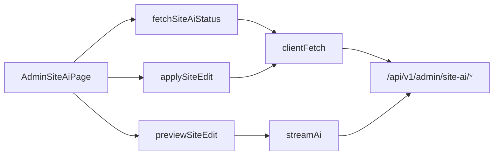

# Onboarding Wizard & Site AI — frontend-customer-src

# Onboarding Wizard & Site AI — `frontend-customer/src`

This module is the coach-facing surface for AI-assisted site editing inside a tenant. A coach describes a change in plain language ("make the hero warmer, shorten the about copy"), the backend streams back a proposed page tree, and the coach either applies it or throws it away. Nothing is written until Apply.

Two files make up the whole thing:

| File | Role |
|------|------|
| `src/app/admin/site-ai/page.tsx` | `AdminSiteAiPage` — the client route: status, instruction box, streaming progress, preview/apply gate, upsell states |
| `src/lib/site-ai-api.ts` | Typed client for `/api/v1/admin/site-ai/*` — `fetchSiteAiStatus`, `previewSiteEdit`, `applySiteEdit` |

The backend counterpart is `backend/apps/core/site_ai_admin.py`; the AI budget and provider selection come from the same onboarding infrastructure (`apps/core/onboarding/`, `apps/core/ai.py`).

## The core design decision: preview is free, apply is metered

This shapes almost every branch in the page. `SiteAiStatus.enabled` gates **Apply only** — `handlePreview` never checks it. A coach on a plan without site-AI, or one who has burned through their allowance, can still type an instruction and watch the AI produce a proposal; they just can't commit it. That turns the quota wall into an upsell moment with the value already demonstrated rather than a locked door.

The backend enforces the same asymmetry, and it can still refuse a preview for reasons unrelated to quota — no AI budget left, provider unavailable. In that case the stream completes normally but resolves with `pages: null`. `handlePreview` treats that as an error toast rather than an empty preview:

```ts
if (!res.pages) {
  toast.error(t("siteAi.error"));
  return;
}
```

`SiteEditPreview.pages` is typed `Record<string, unknown> | null` precisely to force callers through that check. The page tree itself is opaque to the frontend — it's captured from the preview response and handed straight back to `applySiteEdit` untouched. The frontend never inspects or edits its shape, which keeps the page-schema contract entirely between the AI and the backend.

## Request flow



`site-ai-api.ts` deliberately mirrors the split in `lib/blog-api.ts`: plain JSON endpoints go through `clientFetch` (`@/lib/api-client` — the shared client consolidated across the app; it attaches auth, the tracking session id, and throws `ApiError` on failure), while the one long-running generative endpoint goes through `streamAi` (`@/lib/ai-stream`).

`streamAi<TResult, TEvent>` takes the URL, a JSON body, an `AiStreamHandlers` object, and an optional `AbortSignal`, and resolves with the terminal result. Site AI only uses the `onPhase` handler — hence the `never` event type parameter on both `previewSiteEdit` and the `AiStreamHandlers<never>` it accepts. There is no incremental event payload to render here, just a phase label.

## Page state model

Four independent pieces of state, each with a distinct job:

- **`status`** — `SiteAiStatus` from the server: `enabled`, `remaining`, `limit`, and a `reason` that is `"upgrade_required"`, `"quota_exhausted"`, or `null`.
- **`loading` / `error`** — first-load only, fed to `PageState` with a `SkeletonForm` and an `onRetry={load}`.
- **`instruction`** — the textarea, capped at 400 chars client-side.
- **`phase`** / **`preview`** — the in-flight stream label and the resolved page tree.

### Two ways to fetch status, on purpose

`load` sets `loading: true` and clears `error`; it runs once from the mount effect and again from `PageState`'s retry button. `refreshStatus` does the same fetch but touches neither — it's the post-Apply resync, and it swallows its own errors:

```ts
const refreshStatus = useCallback(async () => {
  try {
    setStatus(await fetchSiteAiStatus());
  } catch {
    // Keep the optimistic values on a failed resync — the Apply succeeded.
  }
}, []);
```

Two rules drive this. First, `CLAUDE.md`'s loading convention: a full skeleton is for first load only, so a mutation must never flip `loading` back on and blank the page. Second, the Apply response already carries the authoritative `remaining`, which is applied optimistically before the resync fires:

```ts
setStatus((prev) => prev ? { ...prev, remaining: res.remaining } : prev);
```

The resync exists to pick up the *derived* fields — `enabled` and `reason` may flip once the last allowance is spent — not the counter. If it fails, the optimistic state is still correct enough, and surfacing a resync error after a successful Apply would be actively misleading.

If you add another mutation to this page, follow the same shape: optimistic patch from the mutation response, then `void refreshStatus()`. Never `void load()`.

### Cancellation

`abortRef` holds the `AbortController` for the in-flight preview. `AiProgress`'s `onCancel` aborts it, and `handlePreview` distinguishes a user cancel from a real failure with `isAbortError`:

```ts
} catch (err) {
  if (isAbortError(err)) return; // the coach cancelled; nothing to report
  throw err;
}
```

Re-throwing anything else lets `useAsyncAction`'s `errorToast` handle it. The controller is nulled in `finally` regardless of outcome. Note there is no cleanup-on-unmount abort — navigating away mid-stream leaves the request running server-side; the resolved state is simply discarded.

## Rendering branches

The body renders in three stacked, largely independent sections:

1. **Upsell / exhausted banner** — driven purely by `status.reason`. `upgrade_required` gets a `NavLink` to `/admin/billing/subscription`; `quota_exhausted` gets no upgrade CTA. Both always render the manual-editing escape hatch (`<a href="/?edit=1" target="_blank">`), because manual editing is free on every plan and this screen should never be a dead end. That's why it's a plain `<a>` rather than `NavLink` — it opens the public tenant site in a new tab, outside the admin SPA.
2. **Allowance line** — only when `status.limit > 0`, so unlimited/ungated plans don't render a meaningless "0 of 0".
3. **Input vs. progress** — mutually exclusive. While `previewing`, the textarea is replaced by `<AiProgress>` with a single declared phase (`thinking`) plus the cancel button. Otherwise the textarea and a Preview button, disabled on empty input.
4. **Preview card** — rendered when `preview && !previewing`. Apply is `disabled={!status?.enabled}`; Discard just clears `preview`.

Both mutations go through `useAsyncAction` (`@shared/hooks/use-async-action`), which supplies the double-submit guard, the `loading` flag wired into `<Button loading loadingText>`, and the default error toast. Per `CLAUDE.md`, no raw spinners appear in this file.

## Conventions this module has to honor

- `export const dynamic = "force-dynamic"` — status is per-tenant and per-plan; this route must never be statically cached.
- All user-visible strings come from `useTranslations("admin")` under the `siteAi.*` namespace. `siteAi.remaining` takes `{count, limit}` as ICU args.
- The route needs a `loading.tsx` at or above it (enforced by `scripts/check-loading-patterns.mjs` in `make lint`), even though the client page also renders its own `SkeletonForm` via `PageState`.
- Internal navigation is `NavLink`, never `next/link` — the exception above is an external-tab link, not internal navigation.

## Changing this module

If you touch the backend serializers behind `/api/v1/admin/site-ai/*`, regenerate the OpenAPI types (`npm run gen:api` in `frontend-customer`) and check the diff — `SiteAiStatus` and the apply response are hand-written here and can silently drift from the schema.

If you add a new `reason` value on the backend, add it to the `SiteAiStatus["reason"]` union and give it a branch in the banner block. The current code derives `upsell` and `exhausted` as two independent booleans, so an unknown reason renders no banner at all — the failure is silent, not loud. Adding a third state means adding both a boolean and its copy keys.

If you extend the preview stream to emit incremental events, replace the `never` type parameter on `previewSiteEdit` and `AiStreamHandlers<never>` with the real event type and add the corresponding handler alongside `onPhase`; `streamAi`'s generics already carry the plumbing.