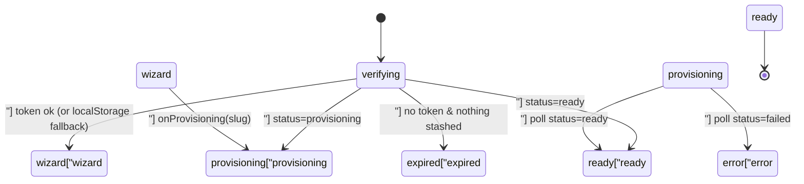
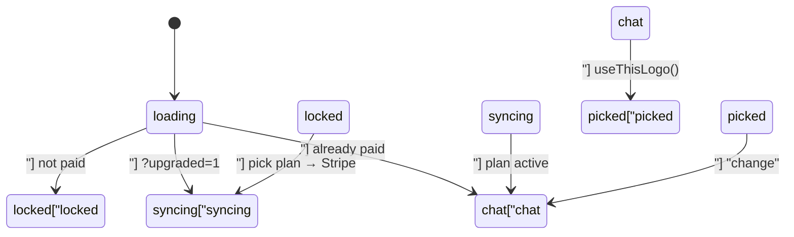

# Onboarding Wizard & Site AI — frontend-main-src

# Onboarding Wizard & Site AI — `frontend-main/src`

The coach-facing signup funnel: from "pick a brand name" to a provisioned tenant with a composed site, plus the AI surfaces that live inside that funnel (logo design chat, natural-language site refinement). Everything here runs in `frontend-main` (the marketing app) and talks to Django's `apps.core.onboarding` package directly over `/api/v1/onboarding/*` — never through a Next.js route handler.

## Scope

| Path | Role |
|---|---|
| `app/signup/page.tsx`, `signup-form.tsx` | Entry: brand name → name/email → verification email (or the short authenticated path) |
| `app/signup/verify/page.tsx` | The funnel's outer state machine: verify → wizard → provisioning → ready/expired |
| `app/signup/verify/wizard/WizardFlow.tsx` | Wizard orchestrator — loads state, owns answers, dispatches steps |
| `.../wizard/WizardShell.tsx` | Chrome: chapter rail, progress bar, slide transitions, footer |
| `.../wizard/steps.tsx` | Presentation primitives (`OptionCard`, `OptionList`, `SlideHeader`) + business/look steps |
| `.../wizard/pages-steps.tsx`, `previews.tsx` | Page-layout step and the mockup/wireframe preview widgets |
| `.../wizard/content-steps.tsx` | Content-first flow: course/event/blog steps + `ProvisioningGate` |
| `.../wizard/logo-review-steps.tsx`, `ai-logo.tsx` | Logo picker (wordmark / curated / AI) and the paid AI door |
| `.../wizard/reveal-chat.tsx` | Post-provision "make it warmer" site editing |
| `lib/wizard/machine.ts` | Pure step machine — order, skipping, progress, "finish the rest" |
| `lib/wizard/types.ts` | `WizardCatalog`, `WizardAnswers`, `WizardState*` contracts |
| `lib/wizard/api.ts`, `logo-api.ts` | Fetchers. Token always rides in the request **body**, never the URL |

## The wizard token

Everything after the verification email is authenticated by a single opaque wizard token — there is no session, no tenant JWT, and no tenant schema for most of the flow. Three rules follow from that:

1. **The token is a body parameter.** Both `lib/wizard/api.ts` and `lib/wizard/logo-api.ts` define their own tiny `request<T>()` helper that posts `{ token, ...body }` and throws `ApiError(status, body)` on non-2xx. Keep new endpoints on that idiom.
2. **The token is stashed in `localStorage` under `contentor_wizard_token`** on first successful verify. The emailed link expires in 15 minutes; the stashed token lives ~7 days. When the URL token fails, `SignupVerifyPage` falls back to the stashed one before declaring the link dead — an expired email link is not the same thing as a dead wizard.
3. **The brand name is decoded from the token itself.** `WizardFlow`'s `brandFromToken()` base64url-decodes the JWT payload for `brand_name`, so every live preview can render the coach's brand without another round-trip.

## The outer state machine (`verify/page.tsx`)

`verifiedRef` guards the POST to `/signup/verify/` against React 18 double-effects. Once provisioning starts, `startPolling` hits `/api/v1/onboarding/status/?slug=` every 2s; the response's `stage` is rendered as a human label when it is one of `KNOWN_STAGES` (`schema`, `config`, `seed`, `ai_copy`, `finalizing`), otherwise a generic "creating…" line.

Two details that are easy to break:

- **The `ready` CTA uses `resumeToken`, not the URL token.** After a Stripe checkout round-trip or a `localStorage` resume there is no `?token=` in the URL, so `requestHandoff(resumeToken)` is what produces the one-click authenticated `login_url`. Any failure silently degrades to `http://${domain}`; the tenant lock screen's owner-login path is the backstop.
- **`expired` is a real screen, not an error.** It offers `recoverWizard(token)` (re-send the resume email) and distinguishes three outcomes via `resumeState`: `sent`, `closed` (HTTP 409 — the wizard already finished, so send them to `/login`), and `failed`.

## The step machine (`lib/wizard/machine.ts`)

Pure functions, no React and no fetch. The server's `WizardCatalog` supplies the *vocabulary* (which niches, themes, fonts, layouts exist); this module decides only **order and skipping**.

- `buildSteps(catalog, answers)` — classic flow: business → look → pages → logo → review. It skips `pages.pricing` when no selling goal is chosen, skips any page with fewer than two catalog layouts, and only inserts `business.followups` when AI actually returned questions.
- `buildContentSteps(catalog, answers)` — content-first flow: business → content → logo → review. `content.event` appears only for live/onsite goals, `content.blog` only for `write_blog`. It deliberately shares no code with `buildSteps` so the classic flow stays byte-for-byte identical while the holdout runs.
- `progressPct` starts at 15%, not 0 — email verification is treated as progress already earned.
- `firstUnansweredStep` drives resume; `answered()` is the per-step predicate (note `business.followups` always reports answered so it can never block a resume, and `review` never does so the machine lands there).
- `finishRestAnswers(catalog, answers)` backfills every unanswered design key with a niche-aware recommendation, leaving explicit answers untouched. `WizardFlow` commits it and jumps straight to `logo`.

### Classic vs content-first

The A/B bucket comes from `WizardStateResponse.wizard_bucket`; `"treatment"` selects the content flow, and **anything else — including `""` on tenants created before the experiment — falls through to classic**. Never assume the field is present.

## `WizardFlow` — the orchestrator

One `useEffect` (guarded by `loadedRef`) loads `getWizardCatalog()` and `readWizardState(token)` in parallel, then:

- If the wizard is no longer open, it hands off to `onProvisioning(slug)`. "Open" means `status ∈ {pending, provisioned}` **and** `template_status ∉ {seeding, ready, skipped}` — `provisioned` is mid-wizard for the content flow, since the schema is created early so content steps can write. This predicate mirrors `WIZARD_OPEN_STATUSES` on the server; change both together.
- `ApiError` with status 400 from `readWizardState` means a dead token → `onTokenExpired()`.
- The restored `current_step` is honoured only if it exists in the freshly built step list; otherwise `firstUnansweredStep` decides.

### Four ways an answer gets committed

| Helper | Used by | Behaviour |
|---|---|---|
| `draft(partial)` | multi-select (`goals`), free text (`describe`, `followups`), logo picking | Local state only; persisted later by Continue |
| `selectAndAdvance(partial)` | single-select steps (niche, all of `look.*`, all of `pages.*`) | PATCH + advance in one motion; these steps render **no** Continue button |
| `commitContent` / `skipContent` | content steps | The step already POSTed a real course/event/post; only the `*_created` flag is persisted. Skipping advances with no flag set — the publish gate and admin checklist surface the gap later |
| `handleContinue` | everything else | Persists `currentSlice()` and advances; on `review` it finalizes |

All of them funnel through `commit()`, which PATCHes `/wizard/state/` and — on `ApiError` 409 — treats the wizard as already finalized and jumps to provisioning.

Two special cases in `handleContinue`:

- **`business.describe`** fires `getDescribeFollowups` behind a 20s `AbortController` before advancing. Cached questions are reused when `followups.for === description`. If AI is slow or down, the step advances straight to `business.goals` and writes `{ for: description, items: [] }` so stale questions disappear rather than lingering.
- **`review`** branches on flow: content-first calls `composeWizard(token)` (schema and content already exist — only the compose step remains), classic calls `finalizeWizard(token)` which runs the full `provision_tenant` pipeline. Both then poll `onboarding/status`.

### Auto-advance and `busy`

`autoAdvance` covers the `look` and `pages` chapters plus `business.niche`; `stepOwnsAdvance` additionally covers `content` (those steps render their own Continue + Skip). When `stepOwnsAdvance` is true, `WizardShell`'s footer is `null` — otherwise you get two Continue buttons. Auto-advance steps pass `disabled={busy}` into `OptionCard`, because the step stays mounted while the PATCH is in flight and an enabled card would swallow the click in the `busy` guard with no feedback.

## Shell and presentation

`WizardShell` is a fixed full-screen overlay. It wraps everything in `<MotionConfig reducedMotion="user">`, which makes framer-motion drop every transform/layout animation when the OS asks for reduced motion — so **no component below it needs to gate motion by hand**. The header (back button, chapter rail, progress bar) sits *outside* the width-morphing column so the progress bar keeps one width across steps; the column itself morphs between `640px` and `~1100px` via the `wide` prop. `AnimatePresence mode="wait"` keyed on `stepId` plus the `direction` prop (`1` forward, `-1` back) produces the slide.

`steps.tsx` owns the shared vocabulary: `listVariants`/`itemVariants` (staggered cascade), `OptionList`, `SlideHeader`, and `OptionCard` — a motion button with an optional preview child, a title/subtitle stack, a corner badge, and an animated check. Note `OptionCard` deliberately avoids `text-center` on the button and dims via `[&:disabled>*]:opacity-50` (the entrance animation leaves an inline `opacity:1` on the button that would beat `disabled:opacity-*`).

`previews.tsx` supplies the visual stand-ins: `MiniNavbar`, `MiniHero`, `MiniPageSketch`, `BrowserFrame`, and `ScreenshotThumbnail`. Thumbnails resolve through `mockupSrcs(niche, id)` (from `@shared/wizard/mockups`) — an ordered candidate list of per-niche screenshots then the yoga fallback set — tracking per-URL `onError` failures so a catalog option added before its screenshots exist degrades to a wireframe instead of a broken image. `FontPreviewLoader` injects one Google Fonts CSS2 stylesheet covering every `FONT_STACKS` family; without it every sans option renders identically.

`pages-steps.tsx`'s `thumbnailBlocks()` splices goal-driven home blocks in after `courseGrid`, mirroring the backend's compose ordering, so the wireframe fallback matches what will actually be built.

## Logo step and the AI door

`LogoStep` presents three modes. Curated marks are ranked client-side by `rankCuratedLogos` + `briefKeywords({ niche, description })` from `@shared/logo/curated-rank` — the same ranking the Logo Studio's Browse entrance uses — then overlaid with `applyAiRank(…, state.curated_logo_rank)`, a server-computed rank produced by a background task while the coach walked the earlier chapters. Absent rank means keyword ranking only.

`AiLogoDoor` (`ai-logo.tsx`) is the paid third option and has four states:

- **locked** — lists non-free platform plans via `listPlans()`. Picking one PATCHes `current_step: "logo"` (so the return trip lands on the right step) then `window.location.assign(checkout_url)`.
- **syncing** — on return, `wizardCheckoutSync(token, session_id)` hands Stripe's session id back so Django activates the plan itself. This is the primary path: local dev never receives the checkout webhook without `make stripe-listen`, and prod can deliver it after the redirect. A 2s `readWizardState` poll runs as fallback, giving up after 15s with a retry button.
- **chat** — a staged conversation (`icon` → `name` → `tagline`). Each turn is the same two-pass the Logo Studio uses: `wizardConverse` returns draft designs, `renderDraftPngs` rasterizes them client-side, `wizardConverseFinish(token, draftToken, images)` lets the model critique its own output. Any failure in the second pass short-circuits to the drafts already in hand. `resp.source !== "ai"` (e.g. `quota_exhausted`) surfaces as an assistant message plus a notice, never an exception.
- **picked** — `useThisLogo()` builds a `LogoRecipe` via `designRecipe()`, calls `renderFinalPngs()` to rasterize a 1024px lockup and a 512px square mark off-screen (`createRoot` + `flushSync` + one `requestAnimationFrame`, then `svgToPngBlob` with `fontsFor(recipe)`), uploads both through `wizardLogoUpload`, and stores `{ mode: "ai", recipe, export_keys }` in the answers. The staged S3 keys are applied at provisioning time.

## Content-first steps

`ProvisioningGate` wraps every `content.*` step. Writing a course needs a tenant schema, which does not exist yet at this point in signup — so on mount it calls `provisionWizard(token)` in a 1.5s poll loop until `status ∈ {provisioned, ready}`, showing a spinner meanwhile. `provisionWizard` is idempotent: only a `pending` tenant enqueues work, so the same call doubles as the poll. Transient failures keep polling rather than stranding the coach.

`CourseStep` offers AI-generated `getCourseOutlines(token)` as pickable cards; `EventStep` and `BlogStep` are plain forms with `savingRef` double-submit guards. `BlogStep` creates its post as `published` on purpose — only a published post satisfies the publish gate's blog requirement, which is the reason the step exists.

## Reveal chat (site AI)

`RevealChat` appears on the `ready` screen. A site edit is a re-compose with an instruction, so it talks to the backend's `ai_compose` trust boundary:

- `previewSiteEdit(token, instruction)` streams SSE frames (`phase` / `done` / `error`) from `/wizard/site-edit/preview/`, buffering across chunk boundaries and resolving with the proposed `pages`. Free to call. `isAbortError` distinguishes a caller-initiated abort from a real failure.
- `applySiteEdit(token, pages)` persists it and returns `remaining`.

`REVEAL_FREE_APPLIES` is duplicated in `reveal-chat.tsx` (value `1`) because there is no shared source between the Django app and this bundle — it mirrors `apps/core/onboarding/wizard.py`'s constant and must be changed with it. The docstring on `applySiteEdit` in `lib/wizard/api.ts` still says "3 free applies"; the client constant is the one that renders, so treat that docstring as stale. Running out never blocks Publish — it only stops further chat refinements.

## Contributing notes

- **Adding a step** means touching three places: a `StepDef` in `buildSteps`/`buildContentSteps`, an `answered()` clause so resume works, and a `case` in `WizardFlow`'s body switch. If the step is single-select, add its chapter/id to the `autoAdvance` predicate and pass `disabled={busy}` down; otherwise add its slice to `currentSlice()`.
- **New answer keys** go in `WizardAnswers` (`lib/wizard/types.ts`) and must be understood by the backend's compose step — the catalog and the answers are a two-sided contract.
- **Loading/feedback conventions apply here too**: `<Spinner>` and `<Button loading>`, never raw `animate-spin`; async handlers in `useAsyncAction` (used by both signup forms and the resume button). The wizard's own step transitions are the exception to the `PageState`/skeleton rule — it is a full-screen overlay with its own choreography.
- **Never widen the token's exposure.** No wizard token in a URL, a query string, or a log line.
