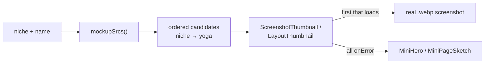

# Onboarding Wizard & Site AI — packages-shared

# Wizard Mockups (`packages/shared/src/wizard/mockups.ts`)

Shared resolver that maps a coach's **niche** plus a **mockup name** to an ordered list of candidate screenshot URLs. It is the single point that decides *which* real screenshot the onboarding wizard shows a coach when they pick a theme, hero style, or page layout — and the guarantee that a missing screenshot degrades to a fallback instead of a broken image.

The module is pure: no imports, no I/O, no React. Roughly 25 lines of code carrying a fair amount of policy.

## Why it exists

The signup wizard asks coaches to choose visual options (theme, hero style, per-page layout). Abstract wireframe sketches tested poorly compared to *real* screenshots of a site with content that matches the coach's niche — a pole-dance coach sees a pole-dance site, not generic lorem sections.

Those screenshots are pre-captured build artifacts, not runtime renders. That creates a coverage problem: the niche catalog (`backend/apps/demo_seed/data/*.json`) grows faster than screenshot capture runs. `mockupSrcs` absorbs that gap so the two can drift without ever producing a broken `` in a coach's face during signup.

## API

```ts
export const MOCKUP_NICHES: readonly string[];  // 7 captured niches
export const FALLBACK_NICHE = "yoga";
export function mockupSrcs(niche: string | undefined, name: string): string[];
```

`mockupSrcs` returns candidates in preference order:

| Input | Result |
|---|---|
| `("belly_dance", "theme-ocean")` | `["/wizard-mockups/belly_dance/theme-ocean.webp", "/wizard-mockups/yoga/theme-ocean.webp"]` |
| `("yoga", "hero-split")` | `["/wizard-mockups/yoga/hero-split.webp"]` — no duplicate fallback |
| `("general", …)` / `(undefined, …)` / unknown niche | yoga only |

`name` is the mockup id, not a filename — the `.webp` extension and `/wizard-mockups/<niche>/` prefix are the module's business. Callers build it from catalog ids: `theme-${theme}`, `hero-${style}`, or a bare layout id (`home-story`, `about-portrait`, `faq-list`, …).

Note `"general"` is deliberately *not* in `MOCKUP_NICHES`. It exists in `demo_seed/data/` but its content module is intentionally sparse (no plans, FAQ disabled), so capturing it would produce empty-state screenshots that misrepresent the layout. It falls through to yoga like any unknown niche.

## How consumers use the list

Callers try each candidate in order and swap to a hand-drawn CSS sketch when *every* candidate fails. Two components implement this, both in `frontend-main/src/app/signup/verify/wizard/`:

- **`ScreenshotThumbnail`** (`previews.tsx`) — generic; takes `srcs` + a `fallback` node. Used by `ThemeStep` and `HeroStep` in `steps.tsx`.
- **`LayoutThumbnail`** (`pages-steps.tsx`) — same pattern inline, falling back to `MiniPageSketch`. It renders the shot uncropped inside `BrowserFrame` because the coach is choosing a *whole page*; cropping would hide the blocks that distinguish two layouts.

Both track failures in a `Record<string, boolean>` **keyed by URL**, then pick `srcs.find((s) => !failed[s])`. Keying by URL rather than by index matters: a coach can change niche mid-wizard, and the new niche's file must get a fresh attempt rather than inheriting the previous one's failure.



## Where the files come from

`tools/wizard-mockups/capture.mjs` (`make capture-wizard-mockups`) writes into `frontend-main/public/wizard-mockups/<niche>/`. Per niche it runs `seed_wizard_mockup_tenant --niche <n>` against the hidden scratch tenant (`WIZARD_MOCKUP_TENANT_SCHEMA = "wizard_mockups"`, `backend/config/settings/base.py`), drives look/layout via `set_wizard_mockup_look` / `set_wizard_mockup_layout`, screenshots each option with Playwright, and saves downscaled WebPs. Hero shots are clipped to `1280×640`; layout and theme shots are full pages.

The naming contract is implicit but strict — the capture script's `LAYOUTS`, `THEMES` (`ocean, ember, forest, sunset, violet, slate`) and `HEROES` (`centered, split, minimal`) mirror `backend/apps/core/onboarding/wizard_catalog.py`, and its `NICHES` array is a hand-maintained duplicate of `MOCKUP_NICHES` (the script says so in a comment). **Editing `MOCKUP_NICHES` without editing `capture.mjs`'s `NICHES` — or vice versa — is the main way to break this module.** There is no automated check tying the two together.

## Consumed from both frontends

The file lives in `packages/shared/src/` and is reached via the `@shared/*` tsconfig path alias, which both `frontend-main` and `frontend-customer` declare. Today only `frontend-main` renders wizard mockups; `frontend-customer` merely owns the unit test (`src/lib/__tests__/wizard-mockups.test.ts`, run by `make test-frontend`) because that app hosts the vitest setup. The assets themselves are served only from `frontend-main/public/`, so the returned root-relative URLs are meaningful on the marketing host, not on tenant subdomains.

## Contributing

- **Adding a niche to the catalog**: nothing required here. It resolves to yoga until screenshots exist. Ship first, capture later.
- **Adding a captured niche**: run `make capture-wizard-mockups ARGS="--niche <name>"`, then add the name to both `MOCKUP_NICHES` and `capture.mjs`'s `NICHES`. Commit the WebPs.
- **Adding a theme / hero style / layout**: add it to `wizard_catalog.py` and to the corresponding array in `capture.mjs`, then re-capture. The wizard renders the new option immediately with a CSS sketch; the screenshot appears once captured.
- **Never** hardcode `/wizard-mockups/...` at a call site — the fallback ordering is the whole value of going through `mockupSrcs`.
- Keep the function pure. It runs during render in client components, has no dependencies, and its four-case behavior is fully covered by the vitest file; extend that test alongside any change.
